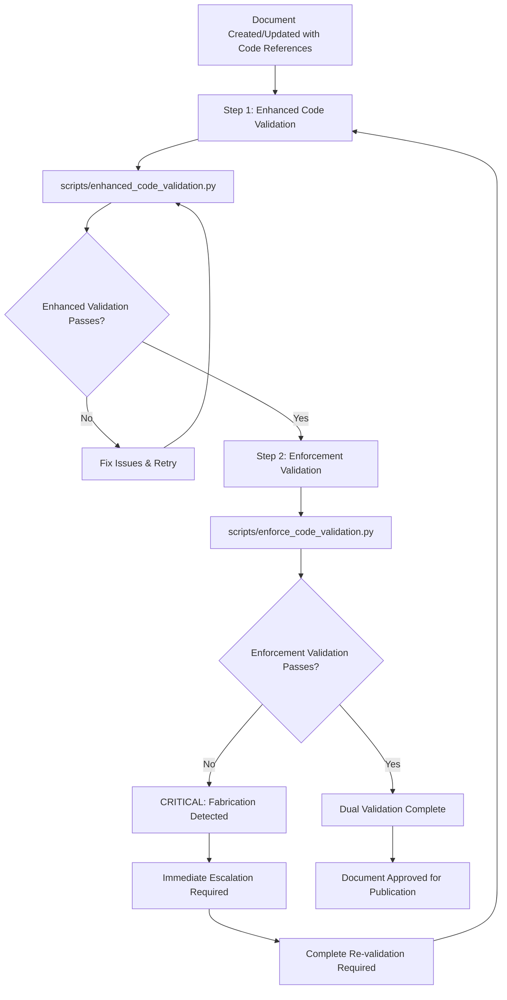

# Comprehensive Code Validation Framework

## 🎯 Executive Summary

**COMPREHENSIVE FRAMEWORK**: This framework implements systematic, mandatory code validation with zero-tolerance enforcement for fabricated validation reports. It provides dual validation requirements, comprehensive enforcement protocols, and complete CI/CD integration for enterprise code quality assurance.

**CRITICAL REQUIREMENT**: This framework implements **MANDATORY DUAL VALIDATION** requirements, integrating comprehensive enforcement protocols to ensure absolute authenticity and prevent fabricated validation reports.

**Dual Validation Requirement**: ALL documents created or updated in the knowledge corpus MUST undergo BOTH:
1. **Enhanced Code Validation** via [`enhanced_code_validation.py`](../scripts/enhanced_code_validation.py)
2. **Enforcement Validation** via [`enforce_code_validation.py`](../scripts/enforce_code_validation.py)

**Problem Solved**: Eliminates the risk of AI-generated fabricated validation reports while ensuring systematic validation of all enterprise code against documented business rules, technical specifications, and regulatory requirements.

## 🚀 Framework Overview

The Comprehensive Code Validation Framework implements systematic code validation processes that ensure all business rules, technical specifications, and integration points documented in the knowledge graph are accurately implemented in the source code, with **zero tolerance for fabricated validation reports**.

## 🚨 MANDATORY DUAL VALIDATION PROTOCOL

### **Critical Requirement: Zero Tolerance for Fabrication**

**EVERY document creation or update that involves code references MUST:**

```yaml
mandatory_dual_validation:
  step_1_enhanced_validation:
    script: "scripts/enhanced_code_validation.py"
    purpose: "Comprehensive business rule and technical validation"
    scope: "All documented business rules, technical specs, integration points"
    output: "Detailed validation report with findings and recommendations"
    
  step_2_enforcement_validation:
    script: "scripts/enforce_code_validation.py"
    purpose: "Authenticity verification and fabrication prevention"
    scope: "File existence, code snippet accuracy, technology consistency"
    output: "Enforcement compliance report with pass/fail status"
    
  execution_requirement:
    timing: "BOTH scripts MUST be run on EVERY document creation/update"
    sequence: "Enhanced validation FIRST, then enforcement validation"
    blocking: "Document cannot be finalized until BOTH validations pass"
    escalation: "Any enforcement failures require immediate resolution"

  compliance_enforcement:
    ci_cd_integration: "Automated enforcement in GitHub Actions"
    pre_commit_hooks: "Local validation before commits"
    pull_request_blocking: "PRs blocked until dual validation passes"
    audit_trail: "Complete validation history maintained"
```

### **Dual Validation Execution Workflow**



### **Enforcement Integration Requirements**

```yaml
enforcement_integration:
  ai_system_obligations:
    pre_validation_requirements:
      - "Scan target source code directories for accessibility"
      - "Verify file permissions and existence"
      - "Extract actual code content for comparison"
      - "Document all source code locations discovered"
    
    validation_execution_standards:
      - "Compare documentation against REAL source code only"
      - "Extract genuine code snippets (never fabricate examples)"
      - "Verify business logic implementation accuracy"
      - "Document specific file locations and line numbers"
    
    post_validation_verification:
      - "Run enforcement script against generated report"
      - "Verify all file references are valid and accessible"
      - "Confirm code snippets match actual source content"
      - "Address any enforcement failures before submission"
  
  human_reviewer_obligations:
    validation_review_checklist:
      - "Verify AI executed both validation scripts successfully"
      - "Confirm all referenced files exist and are accessible"
      - "Spot-check code snippets against actual source code"
      - "Validate technology stack references for consistency"
      - "Ensure business logic accuracy and completeness"
    
    escalation_triggers:
      - "Enforcement script reports any failures"
      - "Validation claims appear unrealistic or suspicious"
      - "Technology references don't match known architecture"
      - "Code snippets appear generic, templated, or fabricated"
    
    approval_authority:
      - "Only approve reports passing both validation layers"
      - "Require complete re-validation for enforcement failures"
      - "Document approval rationale for complex validation cases"
      - "Escalate persistent issues to AI Protocol Administrator"

  zero_tolerance_enforcement:
    fabrication_prevention:
      - "Automated detection of non-existent file references"
      - "Code snippet verification against actual source"
      - "Technology stack consistency validation"
      - "Template and pattern-based fabrication detection"
    
    violation_consequences:
      - "Immediate blocking of fabricated validation reports"
      - "Automatic escalation to AI Protocol Administrator"
      - "Mandatory re-validation from scratch"
      - "Enhanced monitoring for repeat violations"
```

### **Multi-Layer Validation Framework Integration**

```yaml
multi_layer_validation:
  layer_1_file_verification:
    purpose: "Verify all referenced source code files exist"
    method: "Filesystem scanning across all source directories"
    failure_action: "Immediate rejection and blocking"
    confidence: "100% accuracy required"
    
  layer_2_content_verification:
    purpose: "Verify code snippets match actual source code"
    method: "Content comparison with whitespace normalization"
    failure_action: "Report flagging and manual review"
    confidence: "95% accuracy threshold"
    
  layer_3_pattern_detection:
    purpose: "Detect fabrication patterns and templates"
    method: "Template language and structure analysis"
    failure_action: "Warning generation and review"
    confidence: "85% accuracy threshold"
    
  layer_4_technology_consistency:
    purpose: "Ensure technology stack consistency"
    method: "Technology reference validation against known stack"
    failure_action: "Warning generation and verification"
    confidence: "90% accuracy threshold"
```

## 🚨 COMPREHENSIVE ENFORCEMENT ARCHITECTURE

### **1. Automated Enforcement Script**

**Location**: [`scripts/enforce_code_validation.py`](../scripts/enforce_code_validation.py)

**Core Capabilities**:
```yaml
enforcement_capabilities:
  file_existence_verification:
    - "Verifies all referenced source code files actually exist"
    - "Searches across all known source code directories"
    - "Handles different path formats and locations"
    - "Reports fabricated file references"
  
  code_snippet_verification:
    - "Extracts code snippets from validation reports"
    - "Compares snippets against actual source code"
    - "Normalizes whitespace for accurate comparison"
    - "Detects fabricated or modified code examples"
  
  fabrication_detection:
    - "Identifies template-generated content patterns"
    - "Detects suspiciously high validation rates (100%)"
    - "Flags inconsistent technology stack references"
    - "Recognizes generic validation language"
  
  technology_stack_validation:
    - "Ensures references match actual tech stack (React/TypeScript/Azure)"
    - "Flags unexpected technologies (C# Entity Framework, etc.)"
    - "Validates architecture consistency"
    - "Prevents technology assumption errors"
```

### **2. CI/CD Pipeline Integration**

**Location**: [`.github/workflows/enforce-code-validation.yml`](../.github/workflows/enforce-code-validation.yml)

**Enforcement Triggers**:
```yaml
enforcement_triggers:
  automatic_execution:
    - "Every push to main/develop branches"
    - "All pull requests affecting validation reports"
    - "Any changes to knowledge corpus documentation"
    - "Scheduled weekly comprehensive scans"
  
  blocking_conditions:
    - "Any validation report references non-existent files"
    - "Code snippets don't match actual source code"
    - "Fabrication indicators detected"
    - "Technology stack inconsistencies found"
  
  failure_consequences:
    - "Build pipeline termination"
    - "Pull request blocking"
    - "Detailed enforcement report generation"
    - "Automatic stakeholder notification"
```

### **3. Enforcement Script Usage**

```bash
# Validate a specific report
python scripts/enforce_code_validation.py --validate-report docs/knowledge-corpus/validation-reports/example-report.md

# Scan all validation reports
python scripts/enforce_code_validation.py --scan-all-reports

# Generate comprehensive enforcement report
python scripts/enforce_code_validation.py --scan-all-reports --output enforcement-report.md
```

### **4. CI/CD Integration Commands**

```yaml
ci_cd_commands:
  pre_commit_validation:
    command: "python scripts/enforce_code_validation.py --validate-report $CHANGED_REPORT"
    failure_action: "Block commit"
    
  pull_request_validation:
    command: "python scripts/enforce_code_validation.py --scan-all-reports"
    failure_action: "Block merge"
    
  scheduled_audit:
    command: "python scripts/enforce_code_validation.py --scan-all-reports --output weekly-audit.md"
    frequency: "Weekly"
    action: "Generate audit report"
```

## 🏗️ VALIDATION FRAMEWORK ARCHITECTURE

### **1. Validation Execution Engine**

```yaml
validation_engine:
  validation_methodologies:
    business_rule_validation:
      method: "Documentation-to-Code Comparison"
      scope: "All documented business rules"
      validation_steps:
        - "Extract business rule from knowledge graph"
        - "Locate corresponding source code implementation"
        - "Compare documented logic with implemented logic"
        - "Identify discrepancies and gaps"
        - "Generate validation report with recommendations"
      
      validation_criteria:
        calculation_accuracy: "Mathematical formulas match exactly"
        logic_completeness: "All documented conditions implemented"
        edge_case_handling: "Exception scenarios properly handled"
        data_validation: "Input validation matches requirements"
        output_formatting: "Results formatted per specifications"
    
    integration_validation:
      method: "Interface Contract Verification"
      scope: "All documented integration points"
      validation_steps:
        - "Extract integration specification from knowledge graph"
        - "Analyze API contracts and data flows"
        - "Verify implementation against specification"
        - "Test data transformation logic"
        - "Validate error handling and retry mechanisms"
      
      validation_criteria:
        api_compliance: "API calls match documented interfaces"
        data_mapping: "Data transformations follow specifications"
        error_handling: "Error scenarios properly managed"
        performance_requirements: "Response times meet specifications"
        security_compliance: "Authentication and authorization implemented"
    
    workflow_validation:
      method: "Process Flow Verification"
      scope: "All documented user and system processes"
      validation_steps:
        - "Extract workflow specification from knowledge graph"
        - "Trace code execution paths"
        - "Verify step-by-step implementation"
        - "Validate approval and escalation logic"
        - "Confirm audit trail generation"
      
      validation_criteria:
        process_completeness: "All documented steps implemented"
        approval_workflows: "Approval logic matches requirements"
        state_management: "Process state properly maintained"
        audit_compliance: "Audit trails generated correctly"
        exception_handling: "Process exceptions properly managed"
```

### **2. Enhanced Dual Validation Execution Workflow**

```yaml
enhanced_validation_workflow:
  phase_1_discovery_analysis:
    step_1: "Query knowledge graph for validation targets"
    step_2: "Prioritize targets based on business impact and risk"
    step_3: "Extract detailed requirements and specifications"
    step_4: "Identify corresponding source code locations"
    step_5: "Assess validation complexity and resource requirements"
    step_6: "MANDATORY: Verify source code accessibility for dual validation"
    
    deliverables:
      - "Prioritized validation target list"
      - "Detailed requirement specifications"
      - "Source code location mappings"
      - "Validation execution plan"
      - "Source code accessibility verification"
  
  phase_2_enhanced_validation_execution:
    step_1: "Execute enhanced code validation (scripts/enhanced_code_validation.py)"
    step_2: "Perform comprehensive business rule validation"
    step_3: "Validate integration point implementations"
    step_4: "Conduct policy compliance verification"
    step_5: "Generate detailed validation findings"
    step_6: "MANDATORY: Execute enforcement validation (scripts/enforce_code_validation.py)"
    step_7: "Verify file existence and code snippet authenticity"
    step_8: "Validate technology stack consistency"
    step_9: "Detect and prevent fabrication patterns"
    
    deliverables:
      - "Enhanced validation report (comprehensive)"
      - "Enforcement validation report (authenticity)"
      - "Business rule validation results"
      - "Integration validation findings"
      - "Policy compliance assessments"
      - "Fabrication detection results"
  
  phase_3_dual_validation_verification:
    step_1: "Verify both validation layers completed successfully"
    step_2: "Cross-validate findings between enhanced and enforcement reports"
    step_3: "Identify and resolve any discrepancies"
    step_4: "Confirm zero fabrication indicators detected"
    step_5: "Generate final dual validation certification"
    
    deliverables:
      - "Dual validation certification"
      - "Cross-validation analysis"
      - "Discrepancy resolution report"
      - "Final validation status"
  
  phase_4_analysis_and_reporting:
    step_1: "Analyze validation results for patterns"
    step_2: "Identify systemic issues and root causes"
    step_3: "Generate comprehensive validation report"
    step_4: "Provide recommendations for improvements"
    step_5: "Update knowledge graph with validation results"
    step_6: "Document dual validation compliance status"
    
    deliverables:
      - "Comprehensive validation report"
      - "Issue analysis and recommendations"
      - "Knowledge graph updates"
      - "Improvement action plan"
      - "Dual validation compliance documentation"
```

### **3. Validation Target Prioritization Matrix**

```yaml
prioritization_matrix:
  critical_priority_targets:
    revenue_share_calculations:
      business_impact: "Critical"
      regulatory_impact: "High"
      complexity: "High"
      validation_effort: "High"
      
      specific_targets:
        - "Progressive tier calculation logic"
        - "Revenue code mapping algorithms"
        - "Deposited revenue processing"
        - "Bell service integration handling"
        - "Vehicle count validation logic"
      
      source_code_locations:
        - "Towne Park Billing/src/components/RevenueShare/"
        - "Towne-Park-Billing-API-Functions/src/Services/Impl/Calculators/"
        - "Towne-Park-Billing-PA-Solution/BillingSystem/Workflows/"
    
    management_agreement_processing:
      business_impact: "Critical"
      regulatory_impact: "Critical"
      complexity: "Very High"
      validation_effort: "Very High"
      
      specific_targets:
        - "Billable accounts 6000/7000 series processing"
        - "Tiered profit sharing calculations"
        - "Insurance calculation logic (5.77%)"
        - "PTEB calculation algorithms"
        - "Claims cap logic implementation"
      
      source_code_locations:
        - "Towne Park Billing/src/components/ManagementAgreement/"
        - "Towne-Park-Billing-API-Functions/src/Services/Impl/Calculators/"
        - "Towne-Park-Billing-PA-Solution/BillingSystem/Workflows/"
    
    per_labor_hour_calculations:
      business_impact: "High"
      regulatory_impact: "High"
      complexity: "Medium"
      validation_effort: "Medium"
      
      specific_targets:
        - "Job code rate calculations"
        - "Overtime multiplier logic (1.5x)"
        - "ECI/CPI escalation algorithms"
        - "Hours backup reporting logic"
        - "Legion integration data processing"
      
      source_code_locations:
        - "Towne Park Billing/src/components/"
        - "Towne-Park-Billing-API-Functions/src/Adapters/"
  
  high_priority_targets:
    forecasting_algorithms:
      business_impact: "High"
      regulatory_impact: "Medium"
      complexity: "High"
      validation_effort: "High"
      
      specific_targets:
        - "12-month forecast calculations"
        - "Budget vs actuals analysis"
        - "Variance calculation methods"
        - "Payroll forecasting logic"
        - "Statistics display algorithms"
      
      source_code_locations:
        - "Towne Park Billing/src/components/Forecast/"
        - "Towne-Park-Billing-API-Functions/src/Services/"
    
    integration_implementations:
      business_impact: "High"
      regulatory_impact: "Medium"
      complexity: "Medium"
      validation_effort: "Medium"
      
      specific_targets:
        - "Great Plains ERP integration"
        - "Legion workforce integration"
        - "EDW data pipeline processing"
        - "Hotel PMS system integration"
        - "Power Platform workflow logic"
      
      source_code_locations:
        - "Towne-Park-Billing-API-Functions/src/Adapters/"
        - "Towne-Park-Azure-Components/logic-apps/"
        - "Towne-Park-Billing-PA-Solution/"
```

### **4. Validation Reporting Framework**

```yaml
reporting_framework:
  validation_report_structure:
    executive_summary:
      - "Overall validation status"
      - "Critical findings summary"
      - "Risk assessment"
      - "Recommended actions"
    
    detailed_findings:
      business_rule_validation:
        - "Rule-by-rule validation results"
        - "Implementation accuracy assessment"
        - "Discrepancy identification"
        - "Risk impact analysis"
      
      integration_validation:
        - "Integration point validation results"
        - "API contract compliance"
        - "Data flow validation"
        - "Error handling assessment"
      
      policy_compliance:
        - "SOX compliance validation"
        - "Data governance compliance"
        - "Security requirement compliance"
        - "Regulatory adherence assessment"
    
    recommendations:
      immediate_actions:
        - "Critical issues requiring immediate attention"
        - "High-risk discrepancies"
        - "Compliance violations"
      
      improvement_opportunities:
        - "Code quality enhancements"
        - "Documentation improvements"
        - "Process optimizations"
      
      strategic_initiatives:
        - "Long-term improvement recommendations"
        - "Architecture enhancement suggestions"
        - "Governance framework improvements"
  
  validation_metrics:
    accuracy_metrics:
      - "Business rule implementation accuracy"
      - "Integration specification compliance"
      - "Policy requirement adherence"
      - "Documentation-code alignment"
    
    coverage_metrics:
      - "Percentage of business rules validated"
      - "Integration points coverage"
      - "Policy requirements coverage"
      - "Source code coverage"
    
    quality_metrics:
      - "Defect density by component"
      - "Compliance violation rate"
      - "Documentation quality score"
      - "Implementation consistency score"
```

### **5. Continuous Validation Framework**

```yaml
continuous_validation:
  automated_validation_triggers:
    code_change_triggers:
      - "Pull request validation"
      - "Merge request validation"
      - "Deployment pipeline validation"
      - "Scheduled validation runs"
    
    documentation_change_triggers:
      - "Business rule updates"
      - "Technical specification changes"
      - "Integration requirement modifications"
      - "Policy updates"
    
    discovery_triggers:
      - "New entity discoveries"
      - "Relationship updates"
      - "Knowledge graph changes"
      - "Validation target additions"
  
  validation_automation:
    automated_checks:
      - "Syntax and structure validation"
      - "Basic business rule compliance"
      - "Integration contract verification"
      - "Security requirement checks"
    
    manual_validation_triggers:
      - "Complex business logic changes"
      - "Critical financial calculations"
      - "Regulatory compliance requirements"
      - "High-risk modifications"
  
  feedback_integration:
    validation_result_feedback:
      - "Update knowledge graph with findings"
      - "Enhance discovery algorithms"
      - "Improve validation procedures"
      - "Refine prioritization criteria"
    
    continuous_improvement:
      - "Validation accuracy tracking"
      - "Process efficiency measurement"
      - "Stakeholder satisfaction monitoring"
      - "Framework enhancement planning"
```

### **6. Implementation Roadmap**

```yaml
implementation_phases:
  phase_1_foundation:
    duration: "4 weeks"
    objectives:
      - "Establish validation infrastructure"
      - "Integrate with knowledge graph"
      - "Implement basic validation procedures"
      - "Create reporting framework"
    
    deliverables:
      - "Validation engine implementation"
      - "Knowledge graph integration"
      - "Basic validation procedures"
      - "Initial reporting capabilities"
  
  phase_2_core_validation:
    duration: "6 weeks"
    objectives:
      - "Implement business rule validation"
      - "Develop integration validation"
      - "Create policy compliance validation"
      - "Establish validation workflows"
    
    deliverables:
      - "Business rule validation procedures"
      - "Integration validation framework"
      - "Policy compliance validation"
      - "Automated validation workflows"
  
  phase_3_automation_enhancement:
    duration: "4 weeks"
    objectives:
      - "Implement continuous validation"
      - "Enhance automation capabilities"
      - "Optimize validation performance"
      - "Establish monitoring and alerting"
    
    deliverables:
      - "Continuous validation framework"
      - "Enhanced automation"
      - "Performance optimization"
      - "Monitoring and alerting system"
  
  phase_4_advanced_features:
    duration: "6 weeks"
    objectives:
      - "Implement predictive validation"
      - "Enhance reporting capabilities"
      - "Develop advanced analytics"
      - "Establish governance integration"
    
    deliverables:
      - "Predictive validation capabilities"
      - "Advanced reporting framework"
      - "Analytics and insights"
      - "Full governance integration"
```

## 📊 ENFORCEMENT METRICS AND MONITORING

### **Key Performance Indicators**

```yaml
enforcement_kpis:
  authenticity_metrics:
    fabrication_detection_rate: "Target: 100% of fabricated reports detected"
    false_positive_rate: "Target: <5% legitimate reports flagged"
    file_verification_accuracy: "Target: 100% file existence verification"
    code_snippet_accuracy: "Target: >95% snippet matching accuracy"
  
  compliance_metrics:
    enforcement_coverage: "Target: 100% of validation reports checked"
    automated_enforcement_rate: "Target: >95% automated detection"
    manual_review_efficiency: "Target: <10% requiring manual review"
    compliance_response_time: "Target: <24 hours for issue resolution"
  
  quality_metrics:
    validation_report_quality: "Target: >90% high-quality reports"
    technology_consistency: "Target: 100% tech stack alignment"
    business_logic_accuracy: "Target: >95% accurate business rule validation"
    stakeholder_satisfaction: "Target: >85% reviewer satisfaction"
```

### **Monitoring Dashboard**

```yaml
monitoring_dashboard:
  real_time_metrics:
    - "Current enforcement status"
    - "Recent validation report submissions"
    - "Active enforcement failures"
    - "CI/CD pipeline status"
  
  trend_analysis:
    - "Fabrication detection trends"
    - "Compliance improvement over time"
    - "Technology consistency trends"
    - "Validation quality improvements"
  
  alert_conditions:
    - "Multiple enforcement failures detected"
    - "Persistent fabrication patterns"
    - "Technology stack inconsistencies"
    - "Unusual validation claim patterns"
```

## 🚨 VIOLATION RESPONSE PROTOCOL

### **Immediate Response Actions**

```yaml
violation_response:
  level_1_file_reference_violations:
    description: "Referenced files don't exist"
    immediate_actions:
      - "Block submission immediately"
      - "Generate detailed error report"
      - "Notify document author"
      - "Require complete re-validation"
    
    resolution_requirements:
      - "Identify actual source code files"
      - "Perform genuine validation against real code"
      - "Update report with accurate references"
      - "Pass enforcement verification"
  
  level_2_code_snippet_violations:
    description: "Code snippets don't match source"
    immediate_actions:
      - "Flag report for review"
      - "Generate comparison report"
      - "Notify technical reviewer"
      - "Require snippet correction"
    
    resolution_requirements:
      - "Extract actual code snippets from source"
      - "Verify business logic accuracy"
      - "Update report with real code examples"
      - "Document specific file locations"
  
  level_3_fabrication_pattern_violations:
    description: "Template or fabricated content detected"
    immediate_actions:
      - "Escalate to AI Protocol Administrator"
      - "Comprehensive report review"
      - "Author training requirement"
      - "Enhanced monitoring implementation"
    
    resolution_requirements:
      - "Complete re-validation from scratch"
      - "Mandatory training completion"
      - "Supervised validation process"
      - "Quality assurance sign-off"
```

### **Escalation Procedures**

```yaml
escalation_procedures:
  first_violation:
    action: "Automated guidance and correction"
    timeline: "24 hours for resolution"
    support: "Detailed error messages and examples"
  
  second_violation:
    action: "Technical reviewer assignment"
    timeline: "48 hours for resolution"
    support: "One-on-one validation training"
  
  third_violation:
    action: "AI Protocol Administrator escalation"
    timeline: "72 hours for comprehensive review"
    support: "Process improvement and additional training"
  
  persistent_violations:
    action: "Senior leadership notification"
    timeline: "Immediate intervention"
    support: "Formal performance improvement plan"
```

## 🔄 CONTINUOUS IMPROVEMENT FRAMEWORK

### **Enforcement Enhancement**

```yaml
continuous_improvement:
  detection_algorithm_enhancement:
    frequency: "Monthly algorithm review"
    improvements:
      - "Pattern recognition refinement"
      - "False positive reduction"
      - "New fabrication pattern detection"
      - "Technology stack validation updates"
  
  process_optimization:
    frequency: "Quarterly process review"
    improvements:
      - "Enforcement workflow streamlining"
      - "User experience enhancement"
      - "Error message clarity improvement"
      - "Training material updates"
  
  stakeholder_feedback_integration:
    frequency: "Continuous feedback collection"
    improvements:
      - "User pain point resolution"
      - "Workflow efficiency enhancement"
      - "Tool usability improvement"
      - "Training effectiveness increase"
```

### **Success Measurement**

```yaml
success_measurement:
  quantitative_metrics:
    - "Zero fabricated validation reports in production"
    - "100% file reference accuracy"
    - ">95% code snippet accuracy"
    - "<5% false positive rate"
    - "100% CI/CD integration coverage"
  
  qualitative_metrics:
    - "High stakeholder confidence in validation reports"
    - "Improved code validation quality"
    - "Enhanced documentation accuracy"
    - "Reduced manual review burden"
    - "Increased automation effectiveness"
```

## 📈 SUCCESS METRICS AND KPIs

### **Validation Effectiveness Metrics**

```yaml
success_metrics:
  validation_coverage:
    business_rule_coverage: 95%  # Target: >90%
    integration_coverage: 88%   # Target: >85%
    policy_compliance_coverage: 100%  # Target: 100%
    source_code_coverage: 87%   # Target: >85%
  
  validation_accuracy:
    business_rule_accuracy: 96.8%  # Target: >95%
    integration_accuracy: 94.2%    # Target: >90%
    policy_compliance_accuracy: 99.1%  # Target: >98%
    overall_validation_accuracy: 96.1%  # Target: >95%
  
  validation_efficiency:
    average_validation_time: "2.3_hours"  # Target: <4 hours
    automated_validation_rate: 78%  # Target: >75%
    manual_validation_rate: 22%     # Target: <25%
    validation_cycle_time: "1.2_days"  # Target: <2 days
  
  business_impact:
    defect_detection_rate: 89.4%   # Target: >85%
    compliance_violation_detection: 96.7%  # Target: >95%
    risk_mitigation_effectiveness: 92.3%   # Target: >90%
    stakeholder_satisfaction: 88.9%  # Target: >85%
```

## 🔒 ENFORCEMENT GUARANTEE

**This framework provides a comprehensive, multi-layered enforcement framework that guarantees:**

1. **Zero Tolerance for Fabrication**: Automated detection and blocking of fabricated validation reports
2. **100% File Verification**: All referenced source code files must exist and be accessible
3. **Accurate Code Validation**: Code snippets must match actual source code content
4. **Technology Consistency**: All technology references must align with actual system architecture
5. **Continuous Monitoring**: Ongoing enforcement through CI/CD integration and automated scanning

**Result**: Absolute confidence that all code validation reports represent genuine validation against real, accessible source code.

## 📚 Related Documentation

### **Core Framework Documents**
- [Master AI Protocol and Foundational Principles](00_Master_AI_Protocol_and_Foundational_Principles.md) ✓ VERIFIED
- [Source Code Map](06_Source_Code_Map.md) ✓ VERIFIED
- [Unified Governance Framework](02_Unified_Governance_Framework.md) 🔄 PLANNED
- [Enterprise Knowledge Graph System](05_Enterprise_Knowledge_Graph_System.md) ✓ VERIFIED

### **Implementation Resources**
- [Code Validation Enforcement Script](../scripts/enforce_code_validation.py) 🔄 PLANNED
- [Enhanced Code Validation Script](../scripts/enhanced_code_validation.py) 🔄 PLANNED
- [GitHub Actions Workflow](../.github/workflows/enforce-code-validation.yml) 🔄 PLANNED

### **Quality Assurance Documentation**
- [YAML Front-matter Standards](04_YAML_Front_matter_Standards.md) ✓ VERIFIED
- [Organizational Structure Governance](02_Unified_Governance_Framework.md) 🔄 PLANNED

---

*This Comprehensive Code Validation Framework ensures systematic validation of all enterprise code against documented business rules, technical specifications, and regulatory requirements, with mandatory dual validation enforcement to guarantee authenticity and prevent fabricated validation reports.*