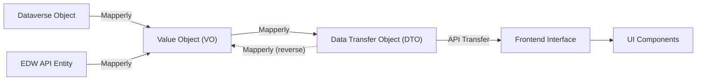

# Coding Guidelines for Frontend and Backend

## General Standards
- Follow consistent naming conventions for files, classes, and functions.
- Maintain clear and concise documentation for all components and services.
- Prioritize code readability and maintainability over cleverness or premature optimization.
- Treat code as a long-term asset: write it for the next developer (or future you).
- Code must be modular, reusable, and maintainable, with each class, function, or component having a clear, single responsibility and adheres to DRY (Don't Repeat Yourself), KISS (Keep It Simple, Stupid), and YAGNI (You Aren’t Gonna Need It) principles.
- Use abstraction and interfaces to decouple high-level logic from low-level implementation details, enabling flexibility and easier testing.
- Design solutions that are easy to reason about and adapt over time, prioritizing readability and long-term quality over short-term convenience.
- Leverage design patterns and architectural best practices where they add clarity or solve recurring problems effectively.

## Project Structure
- The project root contains the React client application.
- The /api folder stores the Azure Functions (.NET API).

## Frontend (React with TypeScript)
### Component Structure
- Components should be organized by view, with each view having its own directory.
- Use functional components and hooks where possible.
- Ensure all components have PropTypes or TypeScript interfaces for props validation.

### UI Structure
- Each subfolder represents a major route or application domain:

  - `customersDetails/`
  - `customersList/`
  - `errorPage/`
  - `forecasts/`
  - `loginPage/`
  - `pnl/`
  - `statements/`

- Each folder contains the main page component and any page-specific logic or subcomponents.
- **Atomic components** and **UI primitives** live in `components/`.
- **Feature-specific** and **page-level** logic is organized in `components/[feature]/` and `pages/[route]/`.
- This structure supports modularity, scalability, and code clarity, following modern React best practices.

### React Client & UI Components
- Standard React application.
- Uses ShadCN components, keeping styling as close to default as possible.
- UI is generated via v0 template tool that automatically builds ShadCN-based components.
- Use Tailwind to generate styles.

### State Management
- Use React Context for global state management.
- Keep local state within components when possible to avoid unnecessary re-renders.

### Static Web App Configuration (staticwebapp.config.json)
- Handles authentication setup and route definitions.
- Routes:
  - /: The home route (login page), accessible by anonymous users.
  - /billing/*: All routes under /billing require authentication.
  - /api/*: All API routes require authentication.
  - /api/updateContractDeviations: Example of a route restricted to admin users with PUT or DELETE permissions.
- The isAdmin (or isAdminCheck) function fetches information from the built-in .auth/me endpoint.
  - .auth/me returns user data (email, roles, claims).
  - The application uses this info to show or hide UI elements depending on user role.

### Testing
- Write unit tests for all components using Jest and React Testing Library.
- Ensure tests cover both happy paths and edge cases.

### Mapping and DTOs
- Use Data Transfer Objects (DTOs) to define the shape of data being passed between components and services.
- Implement mapping functions to convert between DTOs and domain models.

### Mapping and VOs/DTOs
- All Value Objects (VOs) and Data Transfer Objects (DTOs) must be placed in their respective folders:
  - VOs in `api/src/Models/Vo/`
  - DTOs in `api/src/Models/Dto/`
- Ensure namespaces for VOs and DTOs reflect their folder structure, e.g., `namespace api.Models.Vo` for VOs and `namespace api.Models.Dto` for DTOs.
- Use Mapperly for all mapping between domain models, VOs, and DTOs.
- Adapters should handle mapping between VOs and DTOs, keeping business logic in services.
- For service adapters, avoid injecting mappers or services via dependency injection. Instead, instantiate mappers directly within adapter methods as needed, similar to the pattern used in `JobCodeServiceAdapter`.

### Namespace Rules for Tests and Implementations
- All test classes must use the `BackendTests` namespace (e.g., `namespace BackendTests.Services`).
- All implementation classes (production code) must use the `api` namespace (e.g., `namespace api.Services.Impl`).

### Naming Pattern for Interactive UI Elements
- **Naming Pattern Breakdown**: [component-type]-[iteration/index identifier (optional)]-[specific-action/purpose]

#### Component Type Prefixes
- Buttons: `button-`
- Inputs: `input-`
- Checkboxes: `checkbox-`
- Switches: `switch-`
- Links: `link-`
- Dropdowns: `dropdown-`
- Modals: `modal-`
- Forms: `form-`
- Tables: `table-`
- Tabs: `tab-`

#### Naming Principles
- Use lowercase with hyphens for readability; camelCase for multiple words.
- In iterations, include an optional iteration index to keep the ID unique.
- Be descriptive but concise.
- Avoid redundant words.

#### Examples
- Submit button on revenue management page: `data-qa-id="button-revenue-management-submit"`
- Toggle switch for revenue management: `data-qa-id="switch-revenue-management-enabled"`
- Input field for email: `data-qa-id="input-login-email"`
- Dropdown for user selection: `data-qa-id="dropdown-user-role"`

#### Best Practices
- Consistency is key across the entire application.
- Prioritize semantic meaning over technical implementation.
- Update IDs if a component's purpose significantly changes.

## Backend (.NET)
### Project Structure
- Organize the project into layers: Controllers, Services, Repositories, and Models.
- Use Dependency Injection to manage service lifetimes and dependencies.
- All backend functions are implemented as Azure Functions.

### Backend (.NET) – Feature Implementation Flow

When creating a new backend feature, follow this architectural flow, modeled after the "contracts" feature:

#### 1. **Repository Layer (`Data/Impl/`)**
- **Purpose:** Handles all direct data access and persistence logic (e.g., Dataverse, SQL, etc.).
- **Responsibilities:**
  - Expose methods for CRUD operations and complex queries.
  - Accept and return domain models (e.g., `bs_Entity`).
  - No business logic—only data access.
- **Example:** `ContractRepository` implements `IContractRepository`.

- **Note on Dataverse Service Usage:**  
  Inject and use the `IDataverseService` (e.g., `DataverseService`) in repositories to obtain the `IOrganizationService` client. This ensures singleton management, abstraction, and consistency across the codebase. Avoid direct dependency on `IOrganizationService` in repositories.

#### 2. **Service Layer (`Services/Impl/`)**
- **Purpose:** Contains business logic, orchestration, and validation.
- **Responsibilities:**
  - Use repositories to fetch and persist data.
  - Apply business rules, validation, and mapping between domain models and Value Objects (VOs).
  - Compose and coordinate multiple repository calls as needed.
  - Expose methods that operate on VOs.
- **Example:** `ContractService` implements `IContractService`.

#### 3. **Adapter Layer (`Adapters/Impl/` and `Adapters/Mappers/`)**
- **Purpose:** Bridges between service layer and DTOs used by the API layer.
- **Responsibilities:**
  - **Service Adapter:** Accepts/returns DTOs, calls the service layer, and maps between DTOs and VOs.
    - Example: `ContractServiceAdapter` implements `IContractServiceAdapter`.
  - **Mappers:** Use Mapperly to map between domain models, VOs, and DTOs.
    - Example: `ContractMapper` and `UpdateContractMapper`.
- **Guidelines:**
  - All mapping logic should be centralized in mappers.
  - Adapters should be thin and only handle mapping and delegation.

#### 4. **Function/API Layer (`Functions/`)**
- **Purpose:** Azure Functions (or controllers) that expose HTTP endpoints.
- **Responsibilities:**
  - Accept HTTP requests, parse/validate input, and call the appropriate service adapter.
  - Return HTTP responses with serialized DTOs.
  - No business logic or data access logic.
- **Example:** `Contracts` function class.

#### 5. **Data Flow Diagram**

#### 6. **Testing**
- Write unit tests for each layer:
  - Repository: Test data access logic (using mocks or test DB).
  - Service: Test business logic with mocked repositories.
  - Adapter: Test mapping and delegation.
  - Function: Test endpoint behavior with mocked adapters.
- Place backend tests in `api/tests`.

#### 7. **General Principles**
- **Separation of Concerns:** Each layer has a single responsibility.
- **Mapping:** Use Mapperly for all conversions between domain models, VOs, and DTOs.
- **Dependency Injection:** All dependencies should be injected via constructors.
- **DTOs/VOs:** Use DTOs for API contracts and VOs for business logic.
- **No Business Logic in Functions/Adapters/Repositories:** Keep business rules in the service layer.

---

**How to Apply:**  
When creating a new backend feature (e.g., "Site Statistics", "Billing Statement"), scaffold the following:
- Repository interface and implementation.
- Service interface and implementation.
- Service adapter and mappers.
- Azure Function(s) for HTTP endpoints.
- Unit tests for each layer.

**Result:**  
This ensures all backend features are consistent, maintainable, and testable, following the proven contracts flow.

---
### Data Access
- Use Entity Framework for data access and ensure proper use of migrations.
- Implement repository patterns to abstract data access logic.

### Testing
- Write unit tests for all services and controllers using xUnit or NUnit.
- Use mocking frameworks like Moq to isolate tests.
- All backend tests should be created in the `api/tests` directory.

### Mapping and VOs (Required Practice)
- Use Value Objects (VOs) to encapsulate domain logic and ensure immutability.
- **All mapping between domain models, VOs, and DTOs must be performed using [Mapperly](https://mapperly.riok.app/).**
- Do not write manual mapping code or use any other mapping libraries.
- Define all mapping logic in dedicated Mapperly mapper classes (e.g., `ContractMapper`, `UpdateContractMapper`).
- Use `[Mapper]` and `[MapProperty]` attributes to configure mappings as needed.
- If a new mapping is required for a feature, create or extend a Mapperly mapper class for that feature.
- All adapters and services must delegate mapping responsibilities to Mapperly-generated mappers.

### Dataverse Overview and Key Points Summary
This document summarizes the key points from the Dataverse training session, focusing on tables, columns, relationships, and keys.

#### Dataverse Solutions and Components:
- The solution in use by the system is 'Billing System'. A secondary solution ("Allata Test Solution") was used for testing during migration and can be deleted.
- Our primary Dataverse solution houses tables, choices (enumerated values), Power Automate flows, and connection references. This training focuses on tables.

#### Tables and Columns:
- **Table structures** mirror the existing data structure diagram.
- **Columns**:
  - **System Columns**: Automatically added by Dataverse (e.g., created by, modified by).
  - **Custom Columns**: Created by us, prefixed with "bs". It's crucial to use the logical name (not display name) when referencing columns in code.
  - **Column Types**: Various data types are available (text, email, phone number, rich text, number, date, choice, yes/no). Currency types are not used; amounts are stored as plain decimals.
  - **Required Columns**: Can be enforced during column creation.
  - **Lookup Columns**: Represent foreign keys, referencing records in other tables.

#### Relationships:
- **Types**: One-to-many, many-to-one (no many-to-many relationships are used).
- **Naming Convention**: BS_[First Entity]_[Second Entity] (e.g., bs_BillingStatement_CustomerSite).
- **Delete Behavior**: "Restrict" is used to prevent deleting a parent record if it has child records.
- **Model Generation**: Regenerate models after adding relationships to update the code.

#### Keys:
- Created from one or more existing columns.
- Allow retrieving records by the key value instead of just the GUID ID.
- Enforce uniqueness for the combination of columns in the key.

#### Important Considerations:
- **Logical Names**: Cannot be changed after creation for tables or columns.
- **Primary Key Column**: Cannot be deleted or renamed.

## Data Flow and Mapping Architecture

This diagram illustrates the general flow of data and the mapping layers within the project:

**Explanation:**
- **Dataverse Object** and **EDW API Entity** are mapped to the **Value Object (VO)** using Mapperly.
- The **VO** is mapped to the **DTO** (and vice versa) using Mapperly.
- The **DTO** is transferred via API to the frontend, where it is represented as a TypeScript **Interface**.
- The **Interface** is then used by **UI Components** in the React application.
- The diagram also shows the reverse mapping from DTO back to VO, as supported by Mapperly.

## Unit Testing Guidelines
- Write tests for all new features before implementation (Test-Driven Development).
- Ensure tests are run in CI/CD pipelines to maintain code quality.
- Aim for at least 80% code coverage across both frontend and backend.

## Glossary of Terms
- **Account Manager**: Role responsible for a given location in Towne Park. Responsibilities include collecting and submitting data (e.g., occupied room data, revenue spreadsheets) and ensuring accuracy for billing and revenue share calculations, updating the forecasting data, and putting together the budget.
- **Additional Fees or Line Items**: Optional charges added to invoices, such as bell service fees or deposited revenue. These can be included as line items in the billing statement.
- **Annual Escalators**: Predefined annual increases in fees, often tied to CPI or government regulations. This can be configured in the contract configuration.
- **Cash Balancing**: A process to verify that cash reported in the revenue spreadsheet matches deposits in Towne Park's ledger.
- **Consumer Price Index (CPI)**: A measure of the average change in prices over time, often used to adjust fixed fees annually.
- **Deal Types**: Predefined configurations for billing agreements, such as revenue sharing, management agreements, per labor hour agreements, and fixed fee agreements.
- **Fixed Fee**: A straightforward billing model often used in hospital locations where parking revenue is not collected.
- **Flexible Billing**: The system allows for flexibility in billing based on actual hours worked, occupied rooms, or revenue-sharing agreements.
- **General Ledger Codes**: Codes used to map charges for billing purposes.
- **Invoicing Workflow**: Includes data finalization by account managers, invoice generation by AR (Accounts Receivable), and automated data processing into financial systems.
- **Management Agreements**: Agreements where the client pays for all Towne Park's expenses related to parking operations.
- **Mid-Month Advances**: An option to enable mid-month advances for Towne Park, impacting cash flow and billing schedules.
- **Operating Expenses**: Costs related to parking operations, either paid by Towne Park or the client.
- **Payroll and Expense Accounts**: Payroll accounts typically range from 6000-6199, and expense accounts range from 7000-7999.
- **Payroll Taxes and Employee Benefits (PTEB)**: Can be billed as a percentage of payroll or directly pulled from the account summary.
- **Per Labor Hour Agreements**: Billing based on the number of labor hours recorded.
- **Per Occupied Room**: A billing model based on hotel occupancy.
- **Profit Split**: A mechanism where profits are distributed between Towne Park and the client.
- **Revenue Codes**: Codes assigned to different revenue types to allow for differentiated billing and revenue-sharing structures.
- **Revenue Share**: A partnership-like agreement where parking revenue is split between Towne Park and the client.
- **Threshold Structures**: Used in revenue-sharing agreements to define different share percentages at various revenue levels.
- **Validation**: A system to ensure that free parking thresholds are not exceeded without proper billing adjustments.
- **Validation Threshold**: A limit set to control free parking offered by clients.
- **Validation Revenue**: Revenue calculated when free parking exceeds the validation threshold.
- **Validation Types**: Include vehicle count, revenue percentage, and revenue amount.

## Conclusion
Adhering to these guidelines will help maintain a high standard of code quality and ensure consistency across the project.
