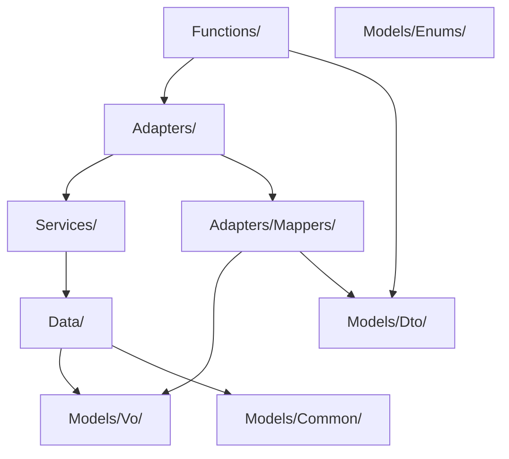

# Coding Guidelines for Frontend and Backend

## General Standards
- Follow consistent naming conventions for files, classes, and functions.
- Maintain clear and concise documentation for all components and services.
- Prioritize code readability and maintainability over cleverness or premature optimization.
- Treat code as a long-term asset: write it for the next developer (or future you).
- Code must be modular, reusable, and maintainable, with each class, function, or component having a clear, single responsibility and adheres to DRY (Don't Repeat Yourself), KISS (Keep It Simple, Stupid), and YAGNI (You Aren’t Gonna Need It) principles.
- Use abstraction and interfaces to decouple high-level logic from low-level implementation details, enabling flexibility and easier testing.
- Design solutions that are easy to reason about and adapt over time, prioritizing readability and long-term quality over short-term convenience.
- Leverage design patterns and architectural best practices where they add clarity or solve recurring problems effectively.


## Project Structure
- The project root contains the React client application.
- The /src folder stores the Azure Functions (.NET API).

### Mapping and DTOs
- Use Data Transfer Objects (DTOs) to define the shape of data being passed between components and services.
- Implement mapping functions to convert between DTOs and domain models.

### Mapping and VOs/DTOs
- All Value Objects (VOs) and Data Transfer Objects (DTOs) must be placed in their respective folders:
  - VOs in `src/Models/Vo/`
  - DTOs in `src/Models/Dto/`
- Ensure namespaces for VOs and DTOs reflect their folder structure, e.g., `namespace api.Models.Vo` for VOs and `namespace api.Models.Dto` for DTOs.
- Adapters should handle mapping between VOs and DTOs, keeping business logic in services.
- For service adapters, avoid injecting mappers or services via dependency injection. Instead, instantiate mappers directly within adapter methods as needed, similar to the pattern used in `JobCodeServiceAdapter`.

#### Naming Principles
- Use lowercase with hyphens for readability; camelCase for multiple words.
- In iterations, include an optional iteration index to keep the ID unique.
- Be descriptive but concise.
- Avoid redundant words.

#### Best Practices
- Consistency is key across the entire application.
- Prioritize semantic meaning over technical implementation.
- Update IDs if a component's purpose significantly changes.

## Backend (.NET)

### Architecture Overview

The backend is organized as a layered Azure Functions application, following Clean Architecture principles for maintainability and scalability. Each layer has a clear responsibility and communicates only with adjacent layers.

#### Layer Responsibilities

- **Function/API Layer (`Functions/`):**  
  Exposes HTTP endpoints as Azure Functions. Handles request validation, calls service adapters, and returns DTOs. No business or data access logic.

- **Adapter Layer (`Adapters/`, `Adapters/Mappers/`):**  
  Bridges between the API and service layers.  
  - *Service Adapters:* Accept/return DTOs, call the service layer, and map between DTOs and VOs.  
  - *Mappers:* Use [Mapperly](https://mapperly.riok.app/) for all mapping between domain models, VOs, and DTOs.  
  No business logic.

- **Service Layer (`Services/`, `Services/Impl/`):**  
  Contains business logic and orchestrates operations. Coordinates between repositories and adapters.

- **Repository Layer (`Data/`, `Data/Impl/`):**  
  Handles all data access and persistence (Dataverse, SQL, etc.). Exposes CRUD and query methods. No business logic.

- **Domain Models & Shared Types (`Models/`):**  
  - `Models/Vo/`: Value Objects for business logic  
  - `Models/Dto/`: Data Transfer Objects for API contracts  
  - `Models/Enums/`: Enumerations for shared types  
  - `Models/Common/`: Shared/common models (e.g., query definitions)

- **Helpers & Middleware:**  
  - `Helpers/`: Utility classes  
  - `Middleware/`: Cross-cutting concerns (e.g., authentication)

- **Configuration:**  
  - `Config/`: Application configuration classes

#### Example Directory Structure

```
src/
  Adapters/
    Mappers/
  Config/
  Data/
    Impl/
  Functions/
  Helpers/
  Middleware/
  Models/
    Common/
    Dto/
    Enums/
    Vo/
  Services/
    Impl/
```

#### Data Flow Diagram



---

### Coding Guidelines

- **Separation of Concerns:** Each layer has a single responsibility.
- **Mapping:** All mapping is currently done manually using custom helper functions.
- **Dependency Injection:** Use constructor injection for all dependencies.
- **No Business Logic in Functions/Adapters/Repositories:** Keep business rules in the service layer.
- **Consistent Naming:** Follow established naming conventions for files, classes, and functions.
- **Testing:** Write unit tests for all services and functions.

---

### Feature Implementation Flow

When creating a new backend feature:

1. **Define Data Models:** Create or update DTOs and VOs in `Models/Dto/` and `Models/Vo/`.
2. **Repository:** Create interface and implementation in `Data/` and `Data/Impl/`.
3. **Service:** Add interface and implementation in `Services/` and `Services/Impl/`.
4. **Adapter & Mapper:** Add service adapter and mappers in `Adapters/` and `Adapters/Mappers/`.
5. **Function:** Add Azure Function in `Functions/`.
6. **EDWQueryRegistry Update:**  
   - Add a new `EDWQueryDefinition` to `Models/Common/EDWQueryRegistry.cs`.
   - Specify the following properties:
     - `Id`: Unique identifier for the query/feature.
     - `NameOrSql`: The SQL statement or name for the query.
     - `CommandType`: The command type (e.g., Text, StoredProcedure).
     - `Mapper`: The Mapperly-generated mapper to convert results to the correct model.
   - This is the only change required in the registry when introducing a new query, once your data models are defined.
7. **Testing:** Add unit tests for each layer.

---

### EDWQueryRegistry Instructions

- **Purpose:** Central registry for all EDW queries used by the application.
- **How to Add a Query:**
  1. Define the necessary DTOs/VOs for your feature.
  2. Add a new `EDWQueryDefinition` entry in `Models/Common/EDWQueryRegistry.cs` with:
     - `Id`: Unique string identifier.
     - `NameOrSql`: SQL or stored procedure name.
     - `CommandType`: Command type (e.g., `CommandType.Text`).
     - `Mapper`: Reference to the Mapperly mapper for result mapping.
  3. No other changes to the registry are required for new features.

---

### Data Access

- Use Entity Framework for data access and ensure proper use of migrations.
- Implement repository patterns to abstract data access logic.


### Mapping and VOs (Required Practice)

- Use Value Objects (VOs) to encapsulate domain logic and ensure immutability.
- **All mapping between domain models, VOs, and DTOs must be performed using [Mapperly](https://mapperly.riok.app/).**
- Do not write manual mapping code or use any other mapping libraries.
- Define all mapping logic in dedicated Mapperly mapper classes.
- Use `[Mapper]` and `[MapProperty]` attributes to configure mappings as needed.
- If a new mapping is required for a feature, create or extend a Mapperly mapper class for that feature.
- All adapters and services must delegate mapping responsibilities to Mapperly-generated mappers.

## Glossary of Terms
- **Account Manager**: Role responsible for a given location in Towne Park. Responsibilities include collecting and submitting data (e.g., occupied room data, revenue spreadsheets) and ensuring accuracy for billing and revenue share calculations, updating the forecasting data, and putting together the budget.
- **Additional Fees or Line Items**: Optional charges added to invoices, such as bell service fees or deposited revenue. These can be included as line items in the billing statement.
- **Annual Escalators**: Predefined annual increases in fees, often tied to CPI or government regulations. This can be configured in the contract configuration.
- **Cash Balancing**: A process to verify that cash reported in the revenue spreadsheet matches deposits in Towne Park's ledger.
- **Consumer Price Index (CPI)**: A measure of the average change in prices over time, often used to adjust fixed fees annually.
- **Deal Types**: Predefined configurations for billing agreements, such as revenue sharing, management agreements, per labor hour agreements, and fixed fee agreements.
- **Fixed Fee**: A straightforward billing model often used in hospital locations where parking revenue is not collected.
- **Flexible Billing**: The system allows for flexibility in billing based on actual hours worked, occupied rooms, or revenue-sharing agreements.
- **General Ledger Codes**: Codes used to map charges for billing purposes.
- **Invoicing Workflow**: Includes data finalization by account managers, invoice generation by AR (Accounts Receivable), and automated data processing into financial systems.
- **Management Agreements**: Agreements where the client pays for all Towne Park's expenses related to parking operations.
- **Mid-Month Advances**: An option to enable mid-month advances for Towne Park, impacting cash flow and billing schedules.
- **Operating Expenses**: Costs related to parking operations, either paid by Towne Park or the client.
- **Payroll and Expense Accounts**: Payroll accounts typically range from 6000-6199, and expense accounts range from 7000-7999.
- **Payroll Taxes and Employee Benefits (PTEB)**: Can be billed as a percentage of payroll or directly pulled from the account summary.
- **Per Labor Hour Agreements**: Billing based on the number of labor hours recorded.
- **Per Occupied Room**: A billing model based on hotel occupancy.
- **Profit Split**: A mechanism where profits are distributed between Towne Park and the client.
- **Revenue Codes**: Codes assigned to different revenue types to allow for differentiated billing and revenue-sharing structures.
- **Revenue Share**: A partnership-like agreement where parking revenue is split between Towne Park and the client.
- **Threshold Structures**: Used in revenue-sharing agreements to define different share percentages at various revenue levels.
- **Validation**: A system to ensure that free parking thresholds are not exceeded without proper billing adjustments.
- **Validation Threshold**: A limit set to control free parking offered by clients.
- **Validation Revenue**: Revenue calculated when free parking exceeds the validation threshold.
- **Validation Types**: Include vehicle count, revenue percentage, and revenue amount.

## Conclusion
Adhering to these guidelines will help maintain a high standard of code quality and ensure consistency across the project.
