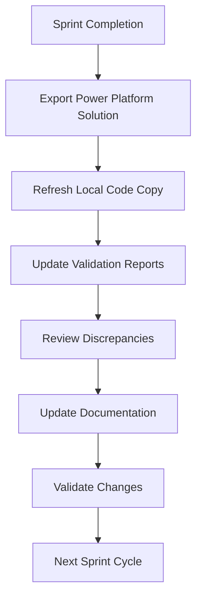

# Code Validation Maintenance Procedures

## 🎯 PURPOSE

This document outlines the operational procedures for maintaining the code validation framework, ensuring validation accuracy, and managing the local code copy refresh process.

## 🏗️ CRITICAL PROJECT INFRASTRUCTURE

**IMPORTANT NOTES FOR ALL MAINTENANCE:**
- **Power Platform Code Directory**: The Towne Park Power Platform code directory is located at `Towne-Park-Billing-PA-Solution/` and DOES EXIST
- **Processed_Files Directory**: The `Processed_Files/` directory ALREADY EXISTS in the project workspace
- **Code Validation**: ALWAYS validate against the existing Power Platform code when applicable
- **Directory Structure**: The code directory contains BillingSystem/, BillingSystemCustomConnectors/, and other solution components

## 📋 MAINTENANCE OVERVIEW

### **Maintenance Responsibilities**

| Role | Responsibility | Frequency |
|------|----------------|-----------|
| **Documentation Lead** | Code copy refresh, validation oversight | After each sprint |
| **AI System** | Automated validation during documentation transformation | Continuous |
| **Technical Team** | Validation accuracy review, discrepancy resolution | As needed |
| **Stakeholders** | Review complex validation findings | As flagged |

### **Maintenance Cycle**



## 🔄 CODE COPY REFRESH PROCEDURES

### **Step 1: Pre-Refresh Preparation**

#### **Validation Status Backup**
```markdown
Before refreshing code copy:
1. Document current validation status for all active documents
2. Note any pending discrepancy resolutions
3. Backup current validation reports
4. Record refresh date and sprint number
```

#### **Pre-Refresh Checklist**
```markdown
- [ ] Current sprint development is complete
- [ ] All code changes have been committed to Power Platform
- [ ] No active development work in progress
- [ ] Documentation team is notified of upcoming refresh
- [ ] Backup of current validation reports created
```

### **Step 2: Power Platform Solution Export**

#### **Export Process**
```markdown
1. Access Power Platform Admin Center
2. Navigate to target environment (Production/UAT)
3. Export BillingSystem solution as managed solution
4. Export BillingSystemCustomConnectors solution
5. Export BillingSystemEnterpriseDataRetrieval solution
6. Export BillingSystemMonitoring solution
7. Download all solution files
```

#### **Export Verification**
```markdown
- [ ] All solution files downloaded successfully
- [ ] File sizes are reasonable (not corrupted)
- [ ] Export includes latest changes from sprint
- [ ] All solution components are present
```

### **Step 3: Local Code Copy Replacement**

#### **Replacement Process**
```markdown
1. Navigate to project directory: `Towne-Park-Billing-PA-Solution/` (DIRECTORY EXISTS)
2. Create backup of current code copy: `Towne-Park-Billing-PA-Solution-BACKUP-YYYYMMDD/`
3. Extract new solution files to temporary directory
4. Replace contents of `Towne-Park-Billing-PA-Solution/` with new files
5. Verify directory structure matches expected format
6. Update refresh date in validation tracking document
```

#### **Directory Structure Verification**
```markdown
Expected structure after refresh (DIRECTORY EXISTS):
- Towne-Park-Billing-PA-Solution/
  - BillingSystem/
    - Formulas/
    - Workflows/
    - environmentvariabledefinitions/
  - BillingSystemCustomConnectors/
  - BillingSystemEnterpriseDataRetrieval/
  - BillingSystemMonitoring/
```

### **Step 4: Post-Refresh Validation**

#### **Immediate Validation Checks**
```markdown
1. Verify key formula files are present and readable
2. Check workflow JSON files for proper format
3. Confirm environment variable definitions exist
4. Test file access from documentation directory
5. Update code copy date in all validation templates
```

#### **Sample Validation Test**
```markdown
Test file access:
- [ ] Can read: BillingSystem/Formulas/bs_profitsharebypercentage-FormulaDefinitions.yaml
- [ ] Can read: BillingSystem/Workflows/FixedFeeGenerationChildFlow-*.json
- [ ] Can read: BillingSystem/environmentvariabledefinitions/bs_environmentName/environmentvariabledefinition.xml
- [ ] File contents are properly formatted
- [ ] No corruption or encoding issues detected
```

## 📊 VALIDATION ACCURACY MONITORING

### **Validation Quality Metrics**

#### **Coverage Metrics**
```markdown
Track monthly:
- **Validation Coverage**: % of applicable documentation with validation reports
- **Code File Coverage**: % of relevant code files referenced in validations
- **Validation Freshness**: Average age of validation reports
- **Discrepancy Resolution Rate**: % of identified discrepancies resolved
```

#### **Accuracy Metrics**
```markdown
Track quarterly:
- **False Positive Rate**: % of flagged discrepancies that were actually correct
- **False Negative Rate**: % of actual discrepancies missed by validation
- **Stakeholder Satisfaction**: Feedback on validation usefulness
- **Documentation Quality Improvement**: Measured improvement in accuracy
```

### **Validation Report Auditing**

#### **Monthly Validation Audit**
```markdown
Review Process:
1. Identify all documents with validation reports
2. Check validation report completeness and accuracy
3. Verify code file references are current and accessible
4. Review discrepancy resolution status
5. Update validation methodology if needed
```

#### **Audit Checklist**
```markdown
For each validation report:
- [ ] Validation date is within acceptable range (< 30 days)
- [ ] Code file references use correct relative paths
- [ ] Validation findings are specific and actionable
- [ ] Status indicators are used correctly
- [ ] Recommendations are clear and implementable
- [ ] Code snippets are accurate and current
```

## 🔧 DISCREPANCY RESOLUTION WORKFLOW

### **Discrepancy Classification**

#### **Priority Levels**
```markdown
**P1 - Critical**: Documentation contradicts code, could cause implementation errors
**P2 - High**: Missing important details that affect functionality
**P3 - Medium**: Minor inconsistencies or unclear descriptions
**P4 - Low**: Enhancement opportunities or complex areas needing review
```

#### **Resolution Process**
```markdown
1. **Triage**: Classify discrepancy by priority and complexity
2. **Investigation**: Determine root cause (code change, documentation error, etc.)
3. **Resolution**: Update documentation, clarify requirements, or flag for review
4. **Verification**: Re-validate after changes to confirm resolution
5. **Documentation**: Update validation report with resolution details
```

### **Stakeholder Escalation**

#### **Escalation Triggers**
```markdown
Escalate to stakeholders when:
- Complex business logic requires expert interpretation
- Conflicting requirements discovered between documentation and code
- Validation reveals potential system design issues
- Multiple related discrepancies suggest broader problems
```

#### **Escalation Process**
```markdown
1. Document specific validation findings requiring expert input
2. Prepare context and background information
3. Schedule review session with appropriate stakeholders
4. Present findings with specific code references
5. Document decisions and update validation reports
6. Follow up on any required changes
```

## 📈 CONTINUOUS IMPROVEMENT

### **Validation Framework Enhancement**

#### **Monthly Review Process**
```markdown
1. **Effectiveness Analysis**: Review validation success rate and user feedback
2. **Pattern Identification**: Look for common types of discrepancies
3. **Process Optimization**: Identify opportunities to improve validation accuracy
4. **Tool Enhancement**: Consider improvements to validation patterns and templates
```

#### **Enhancement Opportunities**
```markdown
Consider enhancements for:
- New types of validation patterns
- Improved automation of validation checks
- Better integration with development workflow
- Enhanced reporting and visualization
- Streamlined discrepancy resolution process
```

### **Training and Knowledge Transfer**

#### **Team Training Requirements**
```markdown
Documentation team training on:
- Understanding validation reports
- Interpreting code validation findings
- Resolving common discrepancies
- Using validation patterns effectively
- Maintaining validation quality
```

#### **Knowledge Documentation**
```markdown
Maintain documentation for:
- Common validation patterns and their meanings
- Typical discrepancy types and resolutions
- Code structure and organization
- Power Platform development practices
- Validation best practices and lessons learned
```

## 🚨 TROUBLESHOOTING GUIDE

### **Common Issues and Solutions**

#### **Code Copy Access Issues**
```markdown
**Problem**: Cannot access code files during validation
**Causes**: File permissions, path changes, corrupted files
**Solutions**:
1. Verify file permissions on Towne-Park-Billing-PA-Solution directory
2. Check file paths in validation reports
3. Re-extract solution files if corruption suspected
4. Update relative paths if directory structure changed
```

#### **Validation Report Inconsistencies**
```markdown
**Problem**: Validation reports show conflicting information
**Causes**: Outdated code copy, multiple validation versions, manual edits
**Solutions**:
1. Verify code copy refresh date
2. Check for multiple versions of validation reports
3. Re-run validation with current code copy
4. Standardize validation report format
```

#### **Performance Issues**
```markdown
**Problem**: Validation process is slow or resource-intensive
**Causes**: Large code files, complex analysis, inefficient patterns
**Solutions**:
1. Optimize validation patterns for efficiency
2. Focus validation on most critical elements
3. Consider batch processing for large validations
4. Monitor system resources during validation
```

### **Emergency Procedures**

#### **Code Copy Corruption**
```markdown
If code copy becomes corrupted:
1. Stop all validation activities immediately
2. Restore from most recent backup
3. Re-export solutions from Power Platform if needed
4. Verify integrity before resuming validation
5. Document incident and prevention measures
```

#### **Validation System Failure**
```markdown
If validation system fails:
1. Document current validation status
2. Switch to manual validation process temporarily
3. Investigate and resolve system issues
4. Test validation system thoroughly before resuming
5. Update validation reports with any gaps
```

## 📋 MAINTENANCE SCHEDULE

### **Daily Tasks**
```markdown
- Monitor validation system health
- Review new validation reports for obvious errors
- Respond to validation-related questions from team
```

### **Weekly Tasks**
```markdown
- Review validation coverage for new documentation
- Check discrepancy resolution progress
- Update validation status tracking
- Communicate validation findings to relevant teams
```

### **Monthly Tasks**
```markdown
- Conduct comprehensive validation audit
- Review and update validation patterns
- Analyze validation effectiveness metrics
- Plan improvements for next month
```

### **Sprint-End Tasks**
```markdown
- Refresh code copy from latest Power Platform export
- Update all validation reports with new code copy date
- Re-validate previously identified discrepancies
- Document any new validation requirements
```

### **Quarterly Tasks**
```markdown
- Comprehensive review of validation framework effectiveness
- Stakeholder feedback collection and analysis
- Training needs assessment and planning
- Strategic planning for validation improvements
```

## 📊 SUCCESS METRICS

### **Key Performance Indicators**

#### **Operational Metrics**
```markdown
- **Code Copy Refresh Success Rate**: 100% successful refreshes
- **Validation Coverage**: >90% of applicable documentation validated
- **Validation Freshness**: <30 days average age of validation reports
- **Discrepancy Resolution Time**: <7 days average resolution time
```

#### **Quality Metrics**
```markdown
- **Documentation Accuracy**: >95% accuracy after validation implementation
- **Stakeholder Satisfaction**: >4.5/5 rating on validation usefulness
- **False Positive Rate**: <5% of flagged discrepancies
- **Process Efficiency**: <2 hours per sprint for maintenance tasks
```

This maintenance framework ensures the code validation system remains accurate, efficient, and valuable for maintaining documentation quality while minimizing operational overhead.