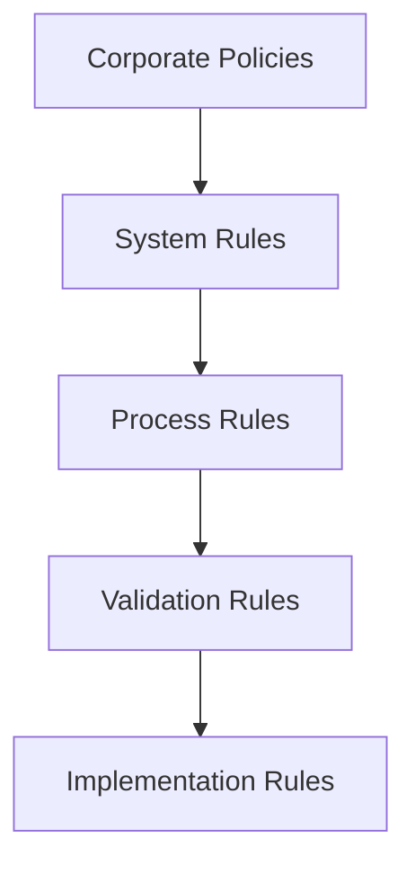

# Business Rules Documentation

## Overview

This section contains comprehensive business rules that govern the behavior, logic, and operational procedures for all Towne Park financial systems. These rules ensure consistency, accuracy, and compliance across all business operations.

## Business Rules by System

### [Billing System Rules](billing/index.md)
Business rules governing billing operations, calculations, and processes.

**Key Areas:**
- [Invoice Calculation Rules](billing/invoice-calculation.md)
- [Account Validation Rules](billing/20250702_Billing_AccountValidation_BusinessRules.md)
- [ROI Analysis & Success Metrics](billing/20250716_Billing_ROIAnalysis_SuccessMetrics.md)
- [PowerBill ROI Analysis](billing/20250717_Billing_ROIAnalysis_PowerBillSuccessMetrics.md)
- [System Modernization Case Study](billing/20250717_TownePark_CaseStudy_BillingSystemModernization.md)

**Process Rules:**
- [Management Fee Escalation](billing/management-fee-escalation-rules.md)
- [PTEB Escalation Rules](billing/pteb-escalation-rules.md)
- [Negative Invoice GL Entity Mapping](billing/negative-invoice-gl-entity-mapping.md)

### [Forecasting System Rules](forecasting/index.md)
Business rules for forecasting operations, calculations, and data validation.

**Key Areas:**
- [Calculations and Validations](forecasting/20250718_Forecasting_BusinessRules_CalculationsAndValidations.md)
- [Development Decisions](forecasting/20250718_Forecasting_BusinessRules_DevelopmentDecisions.md)
- [Process Workflow](forecasting/20250716_Forecasting_BusinessRules_ProcessWorkflow.md)
- [Billable Accounts Rules](forecasting/20250716_Forecasting_BillableAccounts_BusinessRules.md)

**Operational Rules:**
- [Job Code Management](forecasting/20250702_Forecasting_JobCodeManagement_BusinessRules.md)
- [Sprint 26 Features](forecasting/20250717_Forecasting_BusinessRules_Sprint26Features.md)
- [Revenue Rules](forecasting/revenue.md)
- [Payroll Rules](forecasting/payroll.md)
- [Statistics Rules](forecasting/statistics.md)

### [Contract Management Rules](contracts/index.md)
Business rules governing contract types, escalations, and management procedures.

**Key Areas:**
- [Comprehensive Contract Rules](contracts/20250716_Contracts_BusinessRules_Comprehensive.md)
- [Contract Escalation Rules](contracts/contract-escalation-rules.md)
- [PLH Rate Escalation](contracts/plh-rate-escalation.md)
- [Service Fee Escalation ECI](contracts/service-fee-escalation-eci.md)

### [Contract Types](contract-types/revenue-share.md)
Specific business rules for different contract structures.

**Contract Types:**
- [Revenue Share](contract-types/revenue-share.md)
- [Fixed Fee](contract-types/fixed-fee.md)
- [Per Labor Hour](contract-types/per-labor-hour.md)
- [Management Agreement](contract-types/management-agreement.md)

### [Customer Sites Rules](customer-sites/site-classification-rules.md)
Business rules for customer site management and operations.

**Key Areas:**
- [Site Classification Rules](customer-sites/site-classification-rules.md)

## Business Rule Categories

### Financial Rules
Rules governing financial calculations, revenue recognition, and accounting procedures.

**Key Components:**
- Revenue calculation methodologies
- Cost allocation rules
- Profit sharing formulas
- Escalation mechanisms

### Operational Rules
Rules governing day-to-day operations and business processes.

**Key Components:**
- Data validation requirements
- Process workflow rules
- User access controls
- System integration rules

### Compliance Rules
Rules ensuring regulatory compliance and audit requirements.

**Key Components:**
- Data retention policies
- Audit trail requirements
- Regulatory reporting rules
- Security compliance measures

## Rule Implementation Framework

### Rule Hierarchy

### Rule Categories

| Category | Description | Examples |
|----------|-------------|----------|
| **Calculation Rules** | Mathematical formulas and business calculations | Revenue share percentages, escalation rates |
| **Validation Rules** | Data quality and integrity checks | Required fields, data formats, range checks |
| **Process Rules** | Business workflow and procedure rules | Approval workflows, escalation procedures |
| **Access Rules** | User permissions and security rules | Role-based access, data visibility |
| **Integration Rules** | System integration and data flow rules | API requirements, data synchronization |

## Rule Governance

### Rule Management Process
1. **Rule Definition**: Clear specification of business requirements
2. **Rule Validation**: Testing and verification of rule logic
3. **Rule Implementation**: System configuration and deployment
4. **Rule Monitoring**: Ongoing compliance and performance monitoring
5. **Rule Updates**: Change management and version control

### Rule Documentation Standards
- **Rule ID**: Unique identifier for each rule
- **Rule Description**: Clear, concise explanation of the rule
- **Business Justification**: Rationale for the rule
- **Implementation Details**: Technical specifications
- **Testing Requirements**: Validation and verification procedures

## Related Documentation

- [Systems Documentation](../systems/index.md) ✓ VERIFIED
- [Technical Reference](../technical/index.md) ✓ VERIFIED
- [User Processes](../user-processes/index.md) ✓ VERIFIED
- [Configuration Guides](../configuration/index.md) ✓ VERIFIED

## Quick Links

- [Development Standards](../configuration/system-settings/20250718_Development_Standards_ComprehensiveGuide.md)
- [Definition of Done](../configuration/system-settings/20250718_Development_DefinitionOfDone_ComprehensiveGuide.md)
- [Power Platform Licensing](../configuration/system-settings/20250718_Architecture_LicensingAnalysis_PowerPlatform.md)
- [Integration Strategy](../technical/integrations/20250718_Architecture_IntegrationStrategy_HybridConnections.md)