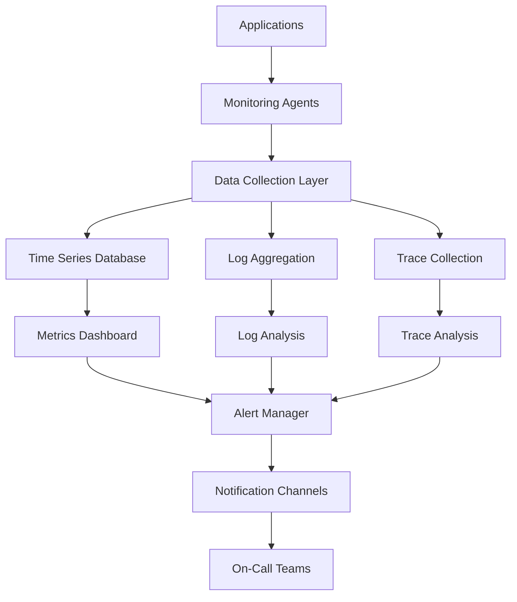

# Monitoring and Alerting Guide

## Overview

This guide provides comprehensive instructions for monitoring and alerting across the Towne Park data platform. It establishes standards for observability, incident detection, and response procedures to ensure optimal system performance and reliability.

## Monitoring Strategy

### Observability Pillars

#### Metrics
- **System Metrics**: CPU, memory, disk, network utilization
- **Application Metrics**: Response times, throughput, error rates
- **Business Metrics**: Transaction volumes, revenue, user engagement
- **Custom Metrics**: Domain-specific KPIs and performance indicators

#### Logs
- **Application Logs**: Structured logging with correlation IDs
- **System Logs**: Infrastructure and platform logs
- **Security Logs**: Authentication, authorization, and audit trails
- **Integration Logs**: API calls, data transfers, and system interactions

#### Traces
- **Distributed Tracing**: End-to-end request tracking across services
- **Performance Tracing**: Detailed performance analysis and bottleneck identification
- **User Journey Tracing**: Complete user interaction flows
- **Business Process Tracing**: Critical business workflow monitoring

### Monitoring Architecture



## Monitoring Tools and Platforms

### Azure Monitor

#### Application Insights
```yaml
ApplicationInsights:
  capabilities:
    - "Application performance monitoring"
    - "Dependency tracking"
    - "Exception monitoring"
    - "User behavior analytics"
  
  configuration:
    sampling_rate: 100  # percent for production
    retention_period: 90  # days
    daily_cap: 100  # GB per day
    alert_rules: "Custom performance and availability rules"
  
  key_metrics:
    - "Response time percentiles"
    - "Request rates"
    - "Failure rates"
    - "Dependency call durations"
```

#### Log Analytics
```yaml
LogAnalytics:
  data_sources:
    - "Application logs"
    - "System event logs"
    - "Security logs"
    - "Custom log sources"
  
  retention_policy:
    interactive_retention: 30  # days
    total_retention: 730  # days
    archive_retention: 2555  # days (7 years)
  
  query_capabilities:
    - "KQL (Kusto Query Language)"
    - "Cross-workspace queries"
    - "Scheduled queries"
    - "Alert rule integration"
```

### Power Platform Monitoring

#### Power Apps Analytics
```yaml
PowerAppsAnalytics:
  metrics:
    - "App usage statistics"
    - "User session data"
    - "Performance metrics"
    - "Error tracking"
  
  monitoring_scope:
    - "Canvas apps"
    - "Model-driven apps"
    - "Portal apps"
    - "Component usage"
  
  reporting:
    frequency: "Daily automated reports"
    recipients: "App owners and administrators"
    format: "Email and dashboard"
```

#### Power Automate Analytics
```yaml
PowerAutomateAnalytics:
  flow_monitoring:
    - "Execution success rates"
    - "Run duration metrics"
    - "Error frequency"
    - "Trigger performance"
  
  connector_monitoring:
    - "Connector usage statistics"
    - "API call volumes"
    - "Throttling incidents"
    - "Authentication failures"
  
  performance_metrics:
    - "Average execution time"
    - "Peak usage periods"
    - "Resource consumption"
    - "Concurrency levels"
```

#### Power BI Monitoring
```yaml
PowerBIMonitoring:
  dataset_monitoring:
    - "Refresh success rates"
    - "Refresh duration"
    - "Data freshness"
    - "Query performance"
  
  report_monitoring:
    - "Report usage statistics"
    - "Load times"
    - "User interactions"
    - "Export activities"
  
  capacity_monitoring:
    - "CPU utilization"
    - "Memory usage"
    - "Query queue length"
    - "Background operations"
```

## Key Performance Indicators (KPIs)

### System Performance KPIs

#### Availability Metrics
```yaml
AvailabilityKPIs:
  system_uptime:
    target: "99.9%"
    measurement: "Monthly rolling average"
    calculation: "(Total time - Downtime) / Total time * 100"
  
  service_availability:
    target: "99.95%"
    measurement: "Per service, monthly"
    calculation: "Successful health checks / Total health checks * 100"
  
  api_availability:
    target: "99.9%"
    measurement: "Per API endpoint"
    calculation: "Successful responses / Total requests * 100"
```

#### Performance Metrics
```yaml
PerformanceKPIs:
  response_time:
    target: "< 2 seconds (95th percentile)"
    measurement: "Application response time"
    alerting: "Warning at 3s, Critical at 5s"
  
  throughput:
    target: "> 1000 requests/minute"
    measurement: "Peak sustained throughput"
    alerting: "Warning at 800 req/min"
  
  error_rate:
    target: "< 0.1%"
    measurement: "Application error rate"
    alerting: "Warning at 0.5%, Critical at 1%"
```

### Business Performance KPIs

#### Transaction Metrics
```yaml
TransactionKPIs:
  billing_processing:
    target: "99.99% success rate"
    measurement: "Billing transaction success"
    alerting: "Immediate alert on any failure"
  
  data_synchronization:
    target: "< 5 minutes lag"
    measurement: "Data freshness across systems"
    alerting: "Warning at 10 minutes, Critical at 30 minutes"
  
  report_generation:
    target: "< 30 seconds"
    measurement: "Standard report generation time"
    alerting: "Warning at 60 seconds"
```

#### User Experience Metrics
```yaml
UserExperienceKPIs:
  page_load_time:
    target: "< 3 seconds"
    measurement: "Complete page load time"
    alerting: "Warning at 5 seconds"
  
  user_satisfaction:
    target: "> 4.0/5.0"
    measurement: "User feedback scores"
    reporting: "Monthly user satisfaction survey"
  
  feature_adoption:
    target: "> 80% adoption rate"
    measurement: "New feature usage within 30 days"
    reporting: "Quarterly adoption reports"
```

## Alert Configuration

### Alert Severity Levels

#### Critical Alerts
```yaml
CriticalAlerts:
  criteria:
    - "System completely unavailable"
    - "Data corruption detected"
    - "Security breach identified"
    - "Financial transaction failures"
  
  response_requirements:
    acknowledgment_time: "5 minutes"
    resolution_time: "1 hour"
    escalation: "Immediate to on-call engineer"
  
  notification_channels:
    - "PagerDuty with phone call"
    - "SMS to on-call team"
    - "Email to management"
    - "Slack emergency channel"
```

#### High Priority Alerts
```yaml
HighPriorityAlerts:
  criteria:
    - "Service degradation affecting users"
    - "Performance below SLA thresholds"
    - "Integration failures"
    - "Capacity approaching limits"
  
  response_requirements:
    acknowledgment_time: "15 minutes"
    resolution_time: "4 hours"
    escalation: "To technical team lead"
  
  notification_channels:
    - "Email to technical team"
    - "Slack operations channel"
    - "Dashboard notifications"
```

#### Medium Priority Alerts
```yaml
MediumPriorityAlerts:
  criteria:
    - "Minor performance issues"
    - "Non-critical feature failures"
    - "Warning threshold breaches"
    - "Scheduled maintenance reminders"
  
  response_requirements:
    acknowledgment_time: "1 hour"
    resolution_time: "Next business day"
    escalation: "To operations team"
  
  notification_channels:
    - "Email to operations team"
    - "Dashboard notifications"
    - "Weekly summary reports"
```

### Alert Rules and Thresholds

#### Infrastructure Alerts
```yaml
InfrastructureAlerts:
  cpu_utilization:
    warning_threshold: 75
    critical_threshold: 90
    duration: "5 minutes sustained"
    action: "Auto-scaling trigger"
  
  memory_utilization:
    warning_threshold: 80
    critical_threshold: 95
    duration: "3 minutes sustained"
    action: "Memory leak investigation"
  
  disk_space:
    warning_threshold: 80
    critical_threshold: 95
    duration: "Immediate"
    action: "Cleanup procedures"
  
  network_latency:
    warning_threshold: 100  # milliseconds
    critical_threshold: 500  # milliseconds
    duration: "2 minutes sustained"
    action: "Network diagnostics"
```

#### Application Alerts
```yaml
ApplicationAlerts:
  response_time:
    warning_threshold: 3000  # milliseconds
    critical_threshold: 5000  # milliseconds
    duration: "5 minutes sustained"
    measurement: "95th percentile"
  
  error_rate:
    warning_threshold: 1.0  # percent
    critical_threshold: 5.0  # percent
    duration: "2 minutes sustained"
    measurement: "Errors per total requests"
  
  throughput:
    warning_threshold: 500  # requests/minute
    critical_threshold: 100  # requests/minute
    duration: "3 minutes sustained"
    measurement: "Requests per minute"
```

#### Business Logic Alerts
```yaml
BusinessAlerts:
  billing_failures:
    threshold: 1  # any failure
    duration: "Immediate"
    severity: "Critical"
    action: "Immediate investigation"
  
  data_sync_lag:
    warning_threshold: 10  # minutes
    critical_threshold: 30  # minutes
    duration: "Sustained lag"
    action: "Sync process restart"
  
  user_login_failures:
    threshold: 10  # failures per minute
    duration: "2 minutes sustained"
    severity: "High"
    action: "Security investigation"
```

## Dashboard Configuration

### Executive Dashboard

#### Key Metrics Display
```yaml
ExecutiveDashboard:
  refresh_frequency: "5 minutes"
  data_retention: "90 days"
  
  widgets:
    system_health:
      type: "Status indicator"
      metrics: ["Overall system status", "Service availability"]
      color_coding: "Green/Yellow/Red"
    
    performance_summary:
      type: "Scorecard"
      metrics: ["Response time", "Throughput", "Error rate"]
      targets: "SLA thresholds"
    
    business_metrics:
      type: "Trend chart"
      metrics: ["Transaction volume", "Revenue", "User activity"]
      time_range: "Last 24 hours"
    
    incident_summary:
      type: "Table"
      data: "Active incidents and recent resolutions"
      auto_refresh: "1 minute"
```

### Operations Dashboard

#### Detailed Monitoring
```yaml
OperationsDashboard:
  refresh_frequency: "30 seconds"
  data_retention: "30 days"
  
  sections:
    infrastructure_monitoring:
      charts: ["CPU usage", "Memory usage", "Disk I/O", "Network traffic"]
      drill_down: "Server-level details"
    
    application_monitoring:
      charts: ["Response times", "Error rates", "Request volumes"]
      filters: ["Service", "Environment", "Time range"]
    
    alert_management:
      display: "Active alerts with severity and age"
      actions: ["Acknowledge", "Escalate", "Resolve"]
    
    log_analysis:
      integration: "Log Analytics workspace"
      quick_queries: "Pre-defined troubleshooting queries"
```

### Technical Dashboard

#### Deep Dive Analytics
```yaml
TechnicalDashboard:
  refresh_frequency: "Real-time"
  data_retention: "7 days detailed, 90 days aggregated"
  
  advanced_features:
    custom_queries:
      language: "KQL (Kusto Query Language)"
      saved_queries: "Common troubleshooting scenarios"
    
    correlation_analysis:
      features: ["Cross-service correlation", "Anomaly detection"]
      machine_learning: "Automated pattern recognition"
    
    performance_profiling:
      tools: ["Application Insights", "Custom profilers"]
      analysis: ["Bottleneck identification", "Resource optimization"]
```

## Incident Management

### Incident Classification

#### Severity Levels
```yaml
IncidentSeverity:
  severity_1:
    description: "Critical business impact"
    examples: ["Complete system outage", "Data corruption", "Security breach"]
    response_time: "15 minutes"
    resolution_target: "4 hours"
  
  severity_2:
    description: "Significant business impact"
    examples: ["Major feature unavailable", "Performance degradation"]
    response_time: "1 hour"
    resolution_target: "24 hours"
  
  severity_3:
    description: "Minor business impact"
    examples: ["Non-critical feature issues", "Cosmetic problems"]
    response_time: "4 hours"
    resolution_target: "72 hours"
  
  severity_4:
    description: "No immediate business impact"
    examples: ["Enhancement requests", "Documentation updates"]
    response_time: "Next business day"
    resolution_target: "Next release cycle"
```

### Incident Response Process

#### Initial Response
```yaml
IncidentResponse:
  detection:
    sources: ["Automated alerts", "User reports", "Monitoring systems"]
    validation: "Confirm incident and assess impact"
    classification: "Assign severity level"
  
  notification:
    internal: "Alert on-call team and stakeholders"
    external: "Notify affected users if necessary"
    communication: "Regular status updates"
  
  investigation:
    triage: "Identify root cause and affected systems"
    mitigation: "Implement immediate workarounds"
    resolution: "Apply permanent fix"
  
  closure:
    verification: "Confirm resolution and system stability"
    documentation: "Document incident and lessons learned"
    review: "Post-incident review and improvement actions"
```

#### Escalation Procedures
```yaml
EscalationProcedures:
  level_1:
    team: "Operations team"
    skills: "Basic troubleshooting and monitoring"
    escalation_criteria: "Unable to resolve within 30 minutes"
  
  level_2:
    team: "Technical specialists"
    skills: "Advanced troubleshooting and system knowledge"
    escalation_criteria: "Complex technical issues or severity 1 incidents"
  
  level_3:
    team: "Senior engineers and architects"
    skills: "Deep system knowledge and design decisions"
    escalation_criteria: "Architecture changes or critical system failures"
  
  management:
    team: "Engineering management"
    involvement: "Major incidents affecting business operations"
    communication: "Executive updates and external communication"
```

## Monitoring Best Practices

### Alerting Best Practices

#### Alert Design Principles
- **Actionable**: Every alert should require a specific action
- **Relevant**: Alerts should indicate real problems, not false positives
- **Timely**: Alerts should fire early enough to prevent impact
- **Clear**: Alert messages should clearly describe the problem and impact

#### Alert Fatigue Prevention
```yaml
AlertFatigue:
  strategies:
    - "Tune thresholds to reduce false positives"
    - "Use alert suppression during maintenance"
    - "Implement alert correlation and grouping"
    - "Regular review and cleanup of alert rules"
  
  metrics:
    - "Alert-to-incident ratio"
    - "Time to acknowledge alerts"
    - "Alert resolution time"
    - "False positive rate"
```

### Dashboard Design Principles

#### Effective Visualization
- **Hierarchy**: Most important information prominently displayed
- **Context**: Provide sufficient context for decision-making
- **Consistency**: Use consistent colors, fonts, and layouts
- **Responsiveness**: Ensure dashboards work on different screen sizes

#### User Experience
```yaml
DashboardUX:
  design_principles:
    - "Mobile-first responsive design"
    - "Intuitive navigation and filtering"
    - "Fast loading times (<3 seconds)"
    - "Accessible design for all users"
  
  customization:
    - "Role-based dashboard views"
    - "Personalized metric preferences"
    - "Custom time range selection"
    - "Bookmark and sharing capabilities"
```

## Monitoring Automation

### Automated Remediation

#### Self-Healing Systems
```yaml
AutomatedRemediation:
  scenarios:
    service_restart:
      trigger: "Service health check failure"
      action: "Automatic service restart"
      validation: "Health check confirmation"
    
    resource_scaling:
      trigger: "High resource utilization"
      action: "Auto-scaling activation"
      validation: "Performance improvement confirmation"
    
    cache_clearing:
      trigger: "Memory pressure alerts"
      action: "Automatic cache cleanup"
      validation: "Memory usage reduction"
  
  safety_measures:
    - "Maximum retry attempts"
    - "Escalation to human operators"
    - "Rollback procedures"
    - "Audit logging of all actions"
```

### Intelligent Alerting

#### Machine Learning Integration
```yaml
IntelligentAlerting:
  anomaly_detection:
    algorithms: ["Statistical analysis", "Machine learning models"]
    training_data: "Historical performance patterns"
    sensitivity: "Configurable sensitivity levels"
  
  predictive_alerting:
    capabilities: ["Trend analysis", "Capacity forecasting"]
    lead_time: "30-60 minutes advance warning"
    accuracy_target: "85% prediction accuracy"
  
  alert_correlation:
    features: ["Root cause analysis", "Impact assessment"]
    grouping: "Related alerts grouped into incidents"
    prioritization: "Business impact-based prioritization"
```

## Reporting and Analytics

### Performance Reports

#### Regular Reports
```yaml
PerformanceReporting:
  daily_reports:
    recipients: "Operations team"
    content: ["System health summary", "Performance metrics", "Incident summary"]
    delivery: "Automated email at 8 AM"
  
  weekly_reports:
    recipients: "Technical management"
    content: ["Trend analysis", "Capacity planning", "Performance optimization"]
    delivery: "Monday morning executive summary"
  
  monthly_reports:
    recipients: "Executive leadership"
    content: ["SLA compliance", "Business impact analysis", "Strategic recommendations"]
    delivery: "First week of following month"
```

#### Custom Analytics
```yaml
CustomAnalytics:
  ad_hoc_analysis:
    tools: ["Power BI", "Azure Data Explorer", "Custom queries"]
    capabilities: ["Root cause analysis", "Performance optimization", "Capacity planning"]
  
  trend_analysis:
    features: ["Historical trend identification", "Seasonal pattern analysis", "Anomaly detection"]
    time_ranges: ["Daily", "Weekly", "Monthly", "Quarterly", "Annual"]
  
  business_intelligence:
    integration: "Business metrics correlation with technical metrics"
    insights: ["Performance impact on business outcomes", "Cost optimization opportunities"]
```

---

*This monitoring and alerting guide is maintained by the Towne Park Operations Team and is updated regularly to reflect system changes and operational improvements.*