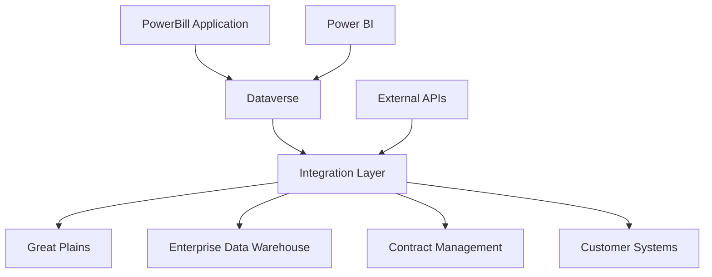

# Billing System Overview

## Introduction

The Towne Park Billing System is a comprehensive financial management platform built on Microsoft Power Platform, designed to automate and streamline all billing operations, invoice generation, and customer account management across multiple contract types and business models.

## System Architecture

### Platform Foundation
- **Microsoft Power Platform**: Core development and runtime platform
- **Microsoft Dataverse**: Unified data platform and storage
- **Power Apps**: User interface and application layer
- **Power Automate**: Business process automation and workflows
- **Power BI**: Business intelligence and reporting

### Integration Architecture

## Core System Features

### Automated Billing Operations
- **Multi-Contract Support**: Support for all contract types (Revenue Share, Fixed Fee, PLH, Management Agreements)
- **Automated Invoice Generation**: Rule-based invoice creation and processing
- **Recurring Billing**: Automated recurring billing cycles and schedules
- **Pro-Ration Calculations**: Intelligent pro-ration for partial billing periods
- **Bulk Processing**: Efficient processing of large invoice batches

### Customer Account Management
- **Centralized Customer Data**: Comprehensive customer master data management
- **Account Hierarchy**: Support for complex customer organizational structures
- **Contact Management**: Multiple contact types and communication preferences
- **Credit Management**: Credit limits, payment terms, and risk assessment
- **Account Maintenance**: Streamlined account setup and ongoing maintenance

### Contract Integration
- **Contract-Driven Billing**: Billing processes driven by contract terms and conditions
- **Rate Management**: Dynamic rate management with automated escalations
- **Performance Tracking**: Contract performance monitoring and reporting
- **Compliance Monitoring**: Automated compliance checking and validation
- **Change Management**: Contract modification impact analysis and implementation

## Business Process Automation

### Invoice Processing Workflows
- **Invoice Creation**: Automated invoice generation based on contract rules
- **Validation and Approval**: Multi-stage validation and approval processes
- **Distribution**: Automated invoice distribution via multiple channels
- **Payment Processing**: Integrated payment processing and reconciliation
- **Exception Handling**: Automated exception detection and resolution workflows

### Customer Service Workflows
- **Account Inquiries**: Streamlined customer account inquiry processing
- **Dispute Management**: Structured billing dispute resolution processes
- **Payment Processing**: Multiple payment method support and processing
- **Communication Management**: Automated customer communication and notifications
- **Service Request Processing**: Customer service request management and tracking

### Financial Management Workflows
- **Revenue Recognition**: Automated revenue recognition based on contract terms
- **Financial Reporting**: Automated financial report generation and distribution
- **Audit Trail Management**: Comprehensive audit trail maintenance and reporting
- **Compliance Reporting**: Automated regulatory and compliance reporting
- **Period-End Processing**: Streamlined month-end and year-end processing

## Integration Capabilities

### Enterprise System Integration
- **Great Plains Integration**: Real-time integration with Great Plains financial system
- **EDW Integration**: Comprehensive data integration with Enterprise Data Warehouse
- **Contract System Integration**: Seamless integration with contract management systems
- **Customer System Integration**: Integration with customer relationship management systems
- **Payment Gateway Integration**: Multiple payment gateway and processor integration

### Data Synchronization
- **Real-Time Synchronization**: Real-time data updates across integrated systems
- **Batch Processing**: Efficient batch processing for large data volumes
- **Error Handling**: Robust error handling and recovery mechanisms
- **Data Validation**: Comprehensive data validation and quality assurance
- **Audit Logging**: Complete audit logging of all integration activities

## User Interface and Experience

### Modern Application Design
- **Responsive Interface**: Mobile-friendly responsive design
- **Intuitive Navigation**: User-friendly navigation and interface design
- **Role-Based Customization**: Customized interfaces based on user roles
- **Dashboard Analytics**: Real-time dashboard and key performance indicators
- **Accessibility Compliance**: Full accessibility standards compliance

### Key User Experiences
- **Billing Administrator**: Comprehensive billing operations and management
- **Account Manager**: Site-specific billing and customer account management
- **Customer Service**: Customer inquiry and service request management
- **Finance Manager**: Financial analysis and reporting capabilities
- **System Administrator**: System configuration and maintenance tools

## Reporting and Analytics

### Financial Reporting
- **Revenue Analysis**: Comprehensive revenue analysis and reporting
- **Billing Performance**: Billing process performance metrics and analysis
- **Customer Analytics**: Customer performance and behavior analysis
- **Contract Analysis**: Contract performance and profitability analysis
- **Trend Analysis**: Historical trend analysis and forecasting

### Operational Reporting
- **Process Efficiency**: Billing process efficiency and performance metrics
- **Quality Metrics**: Data quality and accuracy measurement
- **User Activity**: User activity and system utilization reporting
- **System Performance**: System performance and availability metrics
- **Exception Analysis**: Exception analysis and resolution tracking

### Executive Dashboards
- **Financial KPIs**: Key financial performance indicators and metrics
- **Operational Metrics**: Operational performance and efficiency metrics
- **Customer Metrics**: Customer satisfaction and retention metrics
- **Quality Indicators**: Quality and compliance metrics
- **Strategic Analytics**: Strategic performance and goal tracking

## Security and Compliance

### Security Framework
- **Multi-Factor Authentication**: Required multi-factor authentication for all users
- **Role-Based Access Control**: Granular role-based access control and permissions
- **Data Encryption**: End-to-end data encryption and protection
- **Audit Logging**: Comprehensive audit logging and monitoring
- **Network Security**: Secure network communication and protocols

### Compliance Capabilities
- **Regulatory Compliance**: Compliance with financial regulations and standards
- **Data Privacy**: Compliance with data privacy and protection regulations
- **Industry Standards**: Adherence to industry-specific billing standards
- **Audit Support**: Comprehensive audit support and documentation
- **Risk Management**: Risk assessment and mitigation capabilities

## Performance and Scalability

### Performance Optimization
- **High Performance**: Optimized performance for high-volume operations
- **Scalable Architecture**: Horizontally and vertically scalable architecture
- **Efficient Processing**: Efficient processing algorithms and optimization
- **Caching Strategy**: Strategic caching for improved response times
- **Load Balancing**: Distributed load balancing and resource management

### Monitoring and Management
- **Real-Time Monitoring**: Real-time system monitoring and alerting
- **Performance Analytics**: Performance analytics and optimization recommendations
- **Capacity Planning**: Proactive capacity planning and management
- **Health Monitoring**: System health monitoring and maintenance
- **Disaster Recovery**: Comprehensive disaster recovery and business continuity

## Implementation and Support

### Implementation Approach
- **Phased Implementation**: Structured phased implementation approach
- **Change Management**: Comprehensive change management and training
- **Data Migration**: Secure and efficient data migration procedures
- **Testing and Validation**: Comprehensive testing and validation processes
- **Go-Live Support**: Full go-live support and monitoring

### Ongoing Support
- **Technical Support**: Comprehensive technical support and maintenance
- **User Training**: Ongoing user training and certification programs
- **System Updates**: Regular system updates and feature enhancements
- **Performance Optimization**: Continuous performance monitoring and optimization
- **Business Support**: Business process support and optimization

## Related Documentation

- [PowerBill System Overview (Detailed)](powerbill-system-overview.md)
- [PowerBill System Architecture](20250716_Billing_SystemOverview_PowerBill.md)
- [Billing Business Rules](../../business-rules/billing/index.md)
- [Billing User Processes](../../user-processes/billing-admin/index.md)

## Quick Links

- [Technical Architecture](../../technical/backend/index.md)
- [Integration Strategy](../../technical/integrations/index.md)
- [System Configuration](../../configuration/index.md)
- [Development Standards](../../configuration/system-settings/20250718_Development_Standards_ComprehensiveGuide.md)
