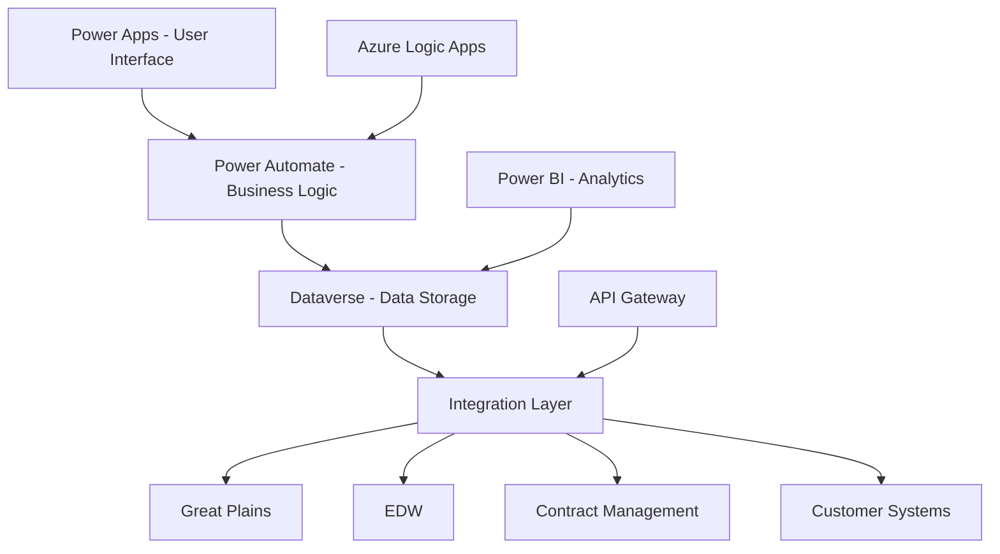

# PowerBill System Overview

## Introduction

PowerBill is Towne Park's modern billing system built on Microsoft Power Platform, designed to automate and streamline billing operations, invoice generation, and customer account management across all contract types and business models.

## System Architecture

### Platform Architecture

### Core Components
- **Power Apps**: Modern web-based user interface
- **Power Automate**: Automated workflows and business processes
- **Dataverse**: Unified data platform and storage
- **Power BI**: Business intelligence and reporting
- **Integration Services**: API-based integration with external systems

## Key Features

### Automated Invoice Generation
- **Contract-Based Billing**: Automatic invoice generation based on contract terms
- **Multi-Contract Support**: Support for revenue share, fixed fee, PLH, and management agreements
- **Recurring Billing**: Automated recurring billing cycles
- **Pro-Ration Calculations**: Automatic pro-ration for partial periods
- **Bulk Processing**: Efficient bulk invoice generation

### Customer Account Management
- **Customer Master Data**: Comprehensive customer information management
- **Account Hierarchy**: Support for complex customer account structures
- **Contact Management**: Multiple contact types and communication preferences
- **Credit Management**: Customer credit limits and payment terms
- **Account History**: Complete customer account history and audit trail

### Revenue Management
- **Revenue Recognition**: Automated revenue recognition based on contract terms
- **Revenue Sharing**: Complex revenue sharing calculations and distributions
- **Multi-Currency Support**: Support for multiple currencies and exchange rates
- **Tax Management**: Automated tax calculations and compliance
- **Revenue Reporting**: Comprehensive revenue reporting and analytics

### Contract Integration
- **Contract-Driven Billing**: Billing based on contract terms and conditions
- **Rate Management**: Dynamic rate management and escalations
- **Performance Metrics**: Contract performance tracking and reporting
- **Compliance Monitoring**: Automated compliance monitoring and reporting
- **Contract Lifecycle**: Integration with contract lifecycle management

## Business Process Automation

### Billing Workflows
- **Invoice Generation**: Automated invoice creation and processing
- **Approval Workflows**: Multi-level approval processes for exceptions
- **Payment Processing**: Automated payment processing and reconciliation
- **Collections Management**: Automated collections and dunning processes
- **Dispute Resolution**: Structured dispute resolution workflows

### Customer Workflows
- **Customer Onboarding**: Automated customer onboarding processes
- **Account Setup**: Streamlined account setup and configuration
- **Communication Management**: Automated customer communication
- **Service Requests**: Customer service request management
- **Relationship Management**: Customer relationship management workflows

### Financial Workflows
- **Month-End Processing**: Automated month-end financial processing
- **Revenue Recognition**: Automated revenue recognition workflows
- **Financial Reporting**: Automated financial report generation
- **Reconciliation**: Automated reconciliation processes
- **Compliance Reporting**: Automated compliance and regulatory reporting

## Integration Capabilities

### External System Integration
- **Great Plains**: Seamless integration with Great Plains financial system
- **EDW**: Real-time data synchronization with Enterprise Data Warehouse
- **Contract Management**: Integration with contract management systems
- **Customer Systems**: Integration with customer management systems
- **Payment Processors**: Integration with payment processing systems

### API Architecture
- **RESTful APIs**: Standard RESTful API design and implementation
- **Real-Time Integration**: Real-time data synchronization and updates
- **Batch Processing**: Efficient batch processing for large datasets
- **Error Handling**: Robust error handling and recovery mechanisms
- **Security**: Comprehensive API security and authentication

### Data Synchronization
- **Real-Time Sync**: Real-time data synchronization across systems
- **Batch Sync**: Scheduled batch synchronization for large datasets
- **Conflict Resolution**: Automated conflict resolution for data inconsistencies
- **Data Validation**: Comprehensive data validation and quality checks
- **Audit Trail**: Complete audit trail for all data changes

## User Interface and Experience

### Modern Web Interface
- **Responsive Design**: Mobile-first responsive design
- **Intuitive Navigation**: User-friendly navigation and interface
- **Role-Based Views**: Customized views based on user roles
- **Dashboard Analytics**: Real-time dashboard and analytics
- **Accessibility**: Full accessibility compliance and support

### Key User Screens
- **Invoice Management**: Comprehensive invoice creation and management
- **Customer Management**: Customer account management and maintenance
- **Contract Management**: Contract setup and configuration
- **Payment Processing**: Payment processing and reconciliation
- **Reporting Dashboard**: Real-time reporting and analytics

### User Experience Features
- **Quick Actions**: Streamlined quick actions for common tasks
- **Bulk Operations**: Efficient bulk operations for large datasets
- **Search and Filter**: Advanced search and filtering capabilities
- **Export Capabilities**: Comprehensive data export capabilities
- **Notification System**: Real-time notifications and alerts

## Reporting and Analytics

### Financial Reporting
- **Revenue Reports**: Comprehensive revenue reporting and analysis
- **Billing Reports**: Detailed billing reports and metrics
- **Customer Reports**: Customer performance and analysis reports
- **Contract Reports**: Contract performance and compliance reports
- **Executive Dashboard**: Executive-level dashboard and KPIs

### Operational Reporting
- **Process Metrics**: Billing process performance metrics
- **Quality Metrics**: Data quality and accuracy metrics
- **User Activity**: User activity and system usage reports
- **System Performance**: System performance and availability metrics
- **Error Reports**: Error tracking and resolution reports

### Advanced Analytics
- **Predictive Analytics**: Predictive modeling for revenue forecasting
- **Trend Analysis**: Historical trend analysis and forecasting
- **Performance Benchmarking**: Performance benchmarking and comparison
- **Customer Analytics**: Customer behavior and performance analytics
- **Risk Analytics**: Risk assessment and mitigation analytics

## Security and Compliance

### Security Framework
- **Authentication**: Multi-factor authentication and single sign-on
- **Authorization**: Role-based access control and permissions
- **Data Encryption**: End-to-end data encryption and protection
- **Network Security**: Secure network communication and protocols
- **Audit Logging**: Comprehensive audit logging and monitoring

### Compliance Features
- **Regulatory Compliance**: Compliance with financial regulations
- **Data Privacy**: Compliance with data privacy and protection laws
- **Audit Trail**: Complete audit trail for all system activities
- **Reporting Compliance**: Automated compliance reporting
- **Documentation**: Comprehensive compliance documentation

### Data Protection
- **Data Classification**: Automated data classification and labeling
- **Data Loss Prevention**: Data loss prevention and protection
- **Backup and Recovery**: Automated backup and recovery procedures
- **Disaster Recovery**: Comprehensive disaster recovery planning
- **Business Continuity**: Business continuity and risk management

## Performance and Scalability

### Performance Optimization
- **Response Time**: Optimized response times for all operations
- **Throughput**: High throughput for bulk operations
- **Scalability**: Horizontal and vertical scalability
- **Caching**: Strategic caching for improved performance
- **Load Balancing**: Distributed load balancing and scaling

### Monitoring and Alerting
- **Real-Time Monitoring**: Real-time system monitoring and alerting
- **Performance Metrics**: Comprehensive performance metrics and KPIs
- **Health Checks**: Automated health checks and monitoring
- **Alert Management**: Configurable alerts and notification system
- **Dashboard Monitoring**: Real-time monitoring dashboards

### Capacity Management
- **Capacity Planning**: Proactive capacity planning and forecasting
- **Resource Optimization**: Resource optimization and utilization
- **Scaling Strategies**: Automated scaling strategies and procedures
- **Performance Tuning**: Continuous performance tuning and optimization
- **Cost Optimization**: Cost optimization and resource management

## Implementation and Deployment

### Implementation Approach
- **Phased Rollout**: Structured phased rollout approach
- **Pilot Implementation**: Pilot implementation and validation
- **User Training**: Comprehensive user training and support
- **Change Management**: Structured change management procedures
- **Go-Live Support**: Comprehensive go-live support and monitoring

### Deployment Architecture
- **Environment Strategy**: Multi-environment deployment strategy
- **CI/CD Pipeline**: Automated continuous integration and deployment
- **Release Management**: Structured release management procedures
- **Rollback Procedures**: Automated rollback and recovery procedures
- **Quality Gates**: Comprehensive quality gates and validation

### Support and Maintenance
- **Help Desk Support**: Comprehensive help desk and user support
- **System Maintenance**: Regular system maintenance and updates
- **Performance Monitoring**: Continuous performance monitoring and optimization
- **Bug Fixes**: Rapid bug fixes and issue resolution
- **Feature Enhancements**: Regular feature enhancements and improvements

## Related Documentation

- [Billing System Architecture](20250716_Billing_SystemOverview_PowerBill.md)
- [Billing Business Rules](../../business-rules/billing/index.md)
- [Billing User Processes](../../user-processes/billing-admin/index.md)
- [Technical Architecture](../../technical/backend/index.md)

## Quick Links

- [Development Standards](../../configuration/system-settings/20250718_Development_Standards_ComprehensiveGuide.md)
- [Power Platform Licensing](../../configuration/system-settings/20250718_Architecture_LicensingAnalysis_PowerPlatform.md)
- [ALM Strategy](../../technical/backend/20250718_Architecture_ALMStrategy_PowerPlatform.md)
- [Integration Strategy](../../technical/integrations/20250718_Architecture_IntegrationStrategy_HybridConnections.md)