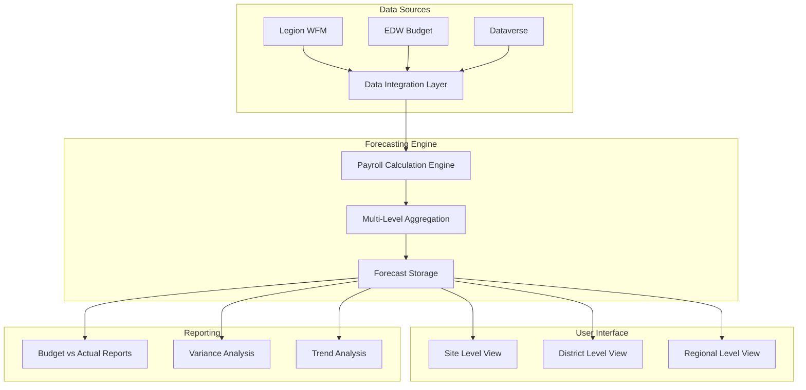

# Payroll Forecasting System - Overview

## Executive Summary

The Payroll Forecasting System provides comprehensive multi-level forecasting capabilities for payroll expenses across site, district, and regional organizational levels. The system integrates with Legion workforce management, EDW budget data, and Dataverse forecast storage to deliver accurate, real-time payroll projections that support strategic financial planning and operational decision-making.

## System Architecture

### High-Level Architecture



### Core Components

#### 1. Data Integration Layer
- **Legion Integration**: Real-time workforce data and scheduling
- **EDW Integration**: Historical budget and actual payroll data
- **Dataverse Integration**: Forecast storage and user overrides
- **Data Validation**: Ensures data quality and consistency

#### 2. Payroll Calculation Engine
- **Base Payroll Calculation**: Standard hourly and salary calculations
- **Overtime Processing**: Automatic overtime calculation based on rules
- **Benefits Calculation**: PTEB (Payroll Taxes, Employee Benefits) processing
- **Escalator Application**: Contract-based rate escalations

#### 3. Multi-Level Aggregation
- **Site Level**: Individual location forecasting
- **District Level**: Aggregated district-wide projections
- **Regional Level**: Multi-district regional forecasting
- **Corporate Level**: Enterprise-wide consolidation

#### 4. Forecast Storage and Management
- **Version Control**: Multiple forecast scenarios and versions
- **Approval Workflow**: Multi-level approval process
- **Audit Trail**: Complete change tracking and history
- **Data Archival**: Historical forecast preservation

## Functional Capabilities

### Site-Level Forecasting

#### Core Features
- **Individual Site Projections**: Detailed payroll forecasts for each location
- **Position-Based Forecasting**: Forecasts by job role and position
- **Schedule Integration**: Legion schedule data integration
- **Budget Comparison**: Budget vs. forecast variance analysis

#### Data Sources
- **Legion Workforce Management**
  - Employee schedules and time tracking
  - Position definitions and pay rates
  - Overtime rules and calculations
  - Benefits eligibility and rates

- **EDW Budget Data**
  - Annual budget allocations
  - Historical actual payroll data
  - Seasonal adjustment factors
  - Performance metrics

#### Calculation Methods
```sql
-- Site-level payroll forecast calculation
SELECT 
    s.SiteCode,
    s.SiteName,
    SUM(pf.RegularHours * pr.HourlyRate) as RegularPayroll,
    SUM(pf.OvertimeHours * pr.HourlyRate * 1.5) as OvertimePayroll,
    SUM(pf.RegularHours * pr.HourlyRate * pteb.PTEBRate) as PTEBAmount,
    SUM(pf.RegularHours * pr.HourlyRate) + 
    SUM(pf.OvertimeHours * pr.HourlyRate * 1.5) + 
    SUM(pf.RegularHours * pr.HourlyRate * pteb.PTEBRate) as TotalPayrollForecast
FROM Sites s
JOIN PayrollForecast pf ON s.SiteCode = pf.SiteCode
JOIN PayRates pr ON pf.PositionCode = pr.PositionCode
JOIN PTEBRates pteb ON s.SiteCode = pteb.SiteCode
WHERE pf.ForecastPeriod = @Period
GROUP BY s.SiteCode, s.SiteName
```

### District-Level Forecasting

#### Aggregation Logic
- **Site Rollup**: Automatic aggregation of site-level forecasts
- **District Adjustments**: District-specific modifications and overrides
- **Resource Allocation**: Cross-site resource planning and optimization
- **Performance Targets**: District-wide performance goal setting

#### Key Metrics
- **Total District Payroll**: Aggregated payroll across all sites
- **Average Site Performance**: District-wide performance indicators
- **Variance Analysis**: Budget vs. forecast variance by site
- **Efficiency Metrics**: Labor efficiency and productivity measures

### Regional-Level Forecasting

#### Strategic Planning
- **Multi-District Aggregation**: Regional consolidation of district forecasts
- **Resource Optimization**: Regional resource allocation and planning
- **Trend Analysis**: Long-term trend identification and analysis
- **Strategic Initiatives**: Regional program impact assessment

#### Executive Reporting
- **Executive Dashboards**: High-level regional performance metrics
- **Variance Reports**: Regional variance analysis and explanations
- **Trend Reports**: Historical and projected trend analysis
- **Strategic Reports**: Impact of strategic initiatives on payroll

## Data Integration Specifications

### Legion Workforce Management Integration

#### Real-Time Data Feeds
```csharp
public class LegionIntegrationService
{
    public async Task<List<ScheduleData>> GetScheduleDataAsync(string siteCode, DateTime startDate, DateTime endDate)
    {
        var endpoint = $"/api/v1/sites/{siteCode}/schedules";
        var parameters = new
        {
            start_date = startDate.ToString("yyyy-MM-dd"),
            end_date = endDate.ToString("yyyy-MM-dd"),
            include_positions = true,
            include_rates = true
        };
        
        return await _httpClient.GetAsync<List<ScheduleData>>(endpoint, parameters);
    }
    
    public async Task<List<PayrollData>> GetActualPayrollAsync(string siteCode, string payPeriod)
    {
        var endpoint = $"/api/v1/sites/{siteCode}/payroll/{payPeriod}";
        return await _httpClient.GetAsync<List<PayrollData>>(endpoint);
    }
}
```

#### Data Mapping
- **Employee Schedules** → Forecast Hours
- **Position Rates** → Payroll Calculations
- **Overtime Rules** → Overtime Projections
- **Benefits Data** → PTEB Calculations

### EDW Budget Integration

#### Budget Data Retrieval
```sql
-- EDW budget data integration query
SELECT 
    b.COST_CENTER as SiteCode,
    b.PERIOD as BudgetPeriod,
    b.MAIN_ACCOUNT as AccountCode,
    coa.ACCOUNT_DESCRIPTION as AccountDescription,
    b.BALANCE as BudgetAmount,
    b.IS_SUMMARY_CATEGORY as CategoryType
FROM [TP_EDW].[dbo].[BUDGET_FINAL] b
JOIN [TP_EDW].[dbo].[CHART_OF_ACCOUNT] coa ON b.MAIN_ACCOUNT = coa.MAIN_ACCOUNT
WHERE b.MAIN_ACCOUNT BETWEEN '6000' AND '6999'  -- Payroll accounts
    AND b.PERIOD = @BudgetPeriod
    AND b.COST_CENTER = @SiteCode
```

#### Historical Analysis
- **Trend Calculation**: Multi-year historical trend analysis
- **Seasonal Adjustments**: Seasonal pattern identification and application
- **Performance Metrics**: Historical performance indicator calculation
- **Variance Analysis**: Historical budget vs. actual variance patterns

### Dataverse Forecast Storage

#### Forecast Data Model
```csharp
public class PayrollForecast
{
    public string SiteCode { get; set; }
    public string Period { get; set; }
    public string PositionCode { get; set; }
    public decimal RegularHours { get; set; }
    public decimal OvertimeHours { get; set; }
    public decimal HourlyRate { get; set; }
    public decimal RegularPayroll { get; set; }
    public decimal OvertimePayroll { get; set; }
    public decimal PTEBAmount { get; set; }
    public decimal TotalPayroll { get; set; }
    public string ForecastType { get; set; } // Site, District, Regional
    public string CreatedBy { get; set; }
    public DateTime CreatedDate { get; set; }
    public string ApprovalStatus { get; set; }
}
```

## User Interface Design

### Site-Level Interface

#### Dashboard Components
- **Current Period Forecast**: Real-time payroll projections
- **Budget Comparison**: Budget vs. forecast variance display
- **Position Breakdown**: Payroll by position and department
- **Trend Charts**: Historical and projected trend visualization

#### Interactive Features
- **Drill-Down Capability**: Position-level detail access
- **What-If Scenarios**: Interactive scenario modeling
- **Export Functions**: Data export to Excel and PDF
- **Alert System**: Variance and threshold alerts

### District-Level Interface

#### Aggregated Views
- **District Summary**: High-level district performance metrics
- **Site Comparison**: Side-by-side site performance comparison
- **Variance Analysis**: District-wide variance identification
- **Resource Planning**: Cross-site resource allocation tools

#### Management Tools
- **Approval Workflow**: District manager approval interface
- **Override Capabilities**: District-level forecast adjustments
- **Reporting Tools**: District-specific report generation
- **Performance Tracking**: District goal tracking and monitoring

### Regional-Level Interface

#### Executive Dashboard
- **Regional Metrics**: High-level regional performance indicators
- **Strategic View**: Long-term strategic planning interface
- **Trend Analysis**: Multi-year trend analysis and projection
- **Executive Reports**: Executive-level reporting and analytics

## Business Rules and Logic

### Payroll Calculation Rules

#### Regular Payroll
- **Base Calculation**: Hours × Hourly Rate
- **Salary Conversion**: Annual salary ÷ 2080 hours for hourly equivalent
- **Position Multipliers**: Position-specific rate adjustments
- **Site Adjustments**: Location-based pay scale modifications

#### Overtime Calculation
- **Standard Overtime**: Hours > 40 per week at 1.5× rate
- **Double Time**: Hours > 12 per day at 2.0× rate (where applicable)
- **Holiday Premium**: Holiday work premium calculations
- **State-Specific Rules**: State-specific overtime regulations

#### PTEB Calculation
- **Payroll Taxes**: Federal, state, and local tax calculations
- **Employee Benefits**: Health insurance, retirement, and other benefits
- **Workers Compensation**: Industry-specific workers comp rates
- **Unemployment Insurance**: State unemployment insurance calculations

### Aggregation Rules

#### Site to District
```csharp
public class DistrictAggregationService
{
    public DistrictForecast AggregateDistrictForecast(List<SiteForecast> siteForecasts)
    {
        return new DistrictForecast
        {
            DistrictCode = siteForecasts.First().DistrictCode,
            Period = siteForecasts.First().Period,
            TotalRegularPayroll = siteForecasts.Sum(s => s.RegularPayroll),
            TotalOvertimePayroll = siteForecasts.Sum(s => s.OvertimePayroll),
            TotalPTEB = siteForecasts.Sum(s => s.PTEBAmount),
            TotalPayroll = siteForecasts.Sum(s => s.TotalPayroll),
            SiteCount = siteForecasts.Count,
            AveragePayrollPerSite = siteForecasts.Average(s => s.TotalPayroll)
        };
    }
}
```

#### District to Regional
- **Multi-District Rollup**: Aggregation across multiple districts
- **Regional Adjustments**: Regional-specific modifications
- **Performance Weighting**: Performance-based aggregation weighting
- **Strategic Initiatives**: Impact of regional programs

## Performance and Scalability

### System Performance

#### Response Time Targets
- **Site-Level Queries**: < 2 seconds
- **District-Level Aggregation**: < 5 seconds
- **Regional-Level Reporting**: < 10 seconds
- **Bulk Data Processing**: < 30 seconds

#### Scalability Considerations
- **Horizontal Scaling**: Multi-server deployment capability
- **Database Optimization**: Indexed queries and partitioning
- **Caching Strategy**: Redis caching for frequently accessed data
- **Load Balancing**: Distributed load across multiple servers

### Data Volume Management

#### Current Scale
- **Sites**: 500+ locations
- **Employees**: 50,000+ active employees
- **Forecast Periods**: 24 months rolling forecast
- **Historical Data**: 5 years of historical data retention

#### Growth Projections
- **Site Growth**: 20% annual growth in locations
- **Employee Growth**: 15% annual growth in workforce
- **Data Volume**: 30% annual growth in data volume
- **Transaction Volume**: 25% annual growth in transactions

## Security and Compliance

### Data Security

#### Access Controls
- **Role-Based Access**: Hierarchical access based on organizational level
- **Site-Level Security**: Users can only access assigned sites
- **Data Encryption**: Encryption at rest and in transit
- **Audit Logging**: Comprehensive audit trail for all access

#### Compliance Requirements
- **SOX Compliance**: Financial data controls and audit trails
- **GDPR Compliance**: Employee data privacy and protection
- **Labor Law Compliance**: Adherence to federal and state labor laws
- **Industry Standards**: Compliance with industry-specific regulations

### Data Privacy

#### Employee Data Protection
- **PII Encryption**: Personal identifiable information encryption
- **Access Restrictions**: Limited access to sensitive employee data
- **Data Retention**: Automated data retention and purging policies
- **Consent Management**: Employee consent tracking and management

## Integration Points

### Upstream Systems

#### Legion Workforce Management
- **Real-Time Integration**: Live data feeds for schedules and time tracking
- **Batch Processing**: Nightly batch updates for historical data
- **Error Handling**: Robust error handling and retry mechanisms
- **Data Validation**: Comprehensive data validation and cleansing

#### EDW (Enterprise Data Warehouse)
- **Budget Data**: Annual and monthly budget data integration
- **Historical Data**: Multi-year historical payroll data
- **Performance Metrics**: Key performance indicator integration
- **Data Quality**: Data quality monitoring and validation

### Downstream Systems

#### Financial Reporting
- **Budget Reports**: Integration with corporate budgeting systems
- **Variance Reports**: Automated variance analysis and reporting
- **Executive Dashboards**: Real-time executive dashboard updates
- **Regulatory Reporting**: Compliance and regulatory report generation

#### Operational Systems
- **Scheduling Systems**: Integration with workforce scheduling
- **HR Systems**: Employee data synchronization
- **Payroll Systems**: Forecast data for payroll processing
- **Business Intelligence**: Data warehouse and BI tool integration

## Monitoring and Maintenance

### System Monitoring

#### Performance Monitoring
- **Response Time Tracking**: Continuous response time monitoring
- **Error Rate Monitoring**: System error rate tracking and alerting
- **Resource Utilization**: CPU, memory, and storage monitoring
- **User Activity**: User access and activity monitoring

#### Data Quality Monitoring
- **Data Validation**: Automated data quality checks and validation
- **Completeness Checks**: Data completeness monitoring and alerting
- **Accuracy Verification**: Data accuracy validation and correction
- **Consistency Monitoring**: Cross-system data consistency checks

### Maintenance Procedures

#### Regular Maintenance
- **Database Maintenance**: Index optimization and statistics updates
- **Cache Management**: Cache refresh and optimization procedures
- **Log Management**: Log rotation and archival procedures
- **Security Updates**: Regular security patch application

#### Disaster Recovery
- **Backup Procedures**: Automated backup and recovery procedures
- **Failover Capabilities**: Automatic failover to backup systems
- **Recovery Testing**: Regular disaster recovery testing
- **Business Continuity**: Business continuity planning and procedures

## Future Enhancements

### Planned Features

#### Advanced Analytics
- **Predictive Analytics**: Machine learning-based payroll predictions
- **Anomaly Detection**: Automated anomaly detection and alerting
- **Trend Forecasting**: Advanced trend analysis and forecasting
- **Scenario Modeling**: Advanced what-if scenario capabilities

#### Enhanced Integration
- **API Expansion**: Extended API capabilities for third-party integration
- **Real-Time Streaming**: Real-time data streaming capabilities
- **Mobile Access**: Mobile application for on-the-go access
- **Voice Integration**: Voice-activated query and reporting

### Technology Roadmap

#### Short-Term (6-12 months)
- **Performance Optimization**: Query optimization and caching improvements
- **User Interface Enhancement**: Improved user experience and interface design
- **Mobile Responsiveness**: Mobile-responsive design implementation
- **API Documentation**: Comprehensive API documentation and examples

#### Long-Term (1-3 years)
- **AI Integration**: Artificial intelligence and machine learning integration
- **Cloud Migration**: Cloud-based deployment and scalability
- **Advanced Analytics**: Advanced analytics and business intelligence
- **Global Expansion**: Multi-currency and international support

## Related Documentation

- [Billable Accounts Business Rules](../business-rules/forecasting/20250716_Forecasting_BillableAccounts_BusinessRules.md) 🔄 PLANNED
- [Forecasting Technical Specifications](../technical/database/20250716_Forecasting_BillableAccounts_TechnicalSpec.md) 🔄 PLANNED
- [Data Table Editing User Process](../user-processes/account-manager/20250716_Forecasting_DataTableEditing_UserProcess.md) 🔄 PLANNED
- [Legion Integration Specifications](../technical/integrations/legion-integration.md) 🔄 PLANNED
- [EDW Budget Integration](../technical/integrations/budget-integration.md) 🔄 PLANNED

## Change History

| Version | Date | Author | Changes |
|---------|------|--------|---------|
| 1.0 | 2025-07-16 | Data Product Team | Initial system overview from Sprint 28 user stories 2136 and 1485 |