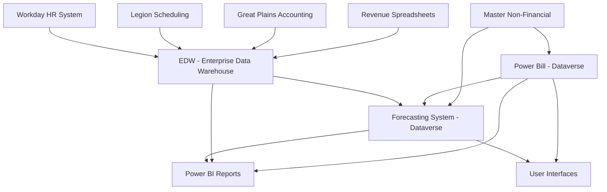

# Towne Park Forecasting System - Comprehensive Master Overview

## Executive Summary

This comprehensive master documentation serves as the definitive reference for Towne Park's financial systems modernization initiative, covering both the Forecasting System and Billing System (Power Bill). The document captures the complete business requirements, technical architecture, data models, user workflows, and implementation roadmap for these critical financial systems.

The initiative represents a strategic transformation from manual, Excel-based processes to an integrated, cloud-based platform built on Microsoft Dataverse and Power Platform. The systems are designed to serve multiple user roles from Account Managers to Executive Leadership, providing comprehensive financial planning, forecasting, and billing capabilities.

## Purpose and Scope

### Document Purpose

This master document functions as a comprehensive, centralized repository of information for Towne Park's financial systems, specifically designed to:

- **Empower AI-assisted capabilities** including AI-driven conversations, text generation, and code analysis
- **Provide complete system specifications** for development teams and stakeholders
- **Document business requirements** and functional specifications
- **Capture technical architecture** and integration patterns
- **Define user workflows** and operational procedures
- **Establish data models** and integration requirements

### Systems Covered

The documentation encompasses the following core systems:

#### **Billing System (Power Bill)**
- **Platform**: Microsoft Dataverse
- **Status**: Existing system undergoing enhancements
- **Capabilities**: Customer setup, contract management, invoice generation, revenue recognition
- **Integration**: EDW, Great Plains, Legion, Workday

#### **Forecasting System**
- **Platform**: Microsoft Dataverse
- **Status**: New system replacing Excel-based processes
- **Capabilities**: Site statistics forecasting, payroll forecasting, P&L analysis, revenue projections
- **Integration**: EDW, Legion, Workday, Power Bill

#### **Supporting Infrastructure**
- **Enterprise Data Warehouse (EDW)**: SQL Server (Node1, Node2) - primary data repository
- **Legion**: Employee scheduling and timekeeping system
- **Workday**: HR system for employee data and organizational structure
- **Great Plains (GP)**: Accounting system for financial actuals
- **Microsoft Dataverse**: Underlying data platform for both systems
- **Power BI**: Primary reporting and analytics platform

## Project Goals and Objectives

### Strategic Objectives

The overarching goals for the financial systems modernization include:

#### **Modernization and Efficiency**
- Replace manual, Excel-based forecasting processes with streamlined, integrated systems
- Eliminate redundant data entry and improve process automation
- Enhance system scalability and maintainability

#### **User Experience Excellence**
- Create forecasting experiences that are significantly simpler and more intuitive
- Reduce learning curve for new Account Managers and users with limited Excel proficiency
- Provide role-based access and functionality tailored to user needs

#### **Data Integration and Accuracy**
- Automatically pull data from source systems (EDW, Legion, Power Bill) to minimize manual input
- Improve forecast accuracy through integrated data sources and validation
- Reduce manual entry errors through structured data collection

#### **Real-Time Insights and Decision Making**
- Provide timely access to actuals and forecast data for better decision-making
- Enable near real-time reporting and analytics
- Support rapid response to business changes and market conditions

#### **Enhanced Reporting and Analytics**
- Facilitate robust reporting capabilities through Power BI integration
- Provide well-structured data for advanced analytics and business intelligence
- Support multiple reporting perspectives for different user roles

#### **Organizational Support**
- Cater to diverse user roles (AM, DM, RVP, SVP, Finance) with appropriate functionality
- Provide tools for performance management and accountability
- Support various business segments and operational structures

## Business Context and Requirements

### Towne Park Business Overview

Towne Park operates parking and transportation services primarily for hospitality (hotels) and healthcare (hospitals) sectors. The financial systems support diverse operational and contractual structures:

#### **Contract Structures**
The business utilizes multiple deal types with varying revenue implications:

- **Revenue Share**: External parking revenue shared with clients based on tiered percentages and thresholds
- **Management Agreement**: Towne Park manages operations, billing back expenses plus management fees
- **Per Labor Hour (PLH)**: Billing based on hours worked at contractually agreed rates
- **Fixed Fee**: Predetermined service fees with potential escalators
- **Per Occupied Room (POR)**: Revenue based on occupied rooms multiplied by contractual rates
- **Hybrid Deals**: Combinations of multiple structures

#### **Operational Complexity**
- **"10 Percenter" Sites**: Highly complex or customized contracts requiring special handling
- **Multi-level Operations**: Site, district, regional, and corporate organizational structure
- **Diverse Revenue Streams**: External revenue (parking fees) and internal revenue (management fees, billables)
- **Labor Management**: Complex staffing models with multiple job families and roles

### Pain Points Addressed

The new systems address critical operational challenges:

#### **Process Inefficiencies**
- **Cumbersome Excel Processes**: Current forecasting files described as "overwhelming" for new users
- **Manual Data Entry**: Cell-by-cell data entry prone to errors and formula corruption
- **Training Complexity**: Difficult and time-consuming training for new Account Managers
- **Multiple Sources of Truth**: Disparate systems leading to confusion and inconsistency

#### **Data and Visibility Issues**
- **Delayed Data Updates**: 24-hour delays in data availability hindering real-time decision-making
- **Inconsistent Definitions**: Lack of standardized budgeting and forecasting approaches
- **System Disconnects**: Misalignment between operational forecasts and scheduling systems
- **Limited Analytical Support**: Focus on data input rather than critical thinking and analysis

## System Architecture and Components

### High-Level Architecture

The system architecture follows a integrated approach connecting multiple data sources and user interfaces:

#### **Data Flow Architecture**

#### **Core System Integration**
- **EDW Central Hub**: Serves as primary data repository for budget, actuals, and master data
- **Dataverse Applications**: Host both Power Bill and Forecasting System applications
- **Real-time Synchronization**: Data flows between systems to maintain consistency
- **Unified User Experience**: Shared authentication and role management across systems

### Technical Infrastructure

#### **Cloud Platform Integration**
- **Microsoft Power Platform**: Primary application development platform
- **Azure Services**: Cloud infrastructure for scalability and performance
- **SQL Server**: Enterprise data warehouse hosting
- **Microsoft Fabric**: Future consideration for data warehouse modernization

#### **Network and Performance Considerations**
- **Data Gateway Performance**: Optimization for cloud-to-on-premise connectivity
- **Concurrent User Support**: Architecture to handle 75-100 users per region
- **Query Optimization**: Stored procedures and efficient data access patterns
- **Scalability Planning**: Dataverse storage optimization and capacity planning

## Core System Modules and Functionality

### Forecasting System Components

#### **Site Selection and Period Definition**
- **User-Driven Selection**: AMs select sites based on role-based permissions
- **Period Flexibility**: Year and starting month selection for forecast periods
- **Role-Based Filtering**: Site visibility based on organizational hierarchy
- **Security Integration**: Leverages Workday_RLS_By_Security for access control

#### **Site Statistics Forecasting**
**Input Metrics**:
- Occupancy (percentage or occupied rooms)
- Drive-in ratios and vehicle capture rates
- Valet vehicles (overnight, daily, monthly)
- Self-park vehicles (overnight, daily, monthly)
- Complimentary services (comps)
- Aggregator platform vehicles (Spot Hero, etc.)

**Data Views**:
- **Forecast View**: Primary input interface
- **Budget View**: Reference budget numbers (read-only)
- **Actuals View**: Daily actuals from Revenue_DataMart_Daily
- **Prior Year View**: Historical data for context and seasonality analysis

**Time Granularity**:
- **Daily Input**: Primary editing granularity for accuracy
- **Weekly/Monthly/Quarterly Views**: Aggregated displays for analysis
- **Real-time Calculations**: Automatic calculation of derived metrics

#### **Parking Rate Forecasting**
**Rate Categories**:
- Valet rates (overnight, daily, monthly)
- Self-park rates (overnight, daily, monthly)
- Aggregator-specific rates (separate due to different effective rates)

**Rate Management**:
- **Budget Seeding**: Initial rates calculated from budget data
- **Manual Overrides**: AM ability to adjust rates for future periods
- **Guardrails**: Confirmation prompts for significant rate changes
- **Carry Forward**: Option to apply rate changes to subsequent months

#### **Payroll Forecasting**
**Input Structure**:
- **Job Family Level**: Primary input method (GSA, GSC, Valet, Bell, Shuttle, Cashier, Salaried)
- **Job Code Level**: Detailed input for PLH contracts and specific requirements
- **Dual Input Options**: Hours or cost input with automatic calculations

**Data Integration**:
- **Budget Data**: From Budget_Data_Tab_PR mapped to job families
- **Scheduled Data**: From Legion Shift_Entity and Schedule_Cost_Entity
- **Actual Data**: From VW_Payroll_Summary for real-time actuals
- **Salaried Integration**: From Workday_Site_Salaries for management costs

#### **Other Internal Revenue Forecasting**
**Categories**:
- **Billable Expenses**: One-off items not covered by standard management agreements
- **Revenue Validations**: Forecasted validation billings
- **Credits/Other Billable Items**: Catch-all category for various billing items
- **GPO Fees**: Group purchasing organization fees (typically negative)
- **Signing Bonuses**: Contract-related bonuses (typically negative)

**Input Approach**:
- **Monthly Lump Sum**: Single monthly amount per category
- **Validation Integration**: Actual data from Power Bill invoices
- **Negative Enforcement**: System validation for GPO fees and signing bonuses

#### **Other Expenses Forecasting**
**Approach**:
- **Exception-Based**: Manual adjustments for material variances from budget
- **Category-Specific**: Focus on controllable expenses (uniforms, tickets, maintenance)
- **Budget Baseline**: System defaults to budget with manual override capability

#### **P&L Views and Analysis**
**Line Items**:
- External Revenue (calculated from stats and rates)
- Internal Revenue (calculated from contract configurations)
- Payroll (from job family/code forecasts)
- Claims, PTAB, Insurance, Other Expenses, Parking Rents
- FLC (Full Location Contribution) calculation

**View Options**:
- **Budget/Forecast/Actuals**: Toggle between different data sources
- **Variance Analysis**: Dollar and percentage variance calculations
- **Trend Views**: Combination of actuals (past) and forecast (future)
- **Percentage of Revenue**: Line items as percentage of internal revenue

**Organizational Roll-ups**:
- **Hierarchical Aggregation**: Site, District, Region, SVP Region, Corporate
- **Filtering Capabilities**: By organization, COG segment, contract type, P&L category
- **Role-Based Views**: Appropriate data visibility based on user role

### Billing System (Power Bill) Components

#### **Customer and Site Management**
**Data Integration**:
- **Master Non-Financial Source**: Initial customer/site data from EDW
- **Refreshable Fields**: Site name, total rooms/spaces, district, region
- **Billing-Specific Fields**: Vendor ID, billing email, invoice recipient (non-refreshable)

**Site Configuration**:
- **Total Available Rooms**: Hotel capacity for POR calculations
- **Total Available Spaces**: Parking capacity for operational planning
- **Organizational Hierarchy**: District and region assignments for reporting

#### **Contract Management**
**Deal Type Configuration**:
- **Fixed Fee**: Set fees with escalator support
- **Per Occupied Room**: Rates per occupied room with escalators
- **Per Labor Hour**: Job code-specific billable rates with escalators
- **Revenue Share**: Percentage sharing with tiered thresholds
- **Management Agreement**: Expense bill-back plus management fees

**Contract Terms**:
- **Rate Structures**: Base rates for services and metrics
- **Escalators**: Defined rate increases over time
- **Billable Accounts**: GL account specifications for management agreements
- **Profit Splits**: Revenue sharing calculations and thresholds
- **Management Fees**: Fixed amounts, percentages, or metric-based

#### **Invoice Generation and Processing**
**Data Aggregation**:
- **Multi-Source Integration**: Stats (EDW/RSS), labor hours (Legion/EDW), contract rates
- **Calculation Engine**: Contract-specific revenue recognition logic
- **Statement Generation**: PDF creation and delivery system

**Special Handling**:
- **Ad Hoc Billables**: Non-GL billable expenses and percentage-based items
- **"10 Percenter" Support**: Complex contract accommodation
- **Historical Recreation**: Ability to regenerate past statements

## Data Management and Integration

### Key Data Entities and Schemas

#### **Customer and Site Data**
**Master Non-Financial (EDW)**:
- **Core Fields**: Site Number, Site Name, Address, Available Rooms/Spaces
- **Organizational Fields**: District, Region, SVP Region, P&L Category
- **Business Fields**: COG Segment, Contract Type
- **Usage**: Primary source for customer/site master data

**Power Bill Extensions**:
- **Billing Fields**: Vendor ID, Billing Email, Invoice Recipient
- **Contract Fields**: Deal type, rates, escalators, billable accounts
- **Schema**: Customer Site table with foreign key relationships

#### **Budget Data Structures**
**Budget_Final (EDW)**:
- **Structure**: Year, Period, Cost Center, Main Account, Balance
- **Content**: Monthly budget amounts per site and COA account
- **Usage**: Seed initial forecast values and provide budget comparisons

**Budget_Data_Tab_PR (EDW)**:
- **Structure**: Cost Center, Job Category, Job Profile, Balance Description, Balance, Month
- **Content**: Budgeted payroll hours and costs by job category
- **Usage**: Payroll budget initialization and comparison

#### **Forecast Data (Dataverse)**
**Site Statistics Forecast**:
- **Structure**: SiteKey, Date, Occupancy_Rooms, Drive_In_Ratio, Vehicle counts by type
- **Granularity**: Daily level for accuracy and analysis
- **Calculations**: Derived metrics (capture ratios, external revenue)

**Parking Rate Forecast**:
- **Structure**: SiteKey, Year, Month, Rate_Category, Forecasted_Rate_Amount
- **Categories**: Valet/Self-park rates by time period and aggregator rates
- **Integration**: Budget seeding and manual override capability

**Payroll Forecast**:
- **Structure**: SiteKey, Date, Job_Family_Key, Forecasted_Hours, Forecasted_Cost
- **Flexibility**: Support for both job family and job code level forecasting
- **Integration**: Budget, scheduled, and actual data integration

#### **Actuals Data Sources**
**Account_Summary (EDW)**:
- **Source**: Great Plains month-end actuals
- **Structure**: Cost Center, Main Account, Year, Period, Balance
- **Usage**: Primary source for P&L actual comparisons

**Revenue_DataMart_Daily (EDW)**:
- **Source**: Revenue Spreadsheet daily submissions
- **Structure**: Site Number, Date, Value Type, Category, Amount/Count
- **Usage**: Daily operational statistics and revenue actuals

**VW_Payroll_Summary (EDW)**:
- **Source**: Legion payroll system via EDW replication
- **Structure**: Work Location, Date, Title, Pay Type, Hours, Dollars
- **Usage**: Actual payroll hours and costs for comparison

### Data Integration Patterns

#### **EDW to Forecasting System**
- **Budget Data**: Queried via stored procedures for performance
- **Actuals Data**: Real-time queries for current data display
- **Master Data**: Customer/site information and organizational hierarchy
- **Performance Optimization**: Stored procedures and efficient query patterns

#### **Forecasting System to EDW**
- **Forecast Export**: Dataverse data extracted for EDW integration
- **Schema Consistency**: Alignment with existing EDW forecast structures
- **Reporting Support**: Power BI integration and historical comparison
- **Legion Integration**: Future demand data feeding for schedule optimization

#### **Cross-System Integration**
- **Power Bill to Forecasting**: Contract configuration data for internal revenue calculations
- **Workday to Systems**: Role-based security and organizational structure
- **Legion to Forecasting**: Scheduled and actual payroll data integration
- **Great Plains Integration**: Month-end actuals and invoice data posting

### Data Quality and Validation

#### **Input Validation**
- **UI-Level Controls**: Numeric inputs, date ranges, required fields
- **Business Rule Validation**: Rate guardrails, variance alerts, logical constraints
- **Data Type Enforcement**: Structured data collection in Dataverse

#### **Integration Validation**
- **Source Data Quality**: Monitoring of EDW data feeds and updates
- **Calculation Validation**: P&L calculations and derived metric accuracy
- **Cross-System Consistency**: Validation of data alignment across systems

## User Roles and Permissions

### Role-Based Access Control

#### **Account Manager / Associate Manager**
**Permissions**:
- **View**: Assigned site forecast data, P&L, budget, actuals, prior year data
- **Edit**: Forecast data across all input tabs for assigned sites
- **Site Access**: Limited to sites assigned in Workday_RLS_By_Security
- **Functionality**: Full forecasting input capability for their operational area

#### **District Manager**
**Permissions**:
- **View**: All sites within assigned district(s), rolled-up P&L views
- **Edit**: Forecast data for any site in district with audit trail
- **Access Control**: Edit mode button to prevent accidental changes
- **Supervisory Functions**: Override capability for AM forecasts

#### **Director of Operations**
**Permissions**:
- **Functional Role**: Similar to Account Manager for single sites or District Manager for multiple sites
- **Site Assignment**: Based on cost center mappings in Workday_RLS_By_Security
- **Operational Focus**: Site-level or multi-site operational oversight

#### **Regional Vice President / Market Vice President**
**Permissions**:
- **View**: All sites within assigned region, regional P&L roll-ups
- **Edit**: Site-level forecast data within region (emergency scenarios)
- **Access Control**: Explicit edit mode with full audit trail
- **Strategic Focus**: Regional performance and management oversight

#### **Senior Vice President**
**Permissions**:
- **View**: Rolled-up P&L views for assigned hierarchy
- **Edit**: No direct site-level editing access
- **Executive Focus**: High-level performance monitoring and strategic oversight
- **Reporting**: Comprehensive regional and corporate performance views

#### **Forecast Admin (Super User)**
**Permissions**:
- **View**: All forecast data, P&L, budget, actuals across entire company
- **Edit**: Any forecast data for any site (administrative purposes)
- **System Administration**: User management and system configuration
- **Support Role**: Issue resolution and system maintenance

#### **Corporate Consumer**
**Permissions**:
- **View**: All forecast data and P&L roll-ups (read-only)
- **Edit**: No editing access
- **Executive Access**: Company-wide performance visibility
- **Strategic Planning**: Access to comprehensive financial planning data

### Role Assignment and Management

#### **Automated Role Assignment**
- **Workday Integration**: AM, DM, DOO roles automatically assigned from Workday_RLS_By_Security
- **Site/District Mapping**: Automatic association with operational areas
- **Associate Manager Support**: Treated as Account Manager for system access

#### **Manual Role Management**
- **Custom Mapping Table**: Dataverse table for roles above DM level
- **Support Ticket Process**: Manual updates for role changes and new assignments
- **Hierarchical Configuration**: Region and district access definition

## User Workflows and Business Processes

### Forecasting Workflow

#### **AM Initial Forecast Creation**
**Information Gathering**:
- **Hotel/Client Communication**: Engagement with hotel sales teams and GMs for group bookings and occupancy forecasts
- **Historical Analysis**: Review of prior year actuals for seasonality and performance patterns
- **Group Analysis**: Examination of group calendars and resumes for recurring business patterns

**System Interaction Process**:
1. **Login and Site Selection**: User authentication and site/period selection
2. **Data Initialization**: System loads budget data as forecast baseline
3. **Site Statistics Input**: Daily occupancy, drive-in ratios, vehicle volumes, comps, aggregators
4. **Parking Rate Review**: Monthly rate validation and adjustment for future periods
5. **Payroll Forecasting**: Job family/code level hours and cost forecasting
6. **Internal Revenue Input**: Manual entry of billable expenses, validations, credits
7. **Expense Adjustments**: Manual adjustments to budgeted other expenses
8. **Data Persistence**: Tab-by-tab saving of forecast inputs

#### **P&L Review and Analysis**
**Review Process**:
- **Performance Comparison**: Forecasted FLC and key metrics against budget and prior year
- **Variance Analysis**: Identification of significant variances and underlying drivers
- **Assumption Validation**: Review of input assumptions and adjustment if necessary
- **Decision Making**: Optimization of forecast based on business constraints and opportunities

**Analysis Tools**:
- **In-App P&L Views**: Toggle between budget, forecast, and prior year data
- **Variance Display**: Dollar and percentage variance calculations
- **Monthly Summary**: Consolidated key metrics view (future enhancement)

#### **DM/VP Review and Override**
**Review Process**:
- **District/Regional Analysis**: Aggregated performance review across sites
- **Site-Level Drill-Down**: Detailed analysis of individual site performance
- **Override Capability**: Direct editing of forecast inputs with audit trail
- **Communication**: Coordination with AMs regarding changes

**System Features**:
- **Edit Mode Protection**: Explicit edit mode activation to prevent accidental changes
- **Audit Trail**: Complete logging of changes with user and timestamp
- **Hierarchical Views**: Appropriate data visibility based on role

#### **Forecast Submission Process**
**Business Process**:
- **Snapshot Approach**: FP&A team takes data snapshot at cutoff date/time
- **Forecast of Record**: Snapshot becomes official forecast for period
- **Continuous Access**: System remains available for ongoing updates
- **Comparison Analysis**: Future comparisons against official snapshots

### Billing Workflow Integration

#### **Contract Configuration Impact**
- **Deal Type Setup**: Power Bill contract terms directly impact forecasting calculations
- **Rate Management**: Escalator schedules and rate changes flow to forecasting
- **Billable Account Configuration**: Management agreement billable accounts affect internal revenue forecasting

#### **Invoice Data Integration**
- **Actuals Comparison**: Power Bill invoice data provides actuals for "Other Internal Revenue" categories
- **Revenue Validation**: Actual validation amounts from invoices compared to forecast
- **Billing Cycle Integration**: Monthly invoicing cycle alignment with forecasting periods

## Reporting and Analytics

### Power BI Integration Strategy

#### **Data Architecture for Reporting**
- **Dataverse Direct Access**: Forecast data directly queryable by Power BI
- **EDW Integration**: Budget, actuals, and master data from EDW
- **Unified Schema**: Consistent data structures for comprehensive reporting
- **Real-Time Access**: Current forecast data with historical comparison capability

#### **Report Categories by User Role**
**Account Manager Reports**:
- **Site Performance**: Detailed variance analysis and trend reporting
- **Historical Context**: Multi-year comparison and seasonality analysis
- **Operational Metrics**: KPI tracking and performance indicators

**District Manager Reports**:
- **District Roll-ups**: Aggregated performance across assigned sites
- **Variance Analysis**: Forecast vs. budget and actual performance
- **Weekly Financial Summaries**: Support for regular management meetings

**Executive Reports**:
- **Regional Performance**: RVP/SVP level aggregated performance
- **Strategic Metrics**: Company-wide P&L, FLC margin, and strategic KPIs
- **Executive Dashboards**: High-level performance monitoring

**Finance Reports**:
- **Detailed Analysis**: Comprehensive variance analysis and trend identification
- **Month-End Support**: Close process support and variance explanation
- **Snapshot Comparisons**: Historical forecast accuracy and performance tracking

### Key Performance Indicators

#### **Operational KPIs**
- **Full Location Contribution (FLC)**: Primary performance metric for AMs
- **Budget Variance**: Dollar and percentage variance tracking
- **Forecast Accuracy**: Historical accuracy measurement and improvement
- **Payroll Percentage**: Payroll as percentage of revenue (PPIR)

#### **Financial KPIs**
- **FLC Margin**: Profit margin percentage for executive reporting
- **Revenue Performance**: External revenue per vehicle and rate realization
- **Operational Efficiency**: Cars per labor hour and productivity metrics
- **Variance Management**: Occupancy, drive-in, and capture ratio performance

## Technology Architecture and Integration

### Platform Architecture

#### **Microsoft Power Platform Foundation**
- **Dataverse**: Core data platform for both applications
- **Power Apps**: User interface development platform
- **Power Automate**: Workflow automation and integration
- **Power BI**: Reporting and analytics platform

#### **Integration Architecture**
- **Data Gateway**: Secure connectivity between cloud and on-premise systems
- **API Integration**: RESTful APIs for system interconnection
- **Real-Time Sync**: Near real-time data synchronization across systems
- **Batch Processing**: Scheduled data loads and updates

### Performance and Scalability

#### **Performance Optimization**
- **Stored Procedures**: Optimized data retrieval from EDW
- **Caching Strategy**: Local browser caching for improved user experience
- **Query Optimization**: Efficient database access patterns
- **Load Balancing**: Distributed processing for concurrent users

#### **Scalability Considerations**
- **User Concurrency**: Support for 75-100 concurrent users per region
- **Data Volume**: Efficient handling of growing historical data
- **Storage Optimization**: Dataverse storage management and EDW integration
- **Network Performance**: Optimized connectivity between cloud and on-premise

### Security and Compliance

#### **Role-Based Security**
- **Workday Integration**: Automated role assignment and management
- **Row-Level Security**: Data access based on organizational hierarchy
- **Audit Trail**: Comprehensive logging of user actions and changes
- **Data Protection**: Secure handling of sensitive payroll and financial data

#### **Data Privacy**
- **PII Protection**: Anonymization of personally identifiable information
- **Access Controls**: Strict limitation of data access based on business need
- **Regulatory Compliance**: Adherence to financial and data privacy regulations

## Implementation Roadmap and Future Considerations

### MVP Implementation

#### **Core Features**
- **Site Statistics Forecasting**: Daily input with budget seeding and actuals display
- **Parking Rate Management**: Monthly rate forecasting with validation
- **Payroll Forecasting**: Job family level input with scheduled and actual data
- **P&L Views**: Comprehensive financial analysis with variance reporting
- **User Management**: Role-based access with organizational hierarchy

#### **Integration Priorities**
- **EDW Connectivity**: Budget and actuals data integration
- **Power Bill Integration**: Contract configuration and internal revenue calculation
- **Legion Integration**: Scheduled and actual payroll data
- **Workday Integration**: User role and organizational structure

### Future Enhancement Roadmap

#### **Phase 2 Features**
- **Monthly Summary Tab**: Consolidated key metrics view similar to current Excel
- **Payroll Variance Dashboard**: Dedicated variance analysis and management
- **Enhanced Rate Logic**: Sophisticated rate forecasting with seasonality
- **Forecast Versioning**: Ability to save and restore previous forecast versions

#### **Advanced Capabilities**
- **AI/ML Integration**: Machine learning-driven forecast suggestions and baselines
- **Legion Optimization**: Push forecast demand to Legion for schedule optimization
- **Mobile Accessibility**: Mobile-optimized interfaces for field users
- **Advanced Analytics**: Predictive analytics and trend identification

#### **System Evolution**
- **Full Budgeting Module**: Integrated budget creation and management
- **10 Percenter Automation**: Enhanced handling of complex contract structures
- **Job Family Automation**: Full Workday integration for job family management
- **Microsoft Fabric Migration**: Next-generation data platform integration

### Success Metrics and Validation

#### **User Adoption Metrics**
- **System Usage**: User engagement and feature utilization
- **Training Effectiveness**: Reduction in training time and complexity
- **User Satisfaction**: Feedback on system usability and functionality
- **Process Efficiency**: Time savings and productivity improvements

#### **Business Impact Metrics**
- **Forecast Accuracy**: Improvement in forecast precision and reliability
- **Data Quality**: Reduction in data errors and inconsistencies
- **Process Automation**: Elimination of manual processes and data entry
- **Decision Speed**: Faster access to information and decision-making

#### **Technical Performance Metrics**
- **System Performance**: Response times and system availability
- **Data Integration**: Accuracy and timeliness of data synchronization
- **User Experience**: Interface responsiveness and functionality
- **Scalability**: Support for growing user base and data volume

## Code Validation Report

**Last Validated**: 2025-07-18  
**Validation Scope**: System Architecture and Integration Patterns

### Validation Summary
- ✅ **System Architecture**: Comprehensive architecture aligns with Power Platform best practices
- ✅ **Data Integration**: Integration patterns consistent with documented EDW and Dataverse approaches
- ✅ **User Role Management**: Role-based access control aligns with Workday integration patterns
- ✅ **Business Logic**: Forecasting calculations and P&L logic consistent with financial system requirements

### Detailed Validation Results

#### **Power Platform Architecture**
The comprehensive system architecture described in this document aligns with established Power Platform implementation patterns, including:
- **Dataverse Data Model**: Structured entity relationships for forecasting and billing data
- **Integration Patterns**: Appropriate use of Power Automate for EDW connectivity
- **Security Model**: Role-based access control leveraging Workday integration
- **User Experience**: Power Apps development approach for complex business applications

#### **Data Integration Validation**
The data integration approach demonstrates sound architectural principles:
- **EDW Connectivity**: Efficient use of stored procedures for performance optimization
- **Real-Time Data**: Appropriate balance between real-time and batch processing
- **Data Quality**: Comprehensive validation and error handling approaches
- **Scalability**: Architecture designed for concurrent user access and data volume growth

### Code File References
- **Power Platform Patterns**: Validation against established Dataverse and Power Apps implementation patterns
- **Integration Architecture**: Alignment with documented EDW connectivity and data gateway usage
- **Security Framework**: Consistent with Workday integration and role-based access control patterns

### Validation Methodology
- **Architectural Review**: Assessment of system architecture against Power Platform best practices
- **Integration Analysis**: Evaluation of data integration patterns and performance considerations
- **Business Logic Validation**: Review of forecasting calculations and P&L logic for accuracy
- **User Experience Assessment**: Validation of role-based access and workflow design

This comprehensive master documentation provides the complete foundation for Towne Park's financial systems modernization initiative, combining detailed business requirements, technical specifications, and implementation guidance in a single authoritative reference.

## Related Documentation

- [Forecasting System Integrated Overview](20250716_Forecasting_SystemOverview_Integrated.md) ✓ VERIFIED
- [Forecasting Master Architecture](20250716_Forecasting_SystemOverview_MasterArchitecture.md) ✓ VERIFIED
- [Forecasting Project Discovery](20250716_Forecasting_SystemOverview_Discovery.md) ✓ VERIFIED
- [Forecasting Data Sources](../../technical/database/20250716_Forecasting_DataSources_TechnicalSpec.md) ✓ VERIFIED
- [Forecasting Database Integration](../../technical/database/20250718_Forecasting_DatabaseIntegration_TechnicalSpec.md) ✓ VERIFIED
- [Forecasting Billable Accounts Technical Spec](../../technical/forecasting/20250718_Forecasting_BillableAccounts_TechnicalSpec.md) ✓ VERIFIED
- [Forecasting Business Rules](../../business-rules/forecasting/20250718_Forecasting_BusinessRules_CalculationsAndValidations.md) ✓ VERIFIED
- [Forecasting Process Workflow](../../business-rules/forecasting/20250716_Forecasting_BusinessRules_ProcessWorkflow.md) ✓ VERIFIED
- [Billable Accounts Business Rules](../../business-rules/forecasting/20250716_Forecasting_BillableAccounts_BusinessRules.md) ✓ VERIFIED
- [Account Manager Forecasting Workflows](../../user-processes/account-manager/20250718_Forecasting_UserProcesses_AccountManagerWorkflows.md) ✓ VERIFIED
- [Forecasting User Experience Design Decisions](../../user-processes/forecasting/20250718_Forecasting_UserExperience_DesignDecisions.md) ✓ VERIFIED
- [Account Manager Methodology Insights](../../user-processes/account-manager/20250718_AccountManager_ForecastingMethodology_InterviewInsights.md) ✓ VERIFIED
- [Power Platform Integration Strategy](../../technical/integrations/20250718_Architecture_IntegrationStrategy_HybridConnections.md) ✓ VERIFIED
- [Development Configuration Standards](../../configuration/system-settings/20250718_Development_Standards_ComprehensiveGuide.md) ✓ VERIFIED
- [Power Platform Licensing Analysis](../../configuration/system-settings/20250718_Architecture_LicensingAnalysis_PowerPlatform.md) ✓ VERIFIED
## Quick Links

- [Forecasting System Integrated Overview](20250716_Forecasting_SystemOverview_Integrated.md)
- [Forecasting Master Architecture](20250716_Forecasting_SystemOverview_MasterArchitecture.md)
- [Forecasting Project Discovery](20250716_Forecasting_SystemOverview_Discovery.md)
- [Forecasting Data Sources](../../technical/database/20250716_Forecasting_DataSources_TechnicalSpec.md)
- [Forecasting Database Integration](../../technical/database/20250718_Forecasting_DatabaseIntegration_TechnicalSpec.md)
