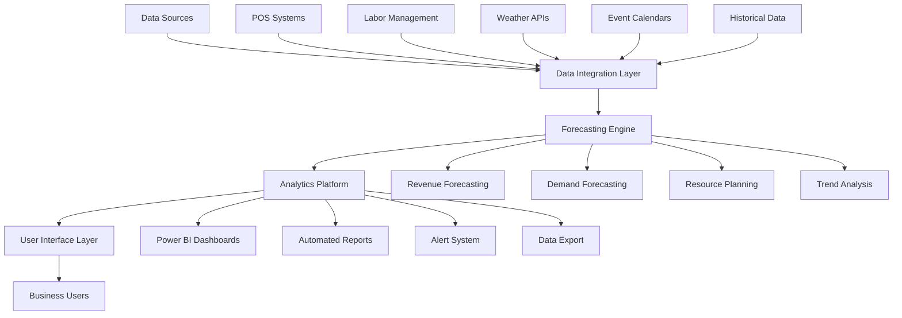

# Forecasting System Overview

## Executive Summary

The Towne Park Forecasting System is a comprehensive business intelligence platform designed to provide accurate, real-time forecasting capabilities for parking operations, revenue projections, and resource planning. The system integrates multiple data sources to deliver actionable insights that drive strategic decision-making and operational efficiency.

## System Architecture

### High-Level Architecture


### Core Components

#### Data Integration Layer
- **Purpose**: Consolidate data from multiple sources into a unified data model
- **Technology**: Azure Data Factory with custom connectors
- **Capabilities**:
  - Real-time data ingestion from POS systems
  - Batch processing of historical data
  - Data validation and cleansing
  - Schema mapping and transformation
  - Error handling and retry mechanisms

#### Forecasting Engine
- **Purpose**: Generate accurate forecasts using advanced analytics and machine learning
- **Technology**: Azure Machine Learning with custom algorithms
- **Models**:
  - Time series forecasting for revenue prediction
  - Regression models for demand forecasting
  - Classification models for event impact analysis
  - Ensemble methods for improved accuracy

#### Analytics Platform
- **Purpose**: Provide interactive analytics and visualization capabilities
- **Technology**: Power BI with custom visuals and DAX calculations
- **Features**:
  - Real-time dashboard updates
  - Drill-down capabilities
  - Comparative analysis tools
  - Trend identification and alerting

#### User Interface Layer
- **Purpose**: Deliver user-friendly interfaces for different user roles
- **Technology**: Power Apps with responsive design
- **Interfaces**:
  - Executive dashboards for high-level insights
  - Operational dashboards for day-to-day management
  - Analytical tools for detailed investigation
  - Mobile applications for field access

## Business Capabilities

### Revenue Forecasting

#### Short-term Revenue Forecasting (1-30 days)
- **Accuracy Target**: 95% within 10% variance
- **Update Frequency**: Hourly during business hours
- **Data Sources**: 
  - Real-time POS transactions
  - Current reservations and bookings
  - Weather forecasts
  - Local event calendars
- **Use Cases**:
  - Daily revenue planning
  - Staffing optimization
  - Inventory management
  - Cash flow planning

#### Medium-term Revenue Forecasting (1-12 months)
- **Accuracy Target**: 90% within 15% variance
- **Update Frequency**: Daily
- **Data Sources**:
  - Historical revenue patterns
  - Seasonal trends
  - Economic indicators
  - Market analysis
- **Use Cases**:
  - Budget planning
  - Contract negotiations
  - Resource allocation
  - Strategic planning

#### Long-term Revenue Forecasting (1-5 years)
- **Accuracy Target**: 80% within 20% variance
- **Update Frequency**: Monthly
- **Data Sources**:
  - Multi-year historical data
  - Market research
  - Economic projections
  - Industry trends
- **Use Cases**:
  - Strategic planning
  - Investment decisions
  - Market expansion
  - Long-term contracts

### Demand Forecasting

#### Parking Demand Prediction
```yaml
DemandForecasting:
  hourly_demand:
    granularity: "15-minute intervals"
    forecast_horizon: "7 days"
    accuracy_target: "90%"
    factors:
      - "Historical usage patterns"
      - "Day of week effects"
      - "Seasonal variations"
      - "Weather conditions"
      - "Local events"
  
  daily_demand:
    granularity: "Daily totals"
    forecast_horizon: "30 days"
    accuracy_target: "85%"
    factors:
      - "Monthly trends"
      - "Holiday effects"
      - "Economic indicators"
      - "Marketing campaigns"
  
  seasonal_demand:
    granularity: "Monthly averages"
    forecast_horizon: "12 months"
    accuracy_target: "80%"
    factors:
      - "Annual patterns"
      - "Tourism cycles"
      - "Business cycles"
      - "Infrastructure changes"
```

#### Capacity Planning
- **Utilization Optimization**: Predict optimal capacity allocation across facilities
- **Peak Period Management**: Identify and prepare for high-demand periods
- **Resource Allocation**: Optimize staffing and equipment deployment
- **Expansion Planning**: Identify opportunities for capacity expansion

### Operational Forecasting

#### Staffing Requirements
- **Labor Demand Prediction**: Forecast staffing needs based on expected demand
- **Skill Mix Optimization**: Determine optimal mix of staff skills and experience
- **Shift Planning**: Optimize shift schedules for cost and service efficiency
- **Overtime Prediction**: Forecast overtime requirements and costs

#### Equipment and Resource Needs
- **Equipment Utilization**: Predict equipment usage and maintenance needs
- **Supply Chain Planning**: Forecast inventory and supply requirements
- **Maintenance Scheduling**: Predict optimal maintenance timing
- **Capital Planning**: Forecast capital equipment needs and timing

## Data Sources and Integration

### Primary Data Sources

#### Point of Sale (POS) Systems
```yaml
POSIntegration:
  data_types:
    - "Transaction records"
    - "Payment methods"
    - "Customer information"
    - "Product/service details"
  
  update_frequency: "Real-time"
  data_volume: "10,000+ transactions/day"
  integration_method: "REST API"
  data_quality: "99.5% accuracy"
```

#### Labor Management Systems
```yaml
LaborIntegration:
  data_types:
    - "Employee schedules"
    - "Time and attendance"
    - "Labor costs"
    - "Productivity metrics"
  
  update_frequency: "Hourly"
  data_volume: "500+ employees"
  integration_method: "Database sync"
  data_quality: "99.8% accuracy"
```

#### External Data Sources
```yaml
ExternalData:
  weather_services:
    provider: "National Weather Service API"
    data_types: ["Temperature", "Precipitation", "Forecasts"]
    update_frequency: "Hourly"
  
  event_calendars:
    sources: ["City events", "Convention centers", "Sports venues"]
    data_types: ["Event schedules", "Attendance estimates", "Impact ratings"]
    update_frequency: "Daily"
  
  economic_indicators:
    sources: ["Bureau of Labor Statistics", "Federal Reserve"]
    data_types: ["Employment rates", "Consumer confidence", "GDP growth"]
    update_frequency: "Monthly"
```

### Data Quality Management

#### Data Validation Rules
- **Completeness Checks**: Ensure all required fields are populated
- **Accuracy Validation**: Cross-reference data against known benchmarks
- **Consistency Verification**: Validate data consistency across sources
- **Timeliness Monitoring**: Ensure data freshness meets requirements

#### Data Cleansing Procedures
- **Outlier Detection**: Identify and handle statistical outliers
- **Missing Value Imputation**: Fill missing values using appropriate methods
- **Duplicate Removal**: Identify and remove duplicate records
- **Format Standardization**: Ensure consistent data formats across sources

## Forecasting Models and Algorithms

### Time Series Models

#### ARIMA (AutoRegressive Integrated Moving Average)
```yaml
ARIMAModel:
  use_cases:
    - "Revenue trend forecasting"
    - "Seasonal pattern analysis"
    - "Long-term projections"
  
  parameters:
    - "Auto-regressive order (p): 1-5"
    - "Differencing order (d): 0-2"
    - "Moving average order (q): 1-5"
  
  performance:
    - "Accuracy: 85-90%"
    - "Training time: 5-10 minutes"
    - "Prediction time: <1 second"
```

#### Seasonal Decomposition
```yaml
SeasonalModel:
  components:
    - "Trend component"
    - "Seasonal component"
    - "Cyclical component"
    - "Irregular component"
  
  applications:
    - "Holiday effect analysis"
    - "Weekly pattern identification"
    - "Annual cycle modeling"
  
  benefits:
    - "Interpretable results"
    - "Robust to outliers"
    - "Handles multiple seasonalities"
```

### Machine Learning Models

#### Random Forest Regression
```yaml
RandomForestModel:
  features:
    - "Historical demand"
    - "Weather conditions"
    - "Day of week"
    - "Month of year"
    - "Local events"
    - "Economic indicators"
  
  hyperparameters:
    - "Number of trees: 100-500"
    - "Max depth: 10-20"
    - "Min samples split: 2-10"
  
  performance:
    - "Accuracy: 90-95%"
    - "Training time: 10-30 minutes"
    - "Feature importance available"
```

#### Neural Networks
```yaml
NeuralNetworkModel:
  architecture:
    - "Input layer: 50-100 features"
    - "Hidden layers: 2-3 layers"
    - "Neurons per layer: 64-256"
    - "Output layer: 1 prediction"
  
  training:
    - "Optimizer: Adam"
    - "Loss function: Mean Squared Error"
    - "Epochs: 100-500"
    - "Batch size: 32-128"
  
  applications:
    - "Complex pattern recognition"
    - "Non-linear relationships"
    - "High-dimensional data"
```

### Ensemble Methods

#### Model Combination Strategy
```yaml
EnsembleStrategy:
  base_models:
    - "ARIMA for trend analysis"
    - "Random Forest for feature interactions"
    - "Neural Network for complex patterns"
  
  combination_method:
    - "Weighted average"
    - "Stacking with meta-learner"
    - "Dynamic model selection"
  
  benefits:
    - "Improved accuracy"
    - "Reduced overfitting"
    - "Robust predictions"
```

## User Interfaces and Dashboards

### Executive Dashboard

#### Key Performance Indicators
- **Revenue Performance**: Current vs. forecasted revenue with variance analysis
- **Demand Trends**: Utilization rates and capacity optimization metrics
- **Operational Efficiency**: Cost per transaction and productivity metrics
- **Market Position**: Competitive analysis and market share indicators

#### Visual Components
- **Revenue Waterfall Charts**: Show revenue drivers and detractors
- **Trend Lines**: Display historical and forecasted trends
- **Heat Maps**: Visualize demand patterns across time and location
- **Gauge Charts**: Show performance against targets and benchmarks

### Operational Dashboard

#### Real-time Monitoring
- **Live Demand Tracking**: Current utilization vs. forecasted demand
- **Staffing Status**: Current staffing levels vs. recommended levels
- **Revenue Tracking**: Real-time revenue vs. daily targets
- **Alert Management**: Active alerts and recommended actions

#### Operational Tools
- **Demand Prediction**: Hourly demand forecasts for next 24-48 hours
- **Staffing Recommendations**: Optimal staffing levels by location and time
- **Capacity Alerts**: Warnings for approaching capacity limits
- **Performance Metrics**: Key operational metrics and trends

### Analytical Dashboard

#### Advanced Analytics
- **Scenario Analysis**: What-if analysis for different scenarios
- **Sensitivity Analysis**: Impact of key variables on forecasts
- **Model Performance**: Accuracy metrics and model diagnostics
- **Data Quality Monitoring**: Data completeness and accuracy metrics

#### Customization Features
- **Flexible Filtering**: Filter by location, time period, customer segment
- **Custom Calculations**: User-defined metrics and calculations
- **Export Capabilities**: Export data and visualizations to various formats
- **Drill-down Analysis**: Navigate from summary to detailed views

## Performance and Scalability

### System Performance

#### Response Time Requirements
- **Dashboard Loading**: <3 seconds for standard dashboards
- **Forecast Generation**: <30 seconds for standard forecasts
- **Data Refresh**: <5 minutes for real-time data updates
- **Report Generation**: <2 minutes for standard reports

#### Scalability Specifications
- **Concurrent Users**: Support for 100+ simultaneous users
- **Data Volume**: Handle 10+ million records efficiently
- **Forecast Complexity**: Support multiple models and scenarios
- **Geographic Scale**: Scale across multiple regions and time zones

### Infrastructure Requirements

#### Compute Resources
```yaml
ComputeRequirements:
  forecasting_engine:
    cpu: "16 cores minimum"
    memory: "64 GB RAM"
    storage: "1 TB SSD"
    gpu: "Optional for neural networks"
  
  analytics_platform:
    cpu: "8 cores minimum"
    memory: "32 GB RAM"
    storage: "500 GB SSD"
    network: "High-speed connectivity"
  
  data_storage:
    type: "Azure SQL Database"
    size: "Premium tier"
    backup: "Automated daily backups"
    retention: "7 years"
```

#### Network and Security
- **Network Bandwidth**: Minimum 1 Gbps for data transfers
- **Security**: End-to-end encryption and role-based access control
- **Compliance**: SOX and industry standard compliance
- **Monitoring**: 24/7 system monitoring and alerting

## Integration and APIs

### API Specifications

#### Forecast API
```yaml
ForecastAPI:
  endpoint: "/api/v1/forecasts"
  methods: ["GET", "POST"]
  authentication: "OAuth 2.0"
  rate_limit: "1000 requests/hour"
  
  parameters:
    location_id: "Required - Location identifier"
    forecast_type: "Required - revenue|demand|staffing"
    time_horizon: "Required - 1d|7d|30d|90d|365d"
    granularity: "Optional - hour|day|week|month"
  
  response_format:
    forecast_id: "Unique forecast identifier"
    timestamp: "Forecast generation time"
    predictions: "Array of forecast values"
    confidence_intervals: "Upper and lower bounds"
    model_metadata: "Model information and parameters"
```

#### Data Ingestion API
```yaml
DataIngestionAPI:
  endpoint: "/api/v1/data"
  methods: ["POST", "PUT"]
  authentication: "API Key"
  rate_limit: "10000 requests/hour"
  
  data_types:
    - "Transaction data"
    - "Labor data"
    - "External events"
    - "Weather data"
  
  validation:
    - "Schema validation"
    - "Data type checking"
    - "Range validation"
    - "Business rule validation"
```

### Integration Patterns

#### Real-time Integration
- **Event-driven Architecture**: Process data as it arrives
- **Stream Processing**: Handle high-volume data streams
- **Message Queues**: Ensure reliable data delivery
- **Circuit Breakers**: Handle integration failures gracefully

#### Batch Integration
- **Scheduled Processing**: Regular batch updates for historical data
- **ETL Pipelines**: Extract, transform, and load data efficiently
- **Data Validation**: Comprehensive validation of batch data
- **Error Handling**: Robust error handling and recovery procedures

## Security and Compliance

### Data Security

#### Access Control
- **Role-based Access**: Different access levels for different user roles
- **Multi-factor Authentication**: Required for all system access
- **Session Management**: Secure session handling and timeout
- **Audit Logging**: Comprehensive logging of all user activities

#### Data Protection
- **Encryption at Rest**: All data encrypted using AES-256
- **Encryption in Transit**: TLS 1.3 for all data transmissions
- **Data Masking**: Sensitive data masked in non-production environments
- **Backup Security**: Encrypted backups with secure key management

### Compliance Requirements

#### Financial Compliance
- **SOX Compliance**: Financial data controls and audit trails
- **Data Retention**: 7-year retention for financial forecasting data
- **Change Management**: Controlled changes to forecasting models
- **Documentation**: Comprehensive documentation of all processes

#### Privacy Compliance
- **Data Minimization**: Collect only necessary data for forecasting
- **Consent Management**: Proper consent for data usage
- **Right to Erasure**: Procedures for data deletion requests
- **Cross-border Transfers**: Compliance with international data transfer rules

## Monitoring and Maintenance

### System Monitoring

#### Performance Monitoring
- **Response Time Tracking**: Monitor API and dashboard response times
- **Resource Utilization**: Track CPU, memory, and storage usage
- **Error Rate Monitoring**: Track and alert on error rates
- **User Activity Monitoring**: Monitor user engagement and usage patterns

#### Model Performance Monitoring
- **Forecast Accuracy**: Track accuracy of forecasting models over time
- **Model Drift Detection**: Identify when models need retraining
- **Data Quality Monitoring**: Monitor input data quality and completeness
- **Bias Detection**: Monitor for bias in model predictions

### Maintenance Procedures

#### Regular Maintenance
- **Model Retraining**: Monthly retraining of machine learning models
- **Data Cleanup**: Weekly cleanup of temporary and obsolete data
- **Performance Optimization**: Quarterly performance tuning
- **Security Updates**: Regular security patches and updates

#### Incident Response
- **Alert Escalation**: Automated escalation for critical issues
- **Recovery Procedures**: Documented procedures for system recovery
- **Communication Plans**: Stakeholder communication during incidents
- **Post-incident Analysis**: Analysis and improvement after incidents

---

*This system overview is maintained by the Towne Park Forecasting Team and is updated regularly to reflect system enhancements and operational changes.*