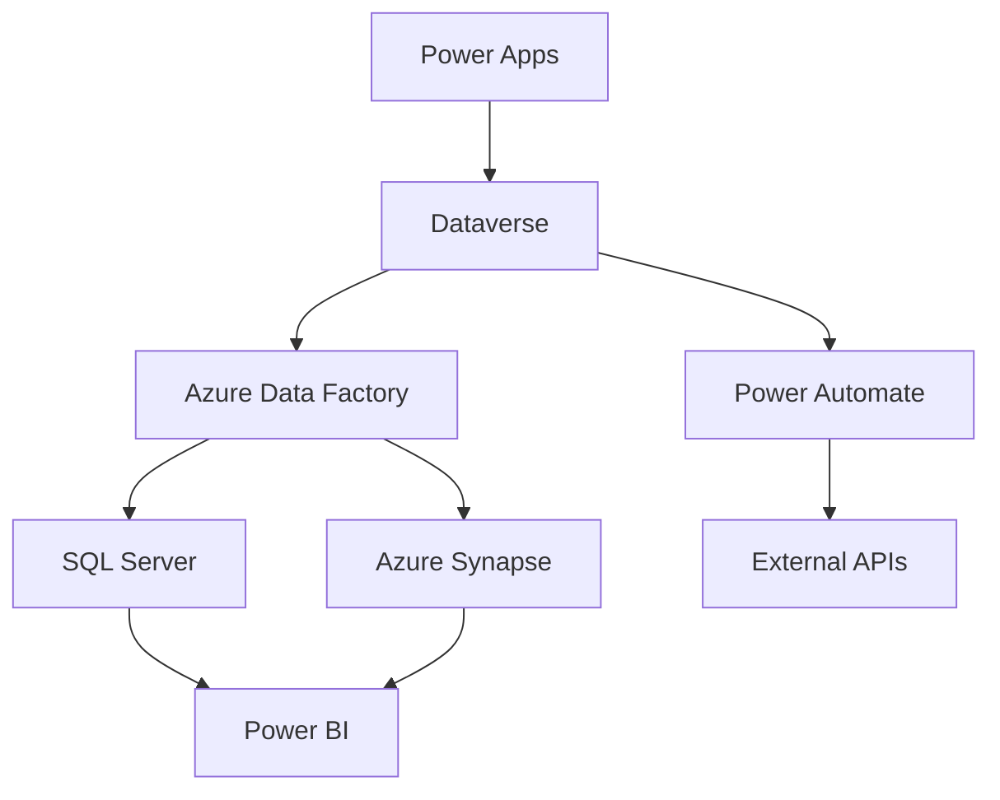

# Architecture Team Meeting Notes - Weekly Sync
**Date**: July 18, 2025  
**Time**: 10:00 AM - 11:30 AM CST  
**Meeting Type**: Weekly Architecture Sync  
**Facilitator**: Sarah Chen, Lead Architect  

## Attendees
- Sarah Chen (Lead Architect)
- Michael Rodriguez (Senior Solutions Architect)
- Jennifer Kim (Integration Architect)
- David Thompson (Platform Architect)
- Lisa Wang (Security Architect)
- Robert Johnson (Data Architect)

## Meeting Agenda

### 1. Power Platform Architecture Review
**Discussion Leader**: Michael Rodriguez

#### Current State Assessment
- **Power Apps**: 15 production applications currently deployed
- **Power Automate**: 47 active workflows across billing and forecasting
- **Power BI**: 12 operational dashboards with real-time data feeds
- **Dataverse**: Central data hub with 150+ custom entities

#### Architecture Decisions Made
1. **Hybrid Connection Strategy**
   - Approved implementation of on-premises data gateway for legacy system integration
   - Decision to maintain hybrid approach for next 18 months during cloud migration
   - Security requirements mandate encrypted connections for all data transfers

2. **ALM (Application Lifecycle Management) Strategy**
   - Standardized on Azure DevOps for source control and deployment pipelines
   - Implemented environment promotion strategy: Dev → Test → UAT → Production
   - Established code review requirements for all Power Platform solutions

3. **Integration Architecture**
   - Approved REST API-first approach for all new integrations
   - Legacy SOAP services to be wrapped with REST facades
   - Event-driven architecture for real-time data synchronization

#### Action Items
- [ ] **Michael Rodriguez**: Document hybrid connection security requirements by July 25
- [ ] **Jennifer Kim**: Create integration testing framework for new REST APIs by August 1
- [ ] **David Thompson**: Establish Power Platform governance policies by July 30

### 2. Data Architecture Updates
**Discussion Leader**: Robert Johnson

#### Database Integration Strategy
- **Primary Database**: SQL Server 2022 with Always On availability groups
- **Data Warehouse**: Azure Synapse Analytics for historical data and reporting
- **Real-time Analytics**: Azure Stream Analytics for live dashboard feeds
- **Backup Strategy**: Automated daily backups with 7-year retention

#### Data Flow Architecture

#### Key Decisions
1. **Data Synchronization**
   - Real-time sync for critical billing data
   - Batch processing for historical forecasting data
   - Event-driven updates for customer information changes

2. **Data Quality Framework**
   - Implemented automated data validation rules
   - Established data lineage tracking
   - Created data quality dashboards for monitoring

#### Action Items
- [ ] **Robert Johnson**: Finalize data retention policies by July 22
- [ ] **Lisa Wang**: Review data encryption standards for new integrations by July 24

### 3. Security Architecture Review
**Discussion Leader**: Lisa Wang

#### Security Framework Updates
- **Identity Management**: Azure Active Directory with conditional access policies
- **API Security**: OAuth 2.0 with JWT tokens for all API communications
- **Data Encryption**: AES-256 encryption for data at rest and in transit
- **Network Security**: Zero-trust network architecture implementation

#### Compliance Requirements
1. **SOX Compliance**
   - Implemented segregation of duties for financial data access
   - Established audit trails for all financial transactions
   - Created automated compliance reporting

2. **PCI DSS Requirements**
   - Tokenization of payment card data
   - Secure payment processing workflows
   - Regular security assessments and penetration testing

#### Security Decisions Made
1. **Multi-Factor Authentication**
   - Mandatory MFA for all system access
   - Risk-based authentication for sensitive operations
   - Integration with Microsoft Authenticator app

2. **Privileged Access Management**
   - Just-in-time access for administrative functions
   - Automated access reviews and certifications
   - Privileged session monitoring and recording

#### Action Items
- [ ] **Lisa Wang**: Complete security assessment of new forecasting module by July 28
- [ ] **Sarah Chen**: Review and approve updated security policies by July 26

### 4. Integration Strategy Discussion
**Discussion Leader**: Jennifer Kim

#### Current Integration Landscape
- **Legacy Systems**: 8 on-premises systems requiring integration
- **Cloud Services**: 12 SaaS applications with API connectivity
- **Real-time Integrations**: 15 critical data flows requiring sub-second latency
- **Batch Integrations**: 25 scheduled data synchronization processes

#### Integration Patterns Adopted
1. **API Gateway Pattern**
   - Centralized API management through Azure API Management
   - Rate limiting and throttling for external API calls
   - Comprehensive API monitoring and analytics

2. **Event-Driven Architecture**
   - Azure Service Bus for reliable message delivery
   - Event sourcing for audit trails and data recovery
   - Saga pattern for distributed transaction management

3. **Hybrid Connectivity**
   - Azure ExpressRoute for high-bandwidth, low-latency connections
   - VPN gateways for secure remote access
   - On-premises data gateways for Power Platform connectivity

#### Integration Challenges and Solutions
1. **Legacy System Modernization**
   - **Challenge**: Outdated APIs with limited functionality
   - **Solution**: API facade pattern with modern REST interfaces
   - **Timeline**: Phased approach over 12 months

2. **Data Consistency**
   - **Challenge**: Maintaining data consistency across multiple systems
   - **Solution**: Event sourcing with eventual consistency model
   - **Implementation**: Azure Event Grid for event distribution

#### Action Items
- [ ] **Jennifer Kim**: Create integration testing strategy document by July 25
- [ ] **David Thompson**: Establish API versioning standards by July 30

### 5. Performance and Scalability Planning
**Discussion Leader**: David Thompson

#### Current Performance Metrics
- **Power Apps Response Time**: Average 1.2 seconds for standard operations
- **Power Automate Throughput**: 500 workflows per minute peak capacity
- **Database Query Performance**: 95% of queries complete under 100ms
- **API Response Times**: Average 250ms for external API calls

#### Scalability Requirements
1. **User Growth Projections**
   - Current: 150 active users
   - 6-month target: 300 active users
   - 12-month target: 500 active users

2. **Data Volume Growth**
   - Current: 2TB of operational data
   - Annual growth rate: 40%
   - 3-year projection: 8TB of operational data

#### Performance Optimization Strategies
1. **Caching Implementation**
   - Redis cache for frequently accessed data
   - CDN for static content delivery
   - Application-level caching for computed results

2. **Database Optimization**
   - Index optimization for critical queries
   - Partitioning for large historical tables
   - Read replicas for reporting workloads

#### Action Items
- [ ] **David Thompson**: Implement performance monitoring dashboard by August 5
- [ ] **Robert Johnson**: Optimize database indexes for forecasting queries by July 30

### 6. Technology Roadmap Updates
**Discussion Leader**: Sarah Chen

#### Short-term Priorities (Next 3 Months)
1. **Power Platform Governance**
   - Establish Center of Excellence (CoE)
   - Implement solution templates and standards
   - Create developer training programs

2. **Integration Modernization**
   - Complete REST API implementation for billing system
   - Migrate legacy SOAP services to modern architecture
   - Implement API gateway for centralized management

3. **Security Enhancements**
   - Deploy advanced threat protection
   - Implement zero-trust network architecture
   - Complete security compliance assessments

#### Medium-term Goals (3-12 Months)
1. **Cloud Migration**
   - Migrate remaining on-premises workloads to Azure
   - Implement cloud-native monitoring and alerting
   - Optimize cloud resource utilization and costs

2. **Advanced Analytics**
   - Deploy machine learning models for forecasting
   - Implement real-time analytics dashboards
   - Create predictive maintenance capabilities

3. **Automation Expansion**
   - Automate manual business processes
   - Implement intelligent document processing
   - Deploy chatbots for customer service

#### Long-term Vision (12+ Months)
1. **AI and Machine Learning**
   - Implement AI-powered business insights
   - Deploy natural language processing for document analysis
   - Create intelligent automation workflows

2. **Edge Computing**
   - Deploy edge computing for real-time processing
   - Implement IoT integration for facility management
   - Create hybrid cloud-edge architecture

#### Action Items
- [ ] **Sarah Chen**: Finalize technology roadmap document by July 31
- [ ] **All Team Members**: Review and provide feedback on roadmap by July 28

## Key Decisions Summary

### Approved Decisions
1. **Hybrid Architecture Approach**: Maintain hybrid cloud-on-premises architecture for 18 months
2. **API-First Strategy**: All new integrations must use REST APIs with OpenAPI specifications
3. **Zero-Trust Security**: Implement zero-trust network architecture across all systems
4. **Event-Driven Integration**: Adopt event-driven architecture for real-time data synchronization
5. **Power Platform Governance**: Establish formal governance framework with CoE

### Pending Decisions
1. **Legacy System Retirement**: Timeline for decommissioning legacy systems (pending business approval)
2. **Multi-Cloud Strategy**: Evaluation of multi-cloud approach for disaster recovery
3. **Edge Computing Implementation**: Business case development for edge computing initiatives

## Risk Assessment

### High-Priority Risks
1. **Legacy System Dependencies**
   - **Risk**: Critical business processes dependent on aging systems
   - **Mitigation**: Accelerated modernization timeline with parallel system operation
   - **Owner**: Jennifer Kim

2. **Security Compliance**
   - **Risk**: Evolving regulatory requirements may impact architecture decisions
   - **Mitigation**: Regular compliance assessments and proactive security updates
   - **Owner**: Lisa Wang

3. **Performance Scalability**
   - **Risk**: Rapid user growth may exceed current system capacity
   - **Mitigation**: Proactive performance monitoring and auto-scaling implementation
   - **Owner**: David Thompson

### Medium-Priority Risks
1. **Integration Complexity**
   - **Risk**: Increasing number of integrations may create maintenance challenges
   - **Mitigation**: Standardized integration patterns and comprehensive documentation
   - **Owner**: Jennifer Kim

2. **Technology Obsolescence**
   - **Risk**: Rapid technology changes may require frequent architecture updates
   - **Mitigation**: Flexible architecture design with modular components
   - **Owner**: Sarah Chen

## Next Meeting
**Date**: July 25, 2025  
**Time**: 10:00 AM - 11:30 AM CST  
**Focus**: Integration testing framework review and security assessment results

## Action Item Summary
| Owner | Task | Due Date | Status |
|-------|------|----------|--------|
| Michael Rodriguez | Document hybrid connection security requirements | July 25 | Pending |
| Jennifer Kim | Create integration testing framework | August 1 | Pending |
| David Thompson | Establish Power Platform governance policies | July 30 | Pending |
| Robert Johnson | Finalize data retention policies | July 22 | Pending |
| Lisa Wang | Review data encryption standards | July 24 | Pending |
| Lisa Wang | Complete security assessment of forecasting module | July 28 | Pending |
| Sarah Chen | Review and approve updated security policies | July 26 | Pending |
| Jennifer Kim | Create integration testing strategy document | July 25 | Pending |
| David Thompson | Establish API versioning standards | July 30 | Pending |
| David Thompson | Implement performance monitoring dashboard | August 5 | Pending |
| Robert Johnson | Optimize database indexes for forecasting queries | July 30 | Pending |
| Sarah Chen | Finalize technology roadmap document | July 31 | Pending |
| All Team Members | Review and provide feedback on roadmap | July 28 | Pending |

---

*Meeting notes compiled by Sarah Chen, Lead Architect. Next review scheduled for July 25, 2025.*