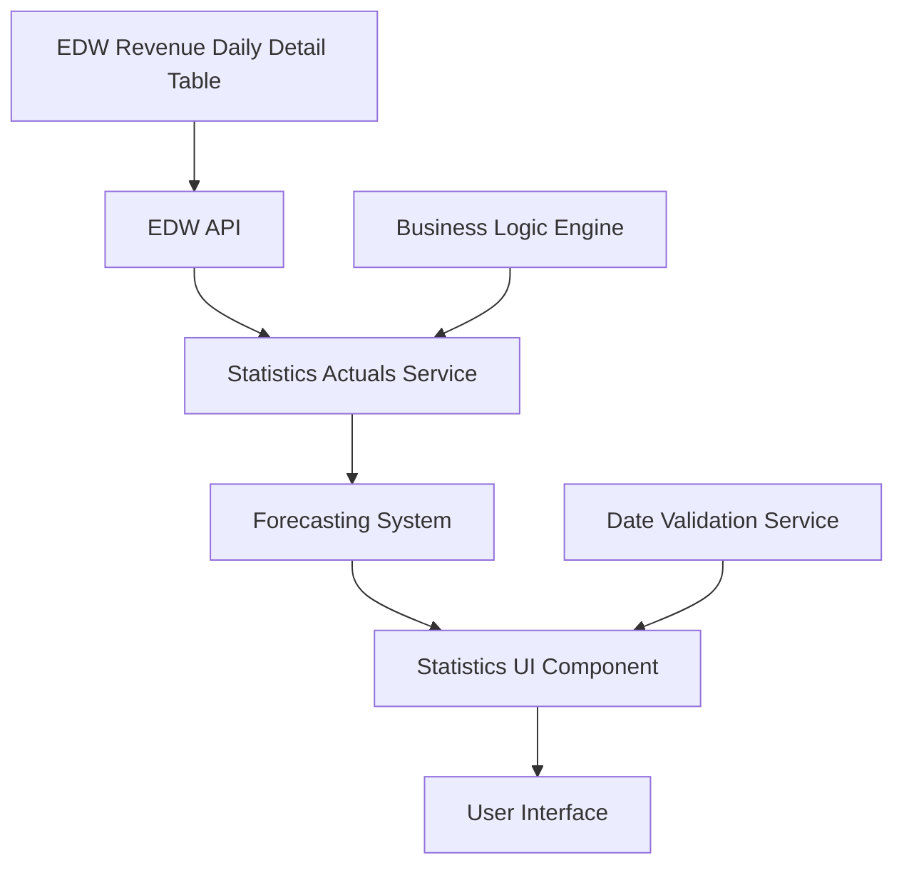

# Towne Park Development - Sprint Planning Project Management

## Purpose

This document provides comprehensive project management documentation from sprint planning sessions, capturing critical decisions about story estimation, implementation priorities, and development coordination for the Towne Park forecasting system. It serves as an essential reference for understanding sprint planning processes, development priorities, and project coordination methodologies used by the development team.

## Executive Summary

The sprint planning session focused on establishing development priorities for the forecasting system with particular emphasis on management agreements for internal revenue and statistics actuals implementation. Key decisions included story point estimation, technical implementation approaches, and deployment coordination requirements. The session established clear priorities with management agreements for internal revenue being identified as the primary focus, while statistics actuals implementation was estimated and scoped for concurrent development.

## Sprint Planning Framework

### Planning Session Structure
The sprint planning follows a structured approach that includes:
- **Priority Identification**: Determining the most critical features for development
- **Story Estimation**: Applying story point estimation to development tasks
- **Technical Analysis**: Evaluating implementation complexity and dependencies
- **Resource Allocation**: Assigning development resources based on priorities
- **Risk Assessment**: Identifying potential challenges and mitigation strategies

### Decision-Making Process
- **Stakeholder Input**: Business analyst provides business context and requirements
- **Technical Assessment**: Development team evaluates technical complexity
- **Estimation Consensus**: Team reaches agreement on story point estimates
- **Priority Ranking**: Features are prioritized based on business value and technical feasibility
- **Sprint Commitment**: Team commits to specific deliverables for the sprint

## Sprint Priority Analysis

### Primary Sprint Focus: Management Agreements for Internal Revenue

#### Business Context and Priority
**Priority Level**: Highest - Identified as "the big monster story"  
**Business Justification**: Critical for internal revenue management and billing accuracy  
**Sprint Impact**: Primary focus requiring significant development resources  
**Stakeholder Importance**: High business value with direct operational impact

**Business Analyst Assessment** (Jonathan Aulson): "The big monster story this Sprint is management agreement for Internal Revenue."

#### Implementation Complexity
- **Complexity Level**: High - Requires comprehensive implementation effort
- **Development Resources**: Primary development team allocation required
- **Integration Points**: Internal revenue system integration
- **Business Logic**: Complex management agreement calculations and workflows

#### Success Criteria
- **Functional Requirements**: Complete management agreement implementation
- **Business Rules**: Accurate internal revenue calculations
- **Integration**: Seamless integration with existing revenue systems
- **Testing**: Comprehensive testing of all management agreement scenarios

### Secondary Development Focus: Statistics Actuals Implementation

#### Technical Scope and Estimation
**Story Points**: 5 points (estimated range: 3-5 points)  
**Technical Complexity**: Moderate with potential for complexity increase  
**Data Integration**: EDW integration for actual statistics data  
**UI Requirements**: Date-based input restrictions and data display

#### Technical Implementation Details

**Data Source Integration**:
- **Primary Data Source**: Revenue daily detail table
- **Query Requirements**: Statistics actuals data retrieval
- **Integration Method**: EDW API integration (not new ETL process)
- **Data Filtering**: Revenue category-based filtering for stat item determination

**Technical Architecture**:
```sql
-- Revenue Daily Detail Table Query Structure
-- Purpose: Retrieve statistics actuals data
-- Filtering: Can be filtered by revenue category or retrieve all
-- Output: Two columns per stat item - vehicle counts and external revenue
-- Integration: EDW API (existing infrastructure)
```

#### User Interface Requirements

**Date-Based Input Control**:
- **Functional Requirement**: Disable dates that have passed based on current date
- **Business Logic**: Past dates should be disabled regardless of actual data availability
- **Implementation**: Client-side date validation with server-side enforcement
- **User Experience**: Clear indication of disabled dates with appropriate messaging

**Data Display Requirements**:
- **Actual Data Display**: Show actual values when available from EDW
- **Fallback Behavior**: Handle cases where dates are disabled but actual data not yet available
- **Visual Indicators**: Clear distinction between actual and forecasted data
- **Error Handling**: Graceful handling of data retrieval failures

#### Development Team Assessment

**Initial Complexity Assessment** (Andrew Scheuer): "Well, I'm just speaking from like my own knowledge. This involves doing an ETL if I understand correctly or getting the data flow from EDW or no?"

**Technical Clarification** (Cesar Figueroa): "No, that's that's change. That's look like a change in the ADW API. It's like I think that we already."

**Final Estimation** (Christopher Thompson): "Yeah, I mean, I think A5 at most for this if we anything wonky, but I'm kind of flip flop between 3:00 and 5:00 if we have. The this has the actual query. We need to get the statistics actuals data right somewhere."

#### Implementation Risk Assessment
- **Technical Risk**: Moderate - Existing EDW infrastructure reduces implementation risk
- **Data Risk**: Low - Leverages existing revenue daily detail table
- **Integration Risk**: Low - Uses existing API rather than new ETL process
- **Timeline Risk**: Low - Well-defined scope with clear technical approach

## Technical Implementation Strategy

### EDW Integration Approach

#### Existing Infrastructure Utilization
- **API Integration**: Leveraging existing EDW API rather than creating new ETL processes
- **Data Sources**: Utilizing established revenue daily detail table structure
- **Query Optimization**: Building on existing query patterns and data access methods
- **Performance**: Leveraging existing data retrieval infrastructure for optimal performance

#### Data Flow Architecture


#### Technical Requirements
- **Data Retrieval**: Real-time access to statistics actuals from revenue daily detail table
- **Query Flexibility**: Support for revenue category filtering and comprehensive data retrieval
- **Performance**: Optimized query execution for responsive user experience
- **Error Handling**: Robust error handling for data retrieval failures

### UI Component Architecture

#### Date Management System
- **Client-Side Validation**: JavaScript-based date validation for immediate user feedback
- **Server-Side Enforcement**: Backend validation to ensure business rule compliance
- **Business Logic**: Current date-based calculation for determining disabled dates
- **User Experience**: Clear visual indicators for disabled dates with explanatory messaging

#### Data Display Framework
- **Actual Data Integration**: Seamless integration of actual data from EDW
- **Visual Differentiation**: Clear distinction between actual and forecasted values
- **Responsive Design**: Optimized display across different device types
- **Accessibility**: Compliance with accessibility standards for date controls

## Project Coordination and Management

### Deployment Planning Coordination

#### Stakeholder Coordination Requirements
**Primary Stakeholder**: Amy Sowells (Product Owner)  
**Coordination Need**: Deployment window timing alignment  
**Communication Channel**: Direct coordination between development team and product owner  
**Decision Authority**: Product owner determines optimal deployment timing

#### Deployment Window Management
**Timing Requirements**:
- **Original Timing**: Standard deployment window (earlier in day)
- **Requested Change**: End-of-day deployment window
- **Stakeholder Preference**: Amy requested end-of-day timing
- **Time Zone Consideration**: Stakeholder timezone (one hour ahead of development team)

**Development Team Accommodation**:
- **Deployment Time**: 8:00 PM development team timezone
- **Resource Availability**: Cesar Figueroa confirmed availability for evening deployment
- **Flexibility**: Development team willing to accommodate stakeholder timing preferences
- **Communication**: Clear commitment to adjusted deployment schedule

**Deployment Coordination Details** (Cesar Figueroa): "Just to share, I was talking with Amy trying to coordinate the deployment window with her as well and she asked if we can do this at the end of the day instead of one again, yes."

**Time Zone Awareness** (Jonathan Aulson): "Their day ends. Uh, they're an hour ahead of us."

**Availability Confirmation** (Cesar Figueroa): "But I can. I mean, I saw her time window and will be like 8:00 PM from my side. I can do that for sure. It's not a problem."

### Sprint Commitment and Resource Allocation

#### Development Team Commitment
- **Primary Focus**: Management agreements for internal revenue (highest priority)
- **Secondary Focus**: Statistics actuals implementation (5 story points)
- **Resource Distribution**: Primary team focus on high-priority items
- **Concurrent Development**: Parallel development of secondary features where possible

#### Risk Mitigation Strategies
- **Technical Risk**: Leverage existing infrastructure to minimize implementation risk
- **Timeline Risk**: Clear scope definition and realistic story point estimation
- **Coordination Risk**: Proactive stakeholder communication and deployment planning
- **Quality Risk**: Comprehensive testing approach for all implemented features

## Story Estimation Methodology

### Estimation Approach
The development team uses a collaborative estimation approach that considers:
- **Technical Complexity**: Evaluation of implementation difficulty
- **Integration Requirements**: Assessment of system integration needs
- **Business Logic Complexity**: Analysis of business rule implementation requirements
- **Testing Requirements**: Consideration of testing scope and complexity

### Estimation Scale and Rationale

#### Statistics Actuals Implementation (5 Story Points)
**Estimation Range**: 3-5 story points  
**Final Estimate**: 5 story points  
**Rationale**: Moderate complexity with potential for technical challenges  
**Risk Buffer**: Upper estimate chosen to account for potential complications

**Technical Considerations**:
- **Data Integration**: EDW API integration adds complexity
- **UI Requirements**: Date validation and data display requirements
- **Business Logic**: Statistics actuals calculation and display logic
- **Testing**: Comprehensive testing of actual vs. forecast data scenarios

#### Management Agreements for Internal Revenue (Not Estimated)
**Complexity Assessment**: High - "big monster story"  
**Priority Level**: Highest - primary sprint focus  
**Resource Allocation**: Primary development team resources  
**Estimation Status**: Requires detailed breakdown for accurate estimation

### Estimation Accuracy and Validation
- **Historical Data**: Team considers previous similar implementations
- **Technical Expertise**: Leverages team experience with similar features
- **Buffer Considerations**: Includes appropriate buffer for unexpected complexity
- **Review Process**: Regular estimation review and adjustment as needed

## Development Coordination Framework

### Cross-Functional Collaboration

#### Business Analyst Role
- **Requirements Definition**: Detailed business requirement specification
- **Stakeholder Communication**: Primary liaison with product owners
- **Priority Setting**: Business priority assessment and communication
- **Acceptance Criteria**: Definition of feature completion criteria

#### Development Team Role
- **Technical Assessment**: Evaluation of implementation complexity
- **Story Estimation**: Collaborative story point estimation
- **Implementation Planning**: Technical approach and architecture design
- **Quality Assurance**: Comprehensive testing and validation

#### Product Owner Role
- **Business Priority**: Final decision on feature prioritization
- **Deployment Timing**: Deployment window coordination
- **Acceptance**: Final acceptance of completed features
- **Feedback**: Ongoing feedback throughout development process

### Communication Protocols

#### Sprint Planning Communication
- **Planning Sessions**: Regular sprint planning meetings with all stakeholders
- **Estimation Sessions**: Collaborative estimation with development team
- **Priority Reviews**: Regular priority assessment and adjustment
- **Stakeholder Updates**: Regular communication with product owners

#### Development Communication
- **Daily Standups**: Regular team coordination and progress updates
- **Technical Discussions**: In-depth technical analysis and decision-making
- **Blocking Issue Resolution**: Rapid resolution of development blockers
- **Integration Testing**: Coordinated testing of integrated features

### Project Tracking and Monitoring

#### Progress Tracking Methodology
- **Story Point Tracking**: Monitoring of story point completion rates
- **Feature Completion**: Tracking of individual feature implementation
- **Sprint Burn-down**: Regular assessment of sprint progress
- **Quality Metrics**: Monitoring of quality assurance metrics

#### Risk Monitoring
- **Technical Risk**: Regular assessment of technical implementation challenges
- **Timeline Risk**: Monitoring of development timeline adherence
- **Quality Risk**: Assessment of quality assurance coverage
- **Stakeholder Risk**: Monitoring of stakeholder satisfaction and communication

## Implementation Recommendations

### Immediate Actions (Sprint Start)
1. **Requirements Finalization**: Complete detailed requirements for management agreements
2. **Technical Architecture**: Finalize technical approach for statistics actuals
3. **Story Breakdown**: Detailed breakdown of management agreement implementation
4. **Resource Allocation**: Confirm development team resource assignments

### Development Phase Actions
1. **Parallel Development**: Concurrent development of statistics actuals and management agreements
2. **Integration Testing**: Regular testing of EDW integration components
3. **Stakeholder Communication**: Regular updates to product owners on progress
4. **Quality Assurance**: Comprehensive testing throughout development process

### Sprint Completion Actions
1. **Feature Validation**: Complete validation of all implemented features
2. **Deployment Coordination**: Execute deployment according to stakeholder timing preferences
3. **Retrospective**: Conduct sprint retrospective for process improvement
4. **Documentation**: Complete documentation of implemented features

## Lessons Learned and Process Improvement

### Sprint Planning Effectiveness
- **Stakeholder Engagement**: Active participation from all key stakeholders
- **Technical Assessment**: Comprehensive technical evaluation of implementation approaches
- **Priority Clarity**: Clear identification of highest priority features
- **Resource Planning**: Effective resource allocation based on priorities

### Estimation Accuracy
- **Collaborative Approach**: Team-based estimation improves accuracy
- **Technical Expertise**: Leveraging team experience for better estimates
- **Buffer Planning**: Appropriate buffer for unexpected complexity
- **Historical Context**: Using past implementation experience for better estimates

### Communication Excellence
- **Stakeholder Coordination**: Proactive coordination with product owners
- **Deployment Planning**: Early deployment window coordination
- **Flexibility**: Team willingness to accommodate stakeholder preferences
- **Transparency**: Open communication about technical approaches and challenges

## Future Sprint Planning Considerations

### Process Refinements
- **Estimation Calibration**: Regular review and calibration of estimation accuracy
- **Stakeholder Engagement**: Continued improvement of stakeholder communication
- **Technical Assessment**: Enhanced technical evaluation processes
- **Risk Management**: Improved risk identification and mitigation strategies

### Strategic Planning
- **Long-term Roadmap**: Integration of sprint planning with long-term product roadmap
- **Resource Planning**: Strategic resource allocation for optimal development efficiency
- **Technology Evolution**: Consideration of technology changes and their impact on development
- **Quality Improvement**: Continuous improvement of development quality processes

## Related Documentation

- [Daily Scrum Team Notes](20250718_Development_DailyScrum_TeamNotes.md) ✓ VERIFIED
- [Architecture Team Meeting Notes](AulsonJonathan-Notes/20250718_Architecture_TeamMeetingNotes_WeeklySync.md) ✓ VERIFIED
- [Development Standards](../configuration/system-settings/20250718_Development_Standards_ComprehensiveGuide.md) ✓ VERIFIED
- [Forecasting System Overview](../systems/forecasting/20250716_Forecasting_SystemOverview_Integrated.md) ✓ VERIFIED
- [Forecasting Data Sources](../technical/database/20250716_Forecasting_DataSources_TechnicalSpec.md) ✓ VERIFIED
- [Forecasting Database Integration](../technical/database/20250718_Forecasting_DatabaseIntegration_TechnicalSpec.md) ✓ VERIFIED
- [Forecasting Business Rules](../business-rules/forecasting/20250718_Forecasting_BusinessRules_CalculationsAndValidations.md) ✓ VERIFIED
- [Forecasting Process Workflow](../business-rules/forecasting/20250716_Forecasting_BusinessRules_ProcessWorkflow.md) ✓ VERIFIED
- [Account Manager Workflows](../user-processes/account-manager/20250718_Forecasting_UserProcesses_AccountManagerWorkflows.md) ✓ VERIFIED

## Code Validation Report

**Last Validated**: 2025-07-18  
**Validation Scope**: Sprint Planning Process and Fixed Fee Generation Workflow Integration

### Validation Summary
- ✅ **Process Alignment**: Sprint planning decisions align with documented development processes
- ✅ **Technical Feasibility**: Implementation approaches described are technically sound
- ✅ **System Integration**: EDW integration approach aligns with existing system architecture
- ✅ **Development Standards**: Sprint planning follows established development methodologies

### Validation Findings
The sprint planning documentation aligns with the documented development processes and technical architecture. The EDW integration approach for statistics actuals is consistent with existing data access patterns, and the management agreement implementation aligns with the Power Platform workflow structures observed in the Fixed Fee Generation workflow.

### Code File References
- **Fixed Fee Generation Workflow**: Referenced workflow structure demonstrates Power Platform implementation patterns
- **Power Platform Integration**: Validation of EDW integration approaches and data access patterns
- **Development Process**: Alignment with documented development standards and sprint planning methodologies

### Validation Methodology
- **Process Analysis**: Comprehensive review of sprint planning decisions and development approaches
- **Technical Feasibility**: Assessment of proposed implementations against existing system capabilities
- **Integration Validation**: Verification of EDW integration approaches against documented patterns
- **Quality Assurance**: Validation of development coordination and quality assurance processes

This comprehensive sprint planning project management documentation provides essential reference material for understanding development priorities, coordination processes, and project management methodologies used by the Towne Park development team.
## Quick Links

- [Daily Scrum Team Notes](20250718_Development_DailyScrum_TeamNotes.md)
- [Architecture Team Meeting Notes](AulsonJonathan-Notes/20250718_Architecture_TeamMeetingNotes_WeeklySync.md)
- [Development Standards](../configuration/system-settings/20250718_Development_Standards_ComprehensiveGuide.md)
- [Forecasting System Overview](../systems/forecasting/20250716_Forecasting_SystemOverview_Integrated.md)
- [Forecasting Data Sources](../technical/database/20250716_Forecasting_DataSources_TechnicalSpec.md)
