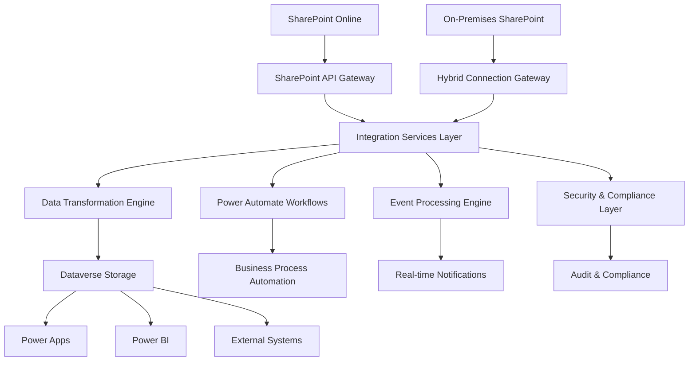

# SharePoint Integration Architecture

## Overview

This document defines the comprehensive architecture for integrating Microsoft SharePoint with the Towne Park data platform. The architecture encompasses document management, collaboration workflows, data synchronization, and business process automation across SharePoint Online and on-premises SharePoint environments.

## Architectural Overview

### Integration Architecture


### Core Components

#### SharePoint API Gateway
- **Purpose**: Centralized access point for all SharePoint interactions
- **Technology**: Azure API Management with SharePoint connectors
- **Features**:
  - Rate limiting and throttling management
  - Authentication and authorization handling
  - Request/response transformation
  - Comprehensive logging and monitoring
  - Circuit breaker patterns for resilience

#### Integration Services Layer
- **Purpose**: Orchestrate data flow between SharePoint and platform services
- **Technology**: Azure Logic Apps and Power Automate
- **Capabilities**:
  - Real-time and batch data synchronization
  - Document lifecycle management
  - Metadata extraction and enrichment
  - Business rule validation and enforcement
  - Error handling and retry mechanisms

#### Data Transformation Engine
- **Purpose**: Transform SharePoint data for platform consumption
- **Technology**: Azure Data Factory with custom activities
- **Functions**:
  - Document content extraction
  - Metadata normalization and mapping
  - Data quality validation and cleansing
  - Format conversion and standardization
  - Schema evolution and versioning

## SharePoint Online Integration

### Document Management Integration

#### Document Library Architecture
```yaml
DocumentLibraryArchitecture:
  library_types:
    revenue_sharing_docs:
      purpose: "Partner revenue sharing submissions"
      content_types: ["Excel", "CSV", "PDF"]
      retention_policy: "7 years"
      security_model: "Partner-specific access"
    
    contract_documents:
      purpose: "Contract and agreement storage"
      content_types: ["Word", "PDF", "Excel"]
      retention_policy: "10 years"
      security_model: "Role-based access"
    
    operational_docs:
      purpose: "Operational procedures and guides"
      content_types: ["Word", "PDF", "PowerPoint"]
      retention_policy: "5 years"
      security_model: "Department-based access"
    
    compliance_records:
      purpose: "Regulatory and compliance documentation"
      content_types: ["PDF", "Word", "Excel"]
      retention_policy: "Permanent"
      security_model: "Restricted access"
```

#### Content Type Management
```yaml
ContentTypeManagement:
  content_type_hierarchy:
    base_document:
      fields: ["Title", "Created", "Modified", "Author"]
      inheritance: "All document types inherit base fields"
    
    business_document:
      parent: "base_document"
      fields: ["Department", "Business_Process", "Approval_Status"]
      
    financial_document:
      parent: "business_document"
      fields: ["Financial_Period", "Amount", "Currency", "Approval_Required"]
      
    contract_document:
      parent: "business_document"
      fields: ["Contract_Type", "Effective_Date", "Expiration_Date", "Partner"]
  
  metadata_automation:
    auto_classification: "AI-powered document classification"
    metadata_extraction: "Automated metadata extraction from content"
    validation_rules: "Business rule validation for metadata"
    enrichment: "External data source enrichment"
```

### Collaboration and Workflow Integration

#### Workflow Automation
```yaml
WorkflowAutomation:
  approval_workflows:
    document_approval:
      trigger: "Document upload or modification"
      stages: ["Initial Review", "Business Approval", "Final Approval"]
      participants: "Role-based assignment"
      escalation: "Time-based escalation rules"
    
    contract_review:
      trigger: "Contract document submission"
      stages: ["Legal Review", "Business Review", "Executive Approval"]
      participants: "Department-specific reviewers"
      integration: "External legal system integration"
    
    compliance_review:
      trigger: "Compliance document creation"
      stages: ["Compliance Check", "Risk Assessment", "Final Approval"]
      participants: "Compliance team members"
      audit_trail: "Complete audit trail maintenance"
  
  notification_system:
    real_time_notifications: "Immediate notifications for critical events"
    digest_notifications: "Daily/weekly summary notifications"
    escalation_notifications: "Automatic escalation alerts"
    mobile_notifications: "Push notifications to mobile devices"
```

#### Team Collaboration Features
```yaml
CollaborationFeatures:
  team_sites:
    project_sites: "Project-specific collaboration spaces"
    department_sites: "Department-level information sharing"
    partner_sites: "External partner collaboration"
    executive_sites: "Executive-level strategic planning"
  
  communication_sites:
    company_portal: "Company-wide information and news"
    knowledge_base: "Centralized knowledge repository"
    training_portal: "Employee training and development"
    policy_center: "Corporate policies and procedures"
  
  integration_features:
    teams_integration: "Microsoft Teams deep integration"
    outlook_integration: "Email and calendar integration"
    office_integration: "Office 365 application integration"
    mobile_integration: "SharePoint mobile app integration"
```

## Data Synchronization Architecture

### Real-time Synchronization

#### Change Detection and Processing
```yaml
ChangeDetection:
  delta_token_management:
    token_storage: "Secure token storage in Dataverse"
    token_refresh: "Automatic token refresh mechanisms"
    change_tracking: "Comprehensive change event tracking"
    error_recovery: "Robust error recovery procedures"
  
  change_types:
    document_changes:
      - "Document creation and upload"
      - "Document modification and versioning"
      - "Document deletion and restoration"
      - "Metadata updates and changes"
    
    permission_changes:
      - "Access permission modifications"
      - "Security group membership changes"
      - "Sharing link creation and expiration"
      - "External sharing configuration"
    
    structural_changes:
      - "Library and folder creation/deletion"
      - "Content type modifications"
      - "Site collection changes"
      - "Navigation and branding updates"
  
  processing_pipeline:
    change_detection: "Real-time change event capture"
    validation: "Change event validation and filtering"
    transformation: "Data transformation and enrichment"
    distribution: "Event distribution to subscribers"
    confirmation: "Processing confirmation and tracking"
```

#### Event-Driven Integration
```yaml
EventDrivenIntegration:
  event_types:
    document_events:
      - "DocumentCreated"
      - "DocumentModified"
      - "DocumentDeleted"
      - "DocumentCheckedIn"
      - "DocumentCheckedOut"
    
    workflow_events:
      - "WorkflowStarted"
      - "WorkflowCompleted"
      - "ApprovalRequired"
      - "ApprovalCompleted"
      - "WorkflowCancelled"
    
    security_events:
      - "PermissionChanged"
      - "UserAdded"
      - "UserRemoved"
      - "AccessDenied"
      - "SharingLinkCreated"
  
  event_processing:
    real_time_processing: "Immediate event processing for critical events"
    batch_processing: "Scheduled batch processing for non-critical events"
    stream_processing: "Continuous stream processing for analytics"
    complex_event_processing: "Pattern detection and correlation"
  
  integration_patterns:
    publish_subscribe: "Event publishing to multiple subscribers"
    request_response: "Synchronous request-response patterns"
    message_queuing: "Reliable message delivery with queuing"
    event_sourcing: "Complete event history maintenance"
```

### Batch Synchronization

#### Scheduled Data Synchronization
```yaml
BatchSynchronization:
  synchronization_schedules:
    hourly_sync:
      scope: "Critical business documents"
      processing_time: "15 minutes maximum"
      error_tolerance: "Zero tolerance for critical data"
    
    daily_sync:
      scope: "All document libraries"
      processing_time: "2 hours maximum"
      error_tolerance: "1% error rate acceptable"
    
    weekly_sync:
      scope: "Historical data and archives"
      processing_time: "8 hours maximum"
      error_tolerance: "5% error rate acceptable"
  
  data_validation:
    completeness_check: "Verify all expected data is synchronized"
    integrity_check: "Validate data integrity and consistency"
    business_rule_validation: "Apply business rules and constraints"
    reconciliation: "Compare source and target data"
  
  error_handling:
    retry_mechanisms: "Configurable retry policies"
    error_quarantine: "Isolate problematic data for review"
    manual_intervention: "Human review for complex errors"
    escalation_procedures: "Automatic escalation for critical failures"
```

## Security and Compliance Architecture

### Authentication and Authorization

#### Identity Integration
```yaml
IdentityIntegration:
  authentication_providers:
    azure_ad: "Primary identity provider"
    federated_identity: "External partner identity federation"
    service_accounts: "Application service accounts"
    guest_access: "External user guest access"
  
  authentication_methods:
    single_sign_on: "Seamless SSO experience"
    multi_factor_authentication: "MFA for sensitive operations"
    conditional_access: "Risk-based access policies"
    certificate_authentication: "PKI-based authentication"
  
  token_management:
    access_tokens: "Short-lived access tokens"
    refresh_tokens: "Long-lived refresh tokens"
    service_tokens: "Application-to-application tokens"
    delegation_tokens: "User delegation tokens"
```

#### Permission Management
```yaml
PermissionManagement:
  permission_models:
    role_based_access: "Standard SharePoint roles and permissions"
    custom_permissions: "Business-specific permission levels"
    dynamic_permissions: "Context-aware permission assignment"
    temporary_access: "Time-limited access grants"
  
  security_groups:
    azure_ad_groups: "Azure AD security group integration"
    sharepoint_groups: "SharePoint-specific groups"
    dynamic_groups: "Rule-based dynamic group membership"
    external_groups: "Partner and vendor access groups"
  
  access_control:
    site_level: "Site collection and site-level permissions"
    library_level: "Document library-specific permissions"
    folder_level: "Folder-level access control"
    item_level: "Individual document permissions"
```

### Data Protection and Privacy

#### Information Protection
```yaml
InformationProtection:
  sensitivity_labels:
    public: "Publicly accessible information"
    internal: "Internal company information"
    confidential: "Confidential business information"
    highly_confidential: "Highly sensitive information"
  
  protection_actions:
    encryption: "Automatic encryption for sensitive content"
    access_restrictions: "Automatic access control application"
    watermarking: "Visual watermarks for document protection"
    download_restrictions: "Prevent unauthorized downloads"
  
  dlp_policies:
    content_scanning: "Automatic content scanning and classification"
    policy_enforcement: "Real-time policy enforcement"
    violation_reporting: "Automatic violation detection and reporting"
    remediation_actions: "Automatic remediation for policy violations"
```

#### Compliance and Governance
```yaml
ComplianceGovernance:
  retention_management:
    retention_policies: "Automated retention policy application"
    legal_hold: "Legal hold and litigation support"
    disposition_review: "Review before permanent deletion"
    compliance_reporting: "Automated compliance reporting"
  
  audit_capabilities:
    activity_logging: "Comprehensive user activity logging"
    access_auditing: "Document access and modification auditing"
    permission_auditing: "Permission change auditing"
    compliance_auditing: "Regulatory compliance auditing"
  
  data_governance:
    data_classification: "Automatic data classification"
    metadata_governance: "Consistent metadata management"
    lifecycle_management: "Automated content lifecycle management"
    quality_management: "Data quality monitoring and improvement"
```

## Performance and Scalability

### Performance Optimization

#### Caching and Content Delivery
```yaml
CachingStrategy:
  content_caching:
    browser_caching: "Client-side content caching"
    cdn_caching: "Content delivery network caching"
    application_caching: "Application-level caching"
    database_caching: "Database query result caching"
  
  cache_invalidation:
    time_based: "Time-based cache expiration"
    event_based: "Event-driven cache invalidation"
    manual_invalidation: "Manual cache clearing capabilities"
    intelligent_invalidation: "AI-driven cache optimization"
  
  performance_monitoring:
    response_times: "Real-time response time monitoring"
    cache_hit_rates: "Cache effectiveness monitoring"
    bandwidth_usage: "Network bandwidth utilization"
    user_experience: "End-user performance metrics"
```

#### Scalability Architecture
```yaml
ScalabilityArchitecture:
  horizontal_scaling:
    load_balancing: "Traffic distribution across multiple endpoints"
    geographic_distribution: "Global content distribution"
    service_partitioning: "Service-based scaling"
    database_sharding: "Horizontal database partitioning"
  
  vertical_scaling:
    resource_optimization: "Efficient resource utilization"
    performance_tuning: "Application performance optimization"
    capacity_planning: "Proactive capacity management"
    auto_scaling: "Automatic resource scaling"
  
  integration_scaling:
    api_throttling: "API rate limiting and throttling"
    batch_optimization: "Optimized batch processing"
    parallel_processing: "Concurrent operation processing"
    queue_management: "Intelligent queue management"
```

## Monitoring and Operations

### Health Monitoring

#### System Health Monitoring
```yaml
HealthMonitoring:
  availability_monitoring:
    service_availability: "SharePoint service availability"
    api_availability: "SharePoint API availability"
    integration_availability: "Integration service availability"
    end_to_end_availability: "Complete workflow availability"
  
  performance_monitoring:
    response_times: "API and service response times"
    throughput: "Data processing throughput"
    error_rates: "Error frequency and types"
    resource_utilization: "System resource usage"
  
  business_monitoring:
    document_processing: "Document processing metrics"
    workflow_completion: "Workflow success rates"
    user_adoption: "User engagement and adoption"
    compliance_metrics: "Compliance and governance metrics"
```

#### Alerting and Notification
```yaml
AlertingFramework:
  alert_types:
    availability_alerts: "Service availability issues"
    performance_alerts: "Performance degradation"
    security_alerts: "Security incidents and violations"
    compliance_alerts: "Compliance and governance issues"
  
  notification_channels:
    email_notifications: "Standard email alerts"
    teams_notifications: "Microsoft Teams integration"
    dashboard_alerts: "Real-time dashboard notifications"
    mobile_notifications: "Mobile push notifications"
  
  escalation_procedures:
    tier_1_support: "Initial response and basic troubleshooting"
    tier_2_support: "Advanced technical support"
    tier_3_support: "Expert-level support and escalation"
    management_escalation: "Executive-level escalation"
```

## Disaster Recovery and Business Continuity

### Backup and Recovery

#### Backup Strategy
```yaml
BackupStrategy:
  backup_types:
    full_backup: "Complete site and content backup"
    incremental_backup: "Changed content since last backup"
    differential_backup: "Changed content since last full backup"
    metadata_backup: "Site structure and metadata backup"
  
  backup_frequency:
    critical_content: "Hourly incremental backups"
    standard_content: "Daily incremental backups"
    archive_content: "Weekly full backups"
    configuration: "Daily configuration backups"
  
  backup_retention:
    short_term: "30 days for operational recovery"
    medium_term: "1 year for compliance requirements"
    long_term: "7 years for regulatory compliance"
    archive: "Permanent archive for critical records"
```

#### Recovery Procedures
```yaml
RecoveryProcedures:
  recovery_types:
    point_in_time: "Restore to specific point in time"
    selective_restore: "Restore specific sites or content"
    full_restore: "Complete environment restoration"
    cross_region_restore: "Restore to alternative region"
  
  recovery_objectives:
    rto_targets: "4 hours for critical systems"
    rpo_targets: "1 hour for critical data"
    availability_targets: "99.9% uptime requirement"
    performance_targets: "Normal performance within 2 hours"
  
  testing_procedures:
    monthly_testing: "Monthly recovery testing"
    quarterly_drills: "Quarterly disaster recovery drills"
    annual_exercises: "Annual full-scale exercises"
    documentation_updates: "Regular procedure updates"
```

---

*This SharePoint integration architecture document is maintained by the Towne Park Integration Architecture Team and is updated regularly to reflect architectural evolution and integration enhancements.*