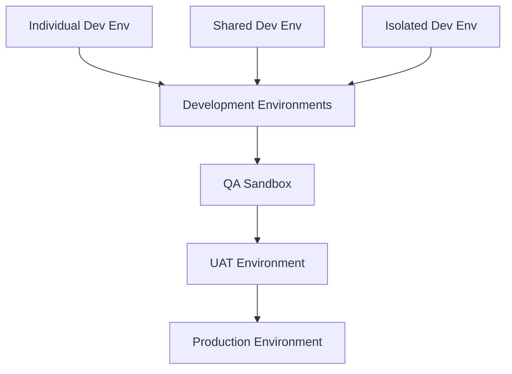

# Towne Park Architecture - ALM and CI/CD Strategy for Power Platform

## Purpose

This document outlines the comprehensive Application Lifecycle Management (ALM) strategy and CI/CD implementation approach for Towne Park's Power Platform solutions and Azure Static Web Apps. It addresses current state challenges and provides a roadmap for implementing proper environment isolation, deployment pipelines, and development workflows.

## Current State Analysis

### Existing CI/CD Limitations

**Critical Issue Identified (February 19, 2025):**
- Two Azure pipelines currently exist:
  1. Development pipeline: Deploys React frontend + API backend to development SWA environment
  2. Production pipeline: Deploys to BOTH release and production environments from master branch

**Key Problems:**
- No ability to deploy release candidates to pre-production environments (TEST, STAGE)
- Production deployment triggered immediately upon master branch merge
- All development, QA, and UAT testing must occur in development environment
- No proper environment isolation for testing phases

### Power Platform Flow Limitations

**Process License Constraints (February 20, 2025):**
- Maximum 25 cloud flows per process-flow with process license
- Current count: 24 flows associated with Statement Generation process
- Additional flows needed for Forecasting system
- Likely need separate Process License for Forecasting business process

## Proposed ALM Strategy

### Environment Architecture

#### Target Environment Structure

**Environment Tiers:**
1. **Development Tier**
   - Individual developer environments (isolated)
   - Shared development environment
   - Daily pristine environment instantiation via build pipeline
   
2. **QA Tier**
   - QA Sandbox environment
   - Automated testing environment
   - Manual testing environment
   
3. **Pre-Production Tier**
   - UAT environment
   - Training environment
   - Performance testing environment
   
4. **Production Tier**
   - Live production environment
   - Disaster recovery environment

### Branching Strategy

**Recommended Git Flow:**
- **Feature Branches**: Individual development work
- **Development Branch**: Integration of feature work
- **Release Branch**: Preparation for production deployment
- **Master Branch**: Production-ready code only

**Key Principles:**
- No direct commits to master branch
- All changes flow through pull requests
- Automated testing at each integration point
- Environment-specific configuration management

### Deployment Pipeline Strategy

#### Option 1: Power Platform Pipelines (Recommended)
- Native Power Platform ALM capabilities
- Integrated with Power Platform environments
- Built-in solution management
- Automated dependency tracking

#### Option 2: Azure DevOps Pipelines
- Greater flexibility and customization
- Integration with existing Azure infrastructure
- Advanced testing and validation capabilities
- Custom deployment logic

### Configuration Migration Strategy

**Configuration Migration Tool Implementation:**
- Capture configuration and test data from source environments
- Source control integration for configuration data
- Automated transport between environments
- Test data automation for validation

**Key Capabilities:**
- Test data capturing and versioning
- Environment-specific configuration management
- Automated testing data deployment
- Configuration drift detection

## Implementation Roadmap

### Phase 1: Environment Setup (Immediate - High Priority)
1. **Create Release Branch**
   - Establish proper branching strategy
   - Configure branch protection rules
   - Set up automated merge policies

2. **QA Sandbox Creation**
   - Deploy QA environment alongside release branch
   - Manual processes acceptable initially
   - Establish environment isolation

3. **Tool Installation and Setup**
   - Install and configure XRMToolbox
   - Set up Configuration Migration tool
   - Establish environment connectivity

### Phase 2: Development Environment Enhancement
1. **Developer Environment Creation**
   - Individual isolated environments for developers
   - Shared development environment for integration
   - Automated environment provisioning

2. **Data Management Strategy**
   - Import production data into development environments
   - Import Power Automate objects and configurations
   - Establish data refresh procedures

### Phase 3: Pipeline Automation
1. **Automated Deployment Pipelines**
   - Development to QA automation
   - QA to UAT automation
   - UAT to Production with approval gates

2. **Testing Integration**
   - Automated unit testing
   - Integration testing frameworks
   - Performance testing automation

### Phase 4: Advanced ALM Features
1. **Configuration Management**
   - Automated configuration drift detection
   - Environment-specific configuration deployment
   - Configuration versioning and rollback

2. **Monitoring and Observability**
   - Deployment success monitoring
   - Environment health checks
   - Performance monitoring integration

## Technical Specifications

### Environment Configuration Requirements

**Development Environments:**
- Isolated Power Platform environments per developer
- Shared development environment for integration testing
- Daily environment refresh capability
- Source control integration

**QA/Testing Environments:**
- Dedicated QA Sandbox environment
- UAT environment with production-like configuration
- Training environment for user acceptance testing
- Performance testing environment

**Production Environment:**
- High availability configuration
- Disaster recovery capabilities
- Monitoring and alerting integration
- Backup and restore procedures

### Security Considerations

**Environment Isolation:**
- Network-level isolation between environments
- Role-based access control per environment
- Service principal authentication for automation
- Audit logging for all environment changes

**Data Protection:**
- Encryption in transit and at rest
- Data masking for non-production environments
- Compliance with data retention policies
- Regular security assessments

### Performance Considerations

**Deployment Performance:**
- Parallel deployment capabilities where possible
- Incremental deployment strategies
- Rollback procedures for failed deployments
- Performance monitoring during deployments

**Environment Performance:**
- Resource allocation per environment tier
- Scaling strategies for load testing
- Performance baseline establishment
- Capacity planning procedures

## Testing Strategy

### Automated Testing Framework
- Unit testing for Power Platform components
- Integration testing for cross-system workflows
- End-to-end testing for complete business processes
- Performance testing for scalability validation

### Manual Testing Procedures
- User acceptance testing in UAT environment
- Security testing and penetration testing
- Compliance testing for regulatory requirements
- Usability testing for end-user workflows

### Test Data Management
- Production data sanitization for lower environments
- Synthetic test data generation
- Test data versioning and management
- Automated test data refresh procedures

## Deployment Considerations

### Deployment Automation
- Infrastructure as Code (IaC) for environment provisioning
- Automated solution deployment via Power Platform pipelines
- Configuration deployment automation
- Database schema migration automation

### Rollback Procedures
- Automated rollback for failed deployments
- Configuration rollback capabilities
- Data rollback procedures where applicable
- Emergency rollback procedures for production issues

### Monitoring and Validation
- Deployment success validation
- Post-deployment health checks
- Performance monitoring after deployments
- User acceptance validation procedures

## Code Validation Report

**Last Validated**: 2025-07-18
**Validation Scope**: Technical Configuration
**Code Copy Date**: Current local copy analysis

### Validation Summary
- ✅ **Verified Elements**: 0 items (no direct code validation applicable)
- ⚠️ **Discrepancies Found**: 0 items
- ❓ **Incomplete Documentation**: 0 items
- 🔍 **Requires Review**: 1 item needs stakeholder verification

### Detailed Validation Results

#### Configuration Validation: Environment Strategy
**Documented Element**: "Multiple environment strategy with development, QA, UAT, and production tiers"
**Validation Status**: 🔍 **REQUIRES_REVIEW** - Environment strategy needs validation against current Power Platform setup
**Findings**: The proposed environment architecture should be validated against current Power Platform tenant configuration and licensing constraints
**Recommendations**: Review current environment setup and validate proposed architecture with Power Platform administrators

### Code File References
- No direct code files applicable for this architectural strategy document
- Configuration validation would require access to Power Platform admin center and Azure DevOps configurations

### Validation Methodology
- **Code Copy Date**: N/A - Architectural strategy document
- **Validation Approach**: Conceptual validation against documented requirements
- **Limitations**: Requires validation against live Power Platform and Azure configurations

## Related Documentation

- [Power Platform Licensing Analysis](../configuration/20250718_Architecture_LicensingAnalysis_PowerPlatform.md) 🔄 PLANNED
- [Integration Architecture Strategy](../integrations/20250718_Architecture_IntegrationStrategy_HybridConnections.md) ✓ VERIFIED
- [Billing System Overview](../../systems/billing/20250716_Billing_SystemOverview_PowerBill.md) ✓ VERIFIED
- [Forecasting System Overview](../../systems/forecasting/20250716_Forecasting_SystemOverview_Integrated.md) ✓ VERIFIED

## Action Items and Next Steps

### Immediate Actions (High Priority)
1. Create release branch and configure branch protection
2. Establish QA Sandbox environment
3. Install and configure XRMToolbox and Configuration Migration tool
4. Schedule internal sync to review environment architecture diagram

### Short-term Actions (Next Sprint)
1. Create individual developer environments
2. Import production data into development environments
3. Establish automated backup and restore procedures
4. Implement basic deployment automation

### Long-term Actions (Future Sprints)
1. Implement full CI/CD pipeline automation
2. Establish comprehensive testing framework
3. Implement advanced monitoring and observability
4. Optimize performance and scalability

## Stakeholder Review Requirements

**Technical Review Required:**
- Environment architecture validation with Power Platform administrators
- Azure infrastructure review with cloud architects
- Security review with information security team
- Compliance review with regulatory team

**Business Review Required:**
- Cost analysis for additional environments and licensing
- Timeline validation with project management
- Resource allocation review with development team
- Training requirements assessment with user community
## Quick Links

- [Integration Architecture Strategy](../integrations/20250718_Architecture_IntegrationStrategy_HybridConnections.md)
- [Billing System Overview](../../systems/billing/20250716_Billing_SystemOverview_PowerBill.md)
- [Forecasting System Overview](../../systems/forecasting/20250716_Forecasting_SystemOverview_Integrated.md)
