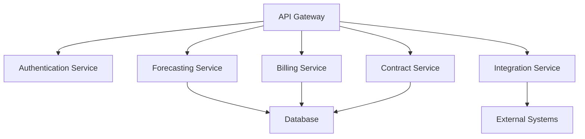
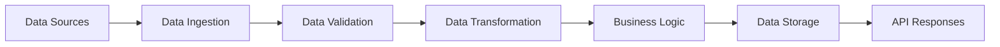

# Backend Technical Documentation

## Overview

This section contains comprehensive backend technical documentation covering server-side development, API architecture, system integration, and backend implementation details for all Towne Park financial systems.

## Core Backend Documentation

### [ALM Strategy for Power Platform](20250718_Architecture_ALMStrategy_PowerPlatform.md)
Comprehensive Application Lifecycle Management strategy for Power Platform development.

**Key Areas:**
- Development lifecycle management
- Environment management and promotion
- Version control and branching strategies
- Automated testing and deployment
- Release management and governance

### [AI Integration Technical Specification](20250718_Development_AIIntegration_TechnicalSpec.md)
Technical specification for AI integration capabilities and implementation.

**Key Areas:**
- AI service integration patterns
- Natural language processing capabilities
- Machine learning model integration
- Data processing and analysis
- Performance optimization for AI workloads

### [Forecasting Technical Architecture & API Design](20250718_Forecasting_TechnicalArchitecture_APIDesign.md)
Comprehensive technical architecture and API design for the forecasting system.

**Key Areas:**
- RESTful API architecture and design
- Microservices architecture patterns
- Authentication and authorization systems
- Performance optimization strategies
- Integration patterns and protocols

### [Billing Technical Architecture](20250716_Billing_TechnicalArchitecture_Development.md)
Technical architecture and development documentation for the billing system.

**Key Areas:**
- System architecture and design patterns
- Data processing and calculation logic
- Integration with external systems
- Performance optimization techniques
- Security and compliance considerations

## API Architecture

### RESTful API Design
The backend systems follow RESTful API design principles with consistent patterns:

**API Structure:**
```
/api/v1/
├── /forecasting/
│   ├── /statistics/
│   ├── /payroll/
│   ├── /rates/
│   └── /pl-view/
├── /billing/
│   ├── /invoices/
│   ├── /contracts/
│   └── /customers/
├── /contracts/
│   ├── /management/
│   └── /escalations/
└── /common/
    ├── /users/
    ├── /sites/
    └── /reports/
```

### API Design Principles
- **Resource-Based URLs**: Clear, hierarchical resource naming
- **HTTP Methods**: Proper use of GET, POST, PUT, DELETE methods
- **Status Codes**: Appropriate HTTP status codes for different scenarios
- **JSON Data Format**: Consistent JSON request/response structures
- **Versioning**: API versioning for backward compatibility

## System Architecture

### Microservices Architecture
The backend systems are designed using microservices patterns:

**Core Services:**
- **Authentication Service**: User authentication and authorization
- **Forecasting Service**: Forecasting calculations and data management
- **Billing Service**: Invoice generation and billing operations
- **Contract Service**: Contract management and configuration
- **Integration Service**: External system integration and data flows

### Service Communication


## Authentication and Security

### OAuth 2.0 Implementation
- **Authorization Code Flow**: Standard OAuth 2.0 flow for user authentication
- **JWT Tokens**: JSON Web Tokens for stateless authentication
- **Role-Based Access Control**: Granular permissions based on user roles
- **Token Management**: Secure token storage and refresh mechanisms

### Security Framework
- **Input Validation**: Comprehensive input validation and sanitization
- **SQL Injection Prevention**: Parameterized queries and ORM usage
- **XSS Protection**: Cross-site scripting prevention measures
- **CSRF Protection**: Cross-site request forgery protection
- **Data Encryption**: End-to-end encryption for sensitive data

## Data Processing and Integration

### Data Integration Patterns
- **API Integration**: RESTful API calls for real-time data exchange
- **Message Queues**: Asynchronous processing using message queues
- **ETL Processes**: Extract, transform, and load operations
- **Event-Driven Architecture**: Event-based system communication

### Data Processing Pipeline


## Performance Optimization

### Caching Strategies
- **Application Caching**: In-memory caching for frequently accessed data
- **Database Caching**: Query result caching for performance
- **API Response Caching**: HTTP caching for API responses
- **CDN Integration**: Content delivery network for static assets

### Performance Monitoring
- **Response Time Monitoring**: API response time tracking
- **Throughput Monitoring**: Request processing capacity monitoring
- **Error Rate Monitoring**: Error rate tracking and alerting
- **Resource Utilization**: CPU, memory, and storage monitoring

## Database Integration

### Database Connectivity
- **Connection Pooling**: Efficient database connection management
- **Query Optimization**: Optimized database queries and indexes
- **Transaction Management**: ACID compliance and transaction handling
- **Data Consistency**: Maintaining data consistency across services

### Data Access Patterns
- **Repository Pattern**: Data access layer abstraction
- **Unit of Work**: Transaction coordination across multiple operations
- **Lazy Loading**: Efficient data loading strategies
- **Bulk Operations**: Optimized bulk data operations

## Error Handling and Logging

### Error Handling Framework
- **Structured Error Responses**: Consistent error response format
- **Error Classification**: Categorization of different error types
- **Retry Logic**: Automatic retry mechanisms for transient failures
- **Graceful Degradation**: Fallback mechanisms for service failures

### Logging and Monitoring
- **Structured Logging**: JSON-formatted log messages
- **Centralized Logging**: Aggregated logging across all services
- **Log Analysis**: Automated log analysis and alerting
- **Performance Metrics**: Comprehensive performance monitoring

## Development Standards

### Code Quality Standards
- **Code Reviews**: Mandatory peer review process
- **Unit Testing**: Comprehensive unit test coverage
- **Integration Testing**: End-to-end integration testing
- **Performance Testing**: Load and performance testing
- **Security Testing**: Security vulnerability testing

### Development Tools
- **IDE Configuration**: Standardized development environment setup
- **Build Tools**: Automated build and packaging tools
- **Testing Frameworks**: Standardized testing frameworks
- **Code Analysis**: Static code analysis and quality tools
- **Documentation**: Automated API documentation generation

## Deployment and DevOps

### CI/CD Pipeline
- **Source Control**: Git-based version control
- **Build Automation**: Automated build and testing
- **Deployment Automation**: Automated deployment to environments
- **Environment Management**: Consistent environment configuration
- **Rollback Procedures**: Automated rollback capabilities

### Monitoring and Alerting
- **Application Monitoring**: Application performance monitoring
- **Infrastructure Monitoring**: Infrastructure health monitoring
- **Business Metrics**: Business-specific metrics and KPIs
- **Alerting**: Proactive alerting and incident response
- **Dashboards**: Real-time monitoring dashboards

## Related Documentation

- [Technical Architecture](../index.md)
- [Database Documentation](../database/index.md)
- [Integration Strategy](../integrations/20250718_Architecture_IntegrationStrategy_HybridConnections.md)
- [System Configuration](../../configuration/index.md)

## Quick Links

- [Development Standards](../../configuration/system-settings/20250718_Development_Standards_ComprehensiveGuide.md)
- [Power Platform Licensing](../../configuration/system-settings/20250718_Architecture_LicensingAnalysis_PowerPlatform.md)
- [Definition of Done](../../configuration/system-settings/20250718_Development_DefinitionOfDone_ComprehensiveGuide.md)
- [Data Sources](../database/20250716_Forecasting_DataSources_TechnicalSpec.md)
