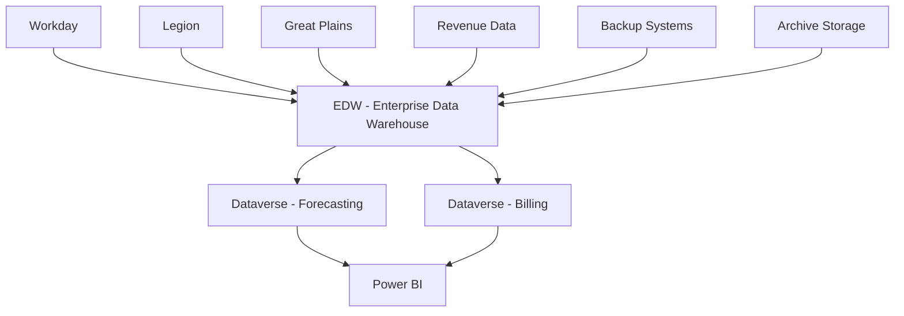

# Database Technical Documentation

## Overview

This section contains comprehensive database technical documentation covering architecture, schema design, integration patterns, and data management for all Towne Park financial systems.

## Database Architecture

### Core Database Systems
- **Microsoft Dataverse**: Primary data platform for Power Platform applications
- **Enterprise Data Warehouse (EDW)**: SQL Server-based central data repository
- **Operational Databases**: System-specific databases for specialized functions

### Data Architecture Overview

## Technical Specifications

### [Forecasting Database Integration](20250718_Forecasting_DatabaseIntegration_TechnicalSpec.md)
Comprehensive technical specification for forecasting system database integration.

**Key Areas:**
- Database connectivity and optimization
- Integration patterns and protocols
- Performance tuning and optimization
- Data synchronization mechanisms
- Security and access control

### [Forecasting Data Sources](20250716_Forecasting_DataSources_TechnicalSpec.md)
Technical specifications for forecasting system data sources and integration.

**Key Areas:**
- Data source connectivity
- ETL processes and data flows
- Data transformation and validation
- Real-time and batch processing
- Error handling and recovery

### [Contracts Data Dictionary](20250718_Contracts_DataDictionary_TechnicalSpec.md)
Comprehensive data dictionary for contract management system.

**Key Areas:**
- Entity definitions and relationships
- Data types and constraints
- Business rules and validation
- Index and performance optimization
- Security and access patterns

### [Billable Accounts Technical Specification](20250716_Forecasting_BillableAccounts_TechnicalSpec.md)
Technical specification for billable accounts data management.

**Key Areas:**
- Data model and schema design
- Integration with billing systems
- Calculation and processing logic
- Audit trail and compliance
- Performance optimization

## Database Schema Design

### [Schema Design Principles](schema-design.md)
Core principles and standards for database schema design.

**Design Principles:**
- Normalization and denormalization strategies
- Performance optimization techniques
- Security and access control patterns
- Scalability and maintainability considerations

### [Contracts Data Schema](contracts-data-schema.md)
Detailed schema design for contract management data.

**Schema Components:**
- Contract entity definitions
- Relationship mappings
- Index optimization
- Constraint definitions
- Security models

### [Customer Sites Data Schema](customer-sites-data-schema.md)
Schema design for customer site management data.

**Schema Components:**
- Site entity definitions
- Customer relationship mappings
- Territory and location data
- Operational configuration data
- Integration touchpoints

## Data Integration Patterns

### Real-Time Integration
- **Change Data Capture (CDC)**: Real-time data synchronization
- **Event-Driven Architecture**: Asynchronous data processing
- **API-Based Integration**: RESTful APIs for data exchange
- **Message Queues**: Reliable message processing

### Batch Integration
- **ETL Processes**: Extract, transform, and load operations
- **Scheduled Jobs**: Regular data synchronization
- **Data Validation**: Comprehensive data quality checks
- **Error Recovery**: Robust error handling and retry mechanisms

## Performance Optimization

### Query Optimization
- **Index Strategy**: Optimal index design for performance
- **Query Tuning**: SQL query optimization techniques
- **Execution Plans**: Analysis and optimization of execution plans
- **Statistics Management**: Database statistics maintenance

### Storage Optimization
- **Partitioning**: Table and index partitioning strategies
- **Compression**: Data compression techniques
- **Archiving**: Historical data archiving strategies
- **Capacity Planning**: Storage capacity planning and management

## Data Security and Compliance

### Security Framework
- **Access Control**: Role-based access control (RBAC)
- **Data Encryption**: Encryption at rest and in transit
- **Audit Logging**: Comprehensive audit trail
- **Row-Level Security**: Fine-grained access control

### Compliance Standards
- **Data Privacy**: GDPR and CCPA compliance
- **Financial Regulations**: SOX compliance for financial data
- **Audit Requirements**: Comprehensive audit logging
- **Data Retention**: Data retention and purging policies

## Data Quality Management

### Data Validation
- **Schema Validation**: Structural data validation
- **Business Rules**: Business logic validation
- **Referential Integrity**: Constraint enforcement
- **Data Profiling**: Data quality assessment

### Data Monitoring
- **Quality Metrics**: Data quality measurement
- **Anomaly Detection**: Automated anomaly detection
- **Alerting**: Data quality alerts and notifications
- **Reporting**: Data quality reporting and dashboards

## Backup and Recovery

### Backup Strategy
- **Full Backups**: Complete database backups
- **Incremental Backups**: Incremental backup strategy
- **Transaction Log Backups**: Transaction log management
- **Cross-Region Backups**: Geographic backup distribution

### Recovery Procedures
- **Point-in-Time Recovery**: Granular recovery capabilities
- **Disaster Recovery**: Comprehensive disaster recovery plan
- **High Availability**: High availability architecture
- **Failover Procedures**: Automated failover mechanisms

## Database Administration

### Administrative Tasks
- **User Management**: Database user and role management
- **Performance Monitoring**: Database performance monitoring
- **Maintenance Tasks**: Regular maintenance procedures
- **Capacity Planning**: Database capacity planning

### Monitoring and Alerting
- **Performance Metrics**: Database performance monitoring
- **Health Checks**: Automated health monitoring
- **Alert Configuration**: Proactive alerting setup
- **Reporting**: Administrative reporting and dashboards

## Development Standards

### Database Development
- **Coding Standards**: SQL coding standards and best practices
- **Version Control**: Database version control procedures
- **Testing**: Database testing methodologies
- **Deployment**: Database deployment procedures

### Change Management
- **Schema Changes**: Database schema change management
- **Migration Scripts**: Data migration procedures
- **Rollback Procedures**: Change rollback capabilities
- **Documentation**: Change documentation requirements

## Related Documentation

- [Technical Architecture](../backend/20250718_Forecasting_TechnicalArchitecture_APIDesign.md)
- [Integration Strategy](../integrations/20250718_Architecture_IntegrationStrategy_HybridConnections.md)
- [Business Rules](../../business-rules/index.md)
- [System Configuration](../../configuration/index.md)

## Quick Links

- [Development Standards](../../configuration/system-settings/20250718_Development_Standards_ComprehensiveGuide.md)
- [ALM Strategy](../backend/20250718_Architecture_ALMStrategy_PowerPlatform.md)
- [Power Platform Licensing](../../configuration/system-settings/20250718_Architecture_LicensingAnalysis_PowerPlatform.md)
- [Definition of Done](../../configuration/system-settings/20250718_Development_DefinitionOfDone_ComprehensiveGuide.md)
