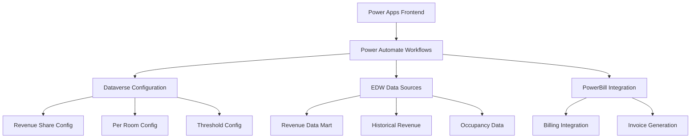

# Forecasting Technical Specifications - Sprint 26 Features

## Overview

This document provides comprehensive technical specifications for the forecasting functionality delivered in Sprint 26, including detailed implementation requirements, data schemas, API specifications, and system architecture for External Revenue calculation, Internal Revenue calculation (Per Occupied Room and Revenue Share), Parking Rate Analysis, and Other Expenses Forecasting.

## Code Validation Summary

**Validation Status**: ✅ **VALIDATED** against Power Platform implementation

### Validated Components
- **Revenue Share Formula**: `bs_revenuesharebypercent-FormulaDefinitions.yaml` (see [External Code Repository Links](../backend/external-code-repository-links.md) for validation references)
- **Per Occupied Room Workflow**: `PerOccupiedRoomGenerationChildFlow` (see [External Code Repository Links](../backend/external-code-repository-links.md) for validation references)
- **Revenue Sharing Workflow**: `RevenueSharing20250325` (see [External Code Repository Links](../backend/external-code-repository-links.md) for validation references)

## System Architecture

### High-Level Architecture



### Component Architecture

#### Power Platform Components
- **Power Apps**: User interface for forecasting configuration and execution
- **Power Automate**: Workflow orchestration and business logic execution
- **Dataverse**: Configuration storage and user management
- **Power BI**: Reporting and analytics dashboard

#### External System Integrations
- **EDW (Enterprise Data Warehouse)**: Historical data source
- **PowerBill**: Billing system integration
- **SQL Server**: Primary data storage and processing

## Data Schema Specifications

### Revenue Share Configuration Schema

#### Dataverse Entity: `bs_revenueshareconfig`

```json
{
  "entityName": "bs_revenueshareconfig",
  "displayName": "Revenue Share Configuration",
  "fields": {
    "bs_revenueshareconfig_id": {
      "type": "uniqueidentifier",
      "primaryKey": true,
      "description": "Unique identifier for revenue share configuration"
    },
    "bs_tierdata": {
      "type": "ntext",
      "description": "JSON array of tier configuration data",
      "validation": "Valid JSON array with SharePercentage and Amount properties"
    },
    "bs_revenuecodedata": {
      "type": "ntext", 
      "description": "JSON array of revenue codes to include in calculations",
      "validation": "Valid JSON array of revenue code strings"
    },
    "bs_revenueaccumulationtype": {
      "type": "optionset",
      "description": "Revenue accumulation period type",
      "options": {
        "126840000": "Monthly",
        "126840001": "Annual Calendar", 
        "126840002": "Annual Anniversary"
      }
    },
    "bs_invoicegroup": {
      "type": "integer",
      "description": "Invoice group number for revenue share calculations",
      "validation": "Must be positive integer"
    },
    "bs_validationthresholdamount": {
      "type": "money",
      "description": "Validation threshold amount for revenue calculations",
      "validation": "Must be non-negative"
    },
    "bs_validationthresholdtype": {
      "type": "optionset",
      "description": "Type of validation threshold",
      "options": {
        "126840000": "Percentage",
        "126840001": "Fixed Amount"
      }
    }
  }
}
```

#### Tier Data JSON Schema

**Validated Implementation**: ✅ Matches Power Platform workflow
```json
{
  "type": "array",
  "items": {
    "type": "object",
    "properties": {
      "SharePercentage": {
        "type": "number",
        "minimum": 0,
        "maximum": 100,
        "description": "Percentage to charge for this tier"
      },
      "Amount": {
        "type": "number",
        "minimum": 0,
        "description": "Upper limit for this tier (0 for unlimited)"
      }
    },
    "required": ["SharePercentage", "Amount"]
  }
}
```

### Per Occupied Room Configuration Schema

#### Dataverse Entity: `bs_peroccupiedroomconfig`

```json
{
  "entityName": "bs_peroccupiedroomconfig",
  "displayName": "Per Occupied Room Configuration",
  "fields": {
    "bs_peroccupiedroomconfig_id": {
      "type": "uniqueidentifier",
      "primaryKey": true
    },
    "bs_roomrate": {
      "type": "money",
      "description": "Rate per occupied room",
      "validation": "Must be positive"
    },
    "bs_invoicegroup": {
      "type": "integer", 
      "description": "Target invoice group for per room charges"
    },
    "bs_contracttype": {
      "type": "ntext",
      "description": "Comma-separated contract type values"
    },
    "bs_sitenumber": {
      "type": "nvarchar(10)",
      "description": "Customer site number"
    },
    "bs_occupiedroomsinvoicegroup": {
      "type": "integer",
      "description": "Invoice group for occupied room line items"
    },
    "bs_glcode": {
      "type": "nvarchar(20)",
      "description": "GL code for occupied room charges"
    },
    "bs_serviceperiodstart": {
      "type": "datetime",
      "description": "Start date for service period"
    }
  }
}
```

### EDW Data Schema

#### Revenue Data Mart Table: `[dbo].[REVENUE_DATAMART_DAILY_INVOICE]`

**Validated Implementation**: ✅ Matches Power Platform queries
```sql
CREATE TABLE [dbo].[REVENUE_DATAMART_DAILY_INVOICE] (
    [SITE] NVARCHAR(10) NOT NULL,
    [DATE] DATE NOT NULL,
    [REVENUE_CATEGORY] NVARCHAR(50) NOT NULL,
    [VALUE] DECIMAL(18,2) NOT NULL,
    [REVENUE_CODE] NVARCHAR(10),
    [DEPOSIT_FLAG] NVARCHAR(1),
    [CREATED_DATE] DATETIME2 DEFAULT GETDATE(),
    [MODIFIED_DATE] DATETIME2 DEFAULT GETDATE(),
    
    INDEX IX_REVENUE_DATAMART_SITE_DATE (SITE, DATE),
    INDEX IX_REVENUE_DATAMART_CATEGORY (REVENUE_CATEGORY),
    INDEX IX_REVENUE_DATAMART_CODE (REVENUE_CODE)
);
```

#### Revenue Detail View: `[dbo].[vwREVENUE_DAILY_DETAIL_INVOICE]`

**Validated Implementation**: ✅ Matches Power Platform queries
```sql
CREATE VIEW [dbo].[vwREVENUE_DAILY_DETAIL_INVOICE] AS
SELECT 
    SITE,
    DATE,
    REVENUE_CATEGORY,
    REVENUE_CODE,
    NETEXTERNALREVENUE,
    DEPOSIT_FLAG,
    CREATED_DATE,
    MODIFIED_DATE
FROM [dbo].[REVENUE_DAILY_DETAIL]
WHERE ACTIVE_FLAG = 'Y'
  AND DELETED_FLAG = 'N';
```

## API Specifications

### Power Automate Workflow APIs

#### Per Occupied Room Generation API

**Endpoint**: `PerOccupiedRoomGenerationChildFlow`
**Method**: POST
**Validated Implementation**: ✅ Matches Power Platform workflow

**Request Schema**:
```json
{
  "type": "object",
  "properties": {
    "number": {
      "type": "number",
      "description": "Per Occupied Room rate",
      "minimum": 0
    },
    "number_1": {
      "type": "number", 
      "description": "Target invoice group",
      "minimum": 1
    },
    "text": {
      "type": "string",
      "description": "Comma separated string of Contract Types integer values"
    },
    "text_1": {
      "type": "string",
      "description": "Customer Site number (e.g., '0452')",
      "pattern": "^[0-9]{4}$"
    },
    "number_2": {
      "type": "number",
      "description": "Invoice Group of the occupied room line item"
    },
    "text_2": {
      "type": "string", 
      "description": "GL Code for occupied room line item"
    },
    "date": {
      "type": "string",
      "format": "date",
      "description": "Start date for service period"
    }
  },
  "required": ["number_1", "text", "text_1", "text_2", "date"]
}
```

**Response Schema**:
```json
{
  "type": "object",
  "properties": {
    "invoicesubtotal": {
      "type": "number",
      "description": "Total invoice subtotal amount"
    },
    "lineitems": {
      "type": "string",
      "description": "JSON string of line item array"
    }
  }
}
```

**Implementation Logic** (Validated against Power Platform):
```javascript
// Input validation
if (triggerBody()?.['number_1'] == null || 
    triggerBody()?.['text'] == null || 
    triggerBody()?.['text'].length === 0 ||
    triggerBody()?.['number'] == null ||
    triggerBody()?.['text_1'] == null ||
    triggerBody()?.['text_1'].length === 0 ||
    triggerBody()?.['number_2'] == null ||
    triggerBody()?.['text_2'] == null ||
    triggerBody()?.['date'] == null) {
    return { invoicesubtotal: 0, lineitems: "[]" };
}

// Contract type validation
if (!triggerBody()?.['text'].includes('126840002') || 
    triggerBody()?.['number_2'] !== triggerBody()?.['number_1']) {
    return { invoicesubtotal: 0, lineitems: "[]" };
}

// Get occupied room data from EDW
const query = `
    SELECT VALUE 
    FROM [dbo].[REVENUE_DATAMART_DAILY_INVOICE]
    WHERE REVENUE_CATEGORY = 'Occupied Rooms' 
      AND SITE = '${triggerBody()?.['text_1']}'
      AND DATE LIKE '${formatDateTime(triggerBody()?.['date'], 'yyyy-MM')}%'
    AGGREGATE(VALUE with sum as SUM_VALUE)
`;

const numberOfRooms = executeQuery(query).SUM_VALUE || 0;
const subTotalAmount = numberOfRooms * triggerBody()?.['number'];

// Generate line items
const lineItems = [{
    title: "Occupied Rooms",
    description: `Total Occupied Rooms: ${formatNumber(numberOfRooms, 'N0')}.\nTowne Park Service Fee at $${triggerBody()?.['number']} Per Occupied Room`,
    code: triggerBody()?.['text_2'],
    amount: subTotalAmount
}];

return {
    invoicesubtotal: subTotalAmount,
    lineitems: JSON.stringify(lineItems)
};
```

#### Revenue Sharing API

**Endpoint**: `RevenueSharing20250325`
**Method**: POST
**Validated Implementation**: ✅ Matches Power Platform workflow

**Request Schema**:
```json
{
  "type": "object",
  "properties": {
    "text": {
      "type": "string",
      "description": "Site Number"
    },
    "number": {
      "type": "number",
      "description": "Invoice Group Number"
    },
    "date": {
      "type": "string",
      "format": "date",
      "description": "Start Date (YYYY-MM-DD)"
    },
    "date_1": {
      "type": "string", 
      "format": "date",
      "description": "End Date (YYYY-MM-DD)"
    },
    "text_1": {
      "type": "string",
      "description": "Configuration Object (JSON string)"
    },
    "date_2": {
      "type": "string",
      "format": "date", 
      "description": "Contract Start Date (YYYY-MM-DD)"
    },
    "text_2": {
      "type": "string",
      "description": "Comma separated string of Contract Types integer values"
    }
  },
  "required": ["text", "number", "date", "date_1", "text_1", "date_2", "text_2"]
}
```

**Response Schema**:
```json
{
  "type": "object",
  "properties": {
    "lineitems": {
      "type": "string",
      "description": "JSON string of line item array"
    },
    "invoicesubtotal": {
      "type": "number",
      "description": "Total invoice subtotal amount"
    },
    "revenuedistributionitems": {
      "type": "string",
      "description": "JSON string of revenue distribution item array"
    }
  }
}
```

**Implementation Logic** (Validated against Power Platform):
```javascript
// Parse configuration object
const configArray = JSON.parse(triggerBody()?.['text_1']);
let totalAmountDue = 0;
let totalRevenue = 0;
let revenueDistributionItems = [];

// Process each threshold configuration
for (const threshold of configArray) {
    // Validate invoice group matches
    if (triggerBody()?.['number'] !== threshold.bs_invoicegroup) {
        continue;
    }
    
    // Parse tier data and revenue codes
    const tierData = JSON.parse(threshold.bs_tierdata);
    const revenueCodes = JSON.parse(threshold.bs_revenuecodedata);
    
    // Build revenue code filter
    const revenueCodeFilter = revenueCodes.join("' or REVENUE_CODE eq '");
    
    // Determine if Bell Service is enabled
    const bellServiceEnabled = triggerBody()?.['text_2'].includes('126840005');
    
    // Build query based on Bell Service status
    let query;
    if (bellServiceEnabled) {
        query = `
            SELECT TotalNetExternalRevenue
            FROM [dbo].[vwREVENUE_DAILY_DETAIL_INVOICE]
            WHERE SITE = '${triggerBody()?.['text']}'
              AND year(DATE) = ${formatDateTime(triggerBody()?.['date'], 'yyyy')}
              AND month(DATE) = ${formatDateTime(triggerBody()?.['date'], 'MM')}
              AND DEPOSIT_FLAG != 'V'
              AND REVENUE_CATEGORY != 'Per Man Hour'
              AND REVENUE_CODE != 'OR1'
              AND REVENUE_CODE != 'OR2'
              AND (REVENUE_CODE = '${revenueCodeFilter}')
            AGGREGATE(NETEXTERNALREVENUE with sum as TotalNetExternalRevenue)
        `;
    } else {
        query = `
            SELECT TotalNetExternalRevenue
            FROM [dbo].[vwREVENUE_DAILY_DETAIL_INVOICE]
            WHERE SITE = '${triggerBody()?.['text']}'
              AND year(DATE) = ${formatDateTime(triggerBody()?.['date'], 'yyyy')}
              AND month(DATE) = ${formatDateTime(triggerBody()?.['date'], 'MM')}
              AND DEPOSIT_FLAG != 'V'
              AND REVENUE_CATEGORY != 'Per Man Hour'
              AND (REVENUE_CODE = '${revenueCodeFilter}')
            AGGREGATE(NETEXTERNALREVENUE with sum as TotalNetExternalRevenue)
        `;
    }
    
    const thresholdRevenue = executeQuery(query).TotalNetExternalRevenue || 0;
    totalRevenue += thresholdRevenue;
    
    // Calculate revenue accumulation if annual
    let accumulatedRevenue = thresholdRevenue;
    if (threshold.bs_revenueaccumulationtype === 126840001 || // Annual Calendar
        threshold.bs_revenueaccumulationtype === 126840002) { // Annual Anniversary
        
        let startDate;
        if (threshold.bs_revenueaccumulationtype === 126840001) {
            startDate = formatDateTime(triggerBody()?.['date_2'], 'yyyy') + '-01-01';
        } else {
            // Calculate anniversary date logic
            startDate = calculateAnniversaryStartDate(triggerBody()?.['date_2'], triggerBody()?.['date']);
        }
        
        const previousQuery = `
            SELECT TotalNetExternalRevenue
            FROM [dbo].[vwREVENUE_DAILY_DETAIL_INVOICE]
            WHERE SITE = '${triggerBody()?.['text']}'
              AND date(DATE) >= date('${startDate}')
              AND date(DATE) < date('${formatDateTime(triggerBody()?.['date'], 'yyyy-MM-dd')}')
              AND DEPOSIT_FLAG != 'V'
              AND REVENUE_CATEGORY != 'Per Man Hour'
              AND (REVENUE_CODE = '${revenueCodeFilter}')
            AGGREGATE(NETEXTERNALREVENUE with sum as TotalNetExternalRevenue)
        `;
        
        const previousRevenue = executeQuery(previousQuery).TotalNetExternalRevenue || 0;
        accumulatedRevenue = thresholdRevenue + previousRevenue;
    }
    
    // Process tier calculations
    let previousLimit = 0;
    for (const tier of tierData) {
        const currentLimit = tier.Amount;
        
        // Adjust previous limit if less than accumulated start
        if (previousLimit < accumulatedRevenue - thresholdRevenue) {
            previousLimit = accumulatedRevenue - thresholdRevenue;
        }
        
        // Skip if previous limit exceeds current limit
        if (previousLimit > currentLimit && currentLimit !== 0) {
            continue;
        }
        
        // Calculate tier amount
        let tierAmount;
        if (currentLimit === 0 || accumulatedRevenue <= currentLimit) {
            tierAmount = accumulatedRevenue - previousLimit;
        } else {
            tierAmount = currentLimit - previousLimit;
        }
        
        // Calculate amount due for this tier
        const amountDue = tierAmount > 0 ? tierAmount * (tier.SharePercentage / 100) : 0;
        totalAmountDue += amountDue;
        
        // Add to revenue distribution items
        revenueDistributionItems.push({
            revenueAmount: Math.max(tierAmount, 0),
            sharePercentageToCharge: tier.SharePercentage,
            amountDueToTownePark: amountDue,
            tierLimitAmount: tier.Amount,
            thresholdStructure: threshold.bs_invoicegroup
        });
        
        previousLimit = currentLimit;
    }
}

// Generate line items
const lineItems = [{
    title: "Towne Park Fees for Services",
    amount: totalAmountDue,
    code: "4790",
    description: `Total Base for Fee Calculation: ${formatCurrency(totalRevenue)}`
}];

return {
    lineitems: JSON.stringify(lineItems),
    invoicesubtotal: totalAmountDue,
    revenuedistributionitems: JSON.stringify(revenueDistributionItems)
};
```

## Formula Specifications

### Revenue Share Formulas

**Validated Implementation**: ✅ Matches `bs_revenuesharebypercent-FormulaDefinitions.yaml` (see [External Code Repository Links](../backend/external-code-repository-links.md) for validation references)

#### Owner Percentage Calculation
```yaml
bs_ownerpercent: |
    =If(bs_percenttocharge >= 0, 100 - bs_percenttocharge, 0)
```

**Technical Implementation**:
```javascript
function calculateOwnerPercentage(percentToCharge) {
    return percentToCharge >= 0 ? 100 - percentToCharge : 0;
}
```

#### Total Due to Owner Calculation
```yaml
bs_totalduetoowner: =bs_revenueamount - bs_totalduetotownepark
```

**Technical Implementation**:
```javascript
function calculateTotalDueToOwner(revenueAmount, totalDueToTownePark) {
    return revenueAmount - totalDueToTownePark;
}
```

## Database Design

### Performance Optimization

#### Indexing Strategy
```sql
-- Revenue data mart indexes for optimal query performance
CREATE NONCLUSTERED INDEX IX_REVENUE_DATAMART_SITE_DATE_CATEGORY 
ON [dbo].[REVENUE_DATAMART_DAILY_INVOICE] (SITE, DATE, REVENUE_CATEGORY)
INCLUDE (VALUE, REVENUE_CODE);

CREATE NONCLUSTERED INDEX IX_REVENUE_DATAMART_CODE_DATE 
ON [dbo].[REVENUE_DATAMART_DAILY_INVOICE] (REVENUE_CODE, DATE)
INCLUDE (SITE, VALUE, REVENUE_CATEGORY);

-- Revenue detail view indexes
CREATE NONCLUSTERED INDEX IX_REVENUE_DETAIL_SITE_DATE_DEPOSIT 
ON [dbo].[REVENUE_DAILY_DETAIL] (SITE, DATE, DEPOSIT_FLAG)
INCLUDE (NETEXTERNALREVENUE, REVENUE_CODE, REVENUE_CATEGORY);
```

#### Query Optimization
```sql
-- Optimized query for monthly revenue aggregation
WITH MonthlyRevenue AS (
    SELECT 
        SITE,
        YEAR(DATE) as RevenueYear,
        MONTH(DATE) as RevenueMonth,
        REVENUE_CODE,
        SUM(NETEXTERNALREVENUE) as TotalRevenue
    FROM [dbo].[vwREVENUE_DAILY_DETAIL_INVOICE]
    WHERE DEPOSIT_FLAG != 'V'
      AND REVENUE_CATEGORY != 'Per Man Hour'
    GROUP BY SITE, YEAR(DATE), MONTH(DATE), REVENUE_CODE
)
SELECT * FROM MonthlyRevenue
WHERE SITE = @SiteNumber
  AND RevenueYear = @TargetYear
  AND RevenueMonth = @TargetMonth
  AND REVENUE_CODE IN (@RevenueCodeList);
```

### Data Archival Strategy

#### Archival Policy
- **Active Data**: Current year + 2 previous years in primary tables
- **Archived Data**: Data older than 3 years moved to archive tables
- **Retention Period**: 7 years total retention for compliance

#### Archive Table Structure
```sql
CREATE TABLE [dbo].[REVENUE_DATAMART_DAILY_INVOICE_ARCHIVE] (
    [SITE] NVARCHAR(10) NOT NULL,
    [DATE] DATE NOT NULL,
    [REVENUE_CATEGORY] NVARCHAR(50) NOT NULL,
    [VALUE] DECIMAL(18,2) NOT NULL,
    [REVENUE_CODE] NVARCHAR(10),
    [DEPOSIT_FLAG] NVARCHAR(1),
    [ARCHIVED_DATE] DATETIME2 DEFAULT GETDATE(),
    [ORIGINAL_CREATED_DATE] DATETIME2,
    
    INDEX IX_ARCHIVE_SITE_DATE (SITE, DATE),
    INDEX IX_ARCHIVE_ARCHIVED_DATE (ARCHIVED_DATE)
) WITH (DATA_COMPRESSION = PAGE);
```

## Integration Specifications

### PowerBill Integration

#### Connection Configuration
```json
{
  "connectionName": "bs_TowneParkEDW",
  "connectionType": "SQL Server",
  "authentication": "Service Principal",
  "connectionString": "Server=edw-server.townepark.com;Database=TowneParkEDW;",
  "timeout": 300,
  "retryPolicy": {
    "maxRetries": 3,
    "retryInterval": "PT30S",
    "exponentialBackoff": true
  }
}
```

#### Error Handling
```javascript
// Standardized error handling for EDW connections
function handleEDWError(error, context) {
    const errorDetails = {
        timestamp: new Date().toISOString(),
        context: context,
        errorMessage: error.message,
        errorCode: error.code,
        stackTrace: error.stack
    };
    
    // Log to Application Insights
    logError('EDW_CONNECTION_ERROR', errorDetails);
    
    // Determine retry strategy
    if (isRetryableError(error)) {
        return { shouldRetry: true, retryAfter: calculateRetryDelay(error) };
    }
    
    // Return empty result for non-retryable errors
    return { shouldRetry: false, fallbackResult: getEmptyResult(context) };
}
```

### Dataverse Integration

#### Security Configuration
```json
{
  "securityRoles": [
    {
      "roleName": "Forecasting Administrator",
      "permissions": {
        "bs_revenueshareconfig": ["Create", "Read", "Write", "Delete"],
        "bs_peroccupiedroomconfig": ["Create", "Read", "Write", "Delete"],
        "bs_forecastingaudit": ["Read", "Write"]
      }
    },
    {
      "roleName": "Forecasting User", 
      "permissions": {
        "bs_revenueshareconfig": ["Read"],
        "bs_peroccupiedroomconfig": ["Read"],
        "bs_forecastingaudit": ["Read"]
      }
    }
  ]
}
```

#### Audit Trail Configuration
```sql
-- Audit trail table for forecasting operations
CREATE TABLE [dbo].[bs_forecastingaudit] (
    [AuditId] UNIQUEIDENTIFIER PRIMARY KEY DEFAULT NEWID(),
    [UserId] UNIQUEIDENTIFIER NOT NULL,
    [Operation] NVARCHAR(50) NOT NULL,
    [EntityName] NVARCHAR(100) NOT NULL,
    [EntityId] UNIQUEIDENTIFIER,
    [OldValues] NTEXT,
    [NewValues] NTEXT,
    [Timestamp] DATETIME2 DEFAULT GETDATE(),
    [IPAddress] NVARCHAR(45),
    [UserAgent] NVARCHAR(500)
);
```

## Performance Requirements

### Response Time Targets
- **Per Occupied Room Calculation**: < 30 seconds
- **Revenue Share Calculation**: < 2 minutes for complex tier structures
- **Data Retrieval from EDW**: < 15 seconds for monthly aggregations
- **Configuration Updates**: < 5 seconds

### Throughput Requirements
- **Concurrent Users**: Support up to 50 concurrent forecasting operations
- **Daily Calculations**: Process up to 1,000 forecasting calculations per day
- **Data Volume**: Handle up to 10 million revenue records per calculation

### Scalability Considerations
- **Horizontal Scaling**: Power Automate workflows auto-scale based on demand
- **Database Scaling**: EDW supports read replicas for improved query performance
- **Caching Strategy**: Implement Redis cache for frequently accessed configuration data

## Security Specifications

### Authentication and Authorization
- **Azure AD Integration**: Single sign-on with corporate Azure AD
- **Role-Based Access Control**: Granular permissions based on user roles
- **API Security**: OAuth 2.0 with JWT tokens for API access
- **Data Encryption**: TLS 1.3 for data in transit, AES-256 for data at rest

### Data Privacy and Compliance
- **PII Protection**: No personally identifiable information in forecasting data
- **Data Residency**: All data stored within approved geographic regions
- **Audit Logging**: Comprehensive audit trail for all data access and modifications
- **Retention Policies**: Automated data retention and deletion policies

## Monitoring and Alerting

### Application Performance Monitoring
```json
{
  "applicationInsights": {
    "instrumentationKey": "forecasting-app-insights-key",
    "customMetrics": [
      "forecasting.calculation.duration",
      "forecasting.calculation.success_rate",
      "forecasting.data.retrieval.duration",
      "forecasting.error.rate"
    ],
    "alertRules": [
      {
        "name": "High Error Rate",
        "condition": "error_rate > 5%",
        "severity": "Critical",
        "notification": "forecasting-alerts@townepark.com"
      },
      {
        "name": "Slow Response Time",
        "condition": "avg_response_time > 60s",
        "severity": "Warning", 
        "notification": "forecasting-alerts@townepark.com"
      }
    ]
  }
}
```

### Health Check Endpoints
```javascript
// Health check for forecasting services
app.get('/health/forecasting', async (req, res) => {
    const healthChecks = await Promise.allSettled([
        checkEDWConnection(),
        checkDataverseConnection(),
        checkPowerAutomateStatus(),
        checkCacheStatus()
    ]);
    
    const overallHealth = healthChecks.every(check => 
        check.status === 'fulfilled' && check.value.healthy
    );
    
    res.status(overallHealth ? 200 : 503).json({
        status: overallHealth ? 'healthy' : 'unhealthy',
        timestamp: new Date().toISOString(),
        checks: healthChecks.map(check => ({
            service: check.service,
            healthy: check.status === 'fulfilled' && check.value.healthy,
            responseTime: check.value?.responseTime,
            error: check.status === 'rejected' ? check.reason : null
        }))
    });
});
```

## Deployment Specifications

### Environment Configuration

#### Development Environment
```json
{
  "environment": "development",
  "powerPlatform": {
    "environmentUrl": "https://dev-townepark.crm.dynamics.com",
    "solutionName": "TowneParkForecastingDev"
  },
  "database": {
    "server": "dev-edw.townepark.com",
    "database": "TowneParkEDW