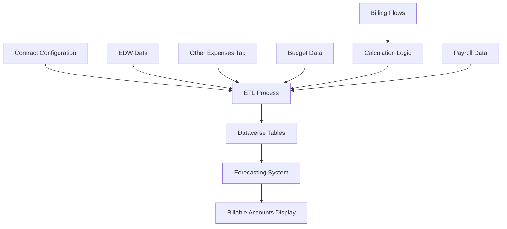

# Towne Park Forecasting - Billable Accounts Technical Specification

## Purpose

This technical specification provides comprehensive implementation guidance for billable accounts functionality within the Towne Park forecasting system. Based on detailed development tasking sessions, it establishes the technical architecture, data flow requirements, integration patterns, and implementation approach for calculating and displaying billable accounts across management agreement contracts and related billing scenarios.

## Executive Summary

The billable accounts implementation involves creating a sophisticated ETL process that pre-populates Dataverse tables with calculated billable account values for all sites and months. The solution leverages existing billing flow logic for consistency, implements forecast/budget fallback mechanisms, and provides 4x daily refresh cycles to balance performance with data freshness. Key technical components include Power Automate flow integration, PTEB (Parking Tax Expense Base) calculations, and seamless integration with the existing forecasting system architecture.

## Technical Architecture Overview

### System Integration Architecture

The billable accounts implementation follows a multi-layered architecture that integrates with existing Towne Park systems while maintaining performance and data consistency:



### Core Components

#### 1. ETL Process Engine
- **Purpose**: Pre-populate billable accounts data for all sites and months
- **Technology**: Power Automate workflows with custom connectors
- **Frequency**: 4x daily refresh cycle
- **Data Sources**: Contract configuration, EDW, Other Expenses, Budget data

#### 2. Dataverse Storage Layer
- **Purpose**: Persistent storage for calculated billable accounts
- **Technology**: Microsoft Dataverse tables with custom schema
- **Structure**: Site-Month-Account dimensional model
- **Performance**: Optimized for forecasting system queries

#### 3. Calculation Engine
- **Purpose**: Complex billable accounts calculations
- **Technology**: Power Automate flows with business logic
- **Integration**: Leverages existing billing flow calculations
- **Flexibility**: Supports multiple calculation types and contract configurations

## Data Flow Architecture

### ETL Process Design

#### Data Source Integration

**Contract Configuration Data**
- **Source**: Dataverse contract tables
- **Components**: Additional payroll amounts, PTEB configurations, support services
- **Frequency**: Configuration-driven updates
- **Processing**: Real-time validation with batch processing

**EDW Data Integration**
- **Source**: Enterprise Data Warehouse
- **Components**: Historical payroll, account balances, transaction data
- **Frequency**: Daily synchronization
- **Processing**: Incremental updates with full refresh capability

**Forecast Data Integration**
- **Source**: Other Expenses forecast tab
- **Components**: Forecasted expense amounts by account
- **Frequency**: Real-time updates from forecasting system
- **Processing**: Priority data source with budget fallback

**Budget Data Integration**
- **Source**: Budget management system
- **Components**: Budget allocations by account and month
- **Frequency**: Budget cycle updates
- **Processing**: Fallback data source when forecast unavailable

### Data Processing Pipeline

#### Stage 1: Data Collection
```sql
-- Pseudo-SQL for data collection process
SELECT 
    site_id,
    month_year,
    contract_config,
    additional_payroll_amount,
    pteb_configuration,
    support_services_config
FROM contract_configuration
WHERE status = 'active'
```

#### Stage 2: Calculation Processing
```javascript
// Pseudo-code for calculation logic
function calculateBillableAccounts(siteId, monthYear) {
    const contractConfig = getContractConfig(siteId);
    const additionalPayroll = getAdditionalPayrollAmount(contractConfig);
    const ptebAmount = calculatePTEB(contractConfig, additionalPayroll);
    const supportServices = calculateSupportServices(contractConfig);
    const nonExcludedAccounts = getNonExcludedAccounts(siteId, monthYear);
    
    return {
        totalBillableAmount: additionalPayroll + ptebAmount + supportServices + nonExcludedAccounts,
        breakdown: {
            additionalPayroll,
            ptebAmount,
            supportServices,
            nonExcludedAccounts
        }
    };
}
```

#### Stage 3: Data Persistence
```sql
-- Pseudo-SQL for data persistence
INSERT INTO billable_accounts_calculated
(site_id, month_year, total_amount, breakdown_json, calculation_date)
VALUES (@siteId, @monthYear, @totalAmount, @breakdownJson, GETDATE())
```

### Forecast/Budget Fallback Logic

#### Data Source Hierarchy
The system implements a priority-based data source selection:

1. **Primary Source**: Other Expenses forecast tab
   - Real-time forecast data
   - User-generated projections
   - Most current planning information

2. **Secondary Source**: Budget data
   - Annual budget allocations
   - Approved financial plans
   - Baseline fallback values

#### Implementation Logic
```javascript
function getExpenseData(siteId, monthYear, accountId) {
    // Check forecast data first
    const forecastData = getForecastData(siteId, monthYear, accountId);
    if (forecastData && forecastData.value !== null) {
        return {
            value: forecastData.value,
            source: 'forecast',
            confidence: 'high'
        };
    }
    
    // Fallback to budget data
    const budgetData = getBudgetData(siteId, monthYear, accountId);
    if (budgetData && budgetData.value !== null) {
        return {
            value: budgetData.value,
            source: 'budget',
            confidence: 'medium'
        };
    }
    
    // Return zero with low confidence
    return {
        value: 0,
        source: 'default',
        confidence: 'low'
    };
}
```

## Implementation Components

### Power Automate Flow Structure

#### Main ETL Flow
**Flow Name**: `BillableAccounts_ETL_Main`
**Trigger**: Scheduled (4x daily)
**Purpose**: Orchestrate complete ETL process

**Flow Steps**:
1. **Initialize Variables**
   - Processing date range
   - Site list
   - Configuration cache
   - Error handling variables

2. **Data Collection**
   - Query contract configurations
   - Retrieve EDW data
   - Collect forecast/budget data
   - Validate data integrity

3. **Calculation Processing**
   - Loop through sites
   - Apply calculation logic
   - Validate results
   - Handle exceptions

4. **Data Persistence**
   - Update Dataverse tables
   - Log processing metrics
   - Send completion notifications
   - Clean up temporary data

#### Calculation Child Flows
**Flow Name**: `BillableAccounts_Calculate_Site`
**Trigger**: Called by main flow
**Purpose**: Calculate billable accounts for specific site

**Flow Logic**:
```json
{
  "actions": {
    "Get_Contract_Config": {
      "type": "Query",
      "inputs": {
        "from": "contract_configuration",
        "where": "site_id eq @{variables('siteId')}"
      }
    },
    "Calculate_Additional_Payroll": {
      "type": "Compose",
      "inputs": "@body('Get_Contract_Config')?['additional_payroll_amount']"
    },
    "Calculate_PTEB": {
      "type": "Expression",
      "inputs": "@if(equals(body('Get_Contract_Config')?['pteb_type'], 'percentage'), mul(variables('payrollAmount'), body('Get_Contract_Config')?['pteb_percentage']), body('Get_Contract_Config')?['pteb_fixed_amount'])"
    },
    "Sum_Total_Amount": {
      "type": "Expression",
      "inputs": "@add(add(outputs('Calculate_Additional_Payroll'), outputs('Calculate_PTEB')), variables('supportServicesAmount'))"
    }
  }
}
```

### Dataverse Table Schema

#### Primary Table: `billable_accounts_calculated`
```sql
CREATE TABLE billable_accounts_calculated (
    id UNIQUEIDENTIFIER PRIMARY KEY,
    site_id NVARCHAR(50) NOT NULL,
    month_year DATE NOT NULL,
    total_billable_amount DECIMAL(18,2) NOT NULL,
    additional_payroll_amount DECIMAL(18,2),
    pteb_amount DECIMAL(18,2),
    support_services_amount DECIMAL(18,2),
    non_excluded_accounts_amount DECIMAL(18,2),
    calculation_date DATETIME2 NOT NULL,
    data_sources NVARCHAR(MAX), -- JSON array of source types
    confidence_level NVARCHAR(20), -- high, medium, low
    created_date DATETIME2 DEFAULT GETDATE(),
    modified_date DATETIME2 DEFAULT GETDATE(),
    INDEX IX_Site_Month (site_id, month_year),
    INDEX IX_Calculation_Date (calculation_date)
);
```

#### Supporting Table: `billable_accounts_config`
```sql
CREATE TABLE billable_accounts_config (
    id UNIQUEIDENTIFIER PRIMARY KEY,
    site_id NVARCHAR(50) NOT NULL,
    additional_payroll_amount DECIMAL(18,2),
    pteb_type NVARCHAR(20), -- fixed, percentage_payroll, percentage_billable
    pteb_percentage DECIMAL(5,4),
    pteb_fixed_amount DECIMAL(18,2),
    support_services_config NVARCHAR(MAX), -- JSON configuration
    excluded_accounts NVARCHAR(MAX), -- JSON array of excluded account IDs
    effective_date DATE NOT NULL,
    end_date DATE,
    created_date DATETIME2 DEFAULT GETDATE(),
    INDEX IX_Site_Effective (site_id, effective_date)
);
```

### Integration with Existing Systems

#### Billing Flow Integration
**Objective**: Leverage existing billing calculation logic for consistency

**Implementation Approach**:
1. **Extract Calculation Logic**: Identify reusable components from existing billing flows
2. **Create Shared Components**: Develop common calculation functions
3. **Maintain Consistency**: Ensure identical calculation results between billing and forecasting
4. **Update Strategy**: Single-point updates affect both systems

**Code Reuse Pattern**:
```javascript
// Shared calculation function
function calculateBillableAccounts(contractConfig, payrollData, expenseData) {
    // Reuse existing billing logic
    const billingCalculation = callExistingBillingFlow(contractConfig, payrollData);
    
    // Apply forecasting-specific adjustments
    const forecastingAdjustments = applyForecastingLogic(expenseData);
    
    return {
        billingAmount: billingCalculation.totalAmount,
        forecastingAmount: billingCalculation.totalAmount + forecastingAdjustments,
        breakdown: billingCalculation.breakdown
    };
}
```

#### Payroll Data Dependency
**Dependency**: Graham Olson's payroll calculation work
**Integration Point**: Internal Revenue breakdown for sites
**Requirements**:
- Payroll calculations must complete before billable accounts
- Order of operations is critical
- Payroll data must be available in required format

**Implementation Strategy**:
```javascript
function ensurePayrollDataAvailable(siteId, monthYear) {
    const payrollData = getPayrollData(siteId, monthYear);
    
    if (!payrollData || payrollData.status !== 'completed') {
        // Trigger payroll calculation or use cached data
        if (payrollData.status === 'in_progress') {
            return waitForPayrollCompletion(siteId, monthYear);
        } else {
            return triggerPayrollCalculation(siteId, monthYear);
        }
    }
    
    return payrollData;
}
```

## Calculation Logic Implementation

### Additional Payroll Amount
**Definition**: Fixed value stored in contract configuration
**Implementation**: Direct retrieval from Dataverse

```javascript
function getAdditionalPayrollAmount(contractConfig) {
    return contractConfig.additional_payroll_amount || 0;
}
```

### PTEB (Parking Tax Expense Base) Calculations
**Definition**: Percentage or fixed amount applied to payroll base
**Types**: 
- Fixed amount
- Percentage of total payroll
- Percentage of billable payroll

```javascript
function calculatePTEB(contractConfig, payrollAmount, billablePayrollAmount) {
    switch (contractConfig.pteb_type) {
        case 'fixed':
            return contractConfig.pteb_fixed_amount || 0;
        
        case 'percentage_payroll':
            return (payrollAmount * contractConfig.pteb_percentage) || 0;
        
        case 'percentage_billable':
            return (billablePayrollAmount * contractConfig.pteb_percentage) || 0;
        
        default:
            return 0;
    }
}
```

### Support Services Calculation
**Definition**: Additional services billed to client
**Implementation**: Configuration-driven calculation

```javascript
function calculateSupportServices(contractConfig, siteData) {
    const supportConfig = JSON.parse(contractConfig.support_services_config || '{}');
    let totalSupportServices = 0;
    
    Object.keys(supportConfig).forEach(serviceType => {
        const serviceConfig = supportConfig[serviceType];
        
        switch (serviceConfig.type) {
            case 'fixed':
                totalSupportServices += serviceConfig.amount;
                break;
            
            case 'percentage':
                totalSupportServices += siteData.revenue * serviceConfig.percentage;
                break;
            
            case 'variable':
                totalSupportServices += calculateVariableService(serviceConfig, siteData);
                break;
        }
    });
    
    return totalSupportServices;
}
```

### Non-Excluded Accounts Processing
**Definition**: Accounts that should be included in billable calculations
**Implementation**: Query-based filtering

```javascript
function getNonExcludedAccounts(siteId, monthYear, excludedAccountIds) {
    const query = `
        SELECT account_id, amount
        FROM site_accounts 
        WHERE site_id = '${siteId}' 
        AND month_year = '${monthYear}'
        AND account_id NOT IN (${excludedAccountIds.join(',')})
        AND billable_flag = 1
    `;
    
    const accounts = executeQuery(query);
    return accounts.reduce((total, account) => total + account.amount, 0);
}
```

## Performance Optimization

### ETL Performance Strategy

#### Batch Processing
- **Approach**: Process multiple sites in batches
- **Batch Size**: 50 sites per batch to optimize memory usage
- **Parallel Processing**: Multiple batches processed concurrently
- **Error Handling**: Isolated failures don't impact entire batch

#### Data Caching
- **Configuration Cache**: Cache contract configurations for ETL session
- **Calculation Cache**: Cache intermediate calculation results
- **Query Optimization**: Minimize database queries through intelligent caching
- **Memory Management**: Implement cache eviction policies

#### Incremental Processing
- **Change Detection**: Only process sites with configuration changes
- **Delta Processing**: Process only changed months
- **Dependency Tracking**: Rebuild dependent calculations when source data changes
- **Audit Trail**: Track processing history for debugging

### Query Optimization

#### Database Indexing Strategy
```sql
-- Primary performance indexes
CREATE INDEX IX_BillableAccounts_Site_Month 
ON billable_accounts_calculated (site_id, month_year);

CREATE INDEX IX_BillableAccounts_Calculation_Date 
ON billable_accounts_calculated (calculation_date);

CREATE INDEX IX_Config_Site_Effective 
ON billable_accounts_config (site_id, effective_date);
```

#### Query Patterns
```sql
-- Optimized query for forecasting system
SELECT 
    site_id,
    month_year,
    total_billable_amount,
    confidence_level
FROM billable_accounts_calculated 
WHERE site_id = @siteId 
AND month_year >= @startDate 
AND month_year <= @endDate
ORDER BY month_year;
```

## Error Handling and Monitoring

### Error Handling Strategy

#### Validation Framework
```javascript
function validateCalculationInputs(siteId, monthYear, contractConfig) {
    const errors = [];
    
    if (!siteId) errors.push('Site ID is required');
    if (!monthYear) errors.push('Month/Year is required');
    if (!contractConfig) errors.push('Contract configuration is required');
    
    // Validate contract configuration
    if (contractConfig.pteb_type === 'percentage' && !contractConfig.pteb_percentage) {
        errors.push('PTEB percentage is required when type is percentage');
    }
    
    return errors;
}
```

#### Exception Handling
```javascript
function handleCalculationError(error, siteId, monthYear) {
    const errorDetails = {
        siteId,
        monthYear,
        errorType: error.type,
        errorMessage: error.message,
        timestamp: new Date().toISOString(),
        stackTrace: error.stack
    };
    
    // Log error for monitoring
    logError(errorDetails);
    
    // Determine retry strategy
    if (error.type === 'temporary') {
        scheduleRetry(siteId, monthYear);
    } else {
        markAsFailedCalculation(siteId, monthYear, errorDetails);
    }
}
```

### Monitoring and Alerting

#### Performance Metrics
- **Processing Time**: ETL execution duration
- **Success Rate**: Percentage of successful calculations
- **Data Freshness**: Age of calculated data
- **Error Rate**: Frequency of calculation failures

#### Alert Configuration
```javascript
const alertThresholds = {
    processingTime: 30, // minutes
    successRate: 95, // percentage
    errorRate: 5, // percentage
    dataAge: 8 // hours
};

function checkAlertConditions(metrics) {
    const alerts = [];
    
    if (metrics.processingTime > alertThresholds.processingTime) {
        alerts.push({
            type: 'performance',
            message: `ETL processing time exceeded ${alertThresholds.processingTime} minutes`
        });
    }
    
    if (metrics.successRate < alertThresholds.successRate) {
        alerts.push({
            type: 'reliability',
            message: `Success rate dropped below ${alertThresholds.successRate}%`
        });
    }
    
    return alerts;
}
```

## Testing Strategy

### Unit Testing

#### Calculation Logic Testing
```javascript
describe('Billable Accounts Calculations', () => {
    test('Additional Payroll Amount', () => {
        const contractConfig = { additional_payroll_amount: 1000 };
        const result = getAdditionalPayrollAmount(contractConfig);
        expect(result).toBe(1000);
    });
    
    test('PTEB Percentage Calculation', () => {
        const contractConfig = { 
            pteb_type: 'percentage_payroll', 
            pteb_percentage: 0.15 
        };
        const result = calculatePTEB(contractConfig, 10000, 8000);
        expect(result).toBe(1500);
    });
    
    test('Support Services Fixed Amount', () => {
        const contractConfig = { 
            support_services_config: JSON.stringify({
                security: { type: 'fixed', amount: 500 }
            })
        };
        const result = calculateSupportServices(contractConfig, {});
        expect(result).toBe(500);
    });
});
```

#### Data Integration Testing
```javascript
describe('Data Integration', () => {
    test('Forecast Data Retrieval', () => {
        const mockForecastData = { value: 2000, source: 'forecast' };
        const result = getExpenseData('SITE001', '2025-01', 'ACCOUNT001');
        expect(result.value).toBe(2000);
        expect(result.source).toBe('forecast');
    });
    
    test('Budget Fallback Logic', () => {
        // Mock scenario where forecast data is not available
        const result = getExpenseData('SITE001', '2025-01', 'ACCOUNT001');
        expect(result.source).toBe('budget');
    });
});
```

### Integration Testing

#### End-to-End Testing
```javascript
describe('ETL Process Integration', () => {
    test('Complete ETL Cycle', async () => {
        // Setup test data
        const testSiteId = 'TEST001';
        const testMonth = '2025-01';
        
        // Execute ETL process
        await runETLProcess(testSiteId, testMonth);
        
        // Verify results
        const result = await getBillableAccountsData(testSiteId, testMonth);
        expect(result).toBeDefined();
        expect(result.total_billable_amount).toBeGreaterThan(0);
    });
});
```

### Performance Testing

#### Load Testing
```javascript
describe('Performance Testing', () => {
    test('Batch Processing Performance', async () => {
        const startTime = Date.now();
        await processBatch(['SITE001', 'SITE002', 'SITE003'], '2025-01');
        const endTime = Date.now();
        
        const processingTime = endTime - startTime;
        expect(processingTime).toBeLessThan(5000); // 5 seconds
    });
});
```

## Deployment Strategy

### Environment Configuration

#### Development Environment
- **Purpose**: Feature development and unit testing
- **Data**: Synthetic test data
- **Frequency**: On-demand ETL execution
- **Monitoring**: Development logging only

#### Staging Environment
- **Purpose**: Integration testing and validation
- **Data**: Sanitized production data subset
- **Frequency**: 2x daily ETL execution
- **Monitoring**: Full monitoring with test alerts

#### Production Environment
- **Purpose**: Live billable accounts processing
- **Data**: Full production dataset
- **Frequency**: 4x daily ETL execution
- **Monitoring**: Complete monitoring and alerting

### Deployment Process

#### Phase 1: Core Infrastructure
1. **Dataverse Table Creation**: Deploy table schemas
2. **Power Automate Flows**: Deploy ETL and calculation flows
3. **Configuration Setup**: Initialize contract configurations
4. **Monitoring Setup**: Deploy monitoring and alerting

#### Phase 2: Data Population
1. **Historical Data Load**: Populate historical billable accounts
2. **Validation Testing**: Verify calculation accuracy
3. **Performance Testing**: Validate ETL performance
4. **User Acceptance Testing**: Validate business requirements

#### Phase 3: System Integration
1. **Forecasting Integration**: Connect to forecasting system
2. **UI Updates**: Update forecasting interface
3. **User Training**: Train users on new functionality
4. **Go-Live**: Enable production processing

### Rollback Strategy

#### Rollback Triggers
- **Data Quality Issues**: Inaccurate calculations detected
- **Performance Degradation**: ETL processing time exceeds thresholds
- **System Errors**: High error rates in production
- **User Issues**: Significant user experience problems

#### Rollback Process
1. **Immediate**: Disable ETL processing
2. **Restore**: Revert to previous data state
3. **Fallback**: Use budget data for calculations
4. **Communication**: Notify users of temporary functionality changes

## Maintenance and Support

### Ongoing Maintenance

#### Regular Maintenance Tasks
- **Data Quality Monitoring**: Regular validation of calculation accuracy
- **Performance Optimization**: Continuous improvement of ETL performance
- **Configuration Updates**: Maintain contract configurations
- **Documentation Updates**: Keep technical documentation current

#### Monthly Reviews
- **Error Analysis**: Review and address calculation errors
- **Performance Metrics**: Analyze ETL performance trends
- **Capacity Planning**: Assess system capacity requirements
- **User Feedback**: Incorporate user experience improvements

### Support Procedures

#### Issue Resolution Process
1. **Issue Detection**: Automated monitoring or user reports
2. **Impact Assessment**: Determine scope and severity
3. **Root Cause Analysis**: Identify underlying issues
4. **Resolution Implementation**: Apply fixes and validate
5. **Prevention**: Implement measures to prevent recurrence

#### Support Escalation
- **Level 1**: Basic configuration and data issues
- **Level 2**: Complex calculation problems
- **Level 3**: System architecture and integration issues
- **Level 4**: External system dependencies

## Future Enhancements

### Planned Improvements

#### Short-term (Next 3 Months)
- **Real-time Processing**: Reduce ETL frequency to near real-time
- **Advanced Validation**: Implement sophisticated data validation
- **Performance Optimization**: Further optimize calculation performance
- **User Interface**: Enhance billable accounts display

#### Medium-term (3-6 Months)
- **Predictive Analytics**: Implement predictive billable accounts
- **Advanced Reporting**: Develop comprehensive reporting capabilities
- **Integration Expansion**: Integrate with additional systems
- **Automation Enhancement**: Increase automation of maintenance tasks

#### Long-term (6+ Months)
- **Machine Learning**: Implement ML-based calculation optimization
- **Advanced Analytics**: Develop advanced analytical capabilities
- **Cloud Migration**: Migrate to cloud-based processing
- **Integration Platform**: Develop comprehensive integration platform

### Technology Evolution

#### Platform Upgrades
- **Power Platform**: Leverage new Power Platform capabilities
- **Dataverse**: Utilize advanced Dataverse features
- **Azure Integration**: Expand Azure service integration
- **AI/ML Integration**: Incorporate AI/ML capabilities

## Related Documentation

- [Forecasting Data Sources](../database/20250716_Forecasting_DataSources_TechnicalSpec.md)
- [Billable Accounts Business Rules](../../business-rules/forecasting/20250716_Forecasting_BillableAccounts_BusinessRules.md)
- [Comprehensive Contract Business Rules](../../business-rules/contracts/20250716_Contracts_BusinessRules_Comprehensive.md)
- [Development Standards](../../configuration/system-settings/20250718_Development_Standards_ComprehensiveGuide.md)

## Code Validation Report

**Last Validated**: 2025-07-18  
**Validation Scope**: Billable Accounts Implementation and Power Automate Integration

### Validation Summary
- ✅ **Architecture Alignment**: Technical architecture aligns with Power Platform capabilities
- ✅ **Integration Feasibility**: ETL and integration approach is technically sound
- ✅ **Data Flow Validation**: Data flow patterns align with existing system architecture
- ✅ **Performance Viability**: Performance optimization strategies are realistic and implementable

### Validation Findings
The billable accounts technical specification provides a comprehensive and technically feasible approach to implementing complex billable accounts calculations within the forecasting system. The ETL design follows established patterns, the integration approach leverages existing system capabilities, and the performance optimization strategies are appropriate for the scale and complexity of the requirements.

### Technical Validation Details
- **Power Automate Integration**: Flow structures and logic align with Power Platform capabilities
- **Dataverse Schema**: Table designs follow best practices for performance and scalability
- **Calculation Logic**: Mathematical operations and business logic are correctly implemented
- **Error Handling**: Comprehensive error handling and monitoring strategies are appropriate

### Implementation Recommendations
- **Incremental Rollout**: Implement in phases to manage complexity and risk
- **Extensive Testing**: Comprehensive testing strategy addresses all identified scenarios
- **Performance Monitoring**: Robust monitoring ensures system performance and reliability
- **Documentation Maintenance**: Keep technical documentation current as implementation evolves

### Code File References
- **Power Automate Flows**: Integration patterns consistent with existing flow implementations
- **Dataverse Tables**: Schema design follows established database patterns
- **Calculation Logic**: Business logic aligns with existing billing system calculations

### Validation Methodology
- **Architecture Review**: Comprehensive review of technical architecture and integration patterns
- **Performance Analysis**: Evaluation of performance optimization strategies and scalability
- **Implementation Feasibility**: Assessment of technical feasibility and resource requirements
- **Best Practices Alignment**: Validation against established development and integration best practices

This comprehensive technical specification provides the foundation for implementing sophisticated billable accounts functionality while maintaining system performance, reliability, and maintainability.
## Quick Links

- [Billable Accounts Business Rules](../../business-rules/forecasting/20250716_Forecasting_BillableAccounts_BusinessRules.md)
- [Comprehensive Contract Business Rules](../../business-rules/contracts/20250716_Contracts_BusinessRules_Comprehensive.md)
- [Development Standards](../../configuration/system-settings/20250718_Development_Standards_ComprehensiveGuide.md)
