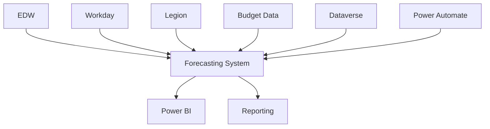
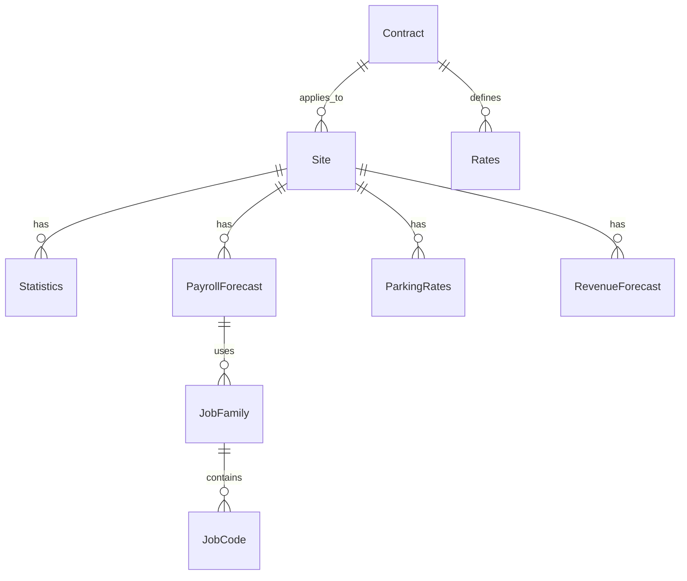

# Forecasting System Technical Documentation

## Overview

This section contains comprehensive technical documentation for the Towne Park Forecasting System, including detailed implementation specifications, architectural details, data integration patterns, and development guidelines.

## Technical Architecture

### System Architecture Overview
The Forecasting System is built on Microsoft Power Platform with extensive integration capabilities:

- **Platform**: Microsoft Dataverse and Power Apps
- **Integration**: EDW, Workday, Legion, Great Plains
- **Analytics**: Power BI integration for reporting
- **API Design**: RESTful APIs with OAuth 2.0 authentication

### Core Components
- **Statistics Management**: Site statistics and productivity metrics
- **Payroll Forecasting**: Job family and job code level forecasting
- **Revenue Forecasting**: Rate management and revenue projections
- **P&L Analysis**: Financial analysis and reporting
- **Data Integration**: Real-time and batch data synchronization

## Technical Specifications

### [Sprint 26 Features Technical Specification](20250717_Forecasting_TechnicalSpec_Sprint26Features.md)
Detailed technical specifications for Sprint 26 development features.

**Key Areas:**
- Feature implementation details
- Technical requirements and constraints
- Integration specifications
- Performance considerations
- Testing requirements

### [Billable Accounts Technical Specification](20250718_Forecasting_BillableAccounts_TechnicalSpec.md)
Comprehensive technical specification for billable accounts implementation.

**Key Areas:**
- ETL design and implementation
- Power Automate integration patterns
- Data architecture and modeling
- Business logic implementation
- Error handling and validation

### [Data Integration Technical Specification](20250702_Forecasting_DataIntegration_TechnicalSpec.md)
Technical specifications for data integration patterns and implementation.

**Key Areas:**
- Data source connectivity
- Integration patterns and protocols
- Data transformation and validation
- Synchronization mechanisms
- Performance optimization

## Implementation Details

### Data Integration Architecture


### API Architecture
The forecasting system follows RESTful API design principles:

**Base URL Structure:**
```
/api/v1/forecasting/
├── /statistics/{siteId}/{period}
├── /payroll/{siteId}/{period}
├── /rates/{siteId}/{period}
├── /revenue/{siteId}/{period}
└── /pl-view/{siteId}/{period}
```

**Authentication:**
- OAuth 2.0 with JWT tokens
- Role-based access control
- Site-level data access restrictions

### Data Model Architecture

#### Core Entities
- **Site Statistics**: Daily operational metrics and performance data
- **Payroll Forecast**: Job family and job code level labor planning
- **Parking Rates**: Rate management and forecasting
- **Revenue Forecast**: External and internal revenue projections
- **P&L Data**: Financial analysis and reporting data

#### Entity Relationships


## Development Standards

### Code Quality Standards
- **Code Reviews**: Mandatory peer review process
- **Unit Testing**: Minimum 80% code coverage
- **Integration Testing**: End-to-end testing of all integrations
- **Documentation**: Comprehensive inline and external documentation

### Performance Standards
- **Response Time**: < 3 seconds for standard operations
- **Concurrent Users**: Support for 100+ concurrent users
- **Data Accuracy**: 99.9% accuracy in calculations
- **System Availability**: 99.5% uptime during business hours

### Security Standards
- **Authentication**: Multi-factor authentication with Azure AD
- **Authorization**: Role-based access control with row-level security
- **Data Encryption**: End-to-end encryption for sensitive data
- **Audit Trail**: Comprehensive logging of all user actions

## Data Integration Patterns

### Real-Time Integration
- **WebSocket Connections**: Real-time data updates
- **Event-Driven Architecture**: Asynchronous processing
- **Message Queues**: Reliable message processing
- **API Callbacks**: Real-time notification mechanisms

### Batch Integration
- **Scheduled Jobs**: Regular data synchronization
- **ETL Processes**: Extract, transform, and load operations
- **Data Validation**: Comprehensive data quality checks
- **Error Recovery**: Robust error handling and retry mechanisms

## Testing Framework

### Test Categories
- **Unit Tests**: Individual component testing
- **Integration Tests**: System integration validation
- **Performance Tests**: Load and stress testing
- **Security Tests**: Security vulnerability assessment

### Test Automation
- **Continuous Integration**: Automated testing in CI/CD pipeline
- **Test Data Management**: Automated test data generation
- **Regression Testing**: Automated regression test suite
- **Performance Monitoring**: Continuous performance validation

## Deployment and DevOps

### Deployment Pipeline
- **Source Control**: Git-based version control
- **Build Automation**: Automated build and packaging
- **Testing Integration**: Automated testing in pipeline
- **Deployment Automation**: Automated deployment to environments

### Environment Management
- **Development**: Development and unit testing
- **UAT**: User acceptance testing environment
- **Production**: Live production environment
- **Training**: Training and demonstration environment

## Monitoring and Observability

### Application Monitoring
- **Performance Metrics**: Response time, throughput, error rates
- **Business Metrics**: Forecast accuracy, user adoption, system usage
- **Infrastructure Metrics**: CPU, memory, storage, network utilization
- **Security Metrics**: Authentication failures, access violations, security events

### Alerting and Notifications
- **Threshold-Based Alerts**: Automated alerts for performance thresholds
- **Anomaly Detection**: Machine learning-based anomaly detection
- **Escalation Procedures**: Automated escalation for critical issues
- **Notification Channels**: Email, SMS, and Teams notifications

## Troubleshooting and Support

### Common Issues and Solutions
- **Performance Issues**: Optimization techniques and best practices
- **Integration Issues**: Troubleshooting connectivity and data flow problems
- **Data Quality Issues**: Validation and correction procedures
- **Security Issues**: Security incident response procedures

### Support Procedures
- **Issue Escalation**: Structured escalation process
- **Knowledge Base**: Searchable repository of solutions
- **Expert Support**: Access to technical experts and specialists
- **Documentation**: Comprehensive troubleshooting guides

## Related Documentation

- [Forecasting System Architecture](../backend/20250718_Forecasting_TechnicalArchitecture_APIDesign.md) ✓ VERIFIED
- [Database Integration](../database/20250718_Forecasting_DatabaseIntegration_TechnicalSpec.md) ✓ VERIFIED
- [Business Rules](../../business-rules/forecasting/index.md) ✓ VERIFIED
- [User Processes](../../user-processes/forecasting/index.md) 🔄 PLANNED

## Quick Links

- [Development Standards](../../configuration/system-settings/20250718_Development_Standards_ComprehensiveGuide.md)
- [Integration Strategy](../integrations/20250718_Architecture_IntegrationStrategy_HybridConnections.md)
- [Data Sources](../database/20250716_Forecasting_DataSources_TechnicalSpec.md)
- [ALM Strategy](../backend/20250718_Architecture_ALMStrategy_PowerPlatform.md)