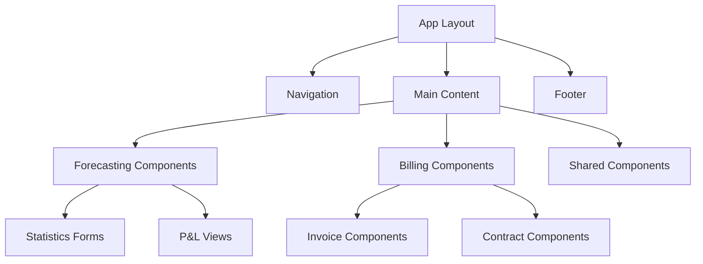

# Frontend Technical Documentation

## Overview

This section contains comprehensive frontend technical documentation covering client-side development, user interface design, responsive frameworks, and frontend implementation details for all Towne Park financial systems.

## Frontend Architecture

### Technology Stack
- **Power Apps**: Primary application development platform
- **React Components**: Custom component development
- **HTML5/CSS3**: Modern web standards
- **JavaScript/TypeScript**: Client-side scripting
- **Responsive Design**: Mobile-first design approach

### Component Architecture

## User Interface Design

### Design System
- **Design Tokens**: Consistent color palette, typography, and spacing
- **Component Library**: Reusable UI components
- **Icon System**: Standardized iconography
- **Responsive Grid**: Flexible layout system
- **Accessibility**: WCAG 2.1 AA compliance

### Component Categories
- **Layout Components**: Headers, footers, navigation, sidebars
- **Form Components**: Input fields, dropdowns, checkboxes, buttons
- **Data Display**: Tables, charts, dashboards, reports
- **Navigation Components**: Menus, breadcrumbs, pagination
- **Feedback Components**: Alerts, notifications, loading states

## Power Apps Development

### Canvas App Architecture
- **Screen Navigation**: Structured navigation patterns
- **Data Connections**: Integration with Dataverse and external APIs
- **Formula Logic**: Power Fx formulas for business logic
- **Component Reusability**: Custom components for common functionality
- **Performance Optimization**: Efficient data loading and caching

### Model-Driven App Design
- **Entity Forms**: Customized forms for data entry
- **Views and Dashboards**: Data visualization and reporting
- **Business Process Flows**: Guided user workflows
- **Custom Controls**: Enhanced user interface controls
- **Security Model**: Role-based access and field-level security

## Responsive Design

### Breakpoint System
- **Mobile**: 320px - 767px
- **Tablet**: 768px - 1023px
- **Desktop**: 1024px - 1439px
- **Large Desktop**: 1440px+

### Responsive Patterns
- **Progressive Enhancement**: Mobile-first approach
- **Flexible Grids**: CSS Grid and Flexbox layouts
- **Responsive Images**: Optimized images for different screen sizes
- **Touch-Friendly**: Touch-optimized interface elements
- **Adaptive Content**: Content adaptation for different screen sizes

## User Experience Design

### UX Principles
- **User-Centered Design**: Design focused on user needs and workflows
- **Simplicity**: Clean, intuitive interfaces
- **Consistency**: Uniform design patterns across applications
- **Accessibility**: Inclusive design for all users
- **Performance**: Fast, responsive user experience

### Interaction Design
- **Navigation Patterns**: Clear, logical navigation structure
- **Form Design**: Efficient data entry with validation
- **Data Visualization**: Clear, meaningful data presentation
- **Error Handling**: User-friendly error messages and recovery
- **Loading States**: Appropriate loading indicators and feedback

## Performance Optimization

### Frontend Performance
- **Code Splitting**: Lazy loading of application modules
- **Asset Optimization**: Minified CSS and JavaScript
- **Image Optimization**: Compressed and responsive images
- **Caching Strategies**: Browser caching and service workers
- **Bundle Optimization**: Optimized application bundles

### Power Apps Performance
- **Delegation**: Efficient data delegation to data sources
- **Concurrent Operations**: Parallel data loading
- **Formula Optimization**: Efficient Power Fx formulas
- **Control Optimization**: Optimized control usage
- **Memory Management**: Efficient memory usage patterns

## Accessibility

### WCAG Compliance
- **Keyboard Navigation**: Full keyboard accessibility
- **Screen Reader Support**: Proper ARIA labels and descriptions
- **Color Contrast**: Sufficient color contrast ratios
- **Focus Management**: Clear focus indicators and management
- **Alternative Text**: Descriptive alternative text for images

### Accessibility Features
- **High Contrast Mode**: Support for high contrast themes
- **Font Size Options**: Adjustable font sizes
- **Reduced Motion**: Respect for motion preferences
- **Language Support**: Multi-language support and localization
- **Assistive Technology**: Compatibility with assistive technologies

## Data Visualization

### Chart Types
- **Line Charts**: Trend analysis and time series data
- **Bar Charts**: Comparative data visualization
- **Pie Charts**: Proportional data representation
- **Dashboard Widgets**: Key performance indicators
- **Interactive Charts**: Drill-down and filtering capabilities

### Visualization Principles
- **Data Clarity**: Clear, accurate data representation
- **Visual Hierarchy**: Logical organization of information
- **Color Usage**: Meaningful use of color for data categorization
- **Interactivity**: User-friendly interaction patterns
- **Responsive Design**: Charts that adapt to screen size

## Form Design and Validation

### Form Architecture
- **Progressive Disclosure**: Layered information display
- **Field Validation**: Real-time validation feedback
- **Error Handling**: Clear error messages and recovery
- **Auto-Save**: Automatic saving of form data
- **Wizard Patterns**: Multi-step form workflows

### Validation Patterns
- **Client-Side Validation**: Immediate feedback for user input
- **Server-Side Validation**: Comprehensive data validation
- **Business Rule Validation**: Custom business logic validation
- **Cross-Field Validation**: Validation across multiple fields
- **Async Validation**: Real-time validation with external systems

## State Management

### Application State
- **Component State**: Local component state management
- **Global State**: Application-wide state management
- **Session State**: User session and authentication state
- **Cache Management**: Efficient data caching strategies
- **Offline Support**: Offline functionality and data synchronization

### Data Flow Patterns
- **Unidirectional Data Flow**: Predictable data flow patterns
- **Event-Driven Updates**: Event-based state updates
- **Optimistic Updates**: Immediate UI updates with rollback
- **Real-Time Updates**: Live data synchronization
- **Conflict Resolution**: Handling of data conflicts

## Testing and Quality Assurance

### Testing Framework
- **Unit Testing**: Component-level testing
- **Integration Testing**: End-to-end user workflow testing
- **Visual Testing**: UI regression testing
- **Accessibility Testing**: Automated accessibility validation
- **Performance Testing**: Frontend performance benchmarking

### Quality Standards
- **Code Quality**: Linting and code quality enforcement
- **Design Review**: UI/UX design review process
- **Cross-Browser Testing**: Browser compatibility testing
- **Device Testing**: Mobile and tablet device testing
- **User Acceptance Testing**: End-user validation

## Development Tools and Workflow

### Development Environment
- **Power Apps Studio**: Primary development environment
- **Visual Studio Code**: Custom development and scripting
- **Browser DevTools**: Debugging and performance analysis
- **Design Tools**: Figma/Adobe XD for design collaboration
- **Version Control**: Git integration for custom components

### Build and Deployment
- **Solution Packaging**: Power Platform solution management
- **Environment Promotion**: Environment-specific deployments
- **Asset Management**: Static asset management and CDN
- **Performance Monitoring**: Real-time performance monitoring
- **Error Tracking**: Client-side error tracking and reporting

## Related Documentation

- [Backend Technical Documentation](../backend/index.md)
- [User Processes](../../user-processes/index.md)
- [System Configuration](../../configuration/index.md)
- [Development Standards](../../configuration/system-settings/20250718_Development_Standards_ComprehensiveGuide.md)

## Quick Links

- [Power Platform Licensing](../../configuration/system-settings/20250718_Architecture_LicensingAnalysis_PowerPlatform.md)
- [Definition of Done](../../configuration/system-settings/20250718_Development_DefinitionOfDone_ComprehensiveGuide.md)
- [ALM Strategy](../backend/20250718_Architecture_ALMStrategy_PowerPlatform.md)
- [Integration Strategy](../integrations/20250718_Architecture_IntegrationStrategy_HybridConnections.md)
