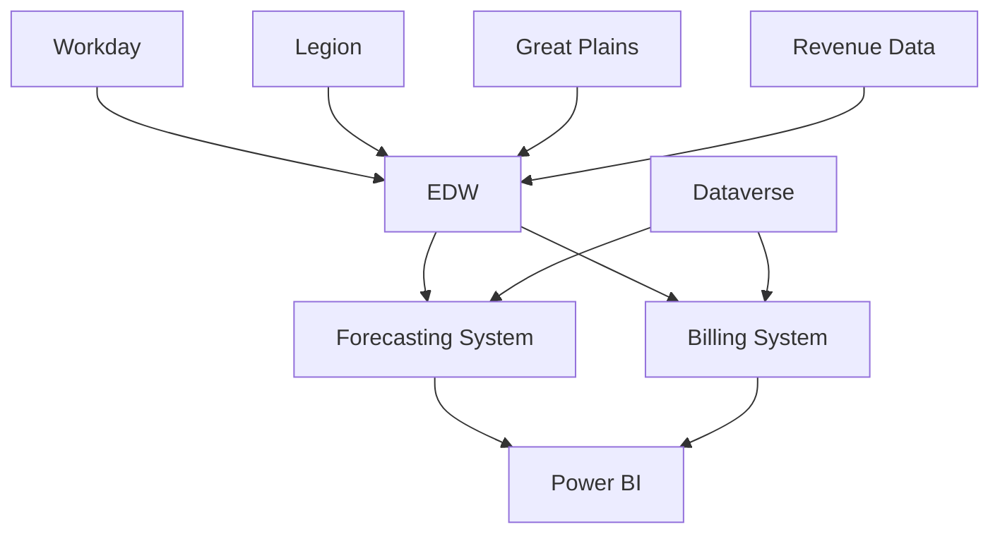

# Technical Reference Documentation

## Overview

This section contains comprehensive technical documentation covering all aspects of the Towne Park financial systems implementation, including architecture, APIs, database design, integration patterns, and development standards.

## Technical Architecture

### [Frontend Development](frontend/index.md)
Client-side development documentation and standards.

**Key Areas:**
- User interface components and patterns
- Responsive design frameworks
- Client-side validation and error handling
- Performance optimization techniques

### [Backend Development](backend/index.md)
Server-side development documentation and implementation details.

**Key Areas:**
- [ALM Strategy for Power Platform](backend/20250718_Architecture_ALMStrategy_PowerPlatform.md)
- [AI Integration Technical Specification](backend/20250718_Development_AIIntegration_TechnicalSpec.md)
- [Forecasting Technical Architecture & API Design](backend/20250718_Forecasting_TechnicalArchitecture_APIDesign.md)
- [Billing Technical Architecture](backend/20250716_Billing_TechnicalArchitecture_Development.md)

**Core Components:**
- RESTful API design and implementation
- Microservices architecture patterns
- Authentication and authorization systems
- Performance optimization strategies

### [Database Design](database/index.md)
Database architecture, schema design, and data management.

**Key Areas:**
- [Forecasting Database Integration](database/20250718_Forecasting_DatabaseIntegration_TechnicalSpec.md)
- [Forecasting Data Sources](database/20250716_Forecasting_DataSources_TechnicalSpec.md)
- [Contracts Data Dictionary](database/20250718_Contracts_DataDictionary_TechnicalSpec.md)
- [Billable Accounts Technical Spec](database/20250716_Forecasting_BillableAccounts_TechnicalSpec.md)

**Database Components:**
- [Schema Design](database/schema-design.md)
- [Contracts Data Schema](database/contracts-data-schema.md)
- [Customer Sites Data Schema](database/customer-sites-data-schema.md)

## System-Specific Technical Documentation

### [Forecasting System Technical Specs](forecasting/index.md)
Technical implementation details for the forecasting system.

**Key Areas:**
- [Sprint 26 Features Technical Spec](forecasting/20250717_Forecasting_TechnicalSpec_Sprint26Features.md)
- [Billable Accounts Technical Spec](forecasting/20250718_Forecasting_BillableAccounts_TechnicalSpec.md)
- [Data Integration Technical Spec](forecasting/20250702_Forecasting_DataIntegration_TechnicalSpec.md)

### [Integration Architecture](integrations/index.md)
System integration patterns and implementation details.

**Key Areas:**
- [Integration Strategy for Hybrid Connections](integrations/20250718_Architecture_IntegrationStrategy_HybridConnections.md)
- [Billing Integrations](integrations/billing-integrations.md)
- [Budget Integration](integrations/budget-integration.md)
- [Legion Integration](integrations/legion-integration.md)
- [Leads Integration](integrations/leads-integration.md)

### [Technical Specifications](specifications/index.md)
Detailed technical specifications for specific components.

**Key Areas:**
- [Forecasting P&L View Technical Spec](specifications/forecasting-pl-view-technical-spec.md)
- [Power Automate Retry Mechanisms](specifications/power-automate-retry-mechanisms.md)
- [SharePoint Delta Token Management](specifications/sharepoint-delta-token-management.md)

## Development Standards and Guidelines

### Architecture Patterns
- **Microservices Architecture**: Loosely coupled, independently deployable services
- **API-First Design**: RESTful APIs with consistent patterns
- **Event-Driven Architecture**: Asynchronous processing and real-time updates
- **Cloud-Native Design**: Scalable, resilient cloud-based solutions

### Technology Stack

| Layer | Technology | Purpose |
|-------|------------|---------|
| **Frontend** | Power Apps, React | User interface and experience |
| **Backend** | Power Platform, .NET | Business logic and APIs |
| **Database** | SQL Server, Dataverse | Data storage and management |
| **Integration** | Power Automate, Logic Apps | System integration and workflows |
| **Analytics** | Power BI, Azure Analytics | Reporting and business intelligence |

### Development Standards

#### Code Quality
- **Code Reviews**: Mandatory peer review process
- **Testing Standards**: Unit, integration, and end-to-end testing
- **Documentation**: Comprehensive inline and external documentation
- **Version Control**: Git-based version control with branching strategies

#### Performance Standards
- **Response Time**: < 3 seconds for standard operations
- **Availability**: 99.5% uptime during business hours
- **Scalability**: Support for 100+ concurrent users
- **Data Integrity**: 99.9% accuracy in calculations and processing

## API Documentation

### API Design Principles
- **RESTful Design**: Resource-based URLs with standard HTTP methods
- **JSON Data Format**: Consistent JSON request/response formats
- **OAuth 2.0 Authentication**: Secure token-based authentication
- **Rate Limiting**: Controlled API access to prevent abuse

### API Endpoints Structure
```
/api/v1/
├── /forecasting/
│   ├── /statistics/
│   ├── /payroll/
│   ├── /rates/
│   └── /pl-view/
├── /billing/
│   ├── /invoices/
│   ├── /contracts/
│   └── /customers/
└── /common/
    ├── /users/
    ├── /sites/
    └── /reports/
```

## Data Architecture

### Data Flow Architecture


### Data Quality Standards
- **Data Validation**: Multi-level validation at input, processing, and output
- **Error Handling**: Comprehensive error logging and recovery mechanisms
- **Data Synchronization**: Real-time and batch synchronization patterns
- **Audit Trails**: Complete audit logging for compliance and debugging

## Security Architecture

### Security Framework
- **Authentication**: Multi-factor authentication with Azure AD integration
- **Authorization**: Role-based access control with granular permissions
- **Data Encryption**: End-to-end encryption for data in transit and at rest
- **Network Security**: VPN access, firewall rules, and network segmentation

### Compliance Standards
- **Data Privacy**: GDPR and CCPA compliance measures
- **Financial Regulations**: SOX compliance for financial reporting
- **Security Standards**: ISO 27001 and NIST cybersecurity framework
- **Audit Requirements**: Comprehensive audit logging and reporting

## Related Documentation

- [Systems Documentation](../systems/index.md) ✓ VERIFIED
- [Business Rules](../business-rules/index.md) ✓ VERIFIED
- [User Processes](../user-processes/index.md) ✓ VERIFIED
- [Configuration Guides](../configuration/index.md) ✓ VERIFIED

## Quick Links

- [Development Standards](../configuration/system-settings/20250718_Development_Standards_ComprehensiveGuide.md)
- [Power Platform Licensing](../configuration/system-settings/20250718_Architecture_LicensingAnalysis_PowerPlatform.md)
- [Definition of Done](../configuration/system-settings/20250718_Development_DefinitionOfDone_ComprehensiveGuide.md)
- [System Configuration](../configuration/system-settings/20250716_Development_ConfigurationGuide_Standards.md)