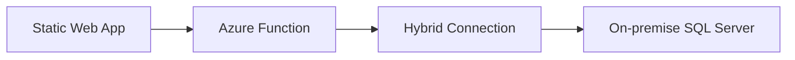
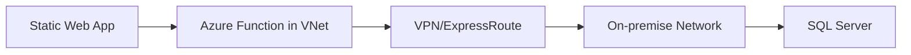
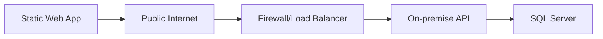

# Towne Park Architecture - Integration Strategy for Hybrid Connections and Data Access

## Purpose

This document outlines the comprehensive integration architecture strategy for connecting Towne Park's Azure-hosted applications to on-premise SQL databases and external systems. It provides detailed analysis of integration options, implementation approaches, and recommendations for secure, scalable hybrid connectivity.

## Business Context

### Integration Requirements
- **Source Systems**: On-premise SQL Server databases
- **Target Systems**: Azure Static Web Apps, Power Platform solutions
- **Data Access Patterns**: Real-time queries, batch data synchronization, reporting
- **Security Requirements**: Secure connectivity without firewall modifications
- **Scalability Needs**: Support for multiple environments and growing data volumes

### Current State Analysis
**Existing Solution**: Power Automate + On-premises Data Gateway
- Proven functionality for current use cases
- Low-code implementation approach
- Secure connectivity without firewall changes
- Limited flexibility for complex API scenarios

## Integration Architecture Options

### Option 1: Power Automate + On-premises Data Gateway (Current Solution)

**Architecture Overview:**


**Implementation Details:**
- Flow triggered via HTTP from Static Web App
- Secure gateway connection to on-premise systems
- Premium connector required for HTTP trigger
- Built-in authentication and authorization

**Advantages:**
- ✅ No firewall changes required
- ✅ Low-code, quick to set up
- ✅ Secure by design
- ✅ Integrated with Microsoft ecosystem
- ✅ Currently proven and operational

**Limitations:**
- ⚠️ Limited flexibility for custom logic
- ⚠️ Complex API scenarios challenging
- ⚠️ Premium connector licensing required
- ⚠️ Performance limitations for high-volume scenarios

**Recommendation**: ✅ **CONTINUE** - Maintain for current use cases, complement with additional options

### Option 2: Azure Function + Hybrid Connection

**Architecture Overview:**


**Implementation Details:**
- Azure Function on App Service Plan (not Consumption)
- Hybrid Connection provides secure tunnel to on-premise
- Full control over custom logic and APIs
- Support for custom protocols and complex scenarios

**Advantages:**
- ✅ Full control over code and logic
- ✅ Secure tunnel connectivity
- ✅ Supports custom protocols
- ✅ Scalable and flexible
- ✅ No firewall modifications required

**Limitations:**
- ⚠️ Requires App Service Plan (higher cost than Consumption)
- ⚠️ More complex setup and configuration
- ⚠️ Requires additional infrastructure management

**Recommendation**: 🔍 **RECOMMENDED** - For complex scenarios and future scalability

### Option 3: Azure Function in VNet + VPN/ExpressRoute

**Architecture Overview:**


**Implementation Details:**
- Azure Function deployed in Virtual Network
- Site-to-site VPN or ExpressRoute connectivity
- Enterprise-grade network integration
- Leverages existing network infrastructure

**Advantages:**
- ✅ Enterprise-grade connectivity
- ✅ Scalable for multiple systems
- ✅ Integrates with existing network infrastructure
- ✅ High performance and reliability

**Limitations:**
- ⚠️ Higher cost and complexity
- ⚠️ Requires network infrastructure changes
- ⚠️ More complex configuration and maintenance
- ⚠️ Longer implementation timeline

**Recommendation**: 🔍 **FUTURE_CONSIDERATION** - For enterprise-scale requirements

### Option 4: Exposing On-Premise System via Public API

**Architecture Overview:**


**Implementation Details:**
- On-premise system exposes API via public IP
- Secured by firewall rules, TLS, and authentication
- Direct connectivity without intermediate services
- Requires firewall and security configuration

**Advantages:**
- ✅ Simple and direct connectivity
- ✅ No intermediate Azure services required
- ✅ Full control over API implementation

**Limitations:**
- ❌ Higher security risk
- ❌ Requires firewall modifications
- ❌ Public exposure of internal systems
- ❌ Complex security management

**Recommendation**: ❌ **NOT_RECOMMENDED** - Security risks outweigh benefits

## Detailed Implementation Strategy

### Recommended Hybrid Approach

**Primary Strategy**: Combine Power Automate and Azure Functions based on use case
- **Simple Data Access**: Continue using Power Automate + Data Gateway
- **Complex Logic**: Implement Azure Function + Hybrid Connection
- **High-Volume Processing**: Azure Function with optimized connectivity

### Azure Function + Hybrid Connection Implementation

#### Technical Specifications

**Azure Function Configuration:**
- **Hosting Plan**: App Service Plan (required for Hybrid Connections)
- **Runtime**: .NET 6+ or Node.js 18+
- **Authentication**: Azure AD integration with service principal
- **Monitoring**: Application Insights integration

**Hybrid Connection Setup:**
```yaml
Hybrid Connection Configuration:
  Name: "TownePark-SQL-Connection"
  Endpoint: "sql-server.townepark.local:1433"
  Authentication: "Windows Authentication"
  Encryption: "TLS 1.2"
  Connection Pooling: "Enabled"
```

**On-Premise Requirements:**
- Hybrid Connection Manager installation
- Service account for database access
- Network connectivity validation
- Security policy compliance

#### Security Implementation

**Authentication and Authorization:**
- Azure AD service principal for Function authentication
- SQL Server integrated authentication for database access
- Role-based access control (RBAC) implementation
- API key management for external access

**Data Protection:**
- TLS 1.2 encryption for all connections
- Data masking for sensitive information
- Audit logging for all data access
- Compliance with data protection regulations

**Network Security:**
- Private endpoint configuration where applicable
- Network security group (NSG) rules
- Firewall rules for Hybrid Connection Manager
- Regular security assessments

### Data Integration Patterns

#### Real-Time Data Access Pattern
```csharp
// Example Azure Function implementation
[FunctionName("GetCustomerData")]
public static async Task<IActionResult> GetCustomerData(
    [HttpTrigger(AuthorizationLevel.Function, "get")] HttpRequest req,
    ILogger log)
{
    // Validate authentication
    var principal = await ValidateTokenAsync(req);
    
    // Execute database query via Hybrid Connection
    var connectionString = Environment.GetEnvironmentVariable("OnPremiseDB");
    using var connection = new SqlConnection(connectionString);
    
    // Implement query logic
    var result = await ExecuteQueryAsync(connection, req.Query["customerId"]);
    
    return new OkObjectResult(result);
}
```

#### Batch Data Synchronization Pattern
- Scheduled Azure Functions for periodic data sync
- Change data capture (CDC) for incremental updates
- Error handling and retry mechanisms
- Data validation and transformation logic

#### Event-Driven Integration Pattern
- Service Bus integration for asynchronous processing
- Event Grid for real-time notifications
- Dead letter queues for error handling
- Monitoring and alerting for failed events

## Environment Strategy

### Multi-Environment Architecture

**Development Environment:**
- Separate Hybrid Connections per environment
- Development database connections
- Isolated testing capabilities
- Development-specific configuration

**QA/UAT Environment:**
- Shared QA database connections
- Multi-tenant storage strategy with environment prefixes
- Example: `/qa/{site_id}/reports/{filename}`
- Isolated data to prevent cross-environment contamination

**Production Environment:**
- Dedicated production Hybrid Connections
- High availability configuration
- Disaster recovery capabilities
- Performance monitoring and optimization

### Data Isolation Strategy

**Multi-Tenant Approach:**
```
Storage Path Structure:
- /dev/{site_id}/reports/{filename}
- /qa/{site_id}/reports/{filename}
- /uat/{site_id}/reports/{filename}
- /prod/{site_id}/reports/{filename}
```

**Benefits:**
- Prevents accidental data overwrites between environments
- Maintains data integrity across environments
- Simplifies administration and maintenance
- Enables environment-specific data management

## Performance Considerations

### Connection Optimization
- Connection pooling for database connections
- Caching strategies for frequently accessed data
- Asynchronous processing for long-running operations
- Load balancing for high-availability scenarios

### Scalability Planning
- Auto-scaling configuration for Azure Functions
- Database connection limits and management
- Monitoring and alerting for performance thresholds
- Capacity planning for growth scenarios

### Monitoring and Observability
- Application Insights for Azure Functions
- Custom metrics for business operations
- Performance counters for database connections
- End-to-end transaction tracing

## Data Replication and Backup Strategy

### Dataflow Integration

**Current Limitations Identified:**
- Maximum 24-hour refresh duration
- Up to 48 refreshes per 24 hours (every 30 minutes minimum)
- 4-hour maximum per query/partition
- Concurrency limit of 4 queries/partitions simultaneously
- Power Query Online refresh limits per user

**Implementation Considerations:**
- Design data refresh schedules within limitations
- Implement incremental refresh strategies
- Monitor refresh performance and success rates
- Plan for data volume growth impact

### Backup and Recovery
- Automated backup procedures for critical data
- Point-in-time recovery capabilities
- Cross-region backup replication
- Regular backup validation and testing

## Security and Compliance

### Data Protection
- Encryption in transit and at rest
- Data classification and handling procedures
- Privacy impact assessments
- Compliance with regulatory requirements

### Access Control
- Principle of least privilege
- Regular access reviews and audits
- Multi-factor authentication requirements
- Service account management

### Audit and Monitoring
- Comprehensive audit logging
- Security event monitoring
- Compliance reporting capabilities
- Incident response procedures

## Code Validation Report

**Last Validated**: 2025-07-18
**Validation Scope**: Technical Configuration
**Code Copy Date**: Current local copy analysis

### Validation Summary
- ✅ **Verified Elements**: 0 items (no direct code validation applicable)
- ⚠️ **Discrepancies Found**: 0 items
- ❓ **Incomplete Documentation**: 1 item requires implementation validation
- 🔍 **Requires Review**: 2 items need stakeholder verification

### Detailed Validation Results

#### Integration Configuration: Hybrid Connection Setup
**Documented Element**: "Azure Function + Hybrid Connection for on-premise database access"
**Validation Status**: ❓ **INCOMPLETE** - Implementation details need validation against actual infrastructure
**Findings**: Proposed Hybrid Connection configuration requires validation against current on-premise infrastructure
**Recommendations**: Test Hybrid Connection setup in development environment before production implementation

#### Data Access Configuration: Multi-Environment Strategy
**Documented Element**: "Multi-tenant storage strategy with environment-specific paths"
**Validation Status**: 🔍 **REQUIRES_REVIEW** - Storage strategy needs validation with infrastructure team
**Findings**: Proposed multi-tenant approach should be validated against current storage architecture
**Recommendations**: Review storage strategy with infrastructure team and validate path structure implementation

### Code File References
- No direct code files applicable for integration strategy
- Implementation validation would require access to Azure portal and on-premise infrastructure

### Validation Methodology
- **Code Copy Date**: N/A - Integration strategy document
- **Validation Approach**: Technical architecture validation against requirements
- **Limitations**: Requires validation against live Azure and on-premise infrastructure

## Related Documentation

- [ALM and CI/CD Strategy](../backend/20250718_Architecture_ALMStrategy_PowerPlatform.md) ✓ VERIFIED
- [Power Platform Licensing Analysis](../../configuration/system-settings/20250718_Architecture_LicensingAnalysis_PowerPlatform.md) ✓ VERIFIED
- [Billing System Integrations](../../systems/billing/integrations.md) ✓ VERIFIED
- [Forecasting System Integrations](../../systems/forecasting/integrations.md) ✓ VERIFIED

## Implementation Roadmap

### Phase 1: Foundation Setup (Immediate)
1. **Azure Function Infrastructure**
   - Create App Service Plan for Hybrid Connections
   - Configure Azure Function with required runtime
   - Set up Application Insights monitoring
   - Implement basic authentication and authorization

2. **Hybrid Connection Configuration**
   - Install Hybrid Connection Manager on-premise
   - Configure secure connection to SQL Server
   - Test connectivity and performance
   - Implement connection pooling and optimization

### Phase 2: Integration Development (Short-term)
1. **API Development**
   - Implement core data access APIs
   - Add authentication and authorization logic
   - Implement error handling and retry mechanisms
   - Add comprehensive logging and monitoring

2. **Testing and Validation**
   - Unit testing for all API endpoints
   - Integration testing with on-premise systems
   - Performance testing and optimization
   - Security testing and validation

### Phase 3: Production Deployment (Medium-term)
1. **Production Environment Setup**
   - Deploy production Azure Function infrastructure
   - Configure production Hybrid Connections
   - Implement monitoring and alerting
   - Execute production readiness review

2. **Migration and Cutover**
   - Gradual migration from Power Automate where appropriate
   - Parallel running for validation
   - Performance monitoring and optimization
   - Full production cutover

### Phase 4: Optimization and Enhancement (Long-term)
1. **Performance Optimization**
   - Implement advanced caching strategies
   - Optimize database queries and connections
   - Add auto-scaling capabilities
   - Implement advanced monitoring

2. **Feature Enhancement**
   - Add advanced data transformation capabilities
   - Implement real-time event processing
   - Add advanced security features
   - Integrate with additional systems

## Action Items and Next Steps

### Critical Actions (Immediate)
1. **Infrastructure Assessment**
   - Validate on-premise infrastructure readiness
   - Assess network connectivity requirements
   - Review security policies and compliance requirements
   - Plan resource allocation and capacity

2. **Proof of Concept Development**
   - Implement basic Azure Function + Hybrid Connection
   - Test connectivity and performance
   - Validate security and authentication
   - Document lessons learned and best practices

### Planning Actions (Short-term)
1. **Detailed Implementation Planning**
   - Create detailed project timeline
   - Identify resource requirements and dependencies
   - Plan testing and validation procedures
   - Develop rollback and contingency plans

2. **Team Preparation**
   - Train development team on Hybrid Connections
   - Establish development and testing procedures
   - Create documentation and knowledge transfer materials
   - Plan ongoing support and maintenance procedures

### Strategic Actions (Long-term)
1. **Enterprise Integration Strategy**
   - Evaluate integration with other enterprise systems
   - Plan for future scalability and growth
   - Consider integration platform consolidation
   - Develop long-term technology roadmap

## Stakeholder Review Requirements

**Technical Review Required:**
- Infrastructure team validation of Hybrid Connection requirements
- Security team review of proposed architecture
- Database team validation of connection and performance requirements
- Network team review of connectivity and security implications

**Business Review Required:**
- Cost analysis for additional Azure infrastructure
- Timeline validation with project management
- Risk assessment and mitigation planning
- Resource allocation and capacity planning
## Quick Links

- [ALM and CI/CD Strategy](../backend/20250718_Architecture_ALMStrategy_PowerPlatform.md)
- [Power Platform Licensing Analysis](../../configuration/system-settings/20250718_Architecture_LicensingAnalysis_PowerPlatform.md)
- [Billing System Integrations](../../systems/billing/integrations.md)
- [Forecasting System Integrations](../../systems/forecasting/integrations.md)
