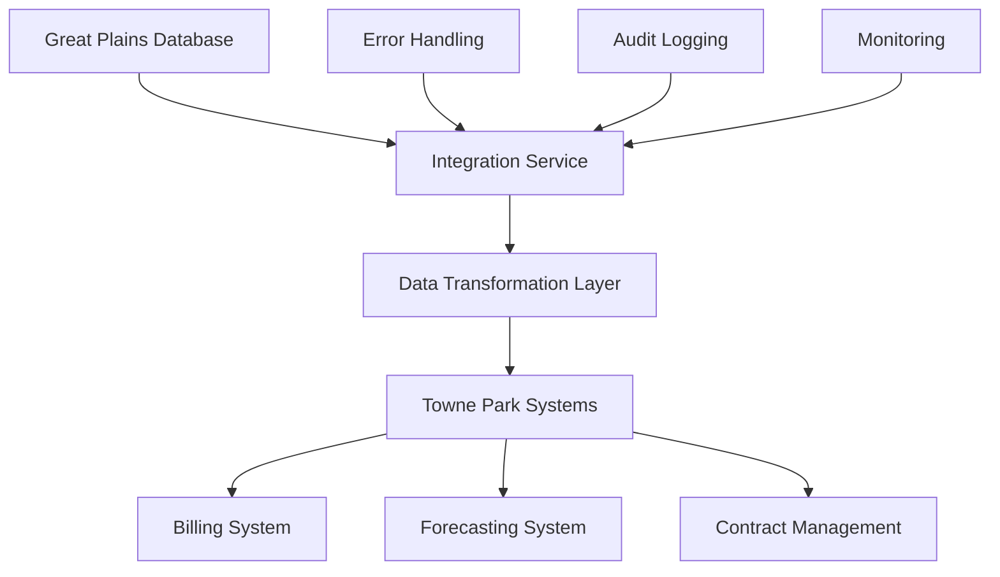

# Great Plains Integration

## Overview

This document provides comprehensive documentation for the integration between Towne Park financial systems and Microsoft Great Plains (GP), covering architecture, data flows, synchronization processes, and implementation details.

## Integration Architecture

### System Architecture Overview

### Integration Components
- **GP Database Connector**: Direct connection to Great Plains database
- **Data Transformation Service**: Business logic and data mapping
- **Integration API**: RESTful API for system communication
- **Error Handling Service**: Comprehensive error management
- **Audit Service**: Complete audit trail and logging

## Data Integration Points

### Chart of Accounts
- **GL Account Structure**: Great Plains chart of accounts integration
- **Account Mapping**: Mapping between GP accounts and Towne Park systems
- **Account Validation**: Real-time account validation and verification
- **Account Synchronization**: Automated account synchronization processes

### Customer Data
- **Customer Master**: Customer information synchronization
- **Customer Accounts**: Account setup and maintenance
- **Customer Relationships**: Customer relationship management
- **Customer Attributes**: Customer classification and attributes

### Financial Transactions
- **Journal Entries**: Automated journal entry creation
- **Transaction Posting**: Real-time transaction posting
- **Batch Processing**: Batch transaction processing
- **Transaction Validation**: Financial transaction validation

### Vendor Management
- **Vendor Master**: Vendor information synchronization
- **Vendor Accounts**: Vendor account management
- **Vendor Payments**: Payment processing integration
- **Vendor Relationships**: Vendor relationship management

## Integration Patterns

### Real-Time Integration
- **API-Based Synchronization**: Real-time data synchronization via APIs
- **Event-Driven Updates**: Event-based data updates and notifications
- **Immediate Validation**: Real-time data validation and error handling
- **Live Data Access**: Direct access to Great Plains data

### Batch Integration
- **Scheduled Synchronization**: Scheduled batch data synchronization
- **Bulk Data Processing**: Efficient bulk data processing
- **Overnight Processing**: Overnight batch processing jobs
- **Data Reconciliation**: Automated data reconciliation processes

### Hybrid Integration
- **Critical Data Real-Time**: Real-time processing for critical data
- **Historical Data Batch**: Batch processing for historical data
- **Flexible Processing**: Configurable processing based on data type
- **Optimized Performance**: Performance-optimized integration patterns

## Data Transformation

### Data Mapping
- **Field Mapping**: Detailed field-level mapping between systems
- **Data Type Conversion**: Data type conversion and validation
- **Business Rule Application**: Business logic application during transformation
- **Data Enrichment**: Data enrichment and enhancement processes

### Transformation Rules
- **Account Number Formatting**: Standardized account number formatting
- **Date Format Conversion**: Date format standardization
- **Currency Conversion**: Multi-currency support and conversion
- **Reference Data Mapping**: Reference data mapping and synchronization

### Data Validation
- **Schema Validation**: Data schema validation and compliance
- **Business Rule Validation**: Business rule validation and enforcement
- **Data Quality Checks**: Comprehensive data quality validation
- **Error Detection**: Automated error detection and reporting

## Security and Compliance

### Security Framework
- **Authentication**: Secure authentication to Great Plains systems
- **Authorization**: Role-based access control and permissions
- **Data Encryption**: End-to-end data encryption
- **Network Security**: Secure network communication protocols

### Compliance Requirements
- **Financial Regulations**: Compliance with financial reporting regulations
- **Audit Requirements**: Comprehensive audit trail and logging
- **Data Privacy**: Data privacy and protection compliance
- **Regulatory Reporting**: Automated regulatory reporting capabilities

### Access Control
- **User Authentication**: Multi-factor authentication for system access
- **Role-Based Permissions**: Granular role-based access control
- **Data Access Restrictions**: Controlled access to sensitive financial data
- **Audit Logging**: Complete audit logging of all access and changes

## Performance Optimization

### Performance Strategies
- **Connection Pooling**: Efficient database connection pooling
- **Caching**: Strategic caching of frequently accessed data
- **Batch Processing**: Optimized batch processing for large datasets
- **Asynchronous Processing**: Asynchronous processing for improved throughput

### Monitoring and Alerting
- **Performance Metrics**: Real-time performance monitoring
- **System Health Checks**: Automated system health monitoring
- **Alert Configuration**: Configurable alerts for system issues
- **Performance Dashboards**: Real-time performance dashboards

### Scalability Considerations
- **Horizontal Scaling**: Scalable architecture for increased load
- **Load Balancing**: Distributed load balancing across instances
- **Resource Management**: Efficient resource utilization and management
- **Capacity Planning**: Proactive capacity planning and scaling

## Error Handling and Recovery

### Error Management
- **Error Classification**: Systematic error classification and categorization
- **Error Logging**: Comprehensive error logging and tracking
- **Error Notification**: Automated error notification and alerting
- **Error Resolution**: Structured error resolution procedures

### Recovery Procedures
- **Automatic Retry**: Automatic retry mechanisms for transient failures
- **Manual Recovery**: Manual recovery procedures for complex issues
- **Data Recovery**: Data recovery and restoration procedures
- **System Recovery**: System recovery and failover procedures

### Business Continuity
- **Backup Systems**: Backup system configuration and management
- **Disaster Recovery**: Comprehensive disaster recovery planning
- **Failover Procedures**: Automated failover and recovery procedures
- **Business Continuity Planning**: Business continuity and risk management

## Implementation Guide

### Setup and Configuration
- **System Requirements**: Great Plains system requirements and prerequisites
- **Connection Configuration**: Database connection setup and configuration
- **Security Configuration**: Security settings and access control setup
- **Performance Configuration**: Performance optimization settings

### Deployment Procedures
- **Environment Setup**: Development, UAT, and production environment setup
- **Integration Testing**: Comprehensive integration testing procedures
- **User Acceptance Testing**: UAT procedures and validation
- **Production Deployment**: Production deployment and go-live procedures

### Maintenance and Support
- **Regular Maintenance**: Scheduled maintenance procedures and tasks
- **System Updates**: System update and upgrade procedures
- **Performance Monitoring**: Ongoing performance monitoring and optimization
- **Support Procedures**: User support and troubleshooting procedures

## Troubleshooting Guide

### Common Issues
- **Connection Issues**: Database connection troubleshooting
- **Data Synchronization Issues**: Data sync troubleshooting procedures
- **Performance Issues**: Performance optimization and troubleshooting
- **Authentication Issues**: Authentication and authorization troubleshooting

### Diagnostic Tools
- **System Diagnostics**: Built-in system diagnostic tools
- **Log Analysis**: Log analysis and troubleshooting tools
- **Performance Analysis**: Performance analysis and optimization tools
- **Error Analysis**: Error analysis and resolution tools

### Support Resources
- **Documentation**: Comprehensive troubleshooting documentation
- **Knowledge Base**: Searchable knowledge base of solutions
- **Expert Support**: Access to technical experts and specialists
- **Community Support**: Community support and knowledge sharing

## Related Documentation

- [Integration Strategy](20250718_Architecture_IntegrationStrategy_HybridConnections.md)
- [Billing Integrations](billing-integrations.md)
- [Technical Architecture](../backend/index.md)
- [Database Integration](../database/index.md)

## Quick Links

- [Development Standards](../../configuration/system-settings/20250718_Development_Standards_ComprehensiveGuide.md)
- [Power Platform Licensing](../../configuration/system-settings/20250718_Architecture_LicensingAnalysis_PowerPlatform.md)
- [ALM Strategy](../backend/20250718_Architecture_ALMStrategy_PowerPlatform.md)
- [System Configuration](../../configuration/system-settings/index.md)