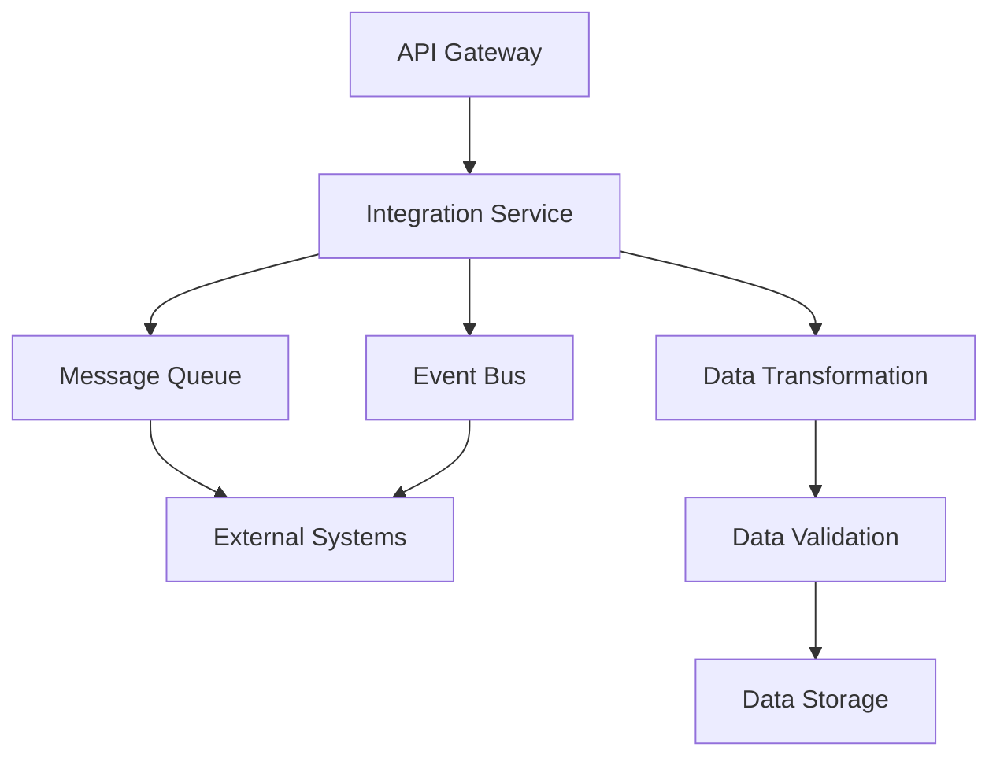

# System Integration Documentation

## Overview

This section contains comprehensive documentation for all system integrations, including integration patterns, implementation details, and integration architecture for all Towne Park financial systems.

## Core Integration Documentation

### [Integration Strategy for Hybrid Connections](20250718_Architecture_IntegrationStrategy_HybridConnections.md)
Comprehensive integration strategy for hybrid cloud and on-premises connections.

**Key Areas:**
- Hybrid integration architecture
- Cloud and on-premises connectivity
- Integration security and compliance
- Performance optimization
- Monitoring and management

## System Integration Patterns

### [Billing Integrations](billing-integrations.md)
Integration patterns and implementation for billing system connectivity.

**Key Areas:**
- Customer management system integration
- Financial system integration
- Payment processing integration
- Reporting and analytics integration
- Audit and compliance integration

### [Budget Integration](budget-integration.md)
Integration with budget planning and management systems.

**Key Areas:**
- Budget data synchronization
- Forecasting integration
- Variance analysis integration
- Reporting and analytics
- Approval workflow integration

### [Legion Integration](legion-integration.md)
Integration with Legion workforce management system.

**Key Areas:**
- Scheduling data integration
- Labor hour tracking
- Performance metrics integration
- Payroll integration
- Real-time data synchronization

### [Leads Integration](leads-integration.md)
Integration with lead management and CRM systems.

**Key Areas:**
- Lead data synchronization
- Customer relationship management
- Sales pipeline integration
- Marketing automation integration
- Reporting and analytics

## Integration Architecture

### Integration Patterns
- **API-First Design**: RESTful APIs for all system interactions
- **Event-Driven Architecture**: Asynchronous event-based integration
- **Message Queues**: Reliable message processing and delivery
- **Batch Processing**: Scheduled batch data synchronization
- **Real-Time Streaming**: Real-time data streaming and processing

### Integration Components

## Data Integration

### Data Flow Patterns
- **Extract, Transform, Load (ETL)**: Traditional batch data processing
- **Extract, Load, Transform (ELT)**: Modern data processing approach
- **Change Data Capture (CDC)**: Real-time data change tracking
- **Event Sourcing**: Event-based data integration
- **Data Virtualization**: Virtual data integration and access

### Data Synchronization
- **Real-Time Synchronization**: Immediate data synchronization
- **Near Real-Time Synchronization**: Minimal delay data synchronization
- **Batch Synchronization**: Scheduled batch data synchronization
- **Delta Synchronization**: Incremental data synchronization
- **Conflict Resolution**: Data conflict detection and resolution

## Enterprise System Integrations

### Enterprise Data Warehouse (EDW)
- **Data Extraction**: Historical data extraction and analysis
- **Data Transformation**: Business rule application and data transformation
- **Data Loading**: Efficient data loading and storage
- **Performance Optimization**: Query optimization and performance tuning
- **Data Quality**: Data validation and quality assurance

### Workday Integration
- **Employee Data**: Employee information and organizational structure
- **Job Management**: Job codes, families, and classification
- **Payroll Data**: Payroll information and labor costs
- **Security Integration**: User authentication and authorization
- **Real-Time Synchronization**: Real-time data updates and synchronization

### Great Plains Integration
- **Financial Data**: General ledger and financial information
- **Account Management**: Chart of accounts and account structure
- **Transaction Processing**: Financial transaction processing
- **Reporting Integration**: Financial reporting and analytics
- **Compliance**: Financial compliance and audit requirements

## API Integration

### API Design Standards
- **RESTful Architecture**: REST-based API design principles
- **JSON Data Format**: Standard JSON request/response format
- **HTTP Status Codes**: Appropriate HTTP status code usage
- **API Versioning**: API versioning and backward compatibility
- **Rate Limiting**: API rate limiting and throttling

### API Security
- **OAuth 2.0**: Standard OAuth 2.0 authentication
- **JWT Tokens**: JSON Web Tokens for stateless authentication
- **API Keys**: API key-based authentication for external systems
- **Input Validation**: Comprehensive input validation and sanitization
- **SSL/TLS**: Secure communication using SSL/TLS encryption

### API Management
- **API Gateway**: Centralized API management and routing
- **Request Routing**: Intelligent request routing and load balancing
- **Response Caching**: API response caching and optimization
- **Monitoring and Analytics**: API usage monitoring and analytics
- **Documentation**: Comprehensive API documentation and examples

## Integration Security

### Security Framework
- **Authentication**: Multi-factor authentication and authorization
- **Encryption**: End-to-end encryption for data in transit and at rest
- **Network Security**: VPN, firewall, and network segmentation
- **Access Control**: Role-based access control and permissions
- **Audit Logging**: Comprehensive audit logging and compliance

### Security Monitoring
- **Intrusion Detection**: Network and system intrusion detection
- **Vulnerability Scanning**: Regular security vulnerability assessments
- **Penetration Testing**: Regular penetration testing and security assessments
- **Incident Response**: Security incident response and procedures
- **Compliance Monitoring**: Ongoing security compliance monitoring

## Performance Optimization

### Performance Strategies
- **Caching**: Multi-level caching for improved performance
- **Load Balancing**: Distributed load balancing and scaling
- **Connection Pooling**: Efficient connection pooling and management
- **Query Optimization**: Database query optimization and tuning
- **Asynchronous Processing**: Asynchronous processing for improved throughput

### Performance Monitoring
- **Response Time Monitoring**: API and system response time tracking
- **Throughput Monitoring**: System throughput and capacity monitoring
- **Error Rate Monitoring**: Error rate tracking and alerting
- **Resource Utilization**: CPU, memory, and storage utilization monitoring
- **Capacity Planning**: Capacity planning and scaling recommendations

## Error Handling and Resilience

### Error Handling
- **Structured Error Responses**: Consistent error response format
- **Error Classification**: Error categorization and classification
- **Retry Logic**: Automatic retry mechanisms for transient failures
- **Circuit Breakers**: Circuit breaker patterns for system resilience
- **Fallback Mechanisms**: Fallback mechanisms for service failures

### System Resilience
- **High Availability**: High availability architecture and design
- **Disaster Recovery**: Comprehensive disaster recovery planning
- **Backup and Recovery**: Regular backup and recovery procedures
- **Failover Procedures**: Automatic failover and recovery procedures
- **Health Checks**: System health monitoring and alerting

## Monitoring and Alerting

### Integration Monitoring
- **Real-Time Monitoring**: Real-time integration monitoring and alerting
- **Performance Metrics**: Integration performance metrics and KPIs
- **Business Metrics**: Business-specific metrics and indicators
- **System Health**: System health monitoring and status reporting
- **Trend Analysis**: Performance trend analysis and forecasting

### Alert Management
- **Alert Configuration**: Configurable alert thresholds and rules
- **Notification Channels**: Multiple notification channels and methods
- **Escalation Procedures**: Alert escalation and incident response
- **Alert Analytics**: Alert analytics and pattern recognition
- **Dashboards**: Real-time monitoring dashboards and visualization

## Testing and Validation

### Integration Testing
- **Unit Testing**: Individual component testing
- **Integration Testing**: End-to-end integration testing
- **Performance Testing**: Load and performance testing
- **Security Testing**: Security vulnerability testing
- **Regression Testing**: Automated regression testing

### Test Automation
- **Test Framework**: Automated testing framework and tools
- **Test Data Management**: Test data provisioning and management
- **Continuous Integration**: Integration testing in CI/CD pipeline
- **Test Reporting**: Comprehensive test reporting and analysis
- **Quality Assurance**: Quality assurance and validation procedures

## Related Documentation

- [Backend Technical Documentation](../backend/index.md)
- [Database Technical Documentation](../database/index.md)
- [System Configuration](../../configuration/index.md)
- [Development Standards](../../configuration/system-settings/20250718_Development_Standards_ComprehensiveGuide.md)

## Quick Links

- [ALM Strategy](../backend/20250718_Architecture_ALMStrategy_PowerPlatform.md)
- [Power Platform Licensing](../../configuration/system-settings/20250718_Architecture_LicensingAnalysis_PowerPlatform.md)
- [Definition of Done](../../configuration/system-settings/20250718_Development_DefinitionOfDone_ComprehensiveGuide.md)
- [Forecasting Data Sources](../database/20250716_Forecasting_DataSources_TechnicalSpec.md)
