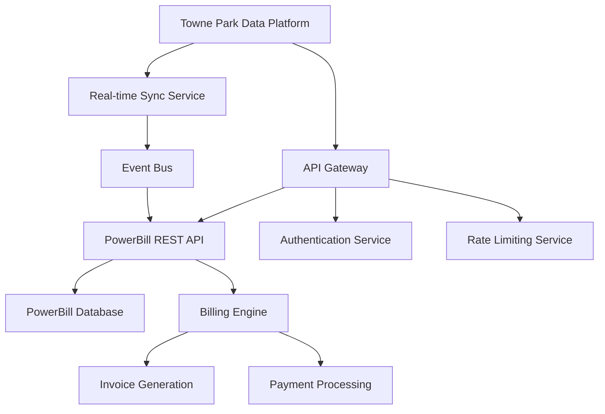

# PowerBill Integration Technical Specification

## Overview

This document provides the comprehensive technical specification for integrating the PowerBill system with the Towne Park data platform. PowerBill serves as the primary billing engine for revenue share, per-labor-hour, and fixed fee contract processing.

## System Architecture

### Integration Architecture


### Core Components

#### API Gateway Layer
- **Purpose**: Centralized entry point for all PowerBill communications
- **Technology**: Azure API Management
- **Features**:
  - Request/response transformation
  - Rate limiting and throttling
  - Authentication and authorization
  - Comprehensive logging and monitoring
  - Circuit breaker pattern implementation

#### PowerBill REST API
- **Base URL**: `https://api.powerbill.townepark.com/v2`
- **Authentication**: OAuth 2.0 with JWT tokens
- **Rate Limits**: 1000 requests per minute per client
- **Response Format**: JSON with standardized error codes
- **API Version**: v2.1 (current), v3.0 (planned Q4 2025)

#### Real-time Synchronization Service
- **Technology**: Azure Service Bus with Event Grid
- **Frequency**: Real-time for critical operations, batch for bulk updates
- **Retry Logic**: Exponential backoff with maximum 5 retry attempts
- **Dead Letter Queue**: Failed messages routed for manual intervention

## API Specifications

### Authentication Endpoints

#### POST /auth/token
```json
{
  "grant_type": "client_credentials",
  "client_id": "townepark_integration",
  "client_secret": "[SECURE_SECRET]",
  "scope": "billing.read billing.write invoices.generate"
}
```

**Response:**
```json
{
  "access_token": "eyJhbGciOiJSUzI1NiIsInR5cCI6IkpXVCJ9...",
  "token_type": "Bearer",
  "expires_in": 3600,
  "scope": "billing.read billing.write invoices.generate"
}
```

### Billing Data Endpoints

#### GET /billing/accounts/{accountId}
Retrieves detailed billing account information including contract terms, rates, and billing history.

**Parameters:**
- `accountId` (required): Unique identifier for the billing account
- `include` (optional): Comma-separated list of related data to include
  - `contracts`: Include contract details
  - `history`: Include billing history
  - `rates`: Include current rate information

**Response:**
```json
{
  "accountId": "ACC-12345",
  "customerName": "Downtown Hotel Group",
  "accountStatus": "active",
  "billingCycle": "monthly",
  "contracts": [
    {
      "contractId": "CTR-67890",
      "contractType": "revenue_share",
      "startDate": "2025-01-01",
      "endDate": "2025-12-31",
      "revenueSharePercentage": 25.0,
      "minimumGuarantee": 5000.00
    }
  ],
  "currentBalance": 15750.00,
  "lastBillingDate": "2025-07-01",
  "nextBillingDate": "2025-08-01"
}
```

#### POST /billing/accounts/{accountId}/invoices
Generates a new invoice for the specified billing account.

**Request Body:**
```json
{
  "billingPeriod": {
    "startDate": "2025-07-01",
    "endDate": "2025-07-31"
  },
  "invoiceType": "standard",
  "includeDetails": true,
  "deliveryMethod": "email",
  "customFields": {
    "poNumber": "PO-2025-0731",
    "departmentCode": "PARK-001"
  }
}
```

**Response:**
```json
{
  "invoiceId": "INV-2025-07-001",
  "accountId": "ACC-12345",
  "invoiceNumber": "TP-2025-070001",
  "invoiceDate": "2025-07-31",
  "dueDate": "2025-08-30",
  "totalAmount": 15750.00,
  "status": "generated",
  "downloadUrl": "https://api.powerbill.townepark.com/v2/invoices/INV-2025-07-001/download",
  "lineItems": [
    {
      "description": "Parking Revenue Share - July 2025",
      "quantity": 1,
      "rate": 15750.00,
      "amount": 15750.00,
      "taxable": true
    }
  ]
}
```

### Revenue Share Endpoints

#### GET /billing/revenue-share/{contractId}/calculations
Retrieves revenue share calculations for a specific contract and period.

**Parameters:**
- `contractId` (required): Contract identifier
- `startDate` (required): Calculation period start date (YYYY-MM-DD)
- `endDate` (required): Calculation period end date (YYYY-MM-DD)
- `includeBreakdown` (optional): Include detailed calculation breakdown

**Response:**
```json
{
  "contractId": "CTR-67890",
  "calculationPeriod": {
    "startDate": "2025-07-01",
    "endDate": "2025-07-31"
  },
  "grossRevenue": 63000.00,
  "revenueSharePercentage": 25.0,
  "calculatedAmount": 15750.00,
  "minimumGuarantee": 5000.00,
  "finalAmount": 15750.00,
  "breakdown": [
    {
      "date": "2025-07-01",
      "dailyRevenue": 2100.00,
      "shareAmount": 525.00
    }
  ]
}
```

#### POST /billing/revenue-share/{contractId}/adjustments
Creates revenue share adjustments for billing corrections or special circumstances.

**Request Body:**
```json
{
  "adjustmentType": "credit",
  "amount": 500.00,
  "reason": "Service interruption credit",
  "effectiveDate": "2025-07-15",
  "approvedBy": "manager@townepark.com",
  "description": "Credit for 2-hour system outage on July 15th"
}
```

### Per-Labor-Hour Endpoints

#### GET /billing/labor-hours/{contractId}/timesheet
Retrieves labor hour data for per-labor-hour billing contracts.

**Parameters:**
- `contractId` (required): Contract identifier
- `startDate` (required): Timesheet period start date
- `endDate` (required): Timesheet period end date
- `employeeId` (optional): Filter by specific employee

**Response:**
```json
{
  "contractId": "CTR-54321",
  "timesheetPeriod": {
    "startDate": "2025-07-01",
    "endDate": "2025-07-31"
  },
  "totalHours": 320.5,
  "regularHours": 280.0,
  "overtimeHours": 40.5,
  "hourlyRate": 25.00,
  "overtimeRate": 37.50,
  "totalAmount": 8518.75,
  "employees": [
    {
      "employeeId": "EMP-001",
      "name": "John Smith",
      "regularHours": 160.0,
      "overtimeHours": 20.0,
      "totalAmount": 4750.00
    }
  ]
}
```

#### POST /billing/labor-hours/{contractId}/submit-timesheet
Submits timesheet data for approval and billing processing.

**Request Body:**
```json
{
  "timesheetPeriod": {
    "startDate": "2025-07-01",
    "endDate": "2025-07-31"
  },
  "entries": [
    {
      "employeeId": "EMP-001",
      "date": "2025-07-01",
      "hoursWorked": 8.0,
      "hourType": "regular",
      "approvedBy": "supervisor@townepark.com"
    }
  ],
  "submittedBy": "manager@townepark.com",
  "submissionDate": "2025-08-01T09:00:00Z"
}
```

## Data Synchronization

### Real-time Sync Events

#### Revenue Data Updates
- **Trigger**: Daily revenue posting from POS systems
- **Frequency**: Every 15 minutes during business hours
- **Data Volume**: ~1000 transactions per sync
- **Processing Time**: <30 seconds average

#### Contract Changes
- **Trigger**: Contract modification or new contract creation
- **Frequency**: Real-time (immediate)
- **Data Volume**: 1-5 contracts per day typically
- **Processing Time**: <5 seconds

#### Rate Updates
- **Trigger**: Billing rate changes or adjustments
- **Frequency**: Real-time (immediate)
- **Data Volume**: Variable, typically 1-10 updates per week
- **Processing Time**: <3 seconds

### Batch Synchronization

#### Historical Data Import
- **Schedule**: Daily at 2:00 AM EST
- **Data Volume**: Complete previous day's transactions
- **Processing Time**: 15-30 minutes
- **Retry Logic**: 3 attempts with 5-minute intervals

#### Monthly Reconciliation
- **Schedule**: 1st of each month at 6:00 AM EST
- **Purpose**: Comprehensive data validation and reconciliation
- **Data Volume**: Complete previous month's data
- **Processing Time**: 2-4 hours

## Error Handling and Recovery

### Error Response Format
```json
{
  "error": {
    "code": "INVALID_CONTRACT_ID",
    "message": "The specified contract ID does not exist or is inactive",
    "details": {
      "contractId": "CTR-INVALID",
      "timestamp": "2025-07-24T10:30:00Z",
      "requestId": "req-12345-67890"
    },
    "suggestions": [
      "Verify the contract ID is correct",
      "Check if the contract is active",
      "Contact support if the issue persists"
    ]
  }
}
```

### Common Error Codes
- `AUTHENTICATION_FAILED`: Invalid or expired authentication token
- `RATE_LIMIT_EXCEEDED`: API rate limit exceeded
- `INVALID_CONTRACT_ID`: Contract not found or inactive
- `INSUFFICIENT_PERMISSIONS`: User lacks required permissions
- `VALIDATION_ERROR`: Request data validation failed
- `SYSTEM_UNAVAILABLE`: PowerBill system temporarily unavailable

### Retry Strategies

#### Transient Errors
- **Retry Count**: 3 attempts
- **Backoff Strategy**: Exponential (1s, 2s, 4s)
- **Applicable Errors**: Network timeouts, 5xx server errors

#### Rate Limiting
- **Retry Count**: 5 attempts
- **Backoff Strategy**: Linear with jitter (60s + random 0-30s)
- **Applicable Errors**: 429 Too Many Requests

#### Authentication Errors
- **Retry Count**: 1 attempt after token refresh
- **Backoff Strategy**: Immediate retry with new token
- **Applicable Errors**: 401 Unauthorized

## Performance Specifications

### Response Time Requirements
- **Authentication**: <500ms
- **Account Lookup**: <1 second
- **Invoice Generation**: <5 seconds
- **Bulk Data Sync**: <30 seconds per 1000 records

### Throughput Specifications
- **Peak Load**: 2000 requests per minute
- **Sustained Load**: 1000 requests per minute
- **Concurrent Connections**: 50 maximum
- **Data Transfer**: 10MB per minute maximum

### Availability Requirements
- **Uptime SLA**: 99.9% (excluding planned maintenance)
- **Planned Maintenance**: Monthly 2-hour window
- **Recovery Time**: <15 minutes for system failures
- **Data Backup**: Real-time replication with 4-hour RPO

## Security Specifications

### Authentication and Authorization
- **Protocol**: OAuth 2.0 with PKCE
- **Token Lifetime**: 1 hour (access), 30 days (refresh)
- **Scope-based Permissions**: Granular access control
- **Multi-factor Authentication**: Required for administrative operations

### Data Encryption
- **In Transit**: TLS 1.3 minimum
- **At Rest**: AES-256 encryption
- **Key Management**: Azure Key Vault integration
- **Certificate Management**: Automated renewal and rotation

### Audit and Compliance
- **Access Logging**: All API calls logged with user context
- **Data Retention**: 7 years for financial data
- **Compliance Standards**: SOX, PCI DSS Level 1
- **Regular Audits**: Quarterly security assessments

## Monitoring and Alerting

### Health Checks
- **Endpoint**: `/health`
- **Frequency**: Every 30 seconds
- **Response Time**: <100ms
- **Dependencies**: Database, external services

### Key Metrics
- **Response Time**: 95th percentile <2 seconds
- **Error Rate**: <0.1% of requests
- **Availability**: >99.9% uptime
- **Throughput**: Requests per minute

### Alert Thresholds
- **Critical**: >5% error rate, >10 second response time
- **Warning**: >1% error rate, >5 second response time
- **Info**: Unusual traffic patterns, approaching rate limits

## Testing and Validation

### Integration Testing
- **Test Environment**: Dedicated PowerBill sandbox
- **Test Data**: Anonymized production data subset
- **Automated Tests**: 150+ test cases covering all endpoints
- **Performance Tests**: Load testing with 2x expected peak load

### Validation Procedures
- **Data Integrity**: Checksums and hash validation
- **Business Logic**: Automated validation of calculations
- **Error Handling**: Comprehensive error scenario testing
- **Security Testing**: Regular penetration testing and vulnerability scans

---

*This integration specification is maintained by the Towne Park Integration Team and is updated regularly to reflect system changes and enhancements.*