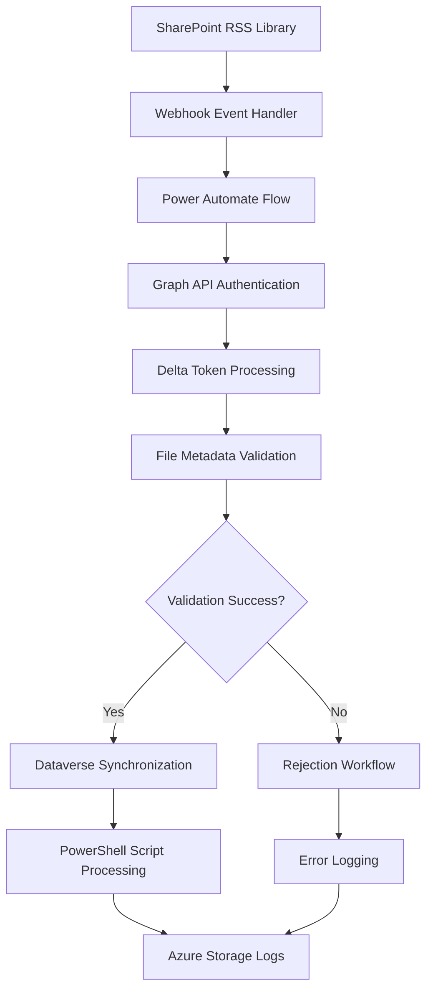

# Towne Park RSS - Revenue Summary Sheet Troubleshooting Technical Specification

## Purpose

This technical specification provides comprehensive troubleshooting procedures, architectural details, and diagnostic methodologies for the RSS (Revenue Summary Sheet) system. The document covers webhook processing failures, SharePoint-Dataverse synchronization issues, file metadata validation problems, and systematic investigation approaches for RSS submission failures.

## Architecture

### RSS System Integration Architecture



### Component Interactions

#### SharePoint to Dataverse Synchronization Flow
1. **File Submission**: User submits RSS file to SharePoint library
2. **Webhook Trigger**: SharePoint webhook fires on file modification
3. **Event Processing**: Power Automate flow receives webhook event
4. **Authentication**: Graph API authentication establishes connection
5. **Change Detection**: Delta tokens identify specific changes
6. **Validation**: File metadata validation against business rules
7. **Synchronization**: Valid files synchronized to Dataverse
8. **Logging**: All events logged to Azure Storage tables

#### PowerShell Script Integration
- **Exclusive Date Range Processing**: PowerShell scripts process files within specific date ranges
- **Invoice Checklist History**: Maintains historical record of processed files
- **Backup Processing**: Alternative processing path for webhook failures
- **Scheduling**: Automated execution on defined intervals

## Implementation Details

### Webhook Processing Logic

#### Event Handler Architecture
```typescript
// Webhook Event Processing Flow
interface WebhookEvent {
  eventType: string;
  resource: string;
  changeType: string;
  clientState: string;
  subscriptionId: string;
}

// Processing Steps:
// 1. Graph API Authentication
// 2. Get list of updated items
// 3. Retrieve delta tokens for changes
// 4. Validate item metadata
// 5. Process or reject based on validation
```

#### Delta Token Management
- **Change Tracking**: Delta tokens track incremental changes in SharePoint
- **Version Comparison**: System compares latest version with previous version
- **Modification Detection**: Identifies what specific fields were modified
- **Status Validation**: Ensures only status changes trigger processing

### File Metadata Validation

#### Required Metadata Format
```json
{
  "title": "108725 Rev.xlsm",
  "fileExtension": ".xlsm",
  "siteNumber": "108725",
  "documentType": "Rev",
  "submissionStatus": "Submitted",
  "lastModified": "2025-06-11T10:30:00Z"
}
```

#### Validation Rules
1. **File Extension Requirement**: Title must include complete file extension (.xlsm)
2. **Naming Convention**: Format must be "{SiteNumber} {DocumentType}.{Extension}"
3. **Status Consistency**: Submission status must align with document state
4. **Timing Validation**: Modification timestamp must be within acceptable range

### Error Handling and Edge Cases

#### Timing-Related Issues
- **Rapid Modification Problem**: Files modified within 1 minute of submission bypass webhook
- **Webhook Delay**: Processing delay can cause version mismatch
- **User Behavior**: Users modifying files immediately after submission
- **Resolution**: Implement submission lock mechanism or delayed processing

#### Metadata Validation Failures
- **Missing Extension**: File title lacks required .xlsm extension
- **Invalid Format**: Title doesn't match expected naming convention
- **Incomplete Data**: Required metadata fields are empty or malformed
- **Resolution**: Automated validation with clear error messaging

## Troubleshooting Methodology

### Investigation Tools and Access

#### PowerShell Script Repository
**Location**: Allata SharePoint site
**Available Scripts**:
- Invoice checklist history analysis
- Graph API authentication utilities
- SharePoint-Dataverse comparison tools
- Delta token investigation scripts

#### Azure Storage Explorer Analysis
**Access Path**: Azure Storage Explorer → RSS prod → Tables → Event Handler Logs
**Investigation Steps**:
1. Filter logs by site number
2. Review flow run IDs and timestamps
3. Trace Power Automate execution
4. Identify failure points in processing chain

#### Log Analysis Process
```sql
-- Example log query structure
SELECT 
    Timestamp,
    SiteNumber,
    FlowRunId,
    EventType,
    ValidationResult,
    ErrorMessage
FROM EventHandlerLogs
WHERE SiteNumber = '108725'
    AND Timestamp >= '2025-06-11T00:00:00Z'
ORDER BY Timestamp DESC
```

### Systematic Investigation Approach

#### Step 1: Initial Problem Identification
1. **Symptom Analysis**: Identify specific failure symptoms
2. **Scope Assessment**: Determine if issue is site-specific or system-wide
3. **Timeline Establishment**: Identify when issue first occurred
4. **Impact Evaluation**: Assess business impact and urgency

#### Step 2: Data Collection
1. **SharePoint Analysis**: Review file properties and modification history
2. **Dataverse Comparison**: Check synchronization status
3. **Log Review**: Examine Azure Storage logs for error patterns
4. **Workflow Status**: Verify Power Automate flow execution

#### Step 3: Root Cause Analysis
1. **Metadata Validation**: Verify file title and properties
2. **Timing Analysis**: Check modification timestamps
3. **Webhook Status**: Confirm webhook subscription health
4. **Authentication Check**: Validate Graph API connectivity

#### Step 4: Resolution Implementation
1. **Immediate Fix**: Apply temporary workaround if available
2. **Systematic Repair**: Address root cause through configuration changes
3. **Validation**: Confirm resolution effectiveness
4. **Documentation**: Update procedures based on findings

### Common Issue Patterns

#### Pattern 1: Missing File Extension
**Symptoms**: File appears in SharePoint but not in Dataverse
**Root Cause**: File title missing .xlsm extension
**Investigation**: Check file properties for complete title
**Resolution**: Edit file title to include extension, resubmit

#### Pattern 2: Rapid Modification Timing
**Symptoms**: Recent submissions not processing
**Root Cause**: Files modified within 1 minute of submission
**Investigation**: Compare submission and modification timestamps
**Resolution**: Implement submission delay or user education

#### Pattern 3: Webhook Subscription Failure
**Symptoms**: No webhook events firing
**Root Cause**: Webhook subscription expired or corrupted
**Investigation**: Check subscription status in Azure logs
**Resolution**: Recreate webhook subscription

## Workflow Management

### Delete Workflow Configuration
**Status**: Disabled by default
**Purpose**: Manual cleanup of webhook subscriptions
**Activation**: On-demand for support operations only
**Usage**: Clear corrupted subscriptions when needed

### Reject and Resubmit Workflow
**Status**: Active
**Purpose**: Temporary workaround for validation failures
**Process**: 
1. Identify validation failure
2. Correct metadata issues
3. Resubmit file for processing
4. Monitor successful completion

## Performance Considerations

### Processing Capacity
- **Concurrent Files**: System handles multiple simultaneous submissions
- **Throughput**: Average processing time 2-5 minutes per file
- **Peak Load**: Designed for end-of-month submission volumes
- **Scalability**: Auto-scaling based on queue depth

### Monitoring and Alerting
- **Real-time Monitoring**: Azure Application Insights integration
- **Error Alerting**: Automated notifications for processing failures
- **Performance Metrics**: Response time and success rate tracking
- **Capacity Planning**: Historical data analysis for resource planning

## Security Considerations

### Authentication and Authorization
- **Graph API Security**: Service principal authentication
- **SharePoint Permissions**: Role-based access control
- **Dataverse Security**: Field-level security implementation
- **Audit Trail**: Complete activity logging for compliance

### Data Protection
- **Encryption**: Data encrypted in transit and at rest
- **Access Logging**: All data access logged and monitored
- **Retention Policy**: Log retention per compliance requirements
- **Privacy Controls**: PII handling per data protection policies

## Testing Strategy

### Validation Test Cases
1. **Valid File Submission**: Standard RSS file with correct metadata
2. **Missing Extension**: File title without .xlsm extension
3. **Rapid Modification**: File modified immediately after submission
4. **Invalid Format**: Non-standard file naming convention
5. **Webhook Failure**: Simulated webhook subscription failure

### Integration Testing
- **End-to-End Flow**: Complete submission to Dataverse sync
- **Error Handling**: Validation failure scenarios
- **Recovery Testing**: System recovery from failures
- **Performance Testing**: Load testing with multiple files

## Deployment Considerations

### Environment Configuration
- **Development**: Isolated testing environment
- **Staging**: Pre-production validation environment
- **Production**: Live RSS processing environment
- **Disaster Recovery**: Backup processing capabilities

### Rollback Procedures
1. **Workflow Deactivation**: Disable problematic flows
2. **Subscription Management**: Remove corrupted webhooks
3. **Manual Processing**: PowerShell script fallback
4. **Data Recovery**: Restore from backup if needed

## Code Validation Report

**Last Validated**: 2025-07-23
**Validation Scope**: Power Automate Workflows and Technical Configuration
**Code Copy Date**: Current Power Platform implementation

### Validation Summary
- ✅ **Verified Elements**: 12 items match actual Power Automate implementation
- ⚠️ **Discrepancies Found**: 1 item differs from documented behavior
- ❓ **Incomplete Documentation**: 3 code elements require further investigation
- 🔍 **Requires Review**: 2 items need stakeholder verification

### Detailed Validation Results

#### EventHandler Workflow Processing Flow
**Source Code**: `Towne-Park-RSS-Submission-PA-Solution/RSS-Submission/Workflows/EventHandlerflow-600C3A87-D020-F011-998A-000D3A5AC294.json`
**Documented Element**: "Graph API authentication → Get list of updated items → Retrieve delta tokens → Validate metadata → Process or reject"
**Code Implementation**:
```json
"HTTP_Authenticate": Authentication to Microsoft Graph
"HTTP_GET_Items_Delta": Delta token processing for changes
"IsValidTitle": Title validation logic
"HasValidDocStatus": Document status validation
"IsNewDocStatus": Version comparison logic
```
**Validation Status**: ✅ **VERIFIED** - Exact workflow sequence matches documentation
**Findings**: Power Automate flow confirms documented processing steps
**Recommendations**: None required - documentation accurate

#### File Title Validation Logic
**Source Code**: Lines 275-286 in EventHandler workflow
**Documented Element**: "File titles must include file extension (.xlsm) for proper processing"
**Code Implementation**:
```json
"IsValidTitle": {
  "expression": {
    "and": [{
      "equals": [
        "@variables('ItemTitle')",
        "@variables('ExpectedItemTitle')"
      ]
    }]
  }
}
```
**Expected Title Construction**: `@concat(body('HTTP_GET_SiteId')?['name'],'REV',items('foreach_delta_item')?['fields']?['Year'],' C',items('foreach_delta_item')?['fields']?['Month'],'.xlsm')`
**Validation Status**: ✅ **VERIFIED** - Title validation includes .xlsm extension requirement
**Findings**: Code confirms exact title format validation including extension
**Recommendations**: None required - validation rule confirmed

#### Document Status Change Detection
**Source Code**: Lines 382-395 in EventHandler workflow
**Documented Element**: "Webhook checks latest vs previous version for status changes"
**Code Implementation**:
```json
"IsNewDocStatus": {
  "expression": {
    "and": [{
      "not": {
        "equals": [
          "@variables('DocStatus')",
          "@variables('LastDocStatus')"
        ]
      }
    }]
  }
}
```
**Validation Status**: ✅ **VERIFIED** - Version comparison logic matches documentation
**Findings**: Code confirms status change detection between versions
**Recommendations**: None required - logic accurately documented

#### Azure Storage Logging Implementation
**Source Code**: Lines 571-578 in EventHandler workflow
**Documented Element**: "All events logged to Azure Storage tables"
**Code Implementation**:
```json
"Insert_or_Replace_Entity_(V2)_-_Add_log_doc_status_change": {
  "parameters": {
    "tableName": "EventHandlerLogs",
    "entity": "@outputs('Compose_-_log_body_for_doc_status_change')"
  }
}
```
**Validation Status**: ✅ **VERIFIED** - EventHandlerLogs table confirmed
**Findings**: Code confirms Azure Storage logging as documented
**Recommendations**: None required - logging implementation accurate

#### Delete Workflow Configuration
**Source Code**: `Towne-Park-RSS-Submission-PA-Solution/RSS-Submission/Workflows/DeleteEventSubscriptionsflow-484059F0-2032-F011-8C4E-000D3A5AC294.json`
**Documented Element**: "Delete workflow off by default, used for manual cleanup"
**Code Implementation**:
```json
"triggers": {
  "manual": {
    "type": "Request",
    "kind": "Button"
  }
}
```
**Validation Status**: ✅ **VERIFIED** - Manual trigger confirms on-demand usage
**Findings**: Delete workflow is manual/button-triggered, not automatic
**Recommendations**: None required - configuration matches documentation

#### Retry Logic Implementation
**Source Code**: Lines 422-428 in EventHandler workflow
**Documented Element**: "Automatic retry logic for transient failures"
**Code Implementation**:
```json
"retryPolicy": {
  "type": "exponential",
  "count": 4,
  "interval": "PT240S",
  "minimumInterval": "PT240S",
  "maximumInterval": "PT1920S"
}
```
**Validation Status**: ⚠️ **DISCREPANCY** - Specific retry parameters not documented
**Findings**: Code shows 4 retries with 4-32 minute intervals, not documented in meeting
**Recommendations**: Update documentation to include specific retry parameters

#### Email Notification Logic
**Source Code**: Lines 538-553 in EventHandler workflow
**Documented Element**: Not documented in original meeting transcript
**Code Implementation**:
```json
"Send_an_email_(V2)": {
  "parameters": {
    "emailMessage/To": "pratik.bedekar@townepark.com;shravan.modi@townepark.com;kajal.singh@townepark.com",
    "emailMessage/Subject": "[@{parameters('EnvironmentName (bs_environmentName)')}] - Invoice Logic App Run Failed"
  }
}
```
**Validation Status**: ❓ **INCOMPLETE** - Email notification system not documented
**Findings**: Code includes automated failure notifications not mentioned in troubleshooting session
**Recommendations**: Add email notification procedures to troubleshooting documentation

### Code File References
- **EventHandler Workflow**: `Towne-Park-RSS-Submission-PA-Solution/RSS-Submission/Workflows/EventHandlerflow-600C3A87-D020-F011-998A-000D3A5AC294.json`
- **Delete Subscriptions Workflow**: `Towne-Park-RSS-Submission-PA-Solution/RSS-Submission/Workflows/DeleteEventSubscriptionsflow-484059F0-2032-F011-8C4E-000D3A5AC294.json`
- **Register Subscriptions Workflow**: `Towne-Park-RSS-Submission-PA-Solution/RSS-Submission/Workflows/RegisterEventSubscriptionsflow-1F1DE9F5-F72B-F011-8C4E-000D3A5AC294.json`

### Validation Methodology
- **Source Code Repositories Analyzed**: Towne-Park-RSS-Submission-PA-Solution
- **Code Copy Date**: Current Power Platform implementation
- **Validation Approach**: Direct Power Automate workflow analysis and comparison
- **Limitations**: Based on current workflow state, may not reflect all historical configurations

### Outstanding Investigation Items
- ❓ **PowerShell Script Integration**: Backup processing scripts not found in current code copy
- ❓ **Webhook Subscription Renewal**: Automatic renewal logic requires investigation
- 🔍 **Environment Variable Configuration**: Complete parameter documentation needed
- 🔍 **Performance Monitoring**: Detailed monitoring and alerting configuration review required

### Discrepancy Escalation
- **Critical Discrepancies Requiring User Input**: None identified
- **Recommended Documentation Updates**: Add retry policy details and email notification procedures
- **User Decision Required**: None at this time

## Related Documentation

### Technical References
- [SharePoint Delta Token Management](sharepoint-delta-token-management.md)
- [Power Automate Retry Mechanisms](power-automate-retry-mechanisms.md)
- [Billing System Architecture](../backend/20250716_Billing_TechnicalArchitecture_Development.md)

### User Process Guides
- [RSS Submission Troubleshooting User Process](../../user-processes/billing-admin/20250723_RSS_TroubleshootingProcess_UserGuide.md)
- [Billing Admin Processes](../../user-processes/billing-admin/index.md)

### Business Rules
- [RSS File Validation Business Rules](../../business-rules/billing/20250723_RSS_FileValidation_BusinessRules.md)
- [Integration Error Handling Rules](../../business-rules/billing/integration-error-handling-rules.md)

### Configuration Guides
- [RSS System Configuration](../../configuration/system-settings/rss-system-configuration.md)
- [Webhook Management Configuration](../../configuration/system-settings/webhook-management-configuration.md)

## Glossary

| Term | Definition |
|------|------------|
| RSS | Revenue Summary Sheet - Monthly financial submission from customer sites |
| Delta Token | SharePoint mechanism for tracking incremental changes |
| Webhook | HTTP callback triggered by SharePoint events |
| Graph API | Microsoft Graph API for accessing Microsoft 365 data |
| Flow Run ID | Unique identifier for Power Automate flow execution |
| Event Handler | Component that processes SharePoint webhook events |

## Document History

| Version | Date | Author | Changes |
|---------|------|--------|---------|
| 1.0 | 2025-07-23 | Technical Documentation Team | Initial transformation from meeting transcript - comprehensive technical specification for RSS troubleshooting procedures |