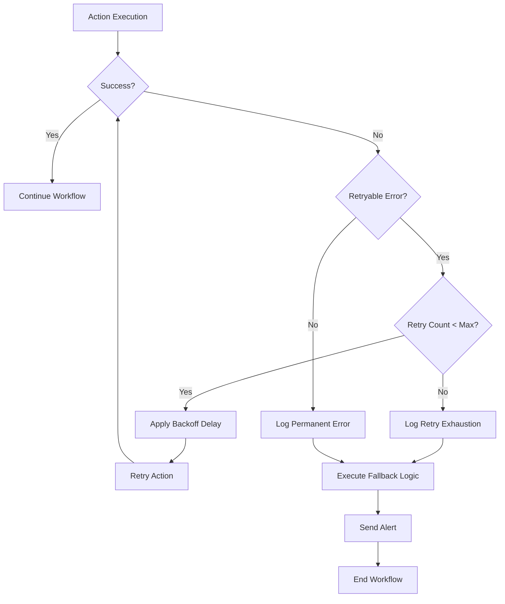

# Power Automate Retry Mechanisms Technical Specification

## Overview

This document provides the technical specification for implementing comprehensive retry mechanisms in Power Automate workflows to handle transient failures, improve system resilience, and ensure reliable data processing across the Towne Park ecosystem.

## Business Context

Power Automate workflows are critical for data integration, business process automation, and system synchronization. Implementing robust retry mechanisms ensures that temporary failures don't result in data loss or process interruption, maintaining system reliability and user confidence.

## Retry Strategy Framework

### Core Retry Patterns

#### 1. Exponential Backoff
```json
{
  "retryPolicy": {
    "type": "exponential",
    "count": 5,
    "interval": "PT5S",
    "maximumInterval": "PT1H",
    "minimumInterval": "PT5S"
  }
}
```

**Implementation Details**:
- Initial delay: 5 seconds
- Maximum retries: 5 attempts
- Backoff multiplier: 2x
- Maximum interval: 1 hour
- Jitter: ±10% to prevent thundering herd

#### 2. Fixed Interval
```json
{
  "retryPolicy": {
    "type": "fixed",
    "count": 3,
    "interval": "PT30S"
  }
}
```

**Use Cases**:
- Simple API calls with predictable recovery times
- Database connection retries
- File system operations

#### 3. Linear Backoff
```json
{
  "retryPolicy": {
    "type": "linear",
    "count": 4,
    "interval": "PT10S",
    "maximumInterval": "PT5M"
  }
}
```

**Implementation**:
- Retry 1: 10 seconds
- Retry 2: 20 seconds
- Retry 3: 30 seconds
- Retry 4: 40 seconds

### Retry Configuration by Action Type

#### HTTP Actions
```json
{
  "HTTP_Request": {
    "retryPolicy": {
      "type": "exponential",
      "count": 5,
      "interval": "PT2S",
      "maximumInterval": "PT30M"
    },
    "retryableStatusCodes": [429, 500, 502, 503, 504],
    "nonRetryableStatusCodes": [400, 401, 403, 404]
  }
}
```

#### SharePoint Actions
```json
{
  "SharePoint_Operations": {
    "retryPolicy": {
      "type": "exponential",
      "count": 3,
      "interval": "PT5S",
      "maximumInterval": "PT10M"
    },
    "retryableErrors": [
      "ServiceUnavailable",
      "RequestTimeout",
      "TooManyRequests",
      "InternalServerError"
    ]
  }
}
```

#### Dataverse Actions
```json
{
  "Dataverse_Operations": {
    "retryPolicy": {
      "type": "exponential",
      "count": 4,
      "interval": "PT3S",
      "maximumInterval": "PT15M"
    },
    "retryableErrors": [
      "ServiceUnavailable",
      "RequestTimeout",
      "ThrottlingException",
      "ConcurrencyException"
    ]
  }
}
```

## Implementation Patterns

### Pattern 1: Action-Level Retry Configuration

```json
{
  "definition": {
    "$schema": "https://schema.management.azure.com/providers/Microsoft.Logic/schemas/2016-06-01/workflowdefinition.json#",
    "actions": {
      "HTTP_Call_External_API": {
        "type": "Http",
        "inputs": {
          "method": "GET",
          "uri": "https://api.external-service.com/data"
        },
        "retryPolicy": {
          "type": "exponential",
          "count": 5,
          "interval": "PT5S",
          "maximumInterval": "PT1H"
        }
      }
    }
  }
}
```

### Pattern 2: Scope-Based Error Handling with Retry

```json
{
  "actions": {
    "Scope_Data_Processing": {
      "type": "Scope",
      "actions": {
        "Get_SharePoint_Data": {
          "type": "OpenApiConnection",
          "inputs": {
            "host": {
              "connectionName": "shared_sharepointonline"
            },
            "method": "get",
            "path": "/datasets/@{encodeURIComponent('https://townepark.sharepoint.com/sites/data')}/tables/@{encodeURIComponent('DataList')}/items"
          }
        },
        "Process_Data": {
          "type": "Compose",
          "inputs": "@body('Get_SharePoint_Data')?['value']"
        }
      },
      "runAfter": {},
      "retryPolicy": {
        "type": "exponential",
        "count": 3,
        "interval": "PT10S"
      }
    },
    "Handle_Scope_Failure": {
      "type": "If",
      "expression": {
        "and": [
          {
            "equals": [
              "@result('Scope_Data_Processing')[0]['status']",
              "Failed"
            ]
          }
        ]
      },
      "actions": {
        "Log_Error": {
          "type": "Compose",
          "inputs": {
            "error": "@result('Scope_Data_Processing')[0]['error']",
            "timestamp": "@utcNow()",
            "workflowRunId": "@workflow()['run']['name']"
          }
        },
        "Send_Alert": {
          "type": "OpenApiConnection",
          "inputs": {
            "host": {
              "connectionName": "shared_teams"
            },
            "method": "post",
            "path": "/flowbot/actions/notification/recipienttypes/channel",
            "body": {
              "recipient": {
                "channelId": "error-alerts"
              },
              "messageBody": "Data processing failed after retries: @{body('Log_Error')}"
            }
          }
        }
      },
      "runAfter": {
        "Scope_Data_Processing": [
          "Failed",
          "Skipped",
          "TimedOut"
        ]
      }
    }
  }
}
```

### Pattern 3: Custom Retry Logic with Do-Until Loop

```json
{
  "actions": {
    "Initialize_Retry_Counter": {
      "type": "InitializeVariable",
      "inputs": {
        "variables": [
          {
            "name": "RetryCount",
            "type": "integer",
            "value": 0
          }
        ]
      }
    },
    "Initialize_Success_Flag": {
      "type": "InitializeVariable",
      "inputs": {
        "variables": [
          {
            "name": "OperationSuccessful",
            "type": "boolean",
            "value": false
          }
        ]
      }
    },
    "Retry_Loop": {
      "type": "Until",
      "expression": "@or(variables('OperationSuccessful'), greater(variables('RetryCount'), 5))",
      "limit": {
        "count": 10,
        "timeout": "PT1H"
      },
      "actions": {
        "Increment_Retry_Counter": {
          "type": "IncrementVariable",
          "inputs": {
            "name": "RetryCount",
            "value": 1
          }
        },
        "Try_Operation": {
          "type": "Scope",
          "actions": {
            "External_API_Call": {
              "type": "Http",
              "inputs": {
                "method": "POST",
                "uri": "https://api.external-service.com/process",
                "body": "@triggerBody()"
              }
            },
            "Set_Success_Flag": {
              "type": "SetVariable",
              "inputs": {
                "name": "OperationSuccessful",
                "value": true
              }
            }
          }
        },
        "Handle_Operation_Failure": {
          "type": "If",
          "expression": {
            "equals": [
              "@result('Try_Operation')[0]['status']",
              "Failed"
            ]
          },
          "actions": {
            "Calculate_Delay": {
              "type": "Compose",
              "inputs": "@mul(variables('RetryCount'), 5)"
            },
            "Wait_Before_Retry": {
              "type": "Wait",
              "inputs": {
                "interval": {
                  "count": "@outputs('Calculate_Delay')",
                  "unit": "Second"
                }
              }
            }
          },
          "runAfter": {
            "Try_Operation": [
              "Failed"
            ]
          }
        }
      }
    }
  }
}
```

## Error Classification and Handling

### Transient Errors (Retryable)

#### Network-Related Errors
```json
{
  "transientErrors": {
    "network": [
      "RequestTimeout",
      "ServiceUnavailable",
      "BadGateway",
      "GatewayTimeout",
      "TooManyRequests"
    ],
    "retryStrategy": "exponential",
    "maxRetries": 5
  }
}
```

#### Service-Related Errors
```json
{
  "transientErrors": {
    "service": [
      "InternalServerError",
      "ServiceBusy",
      "TemporarilyUnavailable",
      "ConcurrencyException"
    ],
    "retryStrategy": "exponential",
    "maxRetries": 3
  }
}
```

#### Authentication Errors
```json
{
  "transientErrors": {
    "authentication": [
      "TokenExpired",
      "AuthenticationTimeout"
    ],
    "retryStrategy": "fixed",
    "maxRetries": 2,
    "preRetryAction": "refreshToken"
  }
}
```

### Permanent Errors (Non-Retryable)

```json
{
  "permanentErrors": [
    "BadRequest",
    "Unauthorized",
    "Forbidden",
    "NotFound",
    "MethodNotAllowed",
    "NotAcceptable",
    "Conflict",
    "Gone",
    "UnprocessableEntity"
  ]
}
```

## Monitoring and Alerting

### Retry Metrics Collection

```json
{
  "actions": {
    "Log_Retry_Metrics": {
      "type": "Compose",
      "inputs": {
        "workflowName": "@workflow()['name']",
        "runId": "@workflow()['run']['name']",
        "actionName": "@actionName()",
        "retryCount": "@action()['retryHistory']",
        "finalStatus": "@action()['status']",
        "totalDuration": "@action()['duration']",
        "timestamp": "@utcNow()"
      }
    },
    "Send_Metrics_to_Log_Analytics": {
      "type": "Http",
      "inputs": {
        "method": "POST",
        "uri": "https://townepark-logs.ods.opinsights.azure.com/api/logs",
        "headers": {
          "Authorization": "SharedKey @{parameters('LogAnalyticsWorkspaceId')}:@{parameters('LogAnalyticsKey')}",
          "Content-Type": "application/json",
          "Log-Type": "PowerAutomateRetryMetrics"
        },
        "body": "@outputs('Log_Retry_Metrics')"
      }
    }
  }
}
```

### Alert Configuration

```json
{
  "alertRules": {
    "highRetryRate": {
      "condition": "retryCount > 3",
      "threshold": "5 occurrences in 15 minutes",
      "action": "sendTeamsNotification",
      "severity": "Warning"
    },
    "retryExhaustion": {
      "condition": "finalStatus = 'Failed' AND retryCount >= maxRetries",
      "threshold": "1 occurrence",
      "action": "sendEmailAlert",
      "severity": "Critical"
    },
    "unusualRetryPattern": {
      "condition": "retryCount > averageRetryCount * 2",
      "threshold": "3 occurrences in 30 minutes",
      "action": "createIncident",
      "severity": "High"
    }
  }
}
```

## Best Practices and Guidelines

### 1. Retry Policy Selection

```yaml
retry_policy_guidelines:
  http_apis:
    - Use exponential backoff for external APIs
    - Set maximum interval to prevent excessive delays
    - Include jitter to avoid thundering herd
  
  database_operations:
    - Use fixed interval for connection retries
    - Limit retry count to prevent resource exhaustion
    - Implement circuit breaker pattern for repeated failures
  
  file_operations:
    - Use linear backoff for file system operations
    - Consider file locking scenarios
    - Implement timeout mechanisms
```

### 2. Error Handling Hierarchy



### 3. Configuration Management

```json
{
  "retryConfiguration": {
    "environment": "production",
    "defaultPolicies": {
      "http": {
        "type": "exponential",
        "count": 5,
        "interval": "PT5S",
        "maximumInterval": "PT30M"
      },
      "dataverse": {
        "type": "exponential",
        "count": 3,
        "interval": "PT3S",
        "maximumInterval": "PT10M"
      },
      "sharepoint": {
        "type": "exponential",
        "count": 4,
        "interval": "PT2S",
        "maximumInterval": "PT15M"
      }
    },
    "customPolicies": {
      "criticalOperations": {
        "type": "exponential",
        "count": 10,
        "interval": "PT1S",
        "maximumInterval": "PT1H"
      },
      "batchOperations": {
        "type": "linear",
        "count": 3,
        "interval": "PT30S",
        "maximumInterval": "PT5M"
      }
    }
  }
}
```

## Testing and Validation

### Unit Testing Retry Logic

```json
{
  "testScenarios": [
    {
      "name": "Transient Network Error",
      "setup": "Mock HTTP 503 response",
      "expectedBehavior": "Retry with exponential backoff",
      "validation": "Verify retry count and final success"
    },
    {
      "name": "Authentication Token Expiry",
      "setup": "Mock 401 Unauthorized response",
      "expectedBehavior": "Refresh token and retry",
      "validation": "Verify token refresh and successful retry"
    },
    {
      "name": "Permanent Error",
      "setup": "Mock HTTP 400 response",
      "expectedBehavior": "No retry, immediate failure",
      "validation": "Verify no retry attempts"
    },
    {
      "name": "Retry Exhaustion",
      "setup": "Mock persistent 500 errors",
      "expectedBehavior": "Exhaust retries and fail",
      "validation": "Verify max retry count reached"
    }
  ]
}
```

### Load Testing

```yaml
load_test_scenarios:
  concurrent_retries:
    description: "Test retry behavior under high concurrency"
    concurrent_flows: 100
    failure_rate: 30%
    expected_outcome: "No thundering herd, proper backoff distribution"
  
  sustained_failures:
    description: "Test system behavior during extended outages"
    failure_duration: "30 minutes"
    expected_outcome: "Graceful degradation, proper alerting"
  
  recovery_testing:
    description: "Test behavior when services recover"
    failure_pattern: "Intermittent failures"
    expected_outcome: "Quick recovery, minimal data loss"
```

## Performance Considerations

### Resource Management

```json
{
  "resourceLimits": {
    "maxConcurrentRetries": 50,
    "retryQueueSize": 1000,
    "memoryThreshold": "80%",
    "cpuThreshold": "70%"
  },
  "throttling": {
    "enabled": true,
    "maxRetriesPerMinute": 100,
    "backpressureThreshold": 500
  }
}
```

### Optimization Strategies

1. **Intelligent Retry Scheduling**
   - Distribute retry attempts across time
   - Implement priority-based retry queues
   - Use circuit breaker patterns

2. **Resource Conservation**
   - Implement retry budgets
   - Use adaptive retry policies
   - Monitor resource consumption

3. **Performance Monitoring**
   - Track retry success rates
   - Monitor retry latency
   - Analyze retry patterns

## Security Considerations

### Secure Retry Implementation

```json
{
  "securityMeasures": {
    "credentialManagement": {
      "tokenRefresh": "automatic",
      "secretRotation": "enabled",
      "encryptionAtRest": "required"
    },
    "auditLogging": {
      "retryAttempts": "logged",
      "failureReasons": "logged",
      "sensitiveDataMasking": "enabled"
    },
    "accessControl": {
      "retryPolicyModification": "restricted",
      "monitoringAccess": "role-based",
      "alertConfiguration": "admin-only"
    }
  }
}
```

## Related Documentation

- [Power Platform Architecture](../architecture/power-platform-architecture.md) 🔄 PLANNED
- [Error Handling Standards](../../standards/error-handling-standards.md) 🔄 PLANNED
- [Monitoring and Alerting Guide](../../operations/monitoring-alerting-guide.md) 🔄 PLANNED
- [SharePoint Delta Token Management](sharepoint-delta-token-management.md) ✓ VERIFIED
- [System Resilience Guidelines](../../standards/system-resilience-guidelines.md) 🔄 PLANNED

## Revision History

| Version | Date | Author | Changes |
|---------|------|--------|---------|
| 1.0 | 2025-07-17 | Data Product Team | Initial technical specification from Sprint 25 user stories |
## Quick Links

- [SharePoint Delta Token Management](sharepoint-delta-token-management.md)
