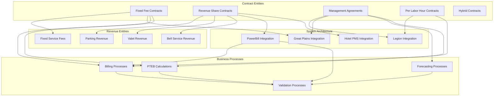

# Towne Park Financial Platform - AI-Optimized Knowledge Corpus

-   :material-graph:{ .lg .middle } __Enterprise Context__

    ---

    AI-optimized enterprise knowledge foundation including business entity registry, relationship mappings, and autonomous discovery guides for comprehensive financial platform context.

    [:octicons-arrow-right-24: Enterprise Context Hub](knowledge-corpus/enterprise-context/business-entity-registry.md)

-   :material-bank:{ .lg .middle } __Financial Entities__

    ---

    FIBO-enhanced financial context covering contract entities, revenue classifications, and business processes with domain-specific extensions for Towne Park operations.

    [:octicons-arrow-right-24: Financial Entities Hub](knowledge-corpus/financial-entities/contract-entities/revenue-share-contracts/_entity-definition.md)

-   :material-cog-box:{ .lg .middle } __System Architecture__

    ---

    Comprehensive technical implementation context including integration patterns, platform architecture, and security frameworks for the financial platform ecosystem.

    [:octicons-arrow-right-24: System Architecture Hub](knowledge-corpus/system-architecture/integration-architecture/powerbill-integration-patterns.md)
    
    [:octicons-arrow-right-24: Revenue Datamart Daily Data Model](knowledge-corpus/technical-specifications/revenue-datamart-daily-data-model.md)
    
    [:octicons-arrow-right-24: Towne Park Forecasting System Architecture](knowledge-corpus/technical-specifications/towne-park-forecasting-system-comprehensive-master-architecture.md)

-   :material-account-group:{ .lg .middle } __Role-Based Processes__

    ---

    User-centric process documentation organized by role with comprehensive workflows for Account Managers, Billing Admins, Contract Admins, and Developers.

    [:octicons-arrow-right-24: Role-Based Processes Hub](knowledge-corpus/role-based-processes/account-manager-workflows/forecasting-dashboard-usage.md)

-   :material-clipboard-check:{ .lg .middle } __Validation Reports__

    ---

    Code validation and quality assurance documentation including contract validation, system validation, and business rule verification reports.

    [:octicons-arrow-right-24: Validation Reports Hub](knowledge-corpus/validation-reports/contract-validation-reports/revenue-share-validation.md)
    
    [:octicons-arrow-right-24: Revenue Datamart Daily Code Validation](knowledge-corpus/validation-reports/revenue-datamart-daily-code-validation-report.md)

-   :material-account-voice:{ .lg .middle } __Meeting Transcripts__

    ---

    Development context and decision documentation from strategic planning sessions, development sprints, and stakeholder meetings.

    [:octicons-arrow-right-24: Meeting Transcripts Hub](knowledge-corpus/meeting-transcripts/strategic-planning/architecture-decisions/README.md)

-   :material-ruler:{ .lg .middle } __Standards Framework__

    ---

    Comprehensive governance and standards documentation covering development standards, business standards, and AI-specific protocols.

    [:octicons-arrow-right-24: Standards Framework Hub](knowledge-corpus/standards/development-standards/coding-standards.md)

-   :material-tune:{ .lg .middle } __Configuration Guides__

    ---

    System configuration and setup documentation for billing systems, forecasting platforms, and AI development environments.

    [:octicons-arrow-right-24: Configuration Hub](knowledge-corpus/configuration/billing-system-configuration/powerbill-configuration.md)

## :material-brain: AI-Optimized Architecture

### **Autonomous Context Discovery**
This knowledge corpus is architected specifically for AI-assisted development and autonomous context discovery, implementing the principles from the [Towne Park Autonomous Context AI Protocol](knowledge-corpus/enterprise-context/autonomous-discovery-guide.md).

### **FIBO Financial Ontology Integration**
All financial entities are classified using the Financial Industry Business Ontology (FIBO) with Towne Park domain-specific extensions, enabling precise business context understanding and automated relationship discovery.

### **Enterprise Knowledge Graph**
The corpus structure supports enterprise knowledge graph generation with:
- **Entity-centric organization** around business concepts
- **Relationship-dense linking** for contextual understanding  
- **Policy-governed validation** for trustworthy AI decisions
- **Multi-dimensional cross-references** for comprehensive context

## :octicons-workflow-24: Business Entity Relationship Map

## :material-compass: AI-First Navigation Principles

| AI Optimization Strategy | Human Navigation Benefit | Implementation |
|:--------------------------|:-------------------------|:---------------|
| **Entity-Centric Organization** | Clear business concept focus | Content grouped by business entities rather than system boundaries |
| **Relationship-Dense Linking** | Comprehensive cross-references | Every document links to related concepts, systems, and processes |
| **FIBO Classification** | Standardized financial terminology | Financial concepts classified using industry-standard ontology |
| **Contextual Metadata** | Rich document information | Extensive frontmatter with entity classifications and relationships |
| **Validation Integration** | Quality assurance visibility | Code validation reports directly linked to business rule documentation |

## :material-folder-multiple: Knowledge Corpus Structure

The AI-optimized knowledge corpus is organized into eight primary domains:

### **1. Enterprise Context** 
Foundation layer providing business entity registry, relationship mappings, and AI discovery guides

### **2. Financial Entities**
FIBO-enhanced business entities including contracts, revenue classifications, and business processes

### **3. System Architecture** 
Technical implementation context covering integration patterns and platform architecture

### **4. Role-Based Processes**
User-centric workflows organized by job function and responsibility

### **5. Validation Reports**
Code validation and quality assurance documentation with business rule verification

### **6. Meeting Transcripts**
Development context and decision documentation from planning and development sessions

### **7. Standards Framework**
Governance and standards covering development, business, and AI-specific protocols

### **8. Configuration Guides**
System setup and configuration documentation for all platform components

---

*This AI-optimized knowledge corpus implements autonomous context discovery principles while maintaining human-friendly navigation for the Towne Park financial platform development project.*
