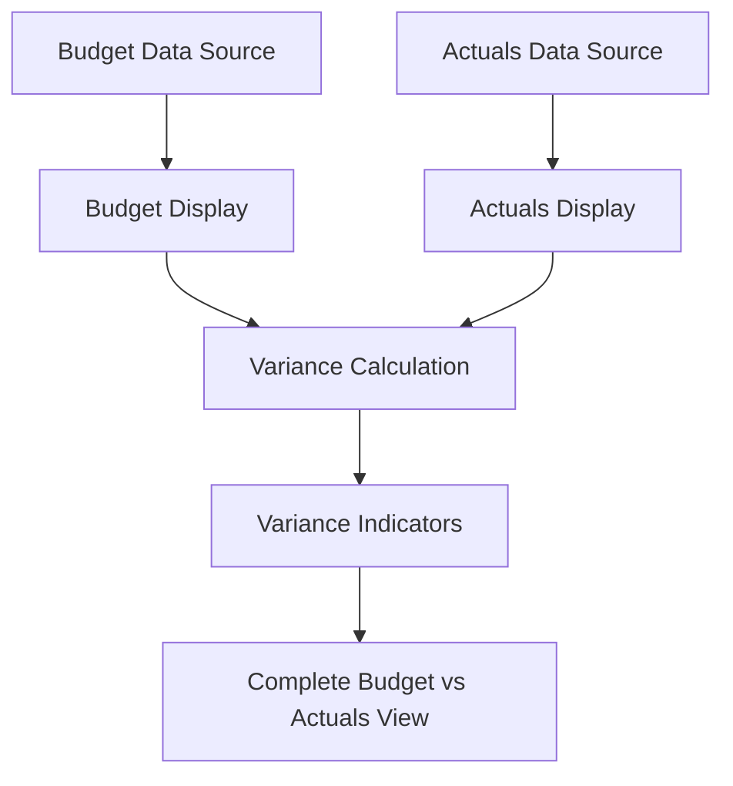

# Sprint 29 Budget vs Actuals Implementation - Development Meeting

## Executive Summary

This strategic development meeting established a revised implementation approach for budget vs actuals functionality in the forecasting system. The team made the critical decision to prioritize budget display implementation before actuals, creating a solid foundation for comprehensive variance analysis capabilities.

**Key Strategic Decision**: Pivot from actuals-first to budget-first implementation approach  
**Technical Impact**: Simplified development path with clear dependency management  
**Business Value**: Enhanced financial planning capabilities with variance analysis foundation

## Meeting Details

**Date**: July 10, 2025  
**Meeting Type**: Sprint Tasking Addon Session  
**Duration**: Approximately 20 minutes  
**Primary Focus**: User Story 2347 implementation strategy and budget vs actuals display prioritization

### Participants and Roles
- **Javier Casas** - Developer
- **Cesar Figueroa** - Technical Lead
- **Jonathan Aulson** - Product Owner/Business Analyst
- **Christopher Thompson** - Senior Developer
- **Graham Olson** - Developer

## FIBO Financial Ontology Classification

**Primary Classification**: [`fibo-fbc-dae-dbt:Budget`](../../FIBO-master-ontology/FBC/) with forecasting and variance analysis extensions  
**Towne Park Extension**: Budget vs Actuals forecasting system with variance calculation  
**Regulatory Context**: Financial planning standards, budget management practices, variance reporting requirements

**Domain-Specific Properties:**
- **Budget Display**: Integration with existing forecasting table structure
- **Variance Calculation**: Absolute values with percentage configuration options
- **Data Integration**: Leveraging existing budget data sources and ETL processes
- **UI Enhancement**: Responsive design with column-based budget display
- **Future Actuals**: Foundation preparation for comprehensive budget vs actuals analysis

## Strategic Implementation Decisions

### 1. Implementation Sequence Revision

**Original Strategy**: Implement actuals display first (User Story 2347)

**Revised Strategy**: Budget-first implementation approach
```yaml
implementation_sequence:
  phase_1_sprint_29:
    focus: "Budget display implementation"
    user_story: "2347 (modified scope)"
    deliverables:
      - "Budget column addition to forecasting tables"
      - "Budget data display and formatting"
      - "UI enhancements for budget visibility"
      - "Foundation preparation for actuals integration"
  
  phase_2_future_sprint:
    focus: "Actuals display and variance calculation"
    user_story: "2477 (new story)"
    deliverables:
      - "Actuals data query implementation"
      - "Actuals column display"
      - "Variance calculation integration"
      - "Complete budget vs actuals functionality"
```

**Strategic Rationale**:
- **Foundation Building**: Budget implementation provides stable foundation for actuals comparison
- **Technical Simplification**: Clear dependency management with sequential development
- **Risk Mitigation**: Reduced complexity by separating concerns
- **User Value**: Immediate budget visibility while preparing for comprehensive variance analysis

### 2. Variance Calculation Methodology

**Technical Question**: Should variance be displayed as absolute values or percentages?

**Resolution Framework**:
```typescript
interface VarianceDisplayConfig {
  defaultMethod: 'absolute' | 'percentage';
  configurationOverride: boolean;
  calculationLogic: {
    absolute: (budget: number, actual: number) => number;
    percentage: (budget: number, actual: number) => number;
  };
}

const varianceConfig: VarianceDisplayConfig = {
  defaultMethod: 'absolute',
  configurationOverride: true,
  calculationLogic: {
    absolute: (budget, actual) => actual - budget,
    percentage: (budget, actual) => budget !== 0 ? ((actual - budget) / budget) * 100 : 0
  }
};
```

**Implementation Rules**:
- **Default Display**: Absolute values for all variance calculations
- **Configuration Override**: Percentage display only where explicitly configured
- **Consistency**: Maintain existing variance calculation patterns
- **Flexibility**: Support both methods based on business requirements

### 3. Data Architecture Strategy

**Budget Data Integration**:
```sql
-- Existing budget data structure (already available)
SELECT 
  site_id,
  period_date,
  account_code,
  budget_amount,
  forecast_amount,
  variance_threshold
FROM budget_data_mart
WHERE enabled = 1;
```

**Table Structure Enhancement**:
```typescript
interface ForecastingTableStructure {
  existingColumns: {
    forecast: number;
    variance: number;
    period: string;
    account: string;
  };
  newBudgetColumns: {
    budget: number;
    budgetVariance: number;
    budgetPercentage?: number;
  };
  futureActualsColumns: {
    actual?: number;
    actualVariance?: number;
    actualPercentage?: number;
  };
}
```

## Technical Implementation Specifications

### Budget Display Implementation

**Data Source Integration**:
- **Existing Availability**: Budget data already available in system
- **ETL Processes**: Leverage existing data pipeline infrastructure
- **Performance**: No additional API calls required for budget data
- **Data Quality**: Utilize established data validation and cleansing processes

**Frontend Implementation**:
```typescript
// Budget column component implementation
interface BudgetColumnProps {
  budgetData: BudgetData[];
  displayFormat: 'currency' | 'percentage';
  varianceCalculation: boolean;
  responsiveBreakpoints: BreakpointConfig;
}

const BudgetColumn: React.FC<BudgetColumnProps> = ({
  budgetData,
  displayFormat,
  varianceCalculation,
  responsiveBreakpoints
}) => {
  return (
    <TableColumn
      header="Budget"
      data={budgetData}
      formatter={displayFormat === 'currency' ? formatCurrency : formatPercentage}
      variance={varianceCalculation}
      responsive={responsiveBreakpoints}
    />
  );
};
```

**Backend Integration**:
```csharp
// Budget data service implementation
public class BudgetDataService : IBudgetDataService
{
    public async Task<BudgetData[]> GetBudgetDataAsync(
        int siteId, 
        DateTime startDate, 
        DateTime endDate)
    {
        // Leverage existing data access patterns
        return await _dataRepository.GetBudgetDataAsync(siteId, startDate, endDate);
    }
    
    public decimal CalculateVariance(decimal budget, decimal forecast)
    {
        return forecast - budget;
    }
    
    public decimal CalculatePercentageVariance(decimal budget, decimal forecast)
    {
        return budget != 0 ? ((forecast - budget) / budget) * 100 : 0;
    }
}
```

### Actuals Implementation Preparation

**Future Data Flow Architecture**:


**Actuals Query Implementation** (Future Sprint):
```sql
-- Actuals data query (to be implemented)
SELECT 
  site_id,
  period_date,
  account_code,
  actual_amount,
  posting_date,
  data_source
FROM actuals_data_mart
WHERE period_date BETWEEN @start_date AND @end_date
  AND site_id = @site_id
  AND data_quality_flag = 'VALIDATED';
```

## User Story Modifications and Sprint Planning

### User Story 2347 Scope Transformation

**Original Scope**: Actuals display implementation
```yaml
original_user_story_2347:
  title: "Implement Actuals Display in Forecasting"
  scope: "Add actuals columns and variance calculation"
  complexity: "High"
  dependencies: ["Budget data", "Actuals data", "Variance logic"]
```

**Modified Scope**: Budget display implementation
```yaml
modified_user_story_2347:
  title: "Implement Budget Display in Forecasting"
  scope: "Add budget columns and prepare for actuals integration"
  complexity: "Medium"
  dependencies: ["Existing budget data", "Table structure enhancement"]
  deliverables:
    - "Budget column implementation"
    - "Budget data display and formatting"
    - "UI enhancements for budget visibility"
    - "Foundation for actuals integration"
```

**New User Story 2477**: Actuals implementation
```yaml
new_user_story_2477:
  title: "Implement Actuals Display and Variance Calculation"
  scope: "Complete budget vs actuals functionality"
  complexity: "High"
  dependencies: ["User Story 2347 completion", "Actuals data source"]
  deliverables:
    - "Actuals data query implementation"
    - "Actuals column display"
    - "Variance calculation integration"
    - "Complete budget vs actuals functionality"
```

### Sprint 29 Development Workflow

**Week 1: Analysis and Planning**
- Review existing table structure and data sources
- Analyze budget data availability and quality
- Plan UI/UX enhancements for budget display
- Prepare development environment and dependencies

**Week 2: Core Implementation**
- Implement budget column components
- Develop budget data binding and display logic
- Create responsive design enhancements
- Integrate with existing table infrastructure

**Week 3: Testing and Integration**
- Unit testing for budget display components
- Integration testing with existing forecasting functionality
- Performance testing with additional columns
- User acceptance testing preparation

**Week 4: Deployment and Documentation**
- Production deployment preparation
- Documentation updates and code validation
- Stakeholder demonstration and feedback
- Foundation preparation for actuals implementation

## Quality Assurance and Testing Framework

### Testing Requirements

**Budget Display Validation**:
```typescript
// Test suite for budget display functionality
describe('Budget Display Implementation', () => {
  test('should display budget data accurately', () => {
    const budgetData = mockBudgetData();
    const component = render(<BudgetColumn budgetData={budgetData} />);
    expect(component.getByText('$10,000')).toBeInTheDocument();
  });
  
  test('should calculate variance correctly', () => {
    const budget = 10000;
    const forecast = 12000;
    const variance = calculateVariance(budget, forecast);
    expect(variance).toBe(2000);
  });
  
  test('should maintain responsive design', () => {
    const component = render(<BudgetColumn responsive={true} />);
    expect(component.container).toHaveClass('responsive-table');
  });
});
```

**Performance Testing**:
- **Load Testing**: Verify table performance with additional budget columns
- **Data Volume Testing**: Test with large datasets and multiple sites
- **Responsive Testing**: Ensure mobile and tablet compatibility
- **Integration Testing**: Validate compatibility with existing variance logic

**Regression Testing**:
- **Existing Functionality**: Ensure no impact on current forecasting features
- **Data Integrity**: Verify budget data accuracy and consistency
- **UI Consistency**: Maintain design patterns and user experience
- **Performance Baseline**: Ensure no degradation in page load times

### Acceptance Criteria

**Budget Implementation Success Criteria**:
1. **Data Accuracy**: Budget columns display correct values from source systems
2. **UI Consistency**: Budget display maintains existing design patterns
3. **Performance**: No significant impact on table loading or rendering times
4. **Responsiveness**: Budget columns adapt properly to different screen sizes
5. **Integration**: Seamless integration with existing forecasting functionality

**Quality Gates**:
- **Code Review**: Technical lead approval required
- **Testing Coverage**: Minimum 90% test coverage for new components
- **Performance Benchmark**: Page load time within 10% of baseline
- **Accessibility**: WCAG 2.1 AA compliance for new UI elements

## Performance Optimization Strategy

### Current Performance Baseline
- **Existing Data**: Budget data already available, no additional API overhead
- **Table Rendering**: Leverage existing table optimization patterns
- **Data Loading**: Utilize established caching and pagination strategies

### Optimization Techniques
```typescript
// Performance optimization for budget display
const BudgetDisplayOptimized = React.memo(({ budgetData }) => {
  const memoizedBudgetData = useMemo(() => 
    budgetData.map(item => ({
      ...item,
      formattedBudget: formatCurrency(item.budget),
      variance: calculateVariance(item.budget, item.forecast)
    })), [budgetData]
  );
  
  return (
    <VirtualizedTable
      data={memoizedBudgetData}
      rowHeight={40}
      overscan={5}
    />
  );
});
```

### Future Performance Considerations
- **Actuals Data Loading**: Plan for additional query execution time
- **Variance Calculations**: Optimize real-time calculation performance
- **Data Synchronization**: Consider caching strategies for actuals data
- **UI Responsiveness**: Maintain smooth user experience with increased data volume

## Integration Points and Dependencies

### Existing System Integration
- **Forecasting Tables**: Seamless integration with current table infrastructure
- **Data Sources**: Leverage existing budget data ETL processes
- **Variance Logic**: Maintain compatibility with current variance calculations
- **User Permissions**: Respect existing role-based access controls

### Future Integration Requirements
- **Actuals Data Sources**: Prepare integration points for actuals data
- **Variance Calculation Engine**: Enhanced variance logic for budget vs actuals
- **Reporting Systems**: Integration with financial reporting and analytics
- **Export Functionality**: Support for budget vs actuals data export

## Related Documentation and Cross-References

- [Forecasting System Overview](../../Future_State_Data_Product/systems/forecasting/forecasting-system-overview.md) 🔄 REQUIRES_VALIDATION
- [Forecasting Business Rules](../../Future_State_Data_Product/business-rules/forecasting/20250724_PayrollDataDisplay_BusinessRules.md) 🔄 REQUIRES_VALIDATION
- [Forecasting User Processes](../../Future_State_Data_Product/user-processes/account-manager/20250718_Forecasting_UserProcesses_AccountManagerWorkflows.md) 🔄 REQUIRES_VALIDATION
- [Data Table Editing User Process](../../Future_State_Data_Product/user-processes/account-manager/20250716_Forecasting_DataTableEditing_UserProcess.md) 🔄 REQUIRES_VALIDATION
- [Forecasting Data Integration Technical Spec](../../Future_State_Data_Product/technical/forecasting/20250702_Forecasting_DataIntegration_TechnicalSpec.md) 🔄 REQUIRES_VALIDATION
- [Sprint 28 Management Agreement Development](sprint28-management-agreement-development-meeting.md) ✓ VALIDATED

## Implementation Audit Trail

**Meeting Date**: July 10, 2025  
**Documentation Date**: August 6, 2025  
**Knowledge Corpus Integration**: August 7, 2025  
**Sprint Execution**: Sprint 29 (July 2025)  
**Implementation Status**: Budget display prioritized, actuals deferred to future sprint

**Key Decision Makers**:
- **Strategic Direction**: Jonathan Aulson (Product Owner)
- **Technical Implementation**: Cesar Figueroa (Technical Lead)
- **Development Team**: Javier Casas, Christopher Thompson, Graham Olson

**Quality Assurance**:
- **Technical Review**: Completed by technical lead
- **Business Validation**: Approved by product owner
- **Implementation Strategy**: Budget-first approach confirmed

---

*This meeting transcript captures the strategic pivot in Sprint 29 implementation approach, establishing budget display as the foundation for comprehensive budget vs actuals functionality while maintaining development efficiency and reducing technical complexity.*