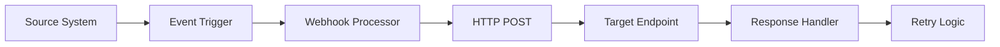

# Webhook Management Configuration Guide

## Purpose

This document provides comprehensive guidance for configuring and managing webhooks across Towne Park systems, including endpoint setup, security configuration, event handling, monitoring, and troubleshooting procedures.

## Webhook Overview

### What are Webhooks
Webhooks are HTTP callbacks that enable real-time communication between systems by automatically sending data when specific events occur. They provide an efficient way to notify external systems about changes or events without requiring constant polling.

### Webhook Architecture


## Webhook Configuration

### Endpoint Configuration

#### Webhook Endpoint Setup
**Configuration Area:** Webhook endpoint registration and management  
**Required Settings:**
- Endpoint URL configuration
- HTTP method specification
- Authentication settings
- Timeout and retry parameters

**Configuration Parameters:**
```yaml
webhook_endpoints:
  rss_file_processed:
    url: "https://api.townepark.com/webhooks/rss/file-processed"
    method: "POST"
    timeout_seconds: 30
    max_retries: 3
    retry_intervals: [30, 60, 120]
    authentication:
      type: "bearer_token"
      header: "Authorization"
      token_source: "environment"
  billing_invoice_generated:
    url: "https://api.townepark.com/webhooks/billing/invoice-generated"
    method: "POST"
    timeout_seconds: 45
    max_retries: 5
    retry_intervals: [15, 30, 60, 120, 300]
    authentication:
      type: "api_key"
      header: "X-API-Key"
      key_source: "vault"
```

#### Event Subscription Configuration
**Configuration Area:** Event types and subscription management  
**Required Settings:**
- Event type definitions
- Subscription filters
- Payload format specifications
- Delivery guarantees

**Configuration Parameters:**
```yaml
event_subscriptions:
  rss_events:
    file_uploaded:
      enabled: true
      endpoints: ["rss_file_processed"]
      filters:
        file_types: ["csv", "xlsx"]
        min_file_size: 1024
      payload_format: "json"
    validation_failed:
      enabled: true
      endpoints: ["rss_file_processed"]
      filters:
        error_types: ["format_error", "business_rule_violation"]
      payload_format: "json"
  billing_events:
    invoice_generated:
      enabled: true
      endpoints: ["billing_invoice_generated"]
      filters:
        invoice_types: ["standard", "adjustment"]
        min_amount: 0.01
      payload_format: "json"
```

### Security Configuration

#### Authentication Settings
**Configuration Area:** Webhook security and authentication  
**Required Settings:**
- Authentication method configuration
- Token management procedures
- Certificate handling
- IP whitelisting

**Configuration Parameters:**
```yaml
security:
  authentication:
    bearer_token:
      token_length: 64
      token_expiry_hours: 24
      refresh_threshold_hours: 6
      encryption_algorithm: "AES-256"
    api_key:
      key_length: 32
      rotation_days: 90
      storage_location: "vault"
      encryption_required: true
  network_security:
    ip_whitelist:
      enabled: true
      allowed_ranges:
        - "10.0.0.0/8"
        - "172.16.0.0/12"
        - "192.168.0.0/16"
    rate_limiting:
      requests_per_minute: 100
      burst_limit: 20
      block_duration_minutes: 15
```

#### Payload Security
**Configuration Area:** Webhook payload protection and validation  
**Required Settings:**
- Payload encryption settings
- Signature verification
- Content validation rules
- Data sanitization

**Configuration Parameters:**
```yaml
payload_security:
  encryption:
    enabled: true
    algorithm: "AES-256-GCM"
    key_rotation_days: 30
  signature:
    enabled: true
    algorithm: "HMAC-SHA256"
    header_name: "X-Webhook-Signature"
    secret_source: "vault"
  validation:
    schema_validation: true
    content_type_check: true
    max_payload_size: "1MB"
    sanitization_enabled: true
```

### Event Management

#### Event Types and Schemas
**RSS System Events:**
```json
{
  "file_processed": {
    "event_type": "rss.file.processed",
    "schema": {
      "file_id": "string",
      "file_name": "string",
      "site_number": "string",
      "processing_status": "enum[success, failed, partial]",
      "record_count": "integer",
      "error_count": "integer",
      "timestamp": "datetime"
    }
  },
  "validation_failed": {
    "event_type": "rss.validation.failed",
    "schema": {
      "file_id": "string",
      "file_name": "string",
      "validation_errors": "array",
      "error_count": "integer",
      "timestamp": "datetime"
    }
  }
}
```

**Billing System Events:**
```json
{
  "invoice_generated": {
    "event_type": "billing.invoice.generated",
    "schema": {
      "invoice_id": "string",
      "customer_id": "string",
      "site_number": "string",
      "invoice_amount": "decimal",
      "invoice_date": "date",
      "due_date": "date",
      "timestamp": "datetime"
    }
  },
  "payment_received": {
    "event_type": "billing.payment.received",
    "schema": {
      "payment_id": "string",
      "invoice_id": "string",
      "payment_amount": "decimal",
      "payment_date": "date",
      "payment_method": "string",
      "timestamp": "datetime"
    }
  }
}
```

#### Event Filtering and Routing
**Configuration Area:** Event filtering and routing logic  
**Required Settings:**
- Filter criteria definition
- Routing rules configuration
- Conditional delivery settings
- Priority handling

**Configuration Parameters:**
```yaml
event_routing:
  filters:
    site_based:
      enabled: true
      filter_field: "site_number"
      routing_table:
        "0001": ["endpoint_group_a"]
        "0002": ["endpoint_group_b"]
        "default": ["endpoint_group_default"]
    amount_based:
      enabled: true
      filter_field: "invoice_amount"
      rules:
        - condition: "> 10000"
          endpoints: ["high_value_endpoint"]
        - condition: "> 1000"
          endpoints: ["medium_value_endpoint"]
        - condition: "default"
          endpoints: ["standard_endpoint"]
  priority_handling:
    high_priority_events: ["payment_received", "validation_failed"]
    priority_queue_enabled: true
    priority_retry_intervals: [5, 10, 20]
```

### Monitoring and Alerting

#### Performance Monitoring
**Configuration Area:** Webhook performance tracking and optimization  
**Required Settings:**
- Response time monitoring
- Success rate tracking
- Throughput measurement
- Error rate analysis

**Configuration Parameters:**
```yaml
monitoring:
  performance:
    response_time_threshold_ms: 5000
    success_rate_threshold: 95
    throughput_threshold_per_minute: 1000
    error_rate_threshold: 5
  metrics_collection:
    enabled: true
    collection_interval_seconds: 60
    retention_days: 30
    aggregation_levels: ["minute", "hour", "day"]
  dashboards:
    real_time_monitoring: true
    historical_analysis: true
    alert_integration: true
```

#### Alert Configuration
**Configuration Area:** Alert conditions and notification settings  
**Required Settings:**
- Alert threshold configuration
- Notification channel setup
- Escalation procedures
- Alert suppression rules

**Configuration Parameters:**
```yaml
alerting:
  thresholds:
    response_time_critical: 10000  # ms
    response_time_warning: 5000    # ms
    error_rate_critical: 10        # percentage
    error_rate_warning: 5          # percentage
    success_rate_critical: 90      # percentage
    success_rate_warning: 95       # percentage
  notifications:
    email:
      enabled: true
      recipients: ["webhook-admin@townepark.com"]
      template: "webhook_alert"
    slack:
      enabled: true
      channel: "#webhook-alerts"
      webhook_url: "https://hooks.slack.com/services/..."
    sms:
      enabled: false
      recipients: ["+1234567890"]
  escalation:
    levels:
      - delay_minutes: 0
        channels: ["email"]
      - delay_minutes: 15
        channels: ["email", "slack"]
      - delay_minutes: 30
        channels: ["email", "slack", "sms"]
```

### Error Handling and Recovery

#### Retry Configuration
**Configuration Area:** Retry logic and failure handling  
**Required Settings:**
- Retry strategy configuration
- Backoff algorithm settings
- Dead letter queue setup
- Circuit breaker configuration

**Configuration Parameters:**
```yaml
error_handling:
  retry_strategy:
    max_attempts: 5
    backoff_type: "exponential"
    base_delay_seconds: 30
    max_delay_seconds: 3600
    jitter_enabled: true
    jitter_percentage: 10
  circuit_breaker:
    enabled: true
    failure_threshold: 10
    timeout_seconds: 60
    half_open_max_calls: 3
  dead_letter_queue:
    enabled: true
    max_retention_days: 7
    reprocessing_enabled: true
    manual_review_required: true
```

#### Error Classification
**Configuration Area:** Error type classification and handling  
**Required Settings:**
- Error type definitions
- Handling strategies per error type
- Logging and notification rules
- Recovery procedures

**Configuration Parameters:**
```yaml
error_classification:
  transient_errors:
    types: ["timeout", "connection_refused", "service_unavailable"]
    retry_enabled: true
    max_retries: 5
    notification_threshold: 3
  permanent_errors:
    types: ["authentication_failed", "not_found", "bad_request"]
    retry_enabled: false
    immediate_notification: true
    manual_intervention_required: true
  rate_limit_errors:
    types: ["too_many_requests"]
    retry_enabled: true
    backoff_multiplier: 2
    max_backoff_seconds: 1800
```

## Operational Procedures

### Webhook Registration
**Procedure:** Adding new webhook endpoints
1. **Endpoint Validation**
   - Verify endpoint URL accessibility
   - Test authentication mechanism
   - Validate response handling
   - Confirm security compliance

2. **Configuration Setup**
   - Add endpoint to configuration
   - Configure authentication credentials
   - Set retry and timeout parameters
   - Enable monitoring and alerting

3. **Testing and Validation**
   - Send test events to endpoint
   - Verify response handling
   - Test error scenarios
   - Validate monitoring data

### Webhook Maintenance
**Procedure:** Regular maintenance and updates
1. **Health Monitoring**
   - Review performance metrics
   - Analyze error rates and patterns
   - Check authentication token expiry
   - Validate endpoint accessibility

2. **Configuration Updates**
   - Update endpoint URLs as needed
   - Rotate authentication credentials
   - Adjust retry parameters
   - Update event subscriptions

3. **Performance Optimization**
   - Analyze response times
   - Optimize payload sizes
   - Adjust retry strategies
   - Update filtering rules

### Troubleshooting Procedures

#### Common Issues and Resolutions
**Endpoint Unreachable:**
- Verify endpoint URL and network connectivity
- Check firewall and security group settings
- Validate DNS resolution
- Test endpoint accessibility from webhook server

**Authentication Failures:**
- Verify authentication credentials
- Check token expiry and rotation
- Validate authentication header format
- Test authentication mechanism independently

**High Error Rates:**
- Analyze error patterns and types
- Review endpoint response codes
- Check payload format and validation
- Investigate network connectivity issues

**Performance Issues:**
- Monitor response times and throughput
- Analyze retry patterns and frequency
- Check endpoint capacity and scaling
- Review payload sizes and optimization

#### Diagnostic Tools and Commands
```bash
# Test webhook endpoint connectivity
curl -X POST https://api.townepark.com/webhooks/test \
  -H "Authorization: Bearer <token>" \
  -H "Content-Type: application/json" \
  -d '{"test": "data"}'

# Check webhook configuration
kubectl get configmap webhook-config -o yaml

# View webhook logs
kubectl logs -f deployment/webhook-processor

# Monitor webhook metrics
curl http://webhook-metrics:8080/metrics
```

## Related Documentation

### Technical Specifications
- [RSS Technical Specifications](../../technical/specifications/20250723_RSS_TechnicalSpec_TroubleshootingProcedures.md)
- [Integration Technical Specifications](../../technical/integrations/index.md)

### Business Rules
- [RSS Business Rules](../../business-rules/billing/20250723_RSS_FileValidation_BusinessRules.md)

### User Processes
- [RSS Troubleshooting Process](../../user-processes/billing-admin/20250723_RSS_TroubleshootingProcess_UserGuide.md)

### Configuration
- [RSS System Configuration](rss-system-configuration.md)
- [System Settings](index.md)

## Best Practices

### Webhook Design Principles
1. **Idempotency**: Design webhooks to handle duplicate deliveries gracefully
2. **Reliability**: Implement proper retry mechanisms and error handling
3. **Security**: Use strong authentication and validate all incoming data
4. **Performance**: Optimize payload sizes and response times
5. **Monitoring**: Implement comprehensive monitoring and alerting

### Security Best Practices
1. **Authentication**: Use strong authentication mechanisms (OAuth 2.0, API keys)
2. **Encryption**: Encrypt sensitive data in webhook payloads
3. **Validation**: Validate all incoming webhook data and signatures
4. **Network Security**: Use IP whitelisting and secure network connections
5. **Audit Logging**: Log all webhook activities for security auditing

### Operational Excellence
1. **Documentation**: Maintain comprehensive webhook documentation
2. **Testing**: Implement automated testing for webhook functionality
3. **Monitoring**: Use real-time monitoring and alerting systems
4. **Incident Response**: Establish clear incident response procedures
5. **Capacity Planning**: Plan for webhook traffic growth and scaling needs