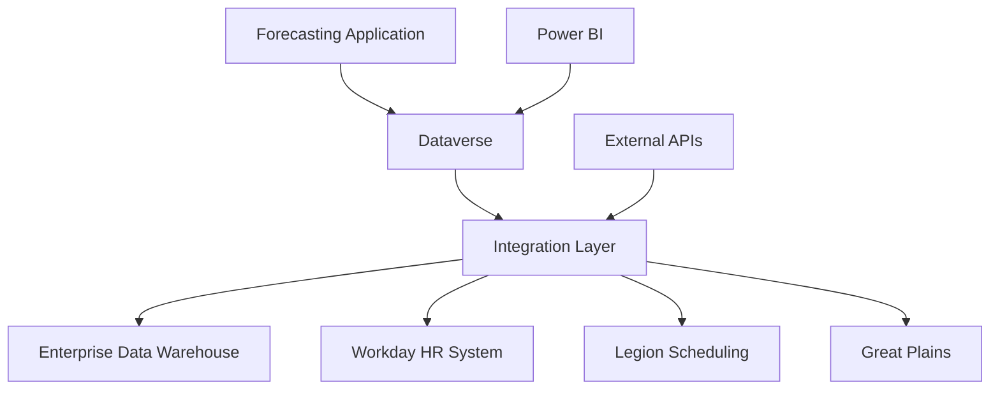

# Forecasting System Overview

## Introduction

The Towne Park Forecasting System is a comprehensive financial forecasting platform built on Microsoft Power Platform, designed to provide accurate site-level forecasting, statistical analysis, and performance management capabilities across all Towne Park operations.

## System Architecture

### Platform Foundation
- **Microsoft Power Platform**: Core development and runtime platform
- **Microsoft Dataverse**: Unified data platform and storage
- **Power Apps**: User interface and application layer
- **Power Automate**: Business process automation and workflows
- **Power BI**: Business intelligence and reporting

### Integration Architecture

## Core System Features

### Site Statistics Management
- **Comprehensive Data Collection**: Multi-dimensional site performance data collection
- **Real-Time Statistics**: Real-time statistical data entry and validation
- **Historical Analysis**: Historical trend analysis and comparative reporting
- **Performance Benchmarking**: Site-to-site performance comparison and benchmarking
- **Data Quality Assurance**: Automated data validation and quality checks

### Payroll Forecasting
- **Job Family Management**: Comprehensive job family and job code management
- **Labor Cost Forecasting**: Accurate labor cost forecasting and budgeting
- **Scheduling Integration**: Integration with scheduling systems for workforce planning
- **Performance Tracking**: Employee and job family performance tracking
- **Budget Planning**: Detailed payroll budget planning and variance analysis

### Revenue Forecasting
- **Revenue Projections**: Comprehensive revenue forecasting and projections
- **Rate Management**: Dynamic rate management and escalation tracking
- **Performance Analysis**: Revenue performance analysis and optimization
- **Contract Integration**: Integration with contract management for rate validation
- **Scenario Planning**: Multiple scenario planning and analysis capabilities

### P&L and FLC Analysis
- **Profit & Loss Analysis**: Comprehensive P&L analysis and reporting
- **Front Line Contribution**: Detailed FLC calculation and analysis
- **Cost Analysis**: Detailed cost analysis and allocation
- **Variance Analysis**: Variance analysis and performance tracking
- **Financial Reporting**: Automated financial reporting and analytics

## Business Process Automation

### Forecasting Workflows
- **Data Collection**: Automated data collection and validation workflows
- **Calculation Processing**: Automated calculation processing and validation
- **Approval Workflows**: Multi-level approval workflows for forecast submissions
- **Exception Handling**: Automated exception detection and resolution
- **Reporting**: Automated report generation and distribution

### User Role-Based Processes
- **Account Manager Workflows**: Site-level forecasting and data management
- **District Manager Workflows**: Regional oversight and approval processes
- **Corporate Finance Workflows**: Corporate-level analysis and reporting
- **System Administration**: System configuration and maintenance workflows

### Integration Workflows
- **Data Synchronization**: Automated data synchronization across systems
- **Validation Processing**: Automated validation and quality checking
- **Error Resolution**: Automated error detection and resolution workflows
- **Audit Trail**: Comprehensive audit trail and compliance tracking

## Integration Capabilities

### Enterprise System Integration
- **EDW Integration**: Comprehensive integration with Enterprise Data Warehouse
- **Workday Integration**: Real-time integration with Workday HR system
- **Legion Integration**: Scheduling system integration for workforce planning
- **Great Plains Integration**: Financial system integration for accounting
- **Contract System Integration**: Contract management system integration

### Data Synchronization
- **Real-Time Updates**: Real-time data synchronization and updates
- **Batch Processing**: Efficient batch processing for large data volumes
- **Data Validation**: Comprehensive data validation and quality assurance
- **Error Handling**: Robust error handling and recovery mechanisms
- **Audit Logging**: Complete audit logging of all integration activities

## User Interface and Experience

### Modern Application Design
- **Responsive Interface**: Mobile-friendly responsive design
- **Intuitive Navigation**: User-friendly navigation and interface design
- **Role-Based Views**: Customized views based on user roles and responsibilities
- **Dashboard Analytics**: Real-time dashboard and key performance indicators
- **Accessibility Compliance**: Full accessibility standards compliance

### Key User Experiences
- **Account Manager Interface**: Site-level forecasting and data management
- **District Manager Interface**: Regional oversight and performance management
- **Corporate Finance Interface**: Corporate-level analysis and reporting
- **System Administrator Interface**: System configuration and maintenance

## Reporting and Analytics

### Operational Reporting
- **Site Performance**: Comprehensive site performance analysis and reporting
- **Statistical Analysis**: Statistical analysis and trend reporting
- **Payroll Analysis**: Payroll analysis and cost management reporting
- **Revenue Analysis**: Revenue analysis and performance reporting
- **Variance Analysis**: Variance analysis and exception reporting

### Executive Dashboards
- **Financial KPIs**: Key financial performance indicators and metrics
- **Operational Metrics**: Operational performance and efficiency metrics
- **Performance Trends**: Performance trend analysis and forecasting
- **Exception Reporting**: Exception analysis and resolution tracking
- **Strategic Analytics**: Strategic performance and goal tracking

### Advanced Analytics
- **Predictive Analytics**: Predictive modeling and forecasting capabilities
- **Trend Analysis**: Historical trend analysis and pattern recognition
- **Comparative Analysis**: Site-to-site and period-to-period comparison
- **Performance Optimization**: Performance optimization recommendations
- **Risk Analytics**: Risk assessment and mitigation analysis

## Security and Compliance

### Security Framework
- **Multi-Factor Authentication**: Required multi-factor authentication for all users
- **Role-Based Access Control**: Granular role-based access control and permissions
- **Data Encryption**: End-to-end data encryption and protection
- **Audit Logging**: Comprehensive audit logging and monitoring
- **Network Security**: Secure network communication and protocols

### Compliance Capabilities
- **Regulatory Compliance**: Compliance with financial regulations and standards
- **Data Privacy**: Compliance with data privacy and protection regulations
- **Industry Standards**: Adherence to industry-specific forecasting standards
- **Audit Support**: Comprehensive audit support and documentation
- **Risk Management**: Risk assessment and mitigation capabilities

## Performance and Scalability

### Performance Optimization
- **High Performance**: Optimized performance for complex calculations
- **Scalable Architecture**: Horizontally and vertically scalable architecture
- **Efficient Processing**: Efficient processing algorithms and optimization
- **Caching Strategy**: Strategic caching for improved response times
- **Load Balancing**: Distributed load balancing and resource management

### Monitoring and Management
- **Real-Time Monitoring**: Real-time system monitoring and alerting
- **Performance Analytics**: Performance analytics and optimization recommendations
- **Capacity Planning**: Proactive capacity planning and management
- **Health Monitoring**: System health monitoring and maintenance
- **Disaster Recovery**: Comprehensive disaster recovery and business continuity

## Data Quality and Validation

### Data Quality Framework
- **Data Validation**: Comprehensive data validation and quality checks
- **Error Detection**: Automated error detection and reporting
- **Data Cleansing**: Automated data cleansing and correction
- **Quality Metrics**: Data quality metrics and performance tracking
- **Continuous Improvement**: Continuous improvement of data quality processes

### Validation Processes
- **Input Validation**: Real-time input validation and feedback
- **Business Rule Validation**: Business rule validation and enforcement
- **Cross-System Validation**: Cross-system data validation and consistency
- **Historical Validation**: Historical data validation and comparison
- **Quality Assurance**: Quality assurance and compliance validation

## Implementation and Support

### Implementation Approach
- **Phased Implementation**: Structured phased implementation approach
- **Change Management**: Comprehensive change management and training
- **Data Migration**: Secure and efficient data migration procedures
- **Testing and Validation**: Comprehensive testing and validation processes
- **Go-Live Support**: Full go-live support and monitoring

### Ongoing Support
- **Technical Support**: Comprehensive technical support and maintenance
- **User Training**: Ongoing user training and certification programs
- **System Updates**: Regular system updates and feature enhancements
- **Performance Optimization**: Continuous performance monitoring and optimization
- **Business Support**: Business process support and optimization

## Related Documentation

- [Forecasting System Comprehensive Master](20250718_Forecasting_SystemOverview_ComprehensiveMaster.md) ✓ VERIFIED
- [Forecasting System Architecture](20250716_Forecasting_SystemOverview_MasterArchitecture.md) ✓ VERIFIED
- [Forecasting Business Rules](../../business-rules/forecasting/index.md) ✓ VERIFIED
- [Forecasting User Processes](../../user-processes/forecasting/index.md) ✓ VERIFIED

## Quick Links

- [Technical Architecture](../../technical/forecasting/index.md)
- [Integration Strategy](../../technical/integrations/index.md)
- [System Configuration](../../configuration/index.md)
- [Development Standards](../../configuration/system-settings/20250718_Development_Standards_ComprehensiveGuide.md)
