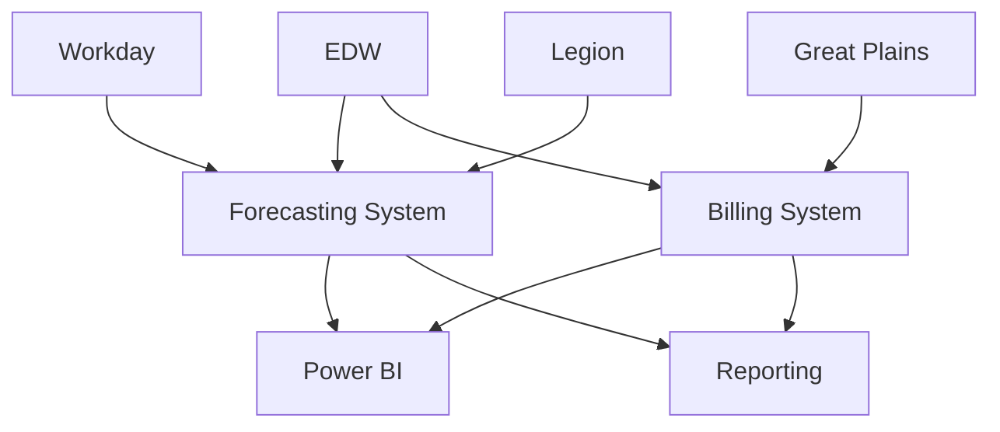

# Systems Documentation

## Overview

This section contains comprehensive documentation for all Towne Park systems, providing detailed information about system architecture, functionality, and integration patterns.

## Core Systems

### [Billing System](billing/overview.md)
Comprehensive billing and invoicing system built on Microsoft Power Platform.

**Key Features:**
- Automated invoice generation
- Revenue share calculations
- Contract management integration
- Financial reporting and analytics

**Recent Updates:**
- [PowerBill System Overview](billing/20250716_Billing_SystemOverview_PowerBill.md)
- [Generate Invoices](billing/generate-invoices.md)

### [Forecasting System](forecasting/overview.md)
Advanced forecasting platform for financial planning and analysis.

**Key Features:**
- Site statistics forecasting
- Payroll planning and analysis
- P&L view and FLC calculations
- Integration with EDW and Legion

**Recent Updates:**
- [Comprehensive Master Overview](forecasting/20250718_Forecasting_SystemOverview_ComprehensiveMaster.md)
- [Technical Architecture & API Design](../technical/backend/20250718_Forecasting_TechnicalArchitecture_APIDesign.md)
- [Master Architecture](forecasting/20250716_Forecasting_SystemOverview_MasterArchitecture.md)

### [Contract Management System](contracts/20250716_Contracts_SystemOverview_PowerBill.md)
Centralized contract management and configuration system.

**Key Features:**
- Contract lifecycle management
- Rate and escalation management
- Deal type configuration
- Integration with billing and forecasting

### [Customer Site Management](customer-sites/20250716_CustomerSites_SystemOverview_Management.md)
Comprehensive customer and site management platform.

**Key Features:**
- Site directory and management
- Customer relationship management
- Territory assignment
- Operational configuration

## System Architecture

### Integration Architecture
All systems are built on a modern, cloud-based architecture with extensive integration capabilities:

- **Microsoft Power Platform**: Core application platform
- **Microsoft Dataverse**: Unified data platform
- **Enterprise Data Warehouse (EDW)**: Central data repository
- **API-First Design**: RESTful APIs for all system interactions

### Data Flow

## System Status

| System | Status | Last Updated | Key Metrics |
|--------|--------|--------------|-------------|
| Billing System | Production | 2025-07-16 | 99.5% uptime |
| Forecasting System | Development | 2025-07-18 | Beta testing |
| Contract Management | Production | 2025-07-16 | 99.8% uptime |
| Customer Sites | Production | 2025-07-16 | 99.7% uptime |

## Related Documentation

- [Business Rules](../business-rules/index.md) ✓ VERIFIED
- [Technical Reference](../technical/index.md) ✓ VERIFIED
- [User Processes](../user-processes/index.md) ✓ VERIFIED
- [Configuration Guides](../configuration/index.md) ✓ VERIFIED

## Quick Links

- [System Architecture Overview](../technical/backend/index.md)
- [Integration Strategy](../technical/integrations/20250718_Architecture_IntegrationStrategy_HybridConnections.md)
- [Development Standards](../configuration/system-settings/20250718_Development_Standards_ComprehensiveGuide.md)
- [Power Platform Licensing](../configuration/system-settings/20250718_Architecture_LicensingAnalysis_PowerPlatform.md)