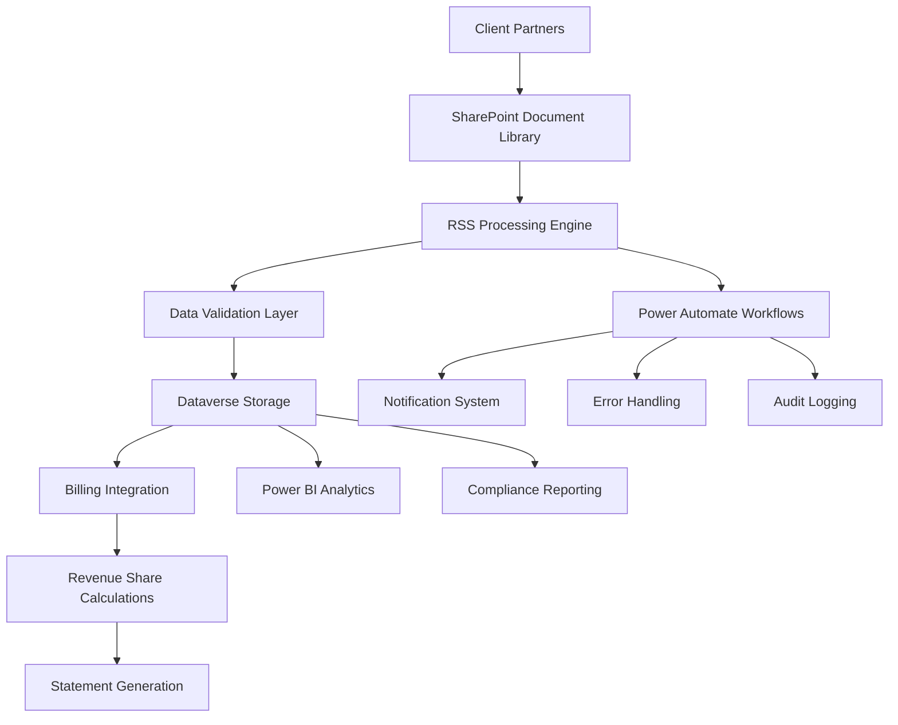

# RSS System Overview

## Executive Summary

The Revenue Sharing System (RSS) is a comprehensive platform designed to automate the collection, validation, and processing of revenue sharing data from Towne Park's client partners. The system integrates with SharePoint for document management, Dataverse for data storage, and Power Automate for workflow automation, providing end-to-end revenue sharing management capabilities.

## System Architecture

### High-Level Architecture


### Core Components

#### SharePoint Integration Layer
- **Purpose**: Secure document repository for revenue sharing files
- **Technology**: SharePoint Online with custom document libraries
- **Capabilities**:
  - Automated file ingestion from client partners
  - Version control and document history
  - Metadata extraction and tagging
  - Security and access control management
  - Integration with Power Platform services

#### RSS Processing Engine
- **Purpose**: Orchestrate the complete revenue sharing workflow
- **Technology**: Power Automate with custom connectors
- **Features**:
  - Automated file detection and processing
  - Multi-format file support (Excel, CSV, PDF)
  - Business rule validation and enforcement
  - Error handling and retry mechanisms
  - Real-time status tracking and notifications

#### Data Validation Layer
- **Purpose**: Ensure data quality and business rule compliance
- **Technology**: Power Apps with custom validation logic
- **Validation Types**:
  - File format and structure validation
  - Data type and range validation
  - Business rule compliance checking
  - Duplicate detection and handling
  - Completeness and accuracy verification

#### Dataverse Storage
- **Purpose**: Central repository for validated revenue sharing data
- **Technology**: Microsoft Dataverse with custom entities
- **Data Model**:
  - Revenue sharing agreements
  - Transaction records
  - Validation results
  - Processing status and audit trails
  - Partner and location information

## Business Capabilities

### Revenue Sharing File Processing

#### Automated File Ingestion
```yaml
FileIngestion:
  supported_formats:
    - "Excel (.xlsx, .xls)"
    - "CSV (.csv)"
    - "PDF (structured data)"
    - "XML (structured data)"
  
  processing_frequency: "Real-time upon file upload"
  validation_rules:
    - "File size limits (max 50MB)"
    - "Required metadata fields"
    - "Naming convention compliance"
    - "Partner authentication"
  
  error_handling:
    - "Invalid format rejection"
    - "Quarantine for manual review"
    - "Automatic notification to submitter"
    - "Retry mechanisms for transient failures"
```

#### Data Extraction and Transformation
```yaml
DataExtraction:
  extraction_methods:
    excel_parsing: "Automated worksheet and cell range detection"
    csv_parsing: "Delimiter detection and field mapping"
    pdf_extraction: "OCR and structured data extraction"
    xml_parsing: "Schema-based data extraction"
  
  transformation_rules:
    data_normalization: "Standardize formats and values"
    currency_conversion: "Convert to standard currency"
    date_standardization: "ISO 8601 date format"
    field_mapping: "Map to standard data model"
  
  quality_assurance:
    completeness_check: "Verify all required fields"
    accuracy_validation: "Cross-reference with master data"
    consistency_verification: "Ensure data consistency"
    business_rule_validation: "Apply domain-specific rules"
```

### Revenue Calculation and Validation

#### Revenue Share Calculation Engine
```yaml
CalculationEngine:
  calculation_types:
    percentage_based: "Fixed percentage of gross revenue"
    tiered_percentage: "Variable percentage based on volume"
    minimum_guarantee: "Guaranteed minimum payment"
    hybrid_models: "Combination of multiple methods"
  
  calculation_frequency: "Monthly processing cycle"
  validation_controls:
    mathematical_accuracy: "Verify calculation correctness"
    business_rule_compliance: "Ensure rule adherence"
    historical_comparison: "Compare with previous periods"
    threshold_validation: "Check against expected ranges"
  
  audit_capabilities:
    calculation_trail: "Complete audit trail"
    version_control: "Track calculation changes"
    approval_workflow: "Multi-level approval process"
    exception_reporting: "Identify and report anomalies"
```

#### Data Reconciliation
```yaml
DataReconciliation:
  reconciliation_types:
    partner_reconciliation: "Compare with partner records"
    internal_reconciliation: "Validate against internal systems"
    period_reconciliation: "Ensure period completeness"
    calculation_reconciliation: "Verify calculation accuracy"
  
  reconciliation_frequency: "Daily for critical data, weekly for comprehensive"
  variance_thresholds:
    acceptable_variance: "±0.1% for financial data"
    investigation_threshold: "±1% triggers investigation"
    escalation_threshold: "±5% requires management review"
  
  resolution_procedures:
    automated_correction: "Fix known data issues"
    manual_investigation: "Research significant variances"
    partner_communication: "Coordinate with partners"
    documentation_requirements: "Document all resolutions"
```

## Integration Architecture

### SharePoint Integration

#### Document Library Configuration
```yaml
SharePointConfig:
  library_structure:
    incoming_files: "New files from partners"
    processing_queue: "Files being processed"
    validated_files: "Successfully validated files"
    error_files: "Files with validation errors"
    archived_files: "Completed processing files"
  
  metadata_schema:
    partner_id: "Unique partner identifier"
    submission_date: "File submission timestamp"
    processing_status: "Current processing state"
    validation_results: "Validation outcome summary"
    business_period: "Revenue period covered"
  
  security_configuration:
    partner_access: "Read/write to specific folders"
    processor_access: "Full access to processing areas"
    auditor_access: "Read-only access to all areas"
    admin_access: "Full administrative privileges"
```

#### Delta Token Management
```yaml
DeltaTokenManagement:
  change_detection:
    file_additions: "New files uploaded"
    file_modifications: "Existing files updated"
    metadata_changes: "File properties modified"
    permission_changes: "Access rights updated"
  
  synchronization_frequency: "Every 5 minutes"
  token_persistence: "Stored in Dataverse for reliability"
  error_handling:
    token_expiration: "Automatic token refresh"
    sync_failures: "Retry with exponential backoff"
    data_corruption: "Full resync capability"
  
  performance_optimization:
    incremental_sync: "Process only changed items"
    batch_processing: "Group changes for efficiency"
    parallel_processing: "Multiple concurrent sync operations"
```

### Power Platform Integration

#### Power Automate Workflows
```yaml
PowerAutomateWorkflows:
  file_processing_workflow:
    trigger: "SharePoint file upload"
    steps:
      - "File validation and metadata extraction"
      - "Data parsing and transformation"
      - "Business rule validation"
      - "Dataverse record creation"
      - "Notification dispatch"
    
  calculation_workflow:
    trigger: "Monthly schedule or manual trigger"
    steps:
      - "Data aggregation and preparation"
      - "Revenue share calculations"
      - "Validation and approval routing"
      - "Result storage and reporting"
      - "Partner notification"
    
  error_handling_workflow:
    trigger: "Processing error detection"
    steps:
      - "Error classification and logging"
      - "Automatic retry attempts"
      - "Escalation to human operators"
      - "Resolution tracking and reporting"
```

#### Power Apps Interface
```yaml
PowerAppsInterface:
  user_interfaces:
    partner_portal: "File submission and status tracking"
    processor_dashboard: "Processing queue management"
    validator_interface: "Data validation and approval"
    administrator_console: "System configuration and monitoring"
  
  key_features:
    real_time_status: "Live processing status updates"
    interactive_validation: "Manual validation capabilities"
    exception_handling: "Error resolution workflows"
    reporting_tools: "Built-in analytics and reporting"
  
  mobile_capabilities:
    responsive_design: "Optimized for mobile devices"
    offline_functionality: "Limited offline capabilities"
    push_notifications: "Real-time alerts and updates"
    touch_optimized: "Touch-friendly interface design"
```

## Data Model and Storage

### Dataverse Entities

#### Revenue Sharing Agreement Entity
```yaml
RevenueSharingAgreement:
  entity_name: "tp_revenuesharing_agreement"
  primary_key: "tp_agreementid"
  
  key_attributes:
    tp_partnername: "Partner organization name"
    tp_agreementnumber: "Unique agreement identifier"
    tp_effectivedate: "Agreement start date"
    tp_expirationdate: "Agreement end date"
    tp_sharingpercentage: "Revenue sharing percentage"
    tp_minimumguarantee: "Minimum guaranteed payment"
    tp_calculationmethod: "Calculation methodology"
    tp_paymentterms: "Payment schedule and terms"
  
  relationships:
    tp_partner: "Link to partner entity"
    tp_locations: "Associated locations"
    tp_transactions: "Related revenue transactions"
```

#### Revenue Transaction Entity
```yaml
RevenueTransaction:
  entity_name: "tp_revenue_transaction"
  primary_key: "tp_transactionid"
  
  key_attributes:
    tp_transactiondate: "Date of revenue transaction"
    tp_amount: "Transaction amount"
    tp_transactiontype: "Type of revenue"
    tp_location: "Location identifier"
    tp_period: "Business period"
    tp_validationstatus: "Validation state"
    tp_calculatedshare: "Calculated sharing amount"
    tp_processingdate: "Date processed"
  
  relationships:
    tp_agreement: "Associated sharing agreement"
    tp_partner: "Partner organization"
    tp_submissionfile: "Source file reference"
```

#### File Submission Entity
```yaml
FileSubmission:
  entity_name: "tp_file_submission"
  primary_key: "tp_submissionid"
  
  key_attributes:
    tp_filename: "Original file name"
    tp_submissiondate: "File upload timestamp"
    tp_filesize: "File size in bytes"
    tp_filetype: "File format type"
    tp_processingstatus: "Current processing state"
    tp_validationresults: "Validation outcome"
    tp_errorcount: "Number of validation errors"
    tp_recordcount: "Number of records processed"
  
  relationships:
    tp_partner: "Submitting partner"
    tp_processor: "Processing user"
    tp_transactions: "Extracted transactions"
```

## Security and Compliance

### Access Control and Security

#### Role-Based Security Model
```yaml
SecurityModel:
  security_roles:
    rss_administrator:
      permissions: "Full system access and configuration"
      users: "System administrators and IT staff"
    
    rss_processor:
      permissions: "File processing and validation"
      users: "Revenue sharing analysts and processors"
    
    rss_validator:
      permissions: "Data validation and approval"
      users: "Senior analysts and supervisors"
    
    partner_user:
      permissions: "File submission and status viewing"
      users: "Partner organization representatives"
  
  data_access_controls:
    partner_isolation: "Partners can only access their own data"
    field_level_security: "Sensitive fields restricted by role"
    audit_trail: "All access logged and monitored"
    time_based_access: "Access restrictions based on business hours"
```

#### Data Protection and Privacy
```yaml
DataProtection:
  encryption_standards:
    data_at_rest: "AES-256 encryption for stored data"
    data_in_transit: "TLS 1.3 for all communications"
    key_management: "Azure Key Vault integration"
    certificate_management: "Automated certificate lifecycle"
  
  privacy_controls:
    data_minimization: "Collect only necessary data"
    retention_policies: "Automated data lifecycle management"
    anonymization: "Remove PII from analytics data"
    consent_management: "Track and manage data consent"
  
  compliance_features:
    gdpr_compliance: "EU data protection requirements"
    sox_compliance: "Financial data controls"
    audit_logging: "Comprehensive activity logging"
    data_lineage: "Track data movement and transformations"
```

### Audit and Compliance

#### Audit Trail Management
```yaml
AuditTrail:
  audit_events:
    file_submissions: "All file upload activities"
    data_processing: "Processing steps and outcomes"
    user_access: "System access and actions"
    configuration_changes: "System modifications"
    calculation_results: "Revenue calculations and approvals"
  
  audit_data_retention:
    active_period: "7 years for financial data"
    archive_period: "Additional 3 years in cold storage"
    deletion_procedures: "Secure data destruction"
    legal_hold: "Litigation hold capabilities"
  
  compliance_reporting:
    sox_reports: "Financial controls compliance"
    privacy_reports: "Data protection compliance"
    security_reports: "Access and security monitoring"
    operational_reports: "System performance and reliability"
```

## Performance and Scalability

### System Performance

#### Processing Performance
```yaml
ProcessingPerformance:
  file_processing_targets:
    small_files: "<1MB processed in <30 seconds"
    medium_files: "1-10MB processed in <2 minutes"
    large_files: "10-50MB processed in <10 minutes"
    batch_processing: "1000+ files processed per hour"
  
  calculation_performance:
    simple_calculations: "<1 second per transaction"
    complex_calculations: "<5 seconds per transaction"
    monthly_processing: "Complete in <4 hours"
    real_time_validation: "<2 seconds response time"
  
  system_availability:
    uptime_target: "99.9% availability"
    planned_maintenance: "Monthly 2-hour window"
    disaster_recovery: "<4 hour RTO, <1 hour RPO"
    performance_monitoring: "Real-time performance tracking"
```

#### Scalability Architecture
```yaml
ScalabilityArchitecture:
  horizontal_scaling:
    processing_nodes: "Auto-scaling based on queue depth"
    database_scaling: "Read replicas for reporting"
    storage_scaling: "Automatic storage expansion"
    network_scaling: "CDN for global file distribution"
  
  vertical_scaling:
    compute_resources: "Dynamic CPU and memory allocation"
    storage_performance: "SSD storage with IOPS scaling"
    network_bandwidth: "Adaptive bandwidth allocation"
    database_performance: "Performance tier auto-adjustment"
  
  capacity_planning:
    growth_projections: "50% annual growth accommodation"
    peak_load_handling: "3x normal load capacity"
    storage_planning: "5-year storage growth projection"
    performance_testing: "Regular load testing and optimization"
```

## Monitoring and Operations

### System Monitoring

#### Health Monitoring
```yaml
HealthMonitoring:
  system_health_checks:
    service_availability: "All critical services operational"
    database_connectivity: "Database connection and performance"
    integration_status: "External system connectivity"
    resource_utilization: "CPU, memory, and storage usage"
  
  business_process_monitoring:
    file_processing_rates: "Files processed per hour"
    validation_success_rates: "Percentage of successful validations"
    calculation_accuracy: "Accuracy of revenue calculations"
    partner_satisfaction: "Partner feedback and issue resolution"
  
  alert_thresholds:
    critical_alerts: "System outages or data corruption"
    warning_alerts: "Performance degradation or high error rates"
    informational_alerts: "Capacity planning and maintenance reminders"
```

#### Operational Dashboards
```yaml
OperationalDashboards:
  executive_dashboard:
    metrics: "High-level KPIs and business metrics"
    frequency: "Real-time updates"
    audience: "Executive leadership and business stakeholders"
  
  operations_dashboard:
    metrics: "Detailed operational metrics and alerts"
    frequency: "Real-time updates"
    audience: "Operations team and system administrators"
  
  partner_dashboard:
    metrics: "Partner-specific processing status and history"
    frequency: "Real-time updates"
    audience: "Partner organizations and account managers"
```

## Future Enhancements

### Planned Improvements

#### Technology Enhancements
- **AI/ML Integration**: Automated anomaly detection and predictive analytics
- **Advanced OCR**: Enhanced PDF and image processing capabilities
- **Real-time Analytics**: Stream processing for immediate insights
- **Mobile Applications**: Native mobile apps for partner access

#### Process Improvements
- **Automated Reconciliation**: Reduce manual reconciliation efforts
- **Predictive Validation**: Proactive error detection and prevention
- **Self-Service Portal**: Enhanced partner self-service capabilities
- **Advanced Reporting**: Interactive analytics and custom reporting

#### Integration Expansions
- **ERP Integration**: Direct integration with partner ERP systems
- **Banking Integration**: Automated payment processing
- **Third-party Validation**: External data validation services
- **API Ecosystem**: Comprehensive API platform for partners

---

*This RSS system overview is maintained by the Towne Park RSS Team and is updated regularly to reflect system enhancements and operational changes.*