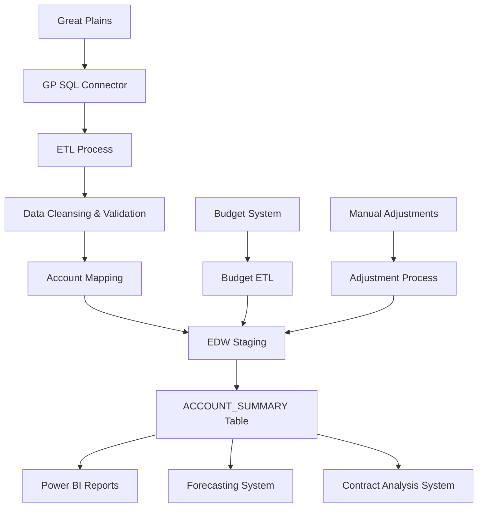

# Data Model Document

**Data Warehouse Data Model: ACCOUNT_SUMMARY**

**Author:** Jim Boyer  
**Date:** July 30, 2025  
**Version:** 1.0

## 1. Fields and Source Systems

| Field Name | Data Type | Source System | Source Field | Description |
|------------|-----------|--------------|--------------|-------------|
| SITE | CHAR(4) | Great Plains | COSTCENTERID | Site identifier |
| PERIOD | CHAR(6) | Great Plains | PERIODID | Financial period in YYYYMM format |
| MAIN_ACCOUNT | CHAR(4) | Great Plains | ACCOUNTNUMBER | GL account number |
| MAIN_ACCOUNT_DESC | VARCHAR(100) | Great Plains | ACCOUNTDESCRIPTION | GL account description |
| BALANCE | DECIMAL(18,2) | Great Plains | AMOUNT | Financial amount (negative for expenses) |
| BALANCE_TYPE | VARCHAR(10) | Great Plains | TYPE | Balance type (ACTUAL, BUDGET, FORECAST) |
| BALANCE_DATE | DATE | Great Plains | POSTINGDATE | Date associated with the balance |
| TRANSACTION_TYPE | VARCHAR(50) | Great Plains | SOURCEDOCUMENTTYPE | Type of transaction |
| TRANSACTION_ID | VARCHAR(30) | Great Plains | SOURCEDOCUMENTNUMBER | Source document identifier |
| COST_CENTER | CHAR(4) | Great Plains | COSTCENTERID | Cost center identifier (same as SITE) |
| DEPARTMENT | VARCHAR(50) | Great Plains | DEPARTMENTID | Department identifier |
| IS_SUMMARY_CATEGORY | VARCHAR(50) | EDW | Derived | Category designation (EXTERNAL REVENUE, INTERNAL REVENUE, PAYROLL, etc.) |
| FISCAL_YEAR | INT | Great Plains | Derived | Fiscal year |
| FISCAL_QUARTER | INT | Great Plains | Derived | Fiscal quarter |
| FISCAL_MONTH | INT | Great Plains | Derived | Fiscal month |
| DW_LOADED_DTTM | DATETIME | EDW | System | Timestamp when record was loaded to EDW |
| DW_SOURCE_SYSTEM | VARCHAR(50) | EDW | System | Source system identifier |
| IS_ADJUSTMENT | BIT | Great Plains | ISADJUSTMENT | Flag indicating if this is an adjustment entry |

## 2. Business Logic for Data Transformations

### IS_SUMMARY_CATEGORY Derivation
```sql
-- Logic to derive IS_SUMMARY_CATEGORY from MAIN_ACCOUNT
CASE 
  WHEN MAIN_ACCOUNT BETWEEN '1000' AND '1999' THEN 'ASSETS'
  WHEN MAIN_ACCOUNT BETWEEN '2000' AND '2999' THEN 'LIABILITIES'
  WHEN MAIN_ACCOUNT BETWEEN '3000' AND '3999' THEN 'EQUITY'
  WHEN MAIN_ACCOUNT BETWEEN '4000' AND '4499' THEN 'INTERNAL REVENUE'
  WHEN MAIN_ACCOUNT BETWEEN '4500' AND '4999' THEN 'OTHER INCOME'
  WHEN MAIN_ACCOUNT = '9410' THEN 'EXTERNAL REVENUE'
  WHEN MAIN_ACCOUNT BETWEEN '6000' AND '6999' THEN 'PAYROLL'
  WHEN MAIN_ACCOUNT BETWEEN '7000' AND '7079' THEN 'OTHER EXPENSES'
  WHEN MAIN_ACCOUNT BETWEEN '7080' AND '7089' THEN 'INSURANCE'
  WHEN MAIN_ACCOUNT BETWEEN '7090' AND '7099' THEN 'CLAIMS'
  WHEN MAIN_ACCOUNT BETWEEN '7100' AND '7199' THEN 'PTEB'
  WHEN MAIN_ACCOUNT BETWEEN '7200' AND '7299' THEN 'PARKING RENTS'
  ELSE 'OTHER'
END
```

### Fiscal Period Calculations
```sql
-- Logic to derive fiscal periods
-- Assuming fiscal year matches calendar year for Towne Park
SET FISCAL_YEAR = SUBSTRING(PERIOD, 1, 4)
SET FISCAL_MONTH = SUBSTRING(PERIOD, 5, 2)
SET FISCAL_QUARTER = CASE 
  WHEN FISCAL_MONTH BETWEEN 1 AND 3 THEN 1
  WHEN FISCAL_MONTH BETWEEN 4 AND 6 THEN 2
  WHEN FISCAL_MONTH BETWEEN 7 AND 9 THEN 3
  WHEN FISCAL_MONTH BETWEEN 10 AND 12 THEN 4
END
```

### Balance Standardization
```sql
-- Logic to standardize balances (expenses as negative, revenue as positive)
IF IS_SUMMARY_CATEGORY IN ('INTERNAL REVENUE', 'EXTERNAL REVENUE', 'OTHER INCOME') THEN
  SET BALANCE = ABS(BALANCE)  -- Ensure revenue is positive
ELSE
  SET BALANCE = -ABS(BALANCE)  -- Ensure expenses are negative
END IF
```

## 3. Runtime Calculated Key Figures

| Field Name | Calculation | Description |
|------------|-------------|-------------|
| FLC | SUM of BALANCE where IS_SUMMARY_CATEGORY = 'INTERNAL REVENUE' + SUM of BALANCE where IS_SUMMARY_CATEGORY = 'PAYROLL' + SUM of BALANCE where IS_SUMMARY_CATEGORY = 'CLAIMS' + SUM of BALANCE where IS_SUMMARY_CATEGORY = 'PTEB' + SUM of BALANCE where IS_SUMMARY_CATEGORY = 'INSURANCE' + SUM of BALANCE where IS_SUMMARY_CATEGORY = 'PARKING RENTS' + SUM of BALANCE where IS_SUMMARY_CATEGORY = 'OTHER EXPENSES' | Full Location Contribution |
| REVENUE | SUM of BALANCE where IS_SUMMARY_CATEGORY IN ('INTERNAL REVENUE', 'EXTERNAL REVENUE') | Total Revenue |
| EXPENSES | SUM of BALANCE where IS_SUMMARY_CATEGORY IN ('PAYROLL', 'CLAIMS', 'PTEB', 'INSURANCE', 'PARKING RENTS', 'OTHER EXPENSES') | Total Expenses |
| FLC_MARGIN | FLC / SUM of BALANCE where IS_SUMMARY_CATEGORY = 'INTERNAL REVENUE' * 100 | FLC as percentage of Internal Revenue |
| PAYROLL_TO_REVENUE | SUM of BALANCE where IS_SUMMARY_CATEGORY = 'PAYROLL' / REVENUE * 100 | Payroll as percentage of total revenue |

## 4. Data Flow Diagram



## 5. Reports Built from This Data Model

| Report Name | Description | Primary Audience |
|-------------|-------------|------------------|
| P&L View | Monthly profit and loss statement by site | Account Managers, Finance |
| Regional Performance Comparison | Comparative analysis across regions | Regional VPs, Executive Team |
| Contract Performance Analysis | Financial performance by contract type | Finance, Operations |
| FLC Variance Analysis | Analysis of FLC vs budget and prior year | Finance, Operations |
| Monthly Financial Close Report | Month-end financial results | Finance, Executive Team |
| Site Profitability Dashboard | Profitability metrics by site | Operations, Finance |
| Financial Forecasting Foundation | Source data for financial forecasting | Finance, Account Managers |

## 6. Production Dataset Size

- Current row count: ~78 million rows
- Monthly new rows: ~1.5 million rows
- Annual growth: ~18 million rows
- Current storage size: ~35 GB
- Projected 5-year size: ~120 GB

## 7. Indexing and Archiving Strategy

### Indexing
- Clustered index on (SITE, PERIOD, MAIN_ACCOUNT)
- Non-clustered index on (PERIOD, IS_SUMMARY_CATEGORY)
- Non-clustered index on (SITE, IS_SUMMARY_CATEGORY, PERIOD)
- Non-clustered index on (BALANCE_TYPE, PERIOD)
- Columnstore index for analytical queries on BALANCE, SITE, PERIOD, IS_SUMMARY_CATEGORY

### Archiving
- Active tier: Current year + 3 previous years in primary table
- Archive tier: Years 4-7 in separate partitioned table with identical structure
- Historical tier: Years 8+ compressed and stored in Azure Data Lake Storage
- Archiving process runs annually in January
- Access to archived data available through dedicated views that union active and archive tables

## 8. Data Management Approach

- **Extraction Method**: Full daily extract from Great Plains via SQL connector
- **Transformation**: ETL process using Azure Data Factory
- **Loading Strategy**: Daily incremental load for current month, full reload for prior month after close
- **Data Validation**:
  - Balance checks ensuring debits equal credits
  - Reconciliation with Great Plains GL balances
  - Validation of site hierarchy integrity
  - Comparison of current month to prior periods for anomaly detection
- **Error Handling**: Failed validations trigger alerts to finance team and data team
- **Correction Process**: Journal entries in Great Plains flow through to EDW within 24 hours
- **Month-End Process**: Special validation and reconciliation after month-end close
- **Disaster Recovery**: Geo-redundant storage with 4-hour RTO, 15-minute RPO

The ETL process is fully automated with monitoring and logging through Azure Monitor. Financial month-end close triggers special validation procedures to ensure data accuracy for reporting.

