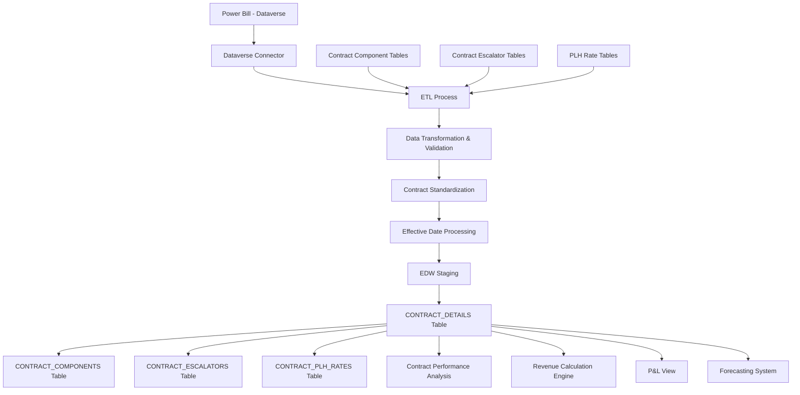

# Data Model Document

**Data Warehouse Data Model: CONTRACT_DETAILS**

**Author:** Amy Sowells  
**Date:** July 25, 2025  
**Version:** 1.1

## 1. Fields and Source Systems

| Field Name | Data Type | Source System | Source Field | Description |
|------------|-----------|--------------|--------------|-------------|
| CONTRACT_ID | VARCHAR(36) | Power Bill | ContractId | Unique identifier for contract |
| SITE | CHAR(4) | Power Bill | SiteCode | Site identifier |
| CUSTOMER_ID | VARCHAR(20) | Power Bill | CustomerId | Customer identifier |
| CONTRACT_TYPE | VARCHAR(50) | Power Bill | ContractType | Type of contract (Revenue Share, Management Agreement, PLH, POR, Fixed Fee) |
| CONTRACT_START_DATE | DATE | Power Bill | StartDate | Contract start date |
| CONTRACT_END_DATE | DATE | Power Bill | EndDate | Contract end date |
| RENEWAL_DATE | DATE | Power Bill | RenewalDate | Contract renewal date |
| STATUS | VARCHAR(20) | Power Bill | Status | Contract status (Active, Pending, Terminated, On Hold) |
| MANAGEMENT_FEE_TYPE | VARCHAR(20) | Power Bill | ManagementFeeType | Type of management fee (Fixed, Percentage, Hybrid) |
| MANAGEMENT_FEE_AMOUNT | DECIMAL(18,2) | Power Bill | ManagementFeeAmount | Fixed fee amount if applicable |
| MANAGEMENT_FEE_PERCENTAGE | DECIMAL(10,6) | Power Bill | ManagementFeePercentage | Fee percentage if applicable |
| REVSHARE_PERCENTAGE | DECIMAL(10,6) | Power Bill | RevSharePercentage | Revenue share percentage |
| POR_RATE | DECIMAL(10,2) | Power Bill | PORRate | Per occupied room rate |
| FIXED_FEE_AMOUNT | DECIMAL(18,2) | Power Bill | FixedFeeAmount | Fixed fee amount |
| BILLABLE_ACCOUNTS_ENABLED | BIT | Power Bill | BillableAccountsEnabled | Flag indicating if billable accounts are enabled |
| TOWNEPARK_DEPOSITED_REVENUE | BIT | Power Bill | TowneParkDepositedRevenue | Flag indicating if Towne Park deposits revenue |
| TOWNEPARK_RESPONSIBLE_FOR_TAX | BIT | Power Bill | TowneParkResponsibleForTax | Flag indicating if Towne Park is responsible for tax |
| TAX_RATE | DECIMAL(10,6) | Power Bill | TaxRate | Applicable tax rate |
| VALIDATION_THRESHOLD_TYPE | VARCHAR(20) | Power Bill | ValidationThresholdType | Type of validation threshold (Vehicle Count, Revenue Amount) |
| VALIDATION_THRESHOLD_AMOUNT | DECIMAL(18,2) | Power Bill | ValidationThresholdAmount | Validation threshold amount |
| IS_HYBRID | BIT | Power Bill | IsHybrid | Flag indicating if contract is a hybrid type |
| PRIMARY_COMPONENT | VARCHAR(50) | Power Bill | PrimaryComponent | Primary component for hybrid contracts |
| EFFECTIVE_DATE | DATE | Power Bill | EffectiveDate | Date when contract configuration became effective |
| CREATED_DATE | DATETIME | Power Bill | CreatedDate | Date when record was created |
| MODIFIED_DATE | DATETIME | Power Bill | ModifiedDate | Date when record was last modified |
| DW_LOADED_DTTM | DATETIME | EDW | System | Timestamp when record was loaded to EDW |
| DW_SOURCE_SYSTEM | VARCHAR(50) | EDW | System | Source system identifier |

## 2. Business Logic for Data Transformations

### CONTRACT_TYPE Standardization
```sql
-- Logic to standardize CONTRACT_TYPE
CASE 
  WHEN CONTRACT_TYPE = 'RevShare' THEN 'Revenue Share'
  WHEN CONTRACT_TYPE = 'ManagementAgreement' THEN 'Management Agreement'
  WHEN CONTRACT_TYPE = 'PerLaborHour' THEN 'PLH'
  WHEN CONTRACT_TYPE = 'PerOccupiedRoom' THEN 'POR'
  WHEN CONTRACT_TYPE = 'Fixed' OR CONTRACT_TYPE = 'FixedFee' THEN 'Fixed Fee'
  ELSE CONTRACT_TYPE
END
```

### IS_HYBRID Determination
```sql
-- Logic to determine if contract is hybrid
IF EXISTS (
  SELECT 1 
  FROM CONTRACT_COMPONENTS 
  WHERE CONTRACT_ID = CONTRACT_DETAILS.CONTRACT_ID
  GROUP BY CONTRACT_ID
  HAVING COUNT(DISTINCT COMPONENT_TYPE) > 1
) THEN
  SET IS_HYBRID = 1
ELSE
  SET IS_HYBRID = 0
END IF
```

### PRIMARY_COMPONENT Determination
```sql
-- Logic to determine primary component for hybrid contracts
IF IS_HYBRID = 1 THEN
  SELECT TOP 1 COMPONENT_TYPE
  FROM CONTRACT_COMPONENTS
  WHERE CONTRACT_ID = CONTRACT_DETAILS.CONTRACT_ID
  ORDER BY COMPONENT_PERCENTAGE DESC
ELSE
  SET PRIMARY_COMPONENT = CONTRACT_TYPE
END IF
```

## 3. Runtime Calculated Key Figures

| Field Name | Calculation | Description |
|------------|-------------|-------------|
| CONTRACT_DURATION_MONTHS | DATEDIFF(month, CONTRACT_START_DATE, CONTRACT_END_DATE) | Duration of contract in months |
| MONTHS_TO_RENEWAL | DATEDIFF(month, CURRENT_DATE, RENEWAL_DATE) | Months remaining until renewal |
| CONTRACT_AGE_MONTHS | DATEDIFF(month, CONTRACT_START_DATE, CURRENT_DATE) | Age of contract in months |
| ANNUALIZED_CONTRACT_VALUE | Based on contract type and terms (complex calculation) | Estimated annual value of contract |
| REVSHARE_TIERED_AMOUNT | Sum of tiered calculations based on revenue thresholds | Calculated revenue share for tiered contracts |
| EFFECTIVE_POR_RATE | POR_RATE adjusted for any escalators or special terms | Effective per occupied room rate |

## 4. Data Flow Diagram



## 5. Reports Built from This Data Model

| Report Name | Description | Primary Audience |
|-------------|-------------|------------------|
| Contract Performance Analysis | Performance metrics by contract type | Finance, Operations |
| Contract Renewal Dashboard | Tracking of upcoming renewals | Account Managers, Sales |
| Revenue Share Analysis | Analysis of revenue share performance | Finance, Account Managers |
| PLH Contract Profitability | Profitability of per labor hour contracts | Finance, Operations |
| Contract Type Distribution | Distribution of contract types across portfolio | Executive Team |
| Contract Term Analysis | Analysis of contract terms and durations | Finance, Legal |
| Validation Threshold Report | Analysis of validation thresholds and usage | Account Managers, Finance |

## 6. Production Dataset Size

- Current row count: ~2,500 rows (main table)
- Related tables: ~15,000 rows (components, escalators, rates)
- Monthly growth: ~50 rows
- Current storage size: ~50 MB
- Projected 5-year size: ~100 MB (relatively small but critical dataset)

## 7. Indexing and Archiving Strategy

### Indexing
- Clustered index on (SITE, EFFECTIVE_DATE)
- Non-clustered index on (CONTRACT_ID)
- Non-clustered index on (CUSTOMER_ID)
- Non-clustered index on (CONTRACT_TYPE, STATUS)
- Non-clustered index on (RENEWAL_DATE) for renewal tracking

### Archiving
- Due to the relatively small size and critical nature of contract data, all historical contract records are maintained in the active dataset
- Contract versions are tracked through effective dating rather than archiving
- Historical contract data maintained indefinitely for audit and analysis purposes
- Logical deletion through STATUS field rather than physical deletion

## 8. Data Management Approach

- **Extraction Method**: Dataverse API for Power Bill contract data
- **Transformation**: Azure Data Factory pipelines with custom transformation logic
- **Loading Strategy**: Full daily refresh to capture all contract changes
- **Change Tracking**: Effective dating and modification timestamps for all contract changes
- **Data Validation**:
  - Contract date validation (start date < end date, etc.)
  - Rate validation (within reasonable ranges)
  - Completeness checks for required fields
  - Consistency checks across related contract tables
- **Error Handling**: Validation failures logged and reported to contract administration team
- **Version Control**: Maintains all versions of contract configurations through effective dating
- **Contract Modifications**: Changes in Power Bill flow through to EDW within 24 hours
- **Security**: Restricted access to contract details based on role
- **Audit Trail**: Full audit trail of all contract changes maintained in Power Bill and replicated to EDW

The CONTRACT_DETAILS data model is a critical foundation for revenue calculations, contract performance analysis, and forecasting. It provides the contract terms and configurations needed to accurately calculate internal revenue across all contract types, including complex hybrid structures.