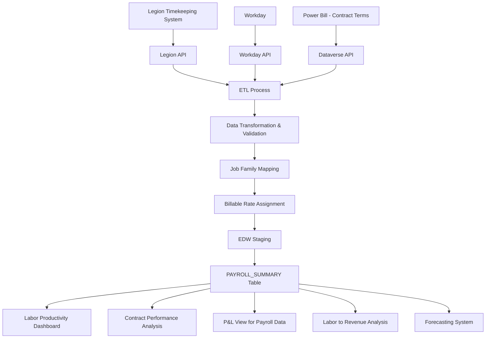

# Data Model Document

**Data Warehouse Data Model: PAYROLL_SUMMARY**

**Author:** Adam Suarez  
**Date:** August 2, 2025  
**Version:** 1.1

## 1. Fields and Source Systems

| Field Name | Data Type | Source System | Source Field | Description |
|------------|-----------|--------------|--------------|-------------|
| PAYROLL_ID | VARCHAR(36) | Legion | TimeSheetID | Unique identifier for payroll record |
| WORK_LOCATION | CHAR(4) | Legion | LocationCode | Site identifier |
| EMPLOYEE_ID | VARCHAR(20) | Legion | EmployeeID | Employee identifier |
| DATE | DATE | Legion | WorkDate | Date of work |
| TITLE | VARCHAR(100) | Legion | JobTitle | Job title/code |
| DEPARTMENT | VARCHAR(50) | Legion | Department | Department name |
| HOURS_TYPE | VARCHAR(20) | Legion | HoursType | Type of hours (Regular, Overtime, PTO, etc.) |
| TOTAL_HOURS | DECIMAL(10,2) | Legion | Hours | Number of hours worked |
| TOTAL_DOLLARS | DECIMAL(18,2) | Legion | GrossPay | Gross pay amount |
| PAY_RATE | DECIMAL(10,2) | Legion | PayRate | Hourly pay rate |
| SHIFT_START | DATETIME | Legion | ShiftStartTime | Start time of shift |
| SHIFT_END | DATETIME | Legion | ShiftEndTime | End time of shift |
| POSITION_ID | VARCHAR(20) | Legion | PositionID | Position identifier |
| COST_CENTER | CHAR(4) | Legion | CostCenter | Cost center identifier (same as WORK_LOCATION) |
| JOB_FAMILY | VARCHAR(50) | EDW | Derived | Job family grouping |
| PAY_PERIOD | CHAR(6) | Legion | PayPeriodID | Pay period identifier in YYYYPP format |
| PERIOD | CHAR(6) | EDW | Derived | Financial period in YYYYMM format |
| IS_BILLABLE | BIT | EDW/Power Bill | Derived | Flag indicating if hours are billable for PLH contracts |
| BILLABLE_RATE | DECIMAL(10,2) | EDW/Power Bill | Derived | Billable rate for PLH contracts |
| SALARIED_FLAG | BIT | Legion | IsSalaried | Flag indicating if employee is salaried |
| DW_LOADED_DTTM | DATETIME | EDW | System | Timestamp when record was loaded to EDW |
| DW_SOURCE_SYSTEM | VARCHAR(50) | EDW | System | Source system identifier |

## 2. Business Logic for Data Transformations

### JOB_FAMILY Derivation
```sql
-- Logic to derive JOB_FAMILY from TITLE
CASE 
  WHEN TITLE IN ('GSA', 'Guest Service Agent', 'Valet Attendant') THEN 'Valet'
  WHEN TITLE IN ('GSC', 'Guest Service Captain', 'Valet Lead', 'Valet Supervisor') THEN 'Supervisor'
  WHEN TITLE IN ('Cashier', 'Parking Cashier', 'Booth Attendant') THEN 'Cashier'
  WHEN TITLE IN ('Shuttle Driver', 'Transportation Driver', 'Shuttle Operator') THEN 'Shuttle'
  WHEN TITLE IN ('Account Manager', 'Assistant Manager', 'DOO', 'Manager') THEN 'Management'
  WHEN TITLE IN ('Bell Person', 'Bell Attendant', 'Bellman') THEN 'Bell'
  ELSE 'Other'
END
```

### PERIOD Calculation
```sql
-- Logic to derive PERIOD from DATE
SET PERIOD = FORMAT(DATE, 'yyyyMM')
```

### IS_BILLABLE Determination
```sql
-- Logic to determine if hours are billable for PLH contracts
-- This is a simplified version, actual logic would check contract details from Power Bill
IF EXISTS (
  SELECT 1 
  FROM CONTRACT_DETAILS 
  WHERE SITE = WORK_LOCATION 
    AND CONTRACT_TYPE = 'PLH'
    AND TITLE IN (SELECT JOB_CODE FROM PLH_BILLABLE_JOBS WHERE SITE = WORK_LOCATION)
    AND DATE BETWEEN CONTRACT_START_DATE AND CONTRACT_END_DATE
) THEN
  SET IS_BILLABLE = 1
ELSE
  SET IS_BILLABLE = 0
END IF
```

### BILLABLE_RATE Determination
```sql
-- Logic to determine billable rate for PLH contracts
-- This is a simplified version, actual logic would check contract details from Power Bill
SELECT TOP 1 BILLABLE_RATE
FROM CONTRACT_DETAILS_PLH_RATES
WHERE SITE = WORK_LOCATION
  AND JOB_CODE = TITLE
  AND DATE BETWEEN RATE_START_DATE AND RATE_END_DATE
ORDER BY RATE_START_DATE DESC
```

## 3. Runtime Calculated Key Figures

| Field Name | Calculation | Description |
|------------|-------------|-------------|
| AVERAGE_HOURLY_RATE | SUM(TOTAL_DOLLARS) / SUM(TOTAL_HOURS) | Average hourly rate across all employees |
| OVERTIME_PERCENTAGE | SUM(TOTAL_HOURS) where HOURS_TYPE = 'Overtime' / SUM(TOTAL_HOURS) * 100 | Percentage of hours that are overtime |
| LABOR_HOURS_PER_DAY | SUM(TOTAL_HOURS) grouped by DATE | Total labor hours per day |
| LABOR_COST_PER_DAY | SUM(TOTAL_DOLLARS) grouped by DATE | Total labor cost per day |
| BILLABLE_REVENUE | SUM(TOTAL_HOURS * BILLABLE_RATE) where IS_BILLABLE = 1 | Potential revenue from billable hours |
| LABOR_DISTRIBUTION | SUM(TOTAL_HOURS) grouped by JOB_FAMILY / SUM(TOTAL_HOURS) * 100 | Percentage distribution of hours by job family |

## 4. Data Flow Diagram



## 5. Reports Built from This Data Model

| Report Name | Description | Primary Audience |
|-------------|-------------|------------------|
| Labor Productivity Dashboard | Productivity metrics and analysis | Account Managers, Operations |
| Payroll Analysis Report | Detailed breakdown of payroll costs | Finance, Operations |
| Labor to Revenue Analysis | Analysis of labor efficiency | Operations, Finance |
| Contract Performance for PLH | Performance of PLH contracts | Finance, Account Managers |
| Overtime Analysis | Analysis of overtime utilization | Operations |
| Job Family Distribution | Distribution of hours by job family | Workforce Planning |
| Labor Forecast vs. Actual | Comparison of forecasted to actual labor | Account Managers, Finance |

## 6. Production Dataset Size

- Current row count: ~120 million rows
- Daily new rows: ~150,000 rows
- Annual growth: ~55 million rows
- Current storage size: ~60 GB
- Projected 5-year size: ~250 GB

## 7. Indexing and Archiving Strategy

### Indexing
- Clustered index on (WORK_LOCATION, DATE, EMPLOYEE_ID)
- Non-clustered index on (DATE, WORK_LOCATION)
- Non-clustered index on (PERIOD, WORK_LOCATION, JOB_FAMILY)
- Non-clustered index on (EMPLOYEE_ID, DATE)
- Non-clustered index on (JOB_FAMILY, WORK_LOCATION, DATE)
- Columnstore index for analytical queries on (WORK_LOCATION, DATE, JOB_FAMILY, TOTAL_HOURS, TOTAL_DOLLARS)

### Archiving
- Active tier: Current year + 2 previous years in primary table
- Archive tier: Years 3-5 in separate partitioned table with identical structure
- Historical tier: Years 6+ compressed and stored in Azure Data Lake Storage
- Archiving process runs quarterly
- Access to archived data available through federated queries

## 8. Data Management Approach

- **Extraction Method**: Legion API for timekeeping data, supplemented with Workday data for employee details
- **Transformation**: Azure Data Factory pipelines for ETL
- **Loading Strategy**: Incremental daily load for new/changed records
- **Delta Identification**: CDC (Change Data Capture) from Legion with last modified timestamp
- **Data Validation**:
  - Hours validation (regular + overtime + PTO = scheduled hours)
  - Rate validation (pay rate within acceptable range)
  - Employee validation (active employees only)
  - Cross-check with scheduled hours from Legion
- **Error Handling**: Validation failures logged and reported to data team and payroll team
- **Correction Process**: Corrections in Legion flow through to EDW within 24 hours
- **Pay Period Close**: Special validation after pay period close to ensure accuracy
- **Disaster Recovery**: Daily backups with 7-day retention, point-in-time recovery

The integration between Legion, Workday, and Power Bill enables comprehensive labor analysis including productivity metrics and billable hour tracking for PLH contracts. The data model supports both operational decision-making and financial analysis.

