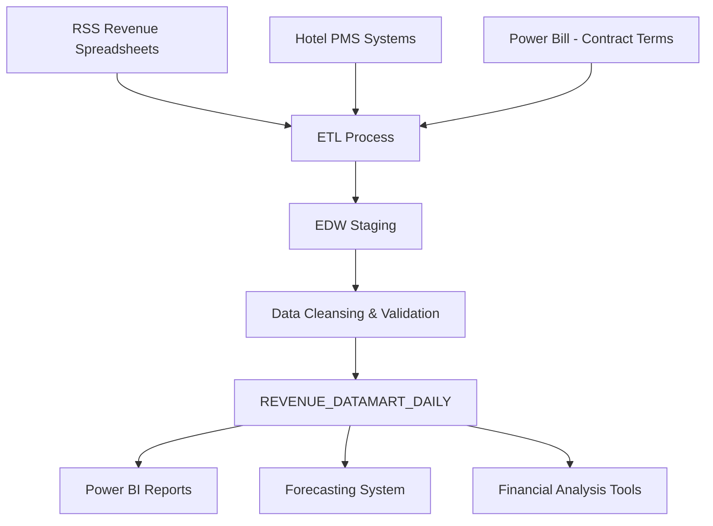

# Data Model Document

**Data Warehouse Data Model: REVENUE_DATAMART_DAILY**

**Author:** Jonathan Aulson  
**Date:** August 4, 2025  
**Version:** 2.3

## 1. Fields and Source Systems

| Field Name | Data Type | Source System | Source Field | Description |
|------------|-----------|--------------|--------------|-------------|
| SITE | CHAR(4) | RSS | Site_ID | Site identifier |
| DATE | DATE | RSS | Transaction_Date | Date of revenue transaction |
| REVENUE_CODE | CHAR(3) | RSS | Revenue_Code | Code identifying revenue type (e.g., VD1, SD2) |
| DEPOSIT_FLAG | CHAR(1) | RSS | Deposit_Flag | Indicates if revenue was deposited by Towne Park (Y/N/V) |
| REVENUE_CATEGORY | VARCHAR(50) | EDW | Derived | Category of revenue (Valet Daily, Self Monthly, etc.) |
| VALUE_TYPE | VARCHAR(20) | EDW | Derived | Type of value (Revenue, Vehicles, Other) |
| EXTERNALREVENUE | DECIMAL(18,2) | RSS | Total_Revenue | Gross external revenue amount |
| NETEXTERNALREVENUE | DECIMAL(18,2) | EDW | Calculated | External revenue net of taxes and adjustments |
| VEHICLECOUNT | INT | RSS | Vehicle_Count | Number of vehicles |
| DW_LOADED_DTTM | DATETIME | EDW | System | Timestamp when record was loaded to EDW |
| DW_SOURCE_SYSTEM | VARCHAR(50) | EDW | System | Source system identifier |
| OCCUPIED_ROOMS | INT | Hotel PMS via RSS | Occupied_Rooms | Number of occupied hotel rooms |
| AVAILABLE_ROOMS | INT | Master Non-Financial | Total_Rooms | Total available rooms at the property |
| BILL_ABLE_NET_VALIDATIONS | DECIMAL(18,2) | RSS | Validation_Amount | Net validation amount eligible for billing |
| ADJUSTMENT_AMOUNT | DECIMAL(18,2) | RSS | Adjustment_Amount | Amount of adjustments applied |

## 2. Business Logic for Data Transformations

### REVENUE_CATEGORY Derivation
```sql
-- Logic to derive REVENUE_CATEGORY from REVENUE_CODE
CASE 
  WHEN REVENUE_CODE IN ('VD1', 'VD2', 'VD3') THEN 'Valet Daily'
  WHEN REVENUE_CODE IN ('VO1', 'VO2', 'VO3') THEN 'Valet Overnight'
  WHEN REVENUE_CODE IN ('VM1', 'VM2', 'VM3') THEN 'Valet Monthly'
  WHEN REVENUE_CODE IN ('SD1', 'SD2', 'SD3') THEN 'Self Daily'
  WHEN REVENUE_CODE IN ('SO1', 'SO2', 'SO3') THEN 'Self Overnight'
  WHEN REVENUE_CODE IN ('SM1', 'SM2', 'SM3') THEN 'Self Monthly'
  WHEN REVENUE_CODE IN ('VA1', 'VA2', 'VA3') THEN 'Valet Aggregator'
  WHEN REVENUE_CODE IN ('SA1', 'SA2', 'SA3') THEN 'Self Aggregator'
  ELSE 'Other'
END
```

### VALUE_TYPE Derivation
```sql
-- Logic to derive VALUE_TYPE
CASE 
  WHEN MEASURE_NAME IN ('EXTERNALREVENUE', 'NETEXTERNALREVENUE', 'BILLABLE_NET_VALIDATIONS') THEN 'Revenue'
  WHEN MEASURE_NAME = 'VEHICLECOUNT' THEN 'Vehicles'
  WHEN MEASURE_NAME IN ('OCCUPIED_ROOMS', 'AVAILABLE_ROOMS') THEN 'Other'
  ELSE 'Unknown'
END
```

### NETEXTERNALREVENUE Calculation
```sql
-- Logic to calculate NETEXTERNALREVENUE
CASE
  WHEN DEPOSIT_FLAG = 'Y' AND TOWNEPARK_RESPONSIBLE_FOR_TAX = 'Y' THEN
    EXTERNALREVENUE - (EXTERNALREVENUE * TAX_RATE)
  WHEN DEPOSIT_FLAG = 'N' THEN
    EXTERNALREVENUE
  ELSE
    EXTERNALREVENUE
END
```

## 3. Runtime Calculated Key Figures

| Field Name | Calculation | Description |
|------------|-------------|-------------|
| OCCUPANCY_PERCENTAGE | OCCUPIED_ROOMS / AVAILABLE_ROOMS * 100 | Hotel occupancy percentage |
| REVENUE_PER_VEHICLE | NETEXTERNALREVENUE / NULLIF(VEHICLECOUNT, 0) | Average revenue per vehicle |
| CAPTURE_RATIO | (SUM of Valet Overnight + Self Overnight VEHICLECOUNT) / NULLIF(OCCUPIED_ROOMS, 0) * 100 | Percentage of hotel guests using parking |
| DRIVE_IN_RATIO | (Total VEHICLECOUNT - Overnight VEHICLECOUNT) / NULLIF(OCCUPIED_ROOMS, 0) | Ratio of non-overnight vehicles to occupied rooms |

## 4. Data Flow Diagram



## 5. Reports Built from This Data Model

| Report Name | Description | Primary Audience |
|-------------|-------------|------------------|
| Site Performance Dashboard | Daily/monthly site performance metrics | Operations, Finance |
| Revenue Analysis Report | Detailed revenue breakdown by category and site | Finance, Revenue Management |
| Vehicle Volume Tracker | Daily/monthly vehicle statistics by type | Operations |
| Validation Report | Analysis of validation volume and revenue impact | Account Managers, Finance |
| Revenue Variance Analysis | Comparison of actual vs. budget revenue | Executives, Finance |
| Capture Ratio Analysis | Analysis of hotel guest parking behavior | Account Managers, Sales |
| Forecasting Data Foundation | Source data for revenue forecasting | Account Managers, Finance |

## 6. Production Dataset Size

- Current row count: ~36 million rows
- Daily new rows: ~50,000 rows
- Annual growth: ~18 million rows
- Current storage size: ~15 GB
- Projected 5-year size: ~75 GB

## 7. Indexing and Archiving Strategy

### Indexing
- Clustered index on (SITE, DATE, REVENUE_CODE)
- Non-clustered index on (SITE, REVENUE_CATEGORY, DATE)
- Non-clustered index on (DATE, SITE)
- Non-clustered index on (DW_LOADED_DTTM)

### Archiving
- Hot data tier: Current year + 2 previous years (daily granularity)
- Warm data tier: Years 3-5 (aggregated to monthly granularity)
- Cold data tier: Years 6+ (aggregated to quarterly granularity)
- Archiving process runs annually on January 15th
- Archived data is stored in Azure Data Lake Storage Gen2

## 8. Data Management Approach

- **Data Loading Strategy**: Full daily load for the previous 7 days + current day to account for corrections
- **Historical Data**: Full drop/reload monthly for the previous 3 months
- **Data Validation**: Automated checks for revenue totals matching source systems
- **Error Handling**: Failed validations trigger alerts to data team and log entries
- **Correction Process**: Source system corrections reflected in EDW within 24 hours
- **Backup Strategy**: Daily incremental backups, weekly full backups, monthly backups retained for 1 year
- **Disaster Recovery**: Geo-redundant storage with 4-hour RTO, 15-minute RPO

The ETL process is implemented using Azure Data Factory pipelines with monitoring and alerting through Azure Monitor. Data quality checks run after each load to ensure completeness and accuracy of the revenue data.