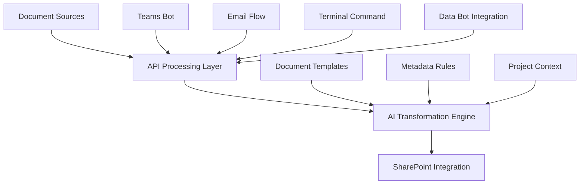

# AI Acceleration (Towne Park) Backlog Grooming - Team Meeting Notes

**Meeting Date:** June 30, 2025, 7:29 PM  
**Duration:** 1h 5m 25s  
**Meeting Type:** Backlog Grooming Session  
**Facilitator:** Jonathan Aulson

---

## Meeting Overview

This backlog grooming session focused on evaluating AI development tools, addressing testing challenges, and discussing internal tool development for documentation automation. The team explored multiple AI platforms and their integration capabilities with existing development workflows.

---

## Attendees

| Name | Role | Participation Level |
|------|------|-------------------|
| Jonathan Aulson | Meeting Facilitator | High - Led discussions and tool demonstrations |
| Andrew Scheuer | Senior Developer | High - Presented Claude Code evaluation |
| Javier Casas | Developer | Medium - Participated in discussions |
| Graham Olson | Developer | High - Presented testing challenges |
| Johnn Hesseltine | Technical Architect | High - Strategic guidance and architecture input |
| Cesar Figueroa | Developer | Medium - Offered assistance with proof of concept |
| Christopher Thompson | Team Member | Low - Brief participation |

---

## Key Discussion Topics

### 1. AI Tool Testing Challenges (Graham Olson)

#### Problem Statement
Graham encountered significant difficulties using AI tools (specifically GPT-4.1 via Client) for unit test generation, particularly for the labor hour calculator component.

#### Specific Issues Identified
- **Context Loss**: AI tool failed to maintain context when starting new tasks
- **Iterative Failures**: Multiple iterations with error feedback did not improve results
- **Code Understanding**: Tool struggled to comprehend existing code patterns and structures

#### Root Cause Analysis
- **Insufficient Context**: Starting new tasks without providing adequate background information
- **Missing Reference Examples**: Lack of existing test examples for similar components
- **Incomplete User Story Context**: Missing acceptance criteria and implementation details

#### Recommended Solutions (Andrew Scheuer)
1. **Maintain Task Continuity**: Use same conversation thread for implementation and testing
2. **Provide Comprehensive Context**: Include user stories, acceptance criteria, and commit references
3. **Reference Existing Patterns**: Point AI to similar test implementations (e.g., revenue share calculator tests)
4. **Incremental Approach**: Break testing into smaller, focused components
5. **Validation Strategy**: Ask AI to explain understanding before proceeding with implementation

#### Implementation Guidelines
```markdown
**Best Practice Workflow:**
1. Provide user story and acceptance criteria
2. Reference existing similar implementations
3. Ask AI to explain understanding of the feature
4. Proceed with incremental test development
5. Validate each component before moving to next
```

### 2. Claude Code CLI Tool Evaluation (Andrew Scheuer)

#### Tool Overview
Claude Code represents a terminal-based AI development environment offering enhanced integration capabilities compared to traditional IDE extensions.

#### Key Advantages Identified
1. **Terminal Integration**: Direct access to command-line tools and utilities
2. **Dataverse Connectivity**: Real-time data access via PAC CLI integration
3. **Azure CLI Integration**: Seamless cloud service interaction
4. **Authentication Flexibility**: OAuth-based authentication without token sharing
5. **Development Workflow Enhancement**: Improved context and validation capabilities

#### Specific Use Case: Dataverse Integration
**Business Problem Solved:**
- Developers often lack understanding of actual data structures during implementation
- Assumptions about data formats lead to rework and bugs
- Need for real-time data validation during development

**Technical Implementation:**
```bash
# Example: Query contract details during development
pac data list-records --entity-name tp_contractdetails --select tp_contractdetailsjson --top 5

# Result: Discovered nested JSON structure with billing flags
{
  "tp_contractdetailsjson": "{\"billingFlags\": {\"autoInvoice\": true}}"
}
```

**Impact:**
- Eliminated need for two additional database tables
- Reduced development iterations
- Improved implementation accuracy through data-driven decisions

#### Comparison with Existing Tools
| Feature | Claude Code | Client | Cursor |
|---------|-------------|--------|--------|
| Terminal Access | ✅ Full | ❌ Limited | ❌ Limited |
| Dataverse Integration | ✅ Native | ❌ Manual | ❌ Manual |
| Authentication | ✅ OAuth | ⚠️ Token-based | ⚠️ Token-based |
| Mode Consistency | ✅ Stable | ❌ Inconsistent | ⚠️ Variable |
| Cost | $20/month | Variable | Variable |

#### Recommendation
**Status:** Experimental adoption recommended for specific use cases
**Rationale:** Tool-agnostic approach allows leveraging best tool for each scenario

### 3. Warp Agentic Development Environment (Jonathan Aulson)

#### Tool Characteristics
- **Interface**: Terminal-like application with AI integration
- **Approach**: Natural language processing for development commands
- **Architecture**: Standalone application requiring installation
- **Pricing**: Free tier available with paid upgrades

#### Key Features Demonstrated
1. **Natural Language Commands**: Convert plain English to terminal commands
2. **Code Generation**: Create files and scripts through conversational interface
3. **Multi-Agent Coordination**: Support for multiple AI agents working in concert
4. **Desktop Integration**: Full system access beyond directory restrictions

#### Comparison with Claude Code
| Aspect | Warp | Claude Code |
|--------|------|-------------|
| Scope | Full desktop access | Directory-restricted |
| Installation | Standalone app | CLI tool |
| Agent Support | Multi-agent | Single agent |
| Restrictions | Minimal | Security-focused |

#### Strategic Implications
- **Multi-Agent Development**: Potential for coordinated AI team workflows
- **Scalability**: Desktop-level access enables broader automation
- **Security Considerations**: Full access requires careful implementation

### 4. Pythagora All-in-One Development Platform (Jonathan Aulson)

#### Platform Overview
Pythagora provides a structured development process from specification through deployment, emphasizing production-ready implementations over mockups.

#### Development Workflow Phases
1. **Specification Phase**: Interactive spec development and refinement
2. **Task Breakdown**: Structured task decomposition and planning
3. **Code Implementation**: Production-focused code generation
4. **Debug Phase**: Systematic error resolution with log analysis
5. **Deployment Phase**: Automated deployment to production environments

#### Key Differentiators
**Production Focus:**
- Creates actual database tables and connections
- Implements real data flows instead of mock data
- Builds deployable applications from start

**Technology Stack:**
- **Backend**: Node.js with full database integration
- **Frontend**: React with production-ready components
- **Infrastructure**: AWS (default) with Azure compatibility
- **Database**: MongoDB (default) with options for alternatives

#### Strategic Value Proposition
**Problem Addressed:** Current tools (like VO.dev) create mockups requiring significant rework for production
**Solution Provided:** Direct path from concept to production-ready implementation

#### Implementation Considerations
- **Schema Integration**: Opportunity to implement Towne Park's complete data schema
- **Feature Development**: Ability to create features matching actual backend systems
- **Deployment Strategy**: Need to evaluate Azure integration capabilities

### 5. Internal Documentation Automation Tool (Jonathan Aulson)

#### Business Problem Statement
Manual processing of meeting transcripts and project artifacts into structured documentation is time-consuming and inconsistent, creating bottlenecks in knowledge management and project documentation.

#### Proposed Solution Architecture



#### Technical Components

**Backend API (FastAPI)**
- **Document Type Detection**: Automatic classification of input documents
- **Template Selection**: Context-aware template matching
- **AI Processing**: OpenAI integration for content transformation
- **SharePoint Integration**: Automated document storage and organization

**Frontend Interfaces**
1. **Teams Bot**: Upload command with document attachment
2. **Power Automate Flow**: Email-triggered processing
3. **Terminal Interface**: curl command for developer integration
4. **Data Bot Integration**: Voice-activated document processing

**Document Processing Pipeline**
```yaml
Input: Raw document (meeting transcript, project artifact)
Process:
  1. Document type identification
  2. Template and prompt selection
  3. AI-powered content transformation
  4. Metadata extraction and tagging
  5. SharePoint storage with proper organization
Output: Structured, searchable documentation
```

#### Implementation Status
**Current State:**
- 100% AI-generated codebase (no manual coding)
- Teams bot implementation complete
- Power Automate flow designed
- API framework with Docker deployment guide
- Meeting transcript processing templates ready

**Technology Stack:**
- **API**: FastAPI (Python) in Docker container
- **Deployment**: Azure App Services (proposed)
- **Integration**: Microsoft Graph API for automatic transcript processing
- **AI Engine**: OpenAI API (configurable for other models)

#### Proof of Concept Requirements
**Infrastructure Needs:**
- Azure App Service instance
- Docker container deployment
- API endpoint configuration
- SharePoint integration setup

**Development Support:**
- Cesar Figueroa volunteered for proof of concept development
- Time-boxed approach to prevent scope creep
- Focus on meeting transcript processing as MVP

#### Strategic Benefits
1. **Automation**: Eliminate manual documentation processing
2. **Consistency**: Standardized document formats and metadata
3. **Scalability**: Centralized processing for multiple projects
4. **Integration**: Seamless workflow integration across platforms

---

## Strategic Decisions and Action Items

### Tool Adoption Strategy

#### Immediate Actions
1. **Tool Agnostic Approach**: Continue using markdown-based documentation to maintain flexibility
2. **Experimental Adoption**: Team members encouraged to experiment with different tools for specific use cases
3. **Knowledge Sharing**: Regular sharing of tool experiences and best practices

#### Evaluation Criteria
- **Use Case Alignment**: Match tools to specific development scenarios
- **Integration Capabilities**: Assess tool integration with existing workflows
- **Cost-Benefit Analysis**: Evaluate subscription costs against productivity gains
- **Team Adoption**: Consider learning curve and team preferences

### Firm-Wide AI Tool Strategy

#### Innovation Community Engagement
- **Contact**: Rob (Innovation Community lead)
- **Purpose**: Share tool evaluations and recommendations
- **Scope**: Broader organizational AI tool adoption strategy

#### Strategic Planning Requirements
- **Tool Standardization**: Develop approved tool lists by technology stack
- **Project-Level Guidance**: Provide tool selection guidance for new projects
- **Evaluation Framework**: Create systematic tool assessment process

### Testing Strategy Improvements

#### Context Management Best Practices
1. **Continuous Conversations**: Maintain AI tool context throughout feature development
2. **Reference Documentation**: Provide existing test examples and patterns
3. **Incremental Development**: Break complex testing into manageable components
4. **Validation Checkpoints**: Verify AI understanding before proceeding

#### Knowledge Sharing
- **Test Pattern Library**: Develop repository of successful AI-generated tests
- **Best Practice Documentation**: Document effective AI tool usage patterns
- **Team Training**: Regular sessions on AI tool optimization

---

## Technical Architecture Discussions

### Development Tool Integration

#### Current State Analysis
- **IDE Extensions**: Limited terminal access and integration capabilities
- **Authentication Challenges**: Token management and security concerns
- **Context Limitations**: Difficulty maintaining development context across tools

#### Future State Vision
- **Terminal-Based Development**: Enhanced CLI tool integration
- **Real-Time Data Access**: Direct database and service connectivity during development
- **Multi-Tool Workflows**: Seamless switching between specialized AI tools

### Infrastructure Considerations

#### Docker and Deployment Strategy
**Discussion Points:**
- **Docker Necessity**: Questioned whether containerization is required for simple APIs
- **Technology Stack**: Python vs. TypeScript/JavaScript for API development
- **Deployment Options**: Azure App Services vs. Azure Functions
- **Scalability Requirements**: Current needs vs. future growth planning

#### Recommendations from Technical Architecture (Johnn Hesseltine)
- **Simplification**: Consider lighter-weight alternatives to Docker for simple APIs
- **Technology Alignment**: Evaluate technology choices against team expertise
- **Implementation Focus**: Prioritize functionality over infrastructure complexity

---

## Business Impact and ROI Considerations

### Development Efficiency Gains

#### Quantifiable Benefits
1. **Context-Aware Development**: Reduced rework through real-time data validation
2. **Automated Testing**: Improved test coverage with AI-generated unit tests
3. **Documentation Automation**: Elimination of manual documentation processing
4. **Tool Optimization**: Better tool selection for specific development scenarios

#### Risk Mitigation
- **Vendor Lock-in**: Tool-agnostic approach maintains flexibility
- **Security Concerns**: Proper authentication and access control implementation
- **Quality Assurance**: Validation processes for AI-generated content

### Investment Priorities

#### High-Impact, Low-Risk Initiatives
1. **Testing Best Practices**: Immediate implementation of improved AI tool usage
2. **Tool Experimentation**: Controlled evaluation of new development tools
3. **Documentation Automation**: Proof of concept for internal tool development

#### Medium-Term Strategic Initiatives
1. **Firm-Wide Tool Strategy**: Comprehensive AI tool adoption framework
2. **Integration Platform**: Centralized development tool integration
3. **Training Programs**: Systematic AI tool education for development teams

---

## Follow-Up Actions and Ownership

### Immediate Actions (Next 1-2 Weeks)

#### Graham Olson - Testing Improvement
- **Action**: Implement context-rich AI tool usage for unit test generation
- **Method**: Apply Andrew's recommendations for labor hour calculator testing
- **Success Criteria**: Successful AI-generated tests with minimal iterations

#### Andrew Scheuer - Tool Evangelism
- **Action**: Present Claude Code evaluation to Innovation Community
- **Contact**: Rob (Innovation Community)
- **Deliverable**: Formal presentation on AI tool comparison and recommendations

#### Jonathan Aulson - Documentation Tool Development
- **Action**: Coordinate with Cesar for proof of concept development
- **Scope**: Time-boxed implementation of meeting transcript processing
- **Infrastructure**: Azure App Service setup and Docker deployment

#### Cesar Figueroa - Technical Implementation
- **Action**: Support documentation automation tool proof of concept
- **Focus**: Azure infrastructure setup and API deployment
- **Timeline**: Coordinate with Jonathan for development schedule

### Medium-Term Actions (Next 1-2 Months)

#### Team-Wide Tool Evaluation
- **Action**: Systematic evaluation of Warp and Pythagora platforms
- **Method**: Pilot projects with different team members
- **Documentation**: Comprehensive comparison and recommendation report

#### Innovation Community Engagement
- **Action**: Establish regular communication with firm-wide AI initiatives
- **Purpose**: Align team tool adoption with organizational strategy
- **Deliverable**: Contribution to firm-wide AI tool adoption framework

#### Architecture Review Process
- **Action**: Regular architecture meetings to review tool integration decisions
- **Participants**: Technical architecture team and development leads
- **Focus**: Strategic alignment and technical debt management

---

## Key Insights and Lessons Learned

### AI Tool Effectiveness Factors

#### Context is Critical
- **Finding**: AI tool success heavily dependent on comprehensive context provision
- **Implication**: Development workflows must include context preparation steps
- **Action**: Develop context checklists for different AI tool scenarios

#### Tool Specialization
- **Finding**: Different AI tools excel in different scenarios
- **Implication**: Multi-tool approach more effective than single-tool standardization
- **Action**: Create tool selection matrix based on use case requirements

#### Integration Capabilities
- **Finding**: Terminal-based tools offer superior integration opportunities
- **Implication**: Consider CLI-based alternatives to IDE extensions
- **Action**: Evaluate development environment architecture for better tool integration

### Development Process Optimization

#### Real-Time Data Validation
- **Finding**: Access to actual data during development significantly improves implementation quality
- **Implication**: Development environments should include production data access capabilities
- **Action**: Implement secure data access patterns for development workflows

#### Automated Documentation
- **Finding**: Manual documentation processing creates significant bottlenecks
- **Implication**: Investment in automation tools provides high ROI
- **Action**: Prioritize documentation automation tool development

#### Testing Strategy Evolution
- **Finding**: AI-generated tests require different approaches than manual test development
- **Implication**: Testing strategies must evolve to leverage AI capabilities effectively
- **Action**: Develop AI-specific testing best practices and training materials

---

## Related Documentation

### Cross-References
- [Dataverse PAC CLI Integration Technical Document](../technical/integrations/20250806_DataversePACCLI_Integration_TechnicalDocument.md)
- [Development Standards and Best Practices](../standards/)
- [AI Tool Usage Guidelines](../configuration/system-settings/)

### Future Documentation Needs
1. **Tool Comparison Matrix**: Comprehensive evaluation framework for AI development tools
2. **Testing Best Practices**: Detailed guidelines for AI-assisted test development
3. **Integration Patterns**: Standard approaches for tool integration in development workflows
4. **Security Guidelines**: Security considerations for AI tool adoption in enterprise environments

---

## Meeting Effectiveness Assessment

### Participation Quality
- **High Engagement**: Technical discussions with concrete examples and solutions
- **Collaborative Problem-Solving**: Team members actively contributed solutions to identified challenges
- **Knowledge Sharing**: Effective transfer of tool evaluation experiences

### Decision Quality
- **Evidence-Based**: Decisions supported by actual tool usage experience
- **Strategic Alignment**: Considerations for both immediate needs and long-term strategy
- **Risk-Aware**: Appropriate consideration of security and integration challenges

### Action Item Clarity
- **Specific Ownership**: Clear assignment of follow-up actions
- **Measurable Outcomes**: Defined success criteria for key initiatives
- **Realistic Timelines**: Appropriate time allocation for complex technical initiatives

---

**Meeting Notes Compiled By:** Documentation Team  
**Source:** Meeting Recording Transcript  
**Next Review:** Follow-up on action items in 2 weeks  
**Related Meetings:** Architecture review sessions, Innovation Community presentations