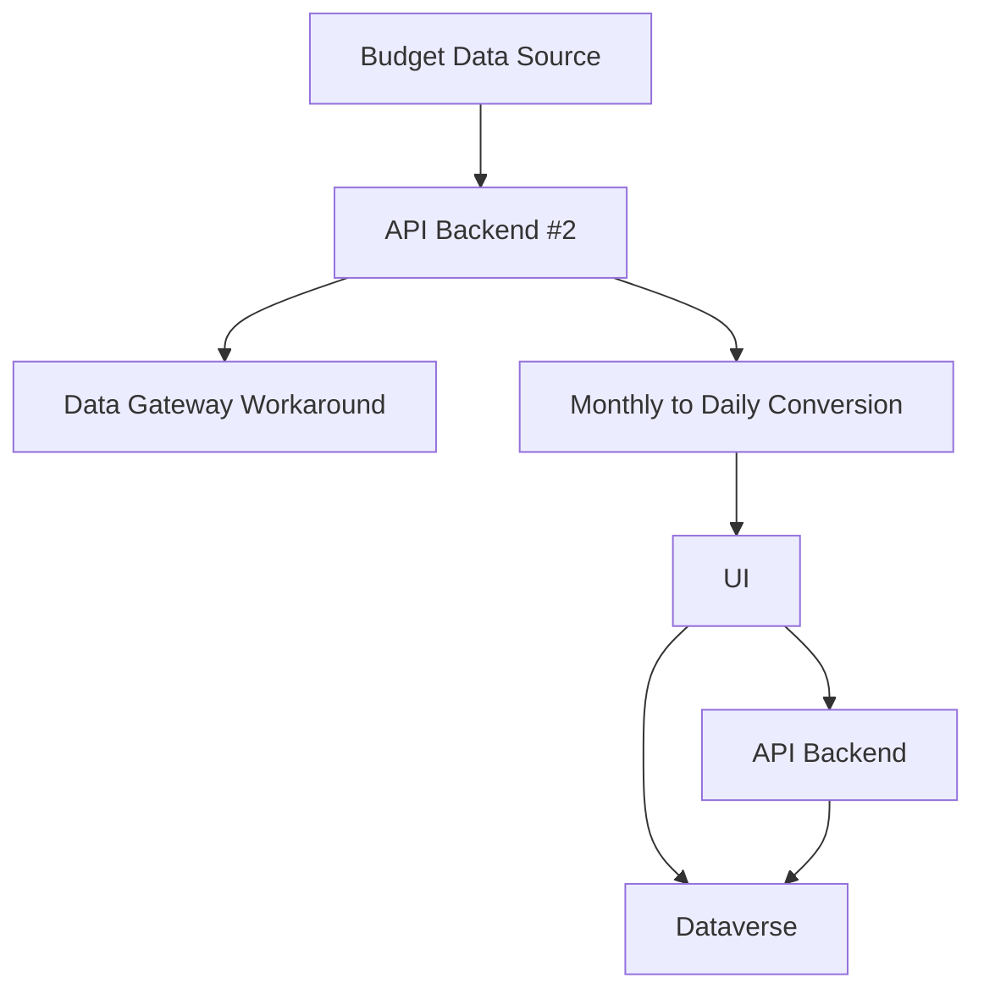
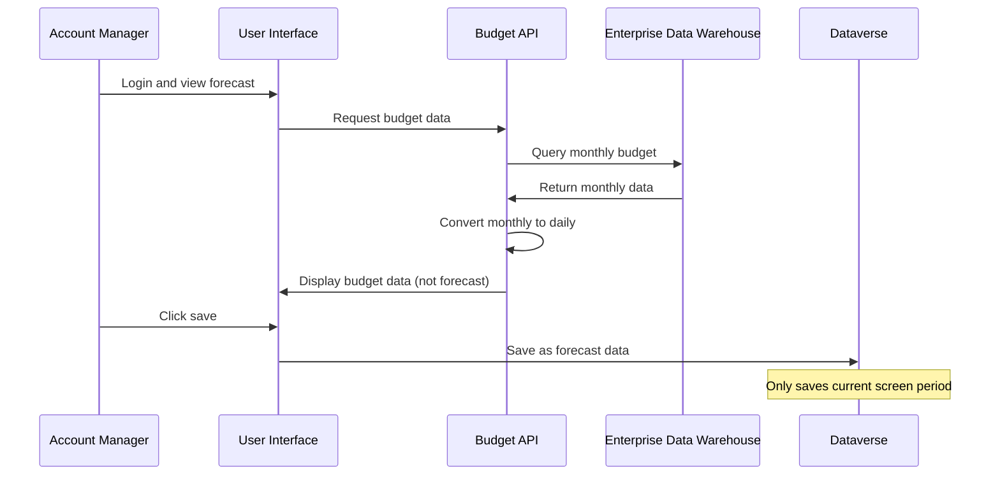
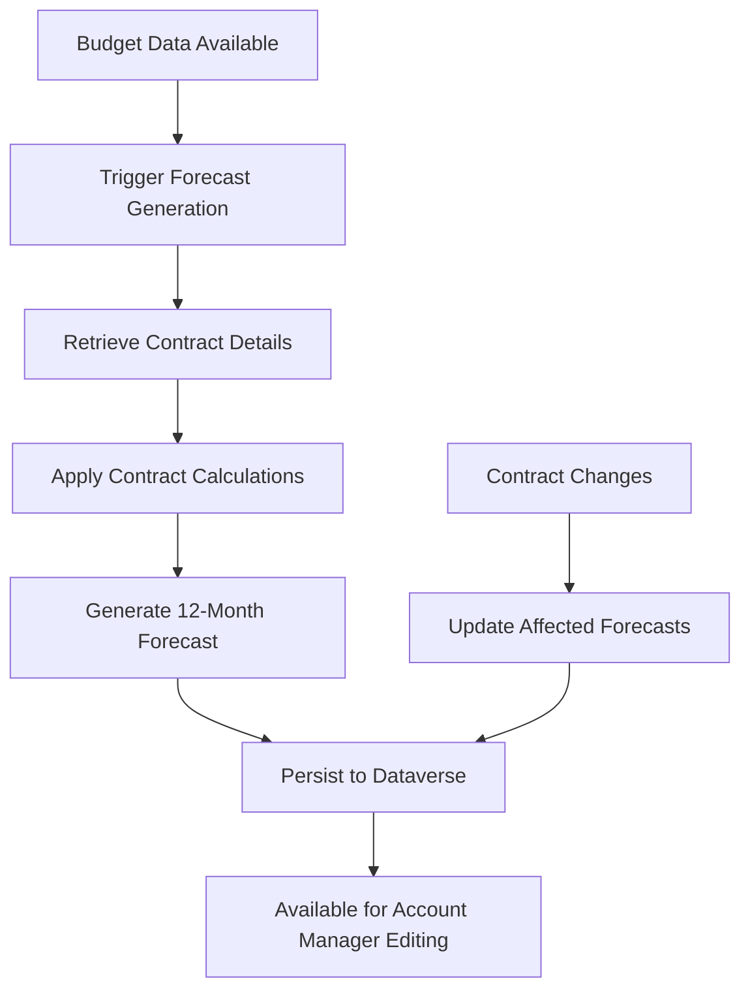

# Forecasting Refactor Meeting Prep - Strategic Requirements Discussion

**Meeting Date:** July 3, 2025, 3:30 PM  
**Meeting Type:** Strategic Planning / Requirements Clarification  
**Facilitator:** Jonathan Aulson  
**Technical Architect:** Johnn Hesseltine

---

## Meeting Overview

This critical strategic planning session identified a fundamental paradigm shift in forecasting requirements, moving from account manager-initiated forecasting to system-generated 12-month forecasts with integrated contract calculations. The discussion revealed significant new requirements that will impact system architecture and development priorities.

---

## Attendees

| Name | Role | Participation Level |
|------|------|-------------------|
| Jonathan Aulson | Development Team Lead | High - Led requirements analysis |
| Johnn Hesseltine | Technical Architect | High - Strategic guidance and architecture implications |

---

## Critical Requirements Discovery

### Current State Analysis

#### Existing System Architecture

#### Current Workflow Limitations
1. **Budget Data Display**: System currently shows budget data, not forecast data
2. **Manual Trigger Required**: Account managers must manually save to create forecast data
3. **Limited Scope**: Only saves forecast data for time period currently on screen
4. **Contract Integration Gap**: Budget data does not incorporate contract detail changes
5. **Temporal Limitations**: Changes to contracts don't automatically update future periods

### Paradigm Shift Identification

#### Previous Understanding
- **Scope**: 90-day forecast window
- **Trigger**: Account manager-initiated forecasting
- **Data Source**: Direct budget data display with manual conversion to forecast
- **Contract Integration**: Manual account manager responsibility

#### New Requirements Discovered
- **Scope**: 12-month forecast generation
- **Trigger**: System-automated forecast creation
- **Data Source**: Budget data transformed through contract calculations
- **Contract Integration**: Automatic incorporation of contract detail changes

### Business Impact Analysis

#### Critical Business Problem
**Scenario Example:**
1. Budget created in 2024 with specific revenue share percentage
2. Contract modified in April 2025 with new revenue share percentage
3. Current system shows budget data (2024 rates) instead of forecast data (2025 rates)
4. Account manager must manually save each month to pick up contract changes
5. Future months remain at old rates until manually updated

**Corporate Forecasting Impact:**
- EDW forecast tables used for all business reporting
- Current system creates gaps in corporate forecasting accuracy
- Manual process creates inconsistency and delays

---

## Technical Architecture Implications

### Current State Technical Challenges

#### Data Flow Analysis

#### Technical Debt Identification
1. **Data Transformation Location**: Monthly-to-daily conversion happens in API, not persisted
2. **Contract Integration Timing**: Contract changes not automatically applied to budget data
3. **Persistence Strategy**: Forecast data only created on manual save action
4. **Scope Limitations**: Partial forecast creation based on UI view

### Future State Architecture Requirements

#### System-Generated Forecast Process

#### Data Granularity Considerations
**Current State:**
- **Budget**: Monthly aggregation at job profile level
- **Forecast**: Daily detail at job code level

**Future State Questions:**
- Should budgeting move to daily/job code level?
- How to handle granularity mismatch in transformation?
- Impact on existing budget processes and tools?

---

## Strategic Decision Points

### Budgeting Process Evolution

#### Current Budgeting Approach
- **Granularity**: Monthly aggregation
- **Detail Level**: Job profile level
- **Process**: External to forecasting system
- **Integration**: One-way data flow to forecasting

#### Future Budgeting Considerations
**Key Question:** Should budgeting process align with forecasting granularity?

**Option 1: Maintain Current Approach**
- **Pros**: No disruption to existing budget processes
- **Cons**: Continued granularity mismatch and transformation complexity

**Option 2: Evolve to Daily/Job Code Budgeting**
- **Pros**: Alignment with forecasting, simplified data flow
- **Cons**: Significant change to budget processes and tools

**Recommendation:** Explore budgeting evolution as part of discovery process

### Implementation Strategy

#### Immediate Requirements
1. **Requirement Validation**: Confirm 12-month forecast requirement with stakeholders
2. **Impact Assessment**: Analyze development effort and timeline implications
3. **Priority Alignment**: Determine impact on current phase deliverables
4. **Architecture Planning**: Design system-generated forecast process

#### Discovery Process
1. **Budgeting Process Analysis**: Understand current and future budgeting needs
2. **Contract Integration Requirements**: Define automatic contract change application
3. **Data Granularity Strategy**: Resolve monthly vs. daily budgeting approach
4. **Performance Implications**: Assess impact of 12-month forecast generation

---

## Requirements Analysis

### New Requirement Classification

#### Requirement: System-Generated 12-Month Forecasts
- **Type**: New functional requirement
- **Impact**: High - fundamental system behavior change
- **Complexity**: High - requires new architecture components
- **Dependencies**: Contract integration, budget data transformation

#### Requirement: Automatic Contract Integration
- **Type**: New functional requirement
- **Impact**: High - affects forecast accuracy and business reporting
- **Complexity**: Medium - requires contract change detection and application
- **Dependencies**: Contract management system integration

#### Requirement: Forecast Data Persistence
- **Type**: Modified functional requirement
- **Impact**: Medium - changes data storage and retrieval patterns
- **Complexity**: Medium - requires new persistence strategies
- **Dependencies**: Dataverse schema modifications

### Stakeholder Communication Strategy

#### Client Communication Approach
1. **Requirement Acknowledgment**: Confirm this is a new requirement, not missed specification
2. **Impact Explanation**: Clearly communicate development effort and timeline implications
3. **Priority Discussion**: Determine if this requirement should be included in current phase
4. **Alternative Exploration**: Discuss phased implementation options

#### Key Messages
- **New Requirement**: This represents a significant change from original 90-day scope
- **Technical Feasibility**: Requirement is technically achievable but requires architecture changes
- **Resource Impact**: Implementation will affect other planned deliverables
- **Business Value**: Addresses critical gap in corporate forecasting accuracy

---

## Technical Implementation Considerations

### Architecture Decision Points

#### Data Transformation Strategy
**Option 1: ETL Budget Data to Dataverse**
- **Approach**: Transform monthly budget to daily forecast in Dataverse
- **Pros**: Centralized data, consistent access patterns
- **Cons**: Dataverse storage implications, transformation complexity

**Option 2: API-Based Transformation**
- **Approach**: Maintain current API transformation, extend to full year
- **Pros**: Minimal Dataverse changes, leverages existing logic
- **Cons**: Performance implications, data consistency challenges

#### Contract Integration Approach
**Option 1: Real-Time Integration**
- **Approach**: Query contract details during forecast generation
- **Pros**: Always current contract information
- **Cons**: Performance impact, dependency on contract system availability

**Option 2: Event-Driven Integration**
- **Approach**: Contract changes trigger forecast updates
- **Pros**: Performance optimization, decoupled systems
- **Cons**: Event system complexity, potential synchronization issues

### Performance and Scalability Implications

#### Data Volume Considerations
- **Current**: 90 days × daily records × sites
- **Future**: 365 days × daily records × sites
- **Impact**: ~4x increase in forecast data volume

#### Processing Requirements
- **Forecast Generation**: Batch processing for multiple sites
- **Contract Updates**: Incremental updates for affected forecasts
- **User Access**: Real-time access to 12-month forecast data

---

## Risk Assessment and Mitigation

### Technical Risks

#### Risk: Performance Degradation
- **Description**: 12-month forecast generation may impact system performance
- **Probability**: Medium
- **Impact**: High
- **Mitigation**: Implement batch processing and performance monitoring

#### Risk: Data Consistency Issues
- **Description**: Contract changes may not propagate correctly to all affected forecasts
- **Probability**: Medium
- **Impact**: High
- **Mitigation**: Implement robust change detection and validation processes

#### Risk: Integration Complexity
- **Description**: Multiple system integration points increase failure potential
- **Probability**: High
- **Impact**: Medium
- **Mitigation**: Phased implementation with comprehensive testing

### Business Risks

#### Risk: Scope Creep
- **Description**: Additional requirements may emerge during implementation
- **Probability**: High
- **Impact**: High
- **Mitigation**: Clear requirement documentation and change control process

#### Risk: Timeline Impact
- **Description**: New requirements may delay current phase deliverables
- **Probability**: High
- **Impact**: High
- **Mitigation**: Priority assessment and stakeholder communication

---

## Action Items and Next Steps

### Immediate Actions (Next 1-2 Days)

#### Jonathan Aulson - Stakeholder Communication
- **Action**: Present requirement analysis to client stakeholders
- **Key Points**: New requirement identification, impact assessment, priority discussion
- **Deliverable**: Stakeholder agreement on requirement scope and priority

#### Technical Team - Impact Assessment
- **Action**: Detailed technical analysis of implementation requirements
- **Scope**: Architecture changes, development effort, timeline implications
- **Deliverable**: Technical impact assessment document

### Short-Term Actions (Next 1-2 Weeks)

#### Discovery Process
- **Action**: Comprehensive analysis of budgeting process evolution
- **Participants**: Business stakeholders, technical team, budget process owners
- **Deliverable**: Budgeting strategy recommendation

#### Architecture Planning
- **Action**: Design system-generated forecast architecture
- **Participants**: Technical architecture team, development leads
- **Deliverable**: Technical architecture specification

### Medium-Term Actions (Next 1-2 Months)

#### Implementation Planning
- **Action**: Detailed implementation plan with phased approach
- **Considerations**: Resource allocation, timeline management, risk mitigation
- **Deliverable**: Project plan with updated timelines and deliverables

#### Stakeholder Alignment
- **Action**: Ongoing communication and expectation management
- **Purpose**: Ensure alignment on requirements, priorities, and timelines
- **Deliverable**: Stakeholder agreement on implementation approach

---

## Key Insights and Strategic Implications

### Requirement Evolution Understanding

#### Root Cause Analysis
- **Original Scope**: Based on understanding of current manual process
- **Reality Discovery**: Current process doesn't meet business needs
- **Gap Identification**: System should automate what users currently do manually

#### Business Process Maturation
- **Current State**: Manual, reactive forecasting process
- **Future State**: Automated, proactive forecasting system
- **Transformation**: From tool replication to process improvement

### Architecture Philosophy

#### Design Principle: Automation Over Replication
- **Previous Approach**: Replicate manual forecasting process in digital form
- **New Approach**: Automate intelligent forecasting with human oversight
- **Impact**: Fundamental shift in system design philosophy

#### Integration Strategy: Data-Driven Decision Making
- **Requirement**: Real-time contract integration for accurate forecasting
- **Implication**: System must understand and apply business rules automatically
- **Benefit**: Reduced manual effort and improved accuracy

### Change Management Considerations

#### Stakeholder Education
- **Need**: Help stakeholders understand difference between current and future state
- **Approach**: Clear communication of business benefits and process changes
- **Success Criteria**: Stakeholder buy-in on new approach

#### Process Change Impact
- **Current**: Account managers manually create and maintain forecasts
- **Future**: System generates forecasts, account managers refine and approve
- **Training**: New workflows and system capabilities

---

## Related Documentation

### Cross-References
- [Forecasting System Overview](../../systems/forecasting/forecasting-system-overview.md)
- [EDW Integration Technical Specification](../../technical/integrations/20250724_EDW_Integration_TechnicalSpec.md)
- [Contract Data Dictionary](../../technical/database/20250718_Contracts_DataDictionary_TechnicalSpec.md)

### Future Documentation Needs
1. **Requirements Specification**: Detailed functional requirements for system-generated forecasting
2. **Architecture Design**: Technical architecture for 12-month forecast generation
3. **Integration Specification**: Contract system integration requirements
4. **Data Model**: Updated data model for forecast persistence and management
5. **User Process Documentation**: New account manager workflows for forecast management

---

## Meeting Effectiveness Assessment

### Strategic Value
- **High Impact Discovery**: Identified fundamental requirement gap with significant business implications
- **Clear Problem Definition**: Articulated specific technical and business challenges
- **Solution Framework**: Established approach for addressing complex requirements

### Decision Quality
- **Evidence-Based Analysis**: Grounded discussion in specific technical and business scenarios
- **Risk-Aware Planning**: Appropriate consideration of implementation challenges
- **Stakeholder-Focused**: Maintained focus on business value and stakeholder communication

### Next Steps Clarity
- **Immediate Actions**: Clear ownership and timeline for critical next steps
- **Strategic Planning**: Framework for longer-term implementation planning
- **Communication Strategy**: Defined approach for stakeholder engagement

---

**Meeting Notes Compiled By:** Documentation Team  
**Source:** Meeting Recording Transcript  
**Strategic Importance:** High - Fundamental requirement change affecting system architecture  
**Follow-Up Required:** Immediate stakeholder communication and impact assessment  
**Related Meetings:** Client requirement validation, technical architecture planning