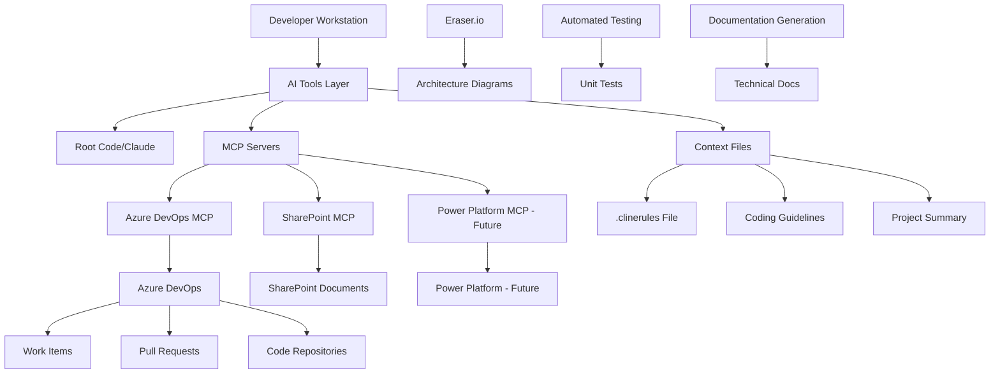
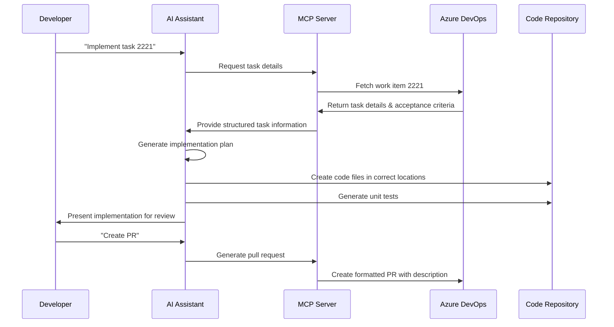

# Towne Park AI - Software Development Life Cycle Integration Technical Specification

## Purpose

This technical specification defines the comprehensive architecture and implementation approach for integrating AI tools into Towne Park's Software Development Life Cycle (SDLC). The document covers MCP (Model Context Protocol) server implementations, AI tool configurations, automated workflow processes, and technical integration patterns that have demonstrated significant improvements in development velocity and code quality.

## Architecture

### AI-Enhanced SDLC Architecture



### Component Interactions

#### AI Tools Integration Layer
1. **Root Code/Claude Interface**: Primary AI development assistant with enhanced customization
2. **Context Management**: Structured markdown files providing domain-specific context
3. **MCP Server Communication**: API layer for external system integration
4. **Workflow Automation**: Automated task generation, code implementation, and testing

#### External System Integration
- **Azure DevOps**: Work item management, task creation, pull request automation
- **SharePoint**: Document access and context retrieval
- **Power Platform**: Future integration for low-code development assistance
- **Eraser.io**: Automated architecture diagram generation

## Implementation Details

### MCP Server Architecture

#### Model Context Protocol (MCP) Implementation
```typescript
// MCP Server Interface Structure
interface MCPServer {
  name: string;
  endpoint: string;
  authentication: AuthConfig;
  capabilities: MCPCapability[];
  integrationMode: 'planning' | 'act' | 'hybrid';
}

// Azure DevOps MCP Configuration
const azureDevOpsMCP: MCPServer = {
  name: 'azure-devops',
  endpoint: 'https://dev.azure.com/townepark',
  authentication: {
    type: 'PAT',
    token: process.env.AZURE_DEVOPS_PAT
  },
  capabilities: [
    'work-item-creation',
    'task-breakdown',
    'pull-request-generation',
    'project-planning'
  ],
  integrationMode: 'hybrid'
};
```

#### MCP Communication Flow
1. **Authentication**: Service principal or PAT-based authentication
2. **Request Processing**: LLM sends structured requests to MCP server
3. **API Translation**: MCP server translates requests to target system APIs
4. **Response Formatting**: Results formatted for LLM consumption
5. **Action Execution**: Automated actions performed in target systems

### Context File Management

#### Project Summary File (.clinerules)
```markdown
# Project Context for AI Assistant

## Business Context
- **Client**: Towne Park
- **Project Type**: Financial Systems Modernization
- **Contract Types**: Per Labor Hour, Fixed Fee, Revenue Share, Management Agreement
- **Primary Systems**: Billing, Forecasting, Contract Management

## Domain Terminology
- RSS: Revenue Summary Sheet
- PTEB: Payroll Tax and Employee Benefits
- PLH: Per Labor Hour
- DTO: Data Transfer Object
- VODTO: View Object Data Transfer Object

## Architecture Patterns
- Clean Architecture (4-layer)
- CQRS with MediatR
- Repository Pattern
- Dependency Injection
- Unit of Work Pattern
```

#### Coding Guidelines File
```markdown
# Development Standards and Guidelines

## General Standards
- Follow Clean Architecture principles
- Use SOLID design principles
- Implement comprehensive unit testing
- Apply consistent naming conventions

## Folder Structure
```
src/
├── Controllers/
├── Services/
│   ├── Impl/
│   └── Interfaces/
├── Models/
│   ├── Dto/
│   ├── Vo/
│   └── Entities/
├── Data/
│   ├── Repositories/
│   └── Context/
└── Tests/
    ├── Unit/
    └── Integration/
```

## Front-end Specifications
- React with TypeScript
- Material-UI components
- Redux for state management
- React Query for data fetching

## Mapping Patterns
- Use Mapperly for object mapping
- Implement AutoMapper profiles
- Separate DTO and Entity mappings
- Validate mapping configurations

## Unit Testing Guidelines
- Minimum 80% code coverage
- Use xUnit for .NET projects
- Jest for React components
- Mock external dependencies
- Test edge cases and error conditions
```

### Tool Configuration and Selection

#### Root Code vs Cursor Analysis
**Root Code Advantages**:
- **Four Interaction Modes**: Planning, Act, Debug, Custom vs. two in Claude
- **Custom Mode Creation**: Ability to define specialized interaction patterns
- **Multi-Model Support**: Different LLM models per mode (GPT-4, Claude, etc.)
- **Enhanced Customization**: Greater control over AI behavior and responses
- **Allata Integration**: Native support for Allata API keys and Copilot licenses

**Technical Implementation**:
```json
{
  "rootCodeConfig": {
    "modes": {
      "planning": {
        "model": "claude-3-sonnet",
        "temperature": 0.3,
        "maxTokens": 4000,
        "systemPrompt": "You are a technical architect focused on planning and design."
      },
      "implementation": {
        "model": "gpt-4-turbo",
        "temperature": 0.1,
        "maxTokens": 8000,
        "systemPrompt": "You are a senior developer focused on code implementation."
      },
      "testing": {
        "model": "claude-3-haiku",
        "temperature": 0.2,
        "maxTokens": 2000,
        "systemPrompt": "You are a QA engineer focused on comprehensive testing."
      },
      "documentation": {
        "model": "gpt-4",
        "temperature": 0.4,
        "maxTokens": 6000,
        "systemPrompt": "You are a technical writer focused on clear documentation."
      }
    }
  }
}
```

### Automated Development Workflow

#### Task Implementation Process


#### Workflow Automation Steps
1. **Task Reference**: Developer references Azure DevOps task number
2. **Context Retrieval**: AI retrieves task details, acceptance criteria, and project context
3. **Code Generation**: AI generates implementation in correct folder structure
4. **Test Creation**: Automated unit test generation with appropriate coverage
5. **Validation**: Code compilation and initial test execution
6. **PR Generation**: Formatted pull request with comprehensive description

### Performance Optimizations

#### Token Usage Management
```typescript
interface TokenOptimization {
  contextCompression: boolean;
  incrementalUpdates: boolean;
  cacheStrategy: 'aggressive' | 'moderate' | 'minimal';
  modelSelection: {
    planning: 'claude-3-sonnet';
    implementation: 'gpt-4-turbo';
    testing: 'claude-3-haiku';
    documentation: 'gpt-4';
  };
}

const optimizationConfig: TokenOptimization = {
  contextCompression: true,
  incrementalUpdates: true,
  cacheStrategy: 'moderate',
  modelSelection: {
    planning: 'claude-3-sonnet',
    implementation: 'gpt-4-turbo', 
    testing: 'claude-3-haiku',
    documentation: 'gpt-4'
  }
};
```

#### Efficiency Metrics
- **Task Breakdown**: 16 tasks generated in 5 minutes via MCP
- **Code Generation**: Complete endpoint implementation in under 10 minutes
- **Test Coverage**: Automated unit tests achieving 80%+ coverage
- **PR Creation**: Comprehensive pull requests generated in 30 seconds

## API Specifications

### MCP Server Endpoints

#### Azure DevOps MCP API
```typescript
interface AzureDevOpsMCPAPI {
  // Work Item Operations
  getWorkItem(id: number): Promise<WorkItem>;
  createTasks(userStoryId: number): Promise<Task[]>;
  updateWorkItem(id: number, updates: WorkItemUpdate): Promise<WorkItem>;
  
  // Pull Request Operations
  createPullRequest(request: PRRequest): Promise<PullRequest>;
  updatePRDescription(prId: number, description: string): Promise<void>;
  
  // Project Planning
  breakdownUserStory(storyId: number): Promise<TaskBreakdown>;
  generateTaskEstimates(tasks: Task[]): Promise<EstimatedTask[]>;
}

interface WorkItem {
  id: number;
  title: string;
  description: string;
  acceptanceCriteria: string[];
  assignedTo: string;
  state: 'New' | 'Active' | 'Resolved' | 'Closed';
  tags: string[];
}

interface TaskBreakdown {
  userStoryId: number;
  tasks: {
    title: string;
    description: string;
    estimatedHours: number;
    dependencies: number[];
    acceptanceCriteria: string[];
  }[];
}
```

#### SharePoint MCP API
```typescript
interface SharePointMCPAPI {
  // Document Operations
  getDocument(siteUrl: string, documentPath: string): Promise<Document>;
  searchDocuments(query: string, siteUrl?: string): Promise<Document[]>;
  getDocumentMetadata(documentId: string): Promise<DocumentMetadata>;
  
  // Context Retrieval
  getProjectContext(projectName: string): Promise<ProjectContext>;
  getBusinessRules(domain: string): Promise<BusinessRule[]>;
}

interface ProjectContext {
  businessDomain: string;
  technicalStack: string[];
  architecturePatterns: string[];
  codingStandards: CodingStandard[];
  terminology: { [key: string]: string };
}
```

## Data Model

### AI Context Data Structure
```typescript
interface AIContext {
  project: {
    name: string;
    domain: string;
    client: string;
    contractTypes: string[];
    technicalStack: TechnicalStack;
  };
  
  development: {
    architecture: ArchitecturePattern[];
    codingStandards: CodingStandard[];
    testingStrategy: TestingStrategy;
    deploymentProcess: DeploymentProcess;
  };
  
  integration: {
    mcpServers: MCPServerConfig[];
    externalSystems: ExternalSystem[];
    apiEndpoints: APIEndpoint[];
  };
  
  quality: {
    codeReviewGuidelines: ReviewGuideline[];
    testingRequirements: TestRequirement[];
    documentationStandards: DocumentationStandard[];
  };
}

interface TechnicalStack {
  backend: {
    language: 'C#';
    framework: '.NET 8';
    database: 'SQL Server';
    orm: 'Entity Framework Core';
  };
  frontend: {
    language: 'TypeScript';
    framework: 'React';
    stateManagement: 'Redux';
    uiLibrary: 'Material-UI';
  };
  cloud: {
    platform: 'Azure';
    services: string[];
    deployment: 'Azure DevOps';
  };
}
```

## Integration Points

### External System Connections

#### Azure DevOps Integration
- **Authentication**: Personal Access Token (PAT) or Service Principal
- **Permissions**: Work item read/write, repository access, pull request management
- **Rate Limits**: 200 requests per minute per user
- **Webhook Support**: Real-time notifications for work item updates

#### SharePoint Integration
- **Authentication**: Azure AD application registration
- **Permissions**: Sites.Read.All, Files.Read.All for document access
- **Search Capabilities**: Full-text search across project documentation
- **Metadata Extraction**: Automatic extraction of project context and business rules

#### Power Platform Integration (Future)
- **Planned Capabilities**: Low-code development assistance
- **Integration Points**: Power Apps, Power Automate, Dataverse
- **AI Assistance**: Formula generation, workflow optimization, data model design

### Eraser.io Integration

#### Automated Diagram Generation
```typescript
interface EraserIntegration {
  generateArchitectureDiagram(context: ArchitectureContext): Promise<Diagram>;
  createFlowDiagram(process: ProcessFlow): Promise<Diagram>;
  generateERDiagram(entities: Entity[]): Promise<Diagram>;
  iterativeRefinement(diagram: Diagram, feedback: string): Promise<Diagram>;
}

interface ArchitectureContext {
  components: Component[];
  relationships: Relationship[];
  deploymentTargets: DeploymentTarget[];
  dataFlows: DataFlow[];
}
```

## Security Considerations

### Authentication and Authorization
- **MCP Server Security**: Encrypted communication, token-based authentication
- **API Key Management**: Secure storage in Azure Key Vault
- **Access Control**: Role-based permissions for different AI capabilities
- **Audit Trail**: Complete logging of AI-generated code and actions

### Data Protection
- **Context Data**: Encryption of sensitive project information
- **Code Security**: Automated security scanning of AI-generated code
- **Compliance**: Adherence to organizational security policies
- **Privacy**: No sensitive data transmitted to external AI services

## Testing Strategy

### AI-Generated Code Validation
```typescript
interface AICodeValidation {
  // Automated Testing
  unitTestGeneration: boolean;
  integrationTestCoverage: number;
  securityScanning: boolean;
  performanceTesting: boolean;
  
  // Quality Checks
  codeReviewAutomation: boolean;
  styleGuideCompliance: boolean;
  architectureValidation: boolean;
  dependencyAnalysis: boolean;
  
  // Human Validation
  peerReviewRequired: boolean;
  architectReviewThreshold: number;
  securityReviewRequired: boolean;
}
```

### Hallucination Management
- **Context Validation**: Continuous refinement of context files
- **Code Verification**: Automated compilation and testing
- **Pattern Recognition**: Learning from common AI mistakes
- **Feedback Loops**: Developer feedback integration for improvement

## Deployment Considerations

### Environment Configuration
- **Development**: Full AI assistance with experimental features
- **Staging**: Validated AI configurations for testing
- **Production**: Approved AI tools with security constraints

### Rollout Strategy
1. **Pilot Phase**: Selected development teams
2. **Training Phase**: Community-based knowledge sharing
3. **Gradual Expansion**: Phased rollout across all teams
4. **Full Deployment**: Organization-wide AI integration

### Monitoring and Metrics
- **Productivity Metrics**: Development velocity, task completion time
- **Quality Metrics**: Code review feedback, bug rates, test coverage
- **Usage Analytics**: AI tool adoption, feature utilization
- **Performance Monitoring**: Response times, system availability

## Related Documentation

### Technical References
- [Development Workflow Standards](../user-processes/development/20250723_Development_UserProcess_WorkflowStandards.md)
- [AI Integration Configuration Guide](../../configuration/system-settings/20250723_AI_ConfigurationGuide_SDLCIntegration.md)
- [MCP Server Setup Guide](../../configuration/system-settings/mcp-server-setup-guide.md)

### User Process Guides
- [AI-Enhanced Development Workflow](../../user-processes/development/20250723_AI_UserProcess_DevelopmentWorkflow.md)
- [Code Review with AI Assistance](../../user-processes/development/ai-code-review-process.md)

### Business Rules
- [AI Tool Usage Policies](../../business-rules/development/ai-tool-usage-policies.md)
- [Code Quality Standards](../../business-rules/development/code-quality-standards.md)

## Glossary

| Term | Definition |
|------|------------|
| MCP | Model Context Protocol - API standard for LLM-external system communication |
| Root Code | Enhanced fork of Claude with additional customization capabilities |
| Context Files | Markdown files providing domain-specific information to AI tools |
| Hallucination | AI-generated content that is factually incorrect or inconsistent |
| DTO | Data Transfer Object - Pattern for transferring data between layers |
| VODTO | View Object Data Transfer Object - Specialized DTO for UI data |

## Document History

| Version | Date | Author | Changes |
|---------|------|--------|---------|
| 1.0 | 2025-07-23 | Technical Documentation Team | Initial technical specification for AI SDLC integration derived from strategy meeting transcript |