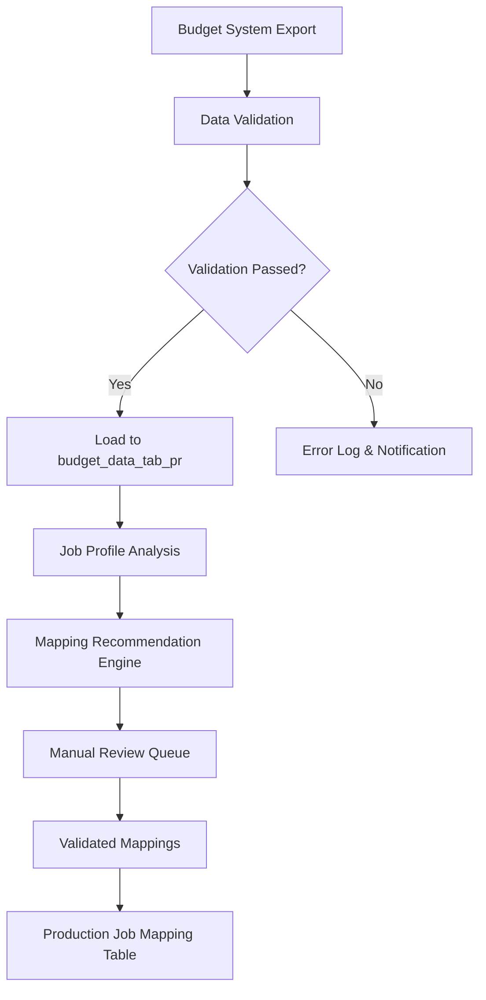
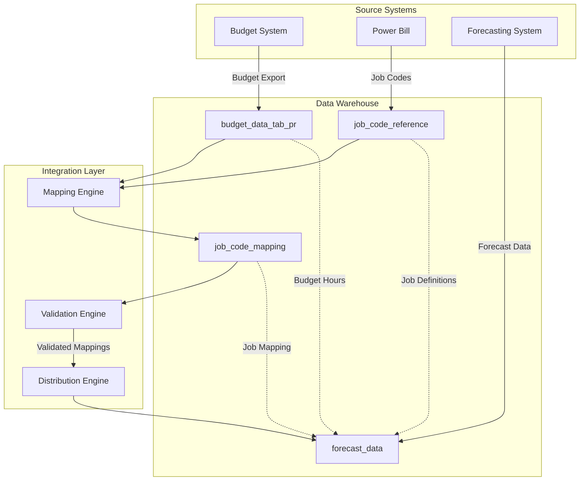
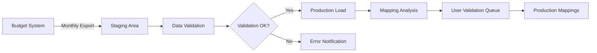

# Towne Park Forecasting - Budget Data Mapping Data Model

## All Fields Including Source System/Source Field

### Primary Table: budget_data_tab_pr

| Field Name | Data Type | Source System | Source Field | Description | Business Rules |
|------------|-----------|---------------|--------------|-------------|----------------|
| site_number | VARCHAR(10) | Budget System | Site_ID | Unique site identifier | Must match Power Bill site numbers |
| job_profile | VARCHAR(100) | Budget System | Job_Profile_Name | Site-specific job classification | Free-form text, varies by site |
| budgeted_hours | DECIMAL(10,2) | Budget System | Budget_Hours | Annual budgeted hours for job profile | Must be positive number |
| budget_amount | DECIMAL(12,2) | Budget System | Budget_Dollar_Amount | Annual budgeted dollar amount | Must be positive number |
| fiscal_year | INT | Budget System | Fiscal_Year | Budget fiscal year | Current or future years only |
| created_date | DATETIME | Budget System | Record_Created | Record creation timestamp | Auto-generated |
| last_updated | DATETIME | Budget System | Last_Modified | Last modification timestamp | Auto-updated on changes |
| active_flag | BIT | Budget System | Active_Status | Record active status | 1=Active, 0=Inactive |

### Related Table: job_code_mapping (Proposed)

| Field Name | Data Type | Source System | Source Field | Description | Business Rules |
|------------|-----------|---------------|--------------|-------------|----------------|
| mapping_id | INT | Forecasting | Auto-generated | Unique mapping identifier | Primary key, auto-increment |
| site_number | VARCHAR(10) | Power Bill | Site_Number | Site identifier | Foreign key to budget_data_tab_pr |
| job_profile | VARCHAR(100) | Budget System | Job_Profile_Name | Budget job profile name | Foreign key to budget_data_tab_pr |
| job_code | VARCHAR(20) | Power Bill | Job_Code | Power Bill job code | Must exist in Power Bill job codes |
| mapping_confidence | VARCHAR(20) | Manual/AI | Confidence_Level | Mapping confidence level | HIGH, MEDIUM, LOW, MANUAL |
| created_by | VARCHAR(50) | System | User_ID | User who created mapping | Required for audit trail |
| created_date | DATETIME | System | Auto-generated | Mapping creation date | Auto-generated |
| validated_by | VARCHAR(50) | Manual | User_ID | User who validated mapping | Required for production use |
| validation_date | DATETIME | Manual | Validation_Date | Date mapping was validated | Required for production use |

### Power Bill Job Codes Reference

| Field Name | Data Type | Source System | Source Field | Description | Business Rules |
|------------|-----------|---------------|--------------|-------------|----------------|
| job_code | VARCHAR(20) | Power Bill | Job_Code | Unique job code identifier | Primary key |
| job_description | VARCHAR(100) | Power Bill | Job_Description | Human-readable job description | Required |
| job_group | VARCHAR(50) | Power Bill | Job_Group | Job grouping category | Required for classification |
| billable_flag | BIT | Power Bill | Is_Billable | Whether job is billable | 1=Billable, 0=Non-billable |
| active_flag | BIT | Power Bill | Active_Status | Job code active status | 1=Active, 0=Inactive |
| hourly_rate | DECIMAL(8,2) | Power Bill | Standard_Rate | Standard hourly rate | Required for per labor hour contracts |

## Business Logic Describing Transformations of Incoming Data

### Data Ingestion Process



### Transformation Rules

#### 1. Job Profile Standardization
- **Input**: Raw job profile names from budget system
- **Process**: 
  - Trim whitespace and normalize case
  - Remove special characters except hyphens and spaces
  - Standardize common abbreviations (GSA, etc.)
- **Output**: Cleaned job profile names for mapping analysis

#### 2. Site Number Validation
- **Input**: Site numbers from budget system
- **Process**: 
  - Validate against Power Bill site master
  - Ensure 4-digit format with leading zeros
  - Flag mismatches for manual review
- **Output**: Validated site numbers or error flags

#### 3. Budget Amount Validation
- **Input**: Budget hours and dollar amounts
- **Process**: 
  - Validate positive numbers only
  - Check for reasonable ranges (hours < 8760 annually)
  - Calculate implied hourly rates for validation
- **Output**: Validated budget data or error flags

## Business Logic Describing Run-time Calculations

### Job Code Mapping Resolution

#### Mapping Priority Logic
```sql
-- Priority 1: Exact validated mappings
SELECT job_code 
FROM job_code_mapping 
WHERE site_number = @site 
  AND job_profile = @profile 
  AND validated_by IS NOT NULL

-- Priority 2: High confidence AI mappings
SELECT job_code 
FROM job_code_mapping 
WHERE site_number = @site 
  AND job_profile = @profile 
  AND mapping_confidence = 'HIGH'

-- Priority 3: Manual review required
SELECT 'MANUAL_REVIEW_REQUIRED' as job_code
```

#### Budget Hour Distribution Logic
```sql
-- For job profiles mapping to multiple job codes
-- Distribute hours evenly across mapped job codes
SELECT 
    jcm.job_code,
    bd.budgeted_hours / COUNT(*) OVER (PARTITION BY bd.site_number, bd.job_profile) as allocated_hours,
    bd.budget_amount / COUNT(*) OVER (PARTITION BY bd.site_number, bd.job_profile) as allocated_amount
FROM budget_data_tab_pr bd
JOIN job_code_mapping jcm ON bd.site_number = jcm.site_number 
                          AND bd.job_profile = jcm.job_profile
WHERE bd.active_flag = 1 
  AND jcm.validated_by IS NOT NULL
```

### Forecast Integration Calculations

#### Budget vs Forecast Variance
```sql
-- Calculate variance between budget and current forecast
SELECT 
    site_number,
    job_code,
    budgeted_hours,
    forecasted_hours,
    (forecasted_hours - budgeted_hours) as variance_hours,
    ((forecasted_hours - budgeted_hours) / budgeted_hours * 100) as variance_percent
FROM (
    SELECT 
        bd.site_number,
        jcm.job_code,
        bd.budgeted_hours,
        SUM(f.forecasted_hours) as forecasted_hours
    FROM budget_data_tab_pr bd
    JOIN job_code_mapping jcm ON bd.site_number = jcm.site_number 
                              AND bd.job_profile = jcm.job_profile
    JOIN forecast_data f ON jcm.site_number = f.site_number 
                        AND jcm.job_code = f.job_code
    GROUP BY bd.site_number, jcm.job_code, bd.budgeted_hours
) variance_calc
```

## Mermaid Flowchart Showing Source System and Data Warehouse Relationship



## List of Reports Built Off of Data Model

### Primary Reports

1. **PNL Report**
   - **Purpose**: Financial performance reporting with budget vs actual comparison
   - **Data Usage**: Budget hours and amounts for variance calculations
   - **Frequency**: Daily/Monthly

2. **Job Code Budget Report**
   - **Purpose**: Budget allocation by job code for account managers
   - **Data Usage**: Mapped budget hours and amounts by job code
   - **Frequency**: Monthly

3. **Budget Variance Analysis Report**
   - **Purpose**: Analysis of forecast vs budget variances
   - **Data Usage**: Budget data compared to forecast data
   - **Frequency**: Weekly

4. **Job Mapping Status Report**
   - **Purpose**: Status of job profile to job code mapping completeness
   - **Data Usage**: Mapping table with validation status
   - **Frequency**: As needed

5. **Site Budget Summary Report**
   - **Purpose**: High-level budget summary by site
   - **Data Usage**: Aggregated budget data across all job profiles
   - **Frequency**: Monthly

### Operational Reports

6. **Unmapped Job Profiles Report**
   - **Purpose**: Identifies job profiles requiring mapping attention
   - **Data Usage**: Budget data without corresponding job code mappings
   - **Frequency**: Daily

7. **Budget Data Quality Report**
   - **Purpose**: Data quality metrics and validation results
   - **Data Usage**: Budget data validation flags and error counts
   - **Frequency**: Daily

8. **Mapping Confidence Report**
   - **Purpose**: Analysis of mapping confidence levels and accuracy
   - **Data Usage**: Job code mapping confidence scores and validation results
   - **Frequency**: Weekly

## Size of Production Dataset

### Current Data Volume Estimates

| Table | Estimated Rows | Growth Rate | Storage Requirements |
|-------|----------------|-------------|---------------------|
| budget_data_tab_pr | 50,000 | 10% annually | 15 MB |
| job_code_mapping | 25,000 | 15% annually | 8 MB |
| job_code_reference | 500 | 5% annually | 0.1 MB |

### Scaling Projections

- **3-Year Projection**: 75,000 budget records, 40,000 mappings
- **5-Year Projection**: 100,000 budget records, 60,000 mappings
- **Peak Usage**: 200 concurrent users during budget season

### Performance Considerations

- **Query Response Time**: < 2 seconds for budget lookups
- **Mapping Resolution**: < 1 second for job code mapping
- **Report Generation**: < 30 seconds for monthly reports

## Indexing/Archiving Strategy

### Primary Indexes

```sql
-- Primary key index
CREATE CLUSTERED INDEX PK_budget_data_tab_pr 
ON budget_data_tab_pr (site_number, job_profile, fiscal_year)

-- Site lookup index
CREATE NONCLUSTERED INDEX IX_budget_site_lookup 
ON budget_data_tab_pr (site_number, active_flag) 
INCLUDE (job_profile, budgeted_hours, budget_amount)

-- Job profile search index
CREATE NONCLUSTERED INDEX IX_budget_job_profile 
ON budget_data_tab_pr (job_profile, site_number) 
INCLUDE (budgeted_hours, budget_amount)

-- Mapping table indexes
CREATE CLUSTERED INDEX PK_job_code_mapping 
ON job_code_mapping (mapping_id)

CREATE NONCLUSTERED INDEX IX_mapping_lookup 
ON job_code_mapping (site_number, job_profile) 
INCLUDE (job_code, mapping_confidence, validated_by)
```

### Archiving Strategy

#### Data Retention Policy
- **Active Budget Data**: Current + 2 prior fiscal years online
- **Historical Budget Data**: 3-7 years in archive storage
- **Mapping Data**: All mappings retained indefinitely for audit trail

#### Archive Process
```sql
-- Annual archiving process
-- Move budget data older than 3 years to archive tables
INSERT INTO budget_data_archive 
SELECT * FROM budget_data_tab_pr 
WHERE fiscal_year < (YEAR(GETDATE()) - 2)

-- Maintain referential integrity
UPDATE job_code_mapping 
SET archived_flag = 1 
WHERE site_number + job_profile IN (
    SELECT site_number + job_profile 
    FROM budget_data_archive
)
```

## Data Management Approach

### Update Strategy: Hybrid Delta/Full Reload

#### Monthly Budget Updates (Full Reload)
- **Frequency**: Monthly during budget season, quarterly otherwise
- **Process**: Complete replacement of current fiscal year data
- **Validation**: Full data quality validation before replacement
- **Rollback**: Previous version maintained for 30 days

#### Daily Mapping Updates (Delta Queue)
- **Frequency**: Real-time as mappings are validated
- **Process**: Insert/update individual mapping records
- **Validation**: Immediate validation of mapping integrity
- **Audit**: All changes logged with user and timestamp

#### Data Synchronization Process



### Data Quality Monitoring

#### Automated Quality Checks
- **Completeness**: All required fields populated
- **Consistency**: Site numbers match across systems
- **Accuracy**: Budget amounts within reasonable ranges
- **Timeliness**: Data loaded within SLA timeframes

#### Quality Metrics Dashboard
- **Data Freshness**: Time since last successful load
- **Mapping Coverage**: Percentage of job profiles mapped
- **Validation Status**: Percentage of mappings validated
- **Error Rates**: Daily error counts and trends

## Related Documentation

- [Forecasting System Overview](../../systems/forecasting/forecasting-system-overview.md)
- [Power Bill Integration](../../technical/integrations/powerbill-integration.md)
- [Budget Management Business Rules](../../business-rules/forecasting/)
- [Job Code Management User Processes](../../user-processes/account-manager/)
- [Data Quality Standards](../../standards/data-quality-standards/)

## Code Validation Notes

**VERIFICATION NEEDED**: Budget data table structure and field definitions require validation against current database schema:
- Confirm exact table name and field names in production database
- Validate data types and constraints match documentation
- Verify foreign key relationships and referential integrity rules

**VERIFICATION NEEDED**: Job code mapping logic requires validation against Power Platform implementation:
- Confirm mapping algorithm and confidence scoring methods
- Validate job code distribution logic for multiple mappings
- Verify integration patterns with forecasting calculations

**VERIFICATION NEEDED**: Data loading and synchronization processes require validation against current ETL implementation:
- Confirm update frequencies and data refresh schedules
- Validate error handling and rollback procedures
- Verify data quality monitoring and alerting mechanisms

---

*This data model documentation provides comprehensive specifications for budget data management within the Towne Park forecasting system. All data structures and business logic should be validated against current system implementation before relying on this documentation for development or operational decisions.*