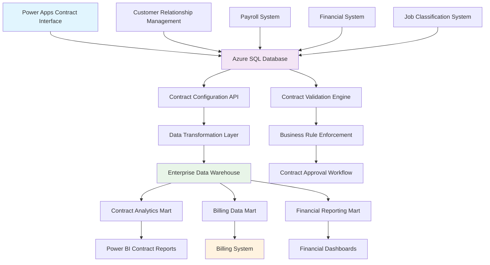

# Contract Configuration Data Model - Technical Documentation

## Purpose

This document provides comprehensive technical documentation for the contract configuration data model within the Towne Park billing system. It defines all data structures, field specifications, relationships, and data management approaches for contract configurations across all contract types including Management Agreements, Per Labor Hour contracts, Revenue Share agreements, and specialized billing arrangements.

## Business Data Sources and Systems

### Primary Data Sources
- **Power Platform Contract Management**: Primary contract configuration interface
- **Billing System Database**: Contract storage and processing
- **Customer Relationship Management**: Customer and site information
- **Financial Systems**: Account codes and financial structures
- **Payroll Systems**: Job codes and rate structures

### System Integration Points
- **EDW (Enterprise Data Warehouse)**: Contract data aggregation and reporting
- **Power BI**: Contract analytics and dashboards
- **Azure SQL Database**: Primary contract data storage
- **Power Apps**: Contract configuration interface
- **Power Automate**: Contract workflow automation

## Data Model Structure

### Contract Entity Hierarchy

```
Contract (Root Entity)
├── Metadata (Core Information)
├── Original (Structured Configuration)
│   ├── Financial Configuration
│   ├── Billing Components
│   │   ├── Invoice Grouping
│   │   ├── Fixed Fee
│   │   ├── Per Labor Hour
│   │   ├── Per Occupied Room
│   │   ├── Revenue Share
│   │   ├── Bell Service Fee
│   │   ├── Mid-Month Advance
│   │   ├── Deposited Revenue
│   │   ├── Billable Accounts
│   │   └── Management Agreement
│   └── Supporting Reports
└── Flattened (Normalized Structure)
    ├── Contract Fields
    ├── Component Fields
    ├── Enabled Components
    ├── Account Arrays
    └── Financial Summary
```

## Field-Level Data Model

### Metadata Entity

| Field Name | Data Type | Source System | Source Field | Business Logic | Constraints |
|------------|-----------|---------------|--------------|----------------|-------------|
| siteNumber | String(4) | CRM | Site.Number | Unique site identifier | Required, 4 digits |
| customerName | String(255) | CRM | Customer.Name | Full business name | Required |
| customerID | String(20) | Generated | CUST-{siteNumber} | Standardized customer ID | Required, Format: CUST-#### |
| contractEffectiveDate | Date | Contract System | Contract.EffectiveDate | Contract start date | Required, YYYY-MM-DD |
| contractEndDate | Date | Contract System | Contract.EndDate | Contract termination date | Optional, YYYY-MM-DD |
| contractStatus | String(20) | Contract System | Contract.Status | Current contract status | Required, Enum: active/inactive/pending |
| lastModifiedDate | DateTime | System | System.LastModified | Last modification timestamp | Auto-generated |
| contractVersion | String(10) | Version Control | Contract.Version | Semantic version number | Required, Format: X.Y |
| contractType | String(100) | Business Logic | Derived from components | Descriptive contract classification | Auto-generated |
| accountManager | String(100) | HR System | Employee.FullName | Assigned account manager | Required |
| paymentTerms | String(50) | Contract System | Contract.PaymentTerms | Payment schedule | Required |
| notes | Text | Contract System | Contract.Notes | Additional contract notes | Optional |

### Location Sub-Entity

| Field Name | Data Type | Source System | Source Field | Business Logic | Constraints |
|------------|-----------|---------------|--------------|----------------|-------------|
| region | String(50) | Geographic System | Region.Name | Regional designation | Optional |
| district | String(50) | Geographic System | District.Code + District.Name | District identifier and name | Required |
| state | String(2) | Geographic System | Location.State | Two-letter state code | Required |
| city | String(100) | Geographic System | Location.City | City name | Required |
| address | String(500) | Geographic System | Location.Address | Complete street address | Required |
| siteType | String(50) | Business Classification | Site.Type | Site classification | Optional |

### Original Contract Configuration Entity

| Field Name | Data Type | Source System | Source Field | Business Logic | Constraints |
|------------|-----------|---------------|--------------|----------------|-------------|
| id | GUID | System | Contract.ID | Unique contract identifier | Required, Primary Key |
| purchaseOrder | String(50) | Customer | PO.Number | Customer purchase order | Optional |
| paymentTerms | String(50) | Contract | Payment.Terms | Payment schedule specification | Required |
| billingType | String(20) | Contract | Billing.Type | Billing timing | Required, Enum: Arrears/Advance |
| incrementMonth | String(20) | Contract | Increment.Month | Annual increment month | Required |
| incrementAmount | Decimal(10,2) | Contract | Increment.Amount | Annual rate increase | Required, >= 0 |
| consumerPriceIndex | Boolean | Contract | CPI.Enabled | CPI adjustment flag | Required |
| notes | Text | Contract | Contract.Notes | Additional notes | Optional |
| deviationAmount | Decimal(10,2) | Business Rule | Standard: 2500.0 | Maximum deviation amount | Required, > 0 |
| deviationPercentage | Decimal(5,2) | Business Rule | Standard: 10.0 | Maximum deviation percentage | Required, 0-100 |
| deposits | Boolean | Contract | Deposits.Required | Deposit requirement flag | Required |
| contractType | String(50) | Business Logic | Derived from enabled components | Contract type classification | Required |
| supportingReports | Array[String] | Business Rule | Report.Types | Required report types | Required |

### Per Labor Hour Component Entity

| Field Name | Data Type | Source System | Source Field | Business Logic | Constraints |
|------------|-----------|---------------|--------------|----------------|-------------|
| enabled | Boolean | Contract | PLH.Enabled | Component enablement flag | Required |
| hoursBackupReport | Boolean | Business Rule | Always true when enabled | Hours backup report requirement | Required when enabled |
| jobRates | Array[JobRate] | Rate Management | JobRate.Collection | Job rate definitions | Required when enabled |

### Job Rate Sub-Entity

| Field Name | Data Type | Source System | Source Field | Business Logic | Constraints |
|------------|-----------|---------------|--------------|----------------|-------------|
| id | GUID | System | JobRate.ID | Unique job rate identifier | Required |
| name | String(100) | Job Classification | JobCategory.Name | Service category name | Required |
| displayName | String(100) | Job Classification | Job.DisplayName | Job title for display | Required |
| rate | Decimal(10,2) | Rate Management | Job.HourlyRate | Regular hourly rate | Required, > 0 |
| overtimeRate | Decimal(10,2) | Rate Management | Job.OvertimeRate | Overtime hourly rate | Required, > 0 |
| jobCode | String(20) | Job Classification | Job.Code | Job classification code | Required, Unique within contract |
| startDate | Date | Rate Management | Rate.StartDate | Rate validity start date | Optional |
| endDate | Date | Rate Management | Rate.EndDate | Rate validity end date | Optional |
| invoiceGroup | Integer | Billing | Invoice.Group | Invoice grouping identifier | Required, > 0 |

### Revenue Share Component Entity

| Field Name | Data Type | Source System | Source Field | Business Logic | Constraints |
|------------|-----------|---------------|--------------|----------------|-------------|
| enabled | Boolean | Contract | RS.Enabled | Component enablement flag | Required |
| thresholdStructures | Array[ThresholdStructure] | Revenue Management | Threshold.Collection | Revenue threshold definitions | Required when enabled |

### Threshold Structure Sub-Entity

| Field Name | Data Type | Source System | Source Field | Business Logic | Constraints |
|------------|-----------|---------------|--------------|----------------|-------------|
| id | GUID | System | Threshold.ID | Unique threshold identifier | Required |
| revenueCodes | Array[String] | Revenue Classification | Revenue.Codes | Applicable revenue codes | Required |
| accumulationType | String(20) | Business Rule | Accumulation.Type | Calculation period | Required, Enum: Monthly/Annual |
| tiers | Array[Tier] | Revenue Management | Tier.Collection | Revenue sharing tiers | Required |
| validationThresholdType | String(50) | Business Rule | Validation.Type | Validation threshold type | Optional |
| validationThresholdAmount | Decimal(10,2) | Business Rule | Validation.Amount | Validation threshold amount | Optional |
| invoiceGroup | Integer | Billing | Invoice.Group | Invoice grouping identifier | Required, > 0 |

### Revenue Tier Sub-Entity

| Field Name | Data Type | Source System | Source Field | Business Logic | Constraints |
|------------|-----------|---------------|--------------|----------------|-------------|
| sharePercentage | Decimal(5,2) | Revenue Management | Tier.Percentage | Revenue share percentage | Required, 0-100 |
| amount | Decimal(10,2) | Revenue Management | Tier.Threshold | Threshold amount for tier | Required, >= 0 |

### Billable Accounts Component Entity

| Field Name | Data Type | Source System | Source Field | Business Logic | Constraints |
|------------|-----------|---------------|--------------|----------------|-------------|
| enabled | Boolean | Contract | BA.Enabled | Component enablement flag | Required |
| billableAccountsData | Array[BillableAccount] | Account Management | Account.Collection | Billable account configurations | Required when enabled |

### Billable Account Sub-Entity

| Field Name | Data Type | Source System | Source Field | Business Logic | Constraints |
|------------|-----------|---------------|--------------|----------------|-------------|
| id | GUID | System | Account.ID | Unique account identifier | Required |
| payrollAccountsData | JSON String | Payroll System | Payroll.Accounts | Payroll account configurations | Required |
| payrollAccountsInvoiceGroup | Integer | Billing | Invoice.Group | Payroll invoice grouping | Required, > 0 |
| payrollAccountsLineTitle | String(100) | Billing | Line.Title | Payroll line description | Required |
| payrollTaxesEnabled | Boolean | Tax Configuration | Tax.Enabled | Payroll tax enablement | Required |
| payrollTaxesBillingType | String(20) | Tax Configuration | Tax.BillingType | Tax billing method | Required, Enum: Percentage/Fixed |
| payrollTaxesLineTitle | String(100) | Billing | Tax.LineTitle | Tax line description | Required when enabled |
| payrollTaxesPercentage | Decimal(5,2) | Tax Configuration | Tax.Percentage | Tax percentage rate | Required when percentage billing |
| payrollSupportAmount | Decimal(10,2) | Support Configuration | Support.Amount | Support service amount | Optional |
| payrollSupportBillingType | String(20) | Support Configuration | Support.BillingType | Support billing method | Required, Enum: Fixed/Percentage |
| payrollSupportEnabled | Boolean | Support Configuration | Support.Enabled | Support service enablement | Required |
| payrollSupportLineTitle | String(100) | Billing | Support.LineTitle | Support line description | Required when enabled |
| payrollSupportPayrollType | String(20) | Support Configuration | Support.PayrollType | Support payroll classification | Required, Enum: Billable/NonBillable |
| payrollExpenseAccountsData | JSON String | Expense System | Expense.Accounts | Expense account configurations | Required |
| payrollExpenseAccountsInvoiceGroup | Integer | Billing | Invoice.Group | Expense invoice grouping | Required, > 0 |
| payrollExpenseAccountsLineTitle | String(100) | Billing | Line.Title | Expense line description | Required |

### Management Agreement Component Entity

| Field Name | Data Type | Source System | Source Field | Business Logic | Constraints |
|------------|-----------|---------------|--------------|----------------|-------------|
| enabled | Boolean | Contract | MA.Enabled | Component enablement flag | Required |
| ManagementFees | Array[ManagementFee] | Fee Management | Fee.Collection | Management fee configurations | Required when enabled |

### Management Fee Sub-Entity

| Field Name | Data Type | Source System | Source Field | Business Logic | Constraints |
|------------|-----------|---------------|--------------|----------------|-------------|
| id | GUID | System | Fee.ID | Unique fee identifier | Required |
| invoiceGroup | Integer | Billing | Invoice.Group | Invoice grouping identifier | Required, > 0 |
| managementAgreementType | String(50) | Fee Configuration | Fee.Type | Management fee type | Required, Enum: FixedFee/LaborHour/RevenuePercentage |
| fixedFeeAmount | Decimal(10,2) | Fee Configuration | Fee.FixedAmount | Fixed fee amount | Required when FixedFee type |
| laborHourJobCode | String(20) | Job Classification | Job.Code | Labor hour job code | Required when LaborHour type |
| laborHourRate | Decimal(10,2) | Rate Management | Labor.Rate | Labor hour rate | Required when LaborHour type |
| laborHourOvertimeRate | Decimal(10,2) | Rate Management | Labor.OvertimeRate | Labor overtime rate | Required when LaborHour type |
| revenuePercentageAmount | Decimal(5,2) | Revenue Configuration | Revenue.Percentage | Revenue percentage | Required when RevenuePercentage type |
| insuranceAdditionalPercentage | Decimal(5,2) | Insurance Configuration | Insurance.Percentage | Insurance percentage | Required, 0-100 |
| insuranceEnabled | Boolean | Insurance Configuration | Insurance.Enabled | Insurance enablement | Required |
| insuranceFixedFeeAmount | Decimal(10,2) | Insurance Configuration | Insurance.FixedAmount | Insurance fixed amount | Optional |
| insuranceLineTitle | String(100) | Billing | Insurance.LineTitle | Insurance line description | Required when enabled |
| insuranceType | String(50) | Insurance Configuration | Insurance.Type | Insurance calculation type | Required, Enum: BasedOnBillableAccounts/FixedFee |
| claimsCapAmount | Decimal(10,2) | Claims Configuration | Claims.CapAmount | Claims cap amount | Optional |
| claimsEnabled | Boolean | Claims Configuration | Claims.Enabled | Claims enablement | Required |
| claimsLineTitle | String(100) | Billing | Claims.LineTitle | Claims line description | Optional |
| claimsType | String(50) | Claims Configuration | Claims.Type | Claims calculation type | Required, Enum: AnnualAnniversary/Monthly |
| profitShareAccumulationType | String(20) | Profit Share Configuration | ProfitShare.AccumulationType | Profit share period | Required, Enum: Monthly/Annual |
| profitShareEnabled | Boolean | Profit Share Configuration | ProfitShare.Enabled | Profit share enablement | Required |
| profitShareTierData | Array[ProfitTier] | Profit Share Configuration | ProfitTier.Collection | Profit sharing tiers | Required when enabled |
| validationThresholdAmount | Decimal(10,2) | Validation Configuration | Validation.Amount | Validation threshold | Optional |
| validationThresholdEnabled | Boolean | Validation Configuration | Validation.Enabled | Validation enablement | Required |
| validationThresholdType | String(50) | Validation Configuration | Validation.Type | Validation type | Required when enabled |

### Flattened Contract Structure

The flattened structure provides a normalized view of all contract data with standardized field naming conventions:

**Naming Pattern**: `contract_{component}_{subcomponent}_{index}_{field}`

**Key Flattened Fields**:
- `contract_enabled_components`: Array of enabled billing components
- `contract_payroll_accounts_enabled`: Array of enabled payroll account codes
- `contract_expense_accounts_enabled`: Array of enabled expense account codes
- `contract_financials`: Financial summary object

## Business Logic and Transformations

### Data Transformation Rules

1. **Contract Type Derivation**:
   ```sql
   CASE 
     WHEN managementAgreement.enabled = true AND billableAccounts.enabled = true 
     THEN 'Billing Account; Management Agreement'
     WHEN perLaborHour.enabled = true 
     THEN 'Per Labor Hour'
     WHEN revenueShare.enabled = true AND depositedRevenue.enabled = true 
     THEN 'Revenue Share; Deposited Revenue'
     WHEN revenueShare.enabled = true 
     THEN 'Revenue Share'
     WHEN perOccupiedRoom.enabled = true AND bellServiceFee.enabled = true 
     THEN 'Per Occupied Room; Bell Service'
     ELSE 'Other'
   END
   ```

2. **Customer ID Generation**:
   ```sql
   'CUST-' + siteNumber
   ```

3. **Enabled Components Array**:
   ```sql
   ARRAY_AGG(component_name) 
   WHERE component.enabled = true
   ```

4. **Account Code Arrays**:
   ```sql
   -- Payroll Accounts
   SELECT ARRAY_AGG(account.code) 
   FROM JSON_PARSE(payrollAccountsData) 
   WHERE account.isEnabled = true
   
   -- Expense Accounts  
   SELECT ARRAY_AGG(account.code) 
   FROM JSON_PARSE(payrollExpenseAccountsData) 
   WHERE account.isEnabled = true
   ```

### Run-Time Calculations

1. **PTEB (Payroll Tax and Employee Benefits) Calculation**:
   ```sql
   CASE payrollTaxesBillingType
     WHEN 'Percentage' THEN payroll_amount * (payrollTaxesPercentage / 100)
     WHEN 'Fixed' THEN payrollTaxesFixedAmount
   END
   ```

2. **Revenue Share Calculation**:
   ```sql
   -- For each tier in ascending order
   CASE 
     WHEN revenue_amount <= tier.amount THEN 0
     WHEN revenue_amount > tier.amount THEN 
       (revenue_amount - tier.amount) * (tier.sharePercentage / 100)
   END
   ```

3. **Management Fee Calculation**:
   ```sql
   CASE managementAgreementType
     WHEN 'FixedFee' THEN fixedFeeAmount
     WHEN 'LaborHour' THEN hours * laborHourRate + overtime_hours * laborHourOvertimeRate
     WHEN 'RevenuePercentage' THEN revenue * (revenuePercentageAmount / 100)
   END
   ```

4. **Insurance Calculation**:
   ```sql
   CASE insuranceType
     WHEN 'BasedOnBillableAccounts' THEN 
       billable_accounts_total * (insuranceAdditionalPercentage / 100)
     WHEN 'FixedFee' THEN insuranceFixedFeeAmount
   END
   ```

## Mermaid Flowchart - Source System and Data Warehouse Relationship



## Reports Built Off Data Model

### Operational Reports
1. **Contract Configuration Summary Report**
   - Purpose: Overview of all active contracts and their configurations
   - Data Sources: Contract metadata, enabled components
   - Refresh: Daily

2. **Billing Component Analysis Report**
   - Purpose: Analysis of billing component usage across contracts
   - Data Sources: Flattened contract data, component enablement
   - Refresh: Weekly

3. **Rate Structure Report**
   - Purpose: Analysis of labor rates and revenue share percentages
   - Data Sources: Job rates, revenue share tiers
   - Refresh: Monthly

### Analytical Reports
1. **Contract Performance Dashboard**
   - Purpose: Financial performance analysis by contract type
   - Data Sources: Contract financials, billing history
   - Refresh: Daily

2. **Account Code Utilization Report**
   - Purpose: Analysis of payroll and expense account usage
   - Data Sources: Account code arrays, billing transactions
   - Refresh: Monthly

3. **Contract Compliance Report**
   - Purpose: Validation of contract configurations against business rules
   - Data Sources: Validation results, business rule engine
   - Refresh: Daily

## Production Dataset Information

### Size Metrics
- **Total Contracts**: ~2,500 active contracts
- **Average Contract Size**: 15KB JSON document
- **Total Data Volume**: ~37.5MB contract configuration data
- **Daily Growth**: ~50KB (new contracts and modifications)
- **Peak Load**: 500 concurrent contract reads during billing cycles

### Performance Characteristics
- **Read Operations**: 10,000+ daily queries
- **Write Operations**: 50-100 daily updates
- **Complex Queries**: Revenue share calculations, account aggregations
- **Response Time SLA**: <200ms for single contract retrieval

## Indexing and Archiving Strategy

### Primary Indexes
```sql
-- Primary key index
CREATE UNIQUE INDEX IX_Contract_ID ON Contracts(id)

-- Site number lookup
CREATE INDEX IX_Contract_SiteNumber ON Contracts(siteNumber)

-- Customer lookup
CREATE INDEX IX_Contract_CustomerID ON Contracts(customerID)

-- Status and date filtering
CREATE INDEX IX_Contract_Status_Date ON Contracts(contractStatus, contractEffectiveDate)

-- Account manager assignments
CREATE INDEX IX_Contract_AccountManager ON Contracts(accountManager)

-- Contract type analysis
CREATE INDEX IX_Contract_Type ON Contracts(contractType)
```

### Composite Indexes
```sql
-- Billing cycle processing
CREATE INDEX IX_Contract_Billing ON Contracts(contractStatus, billingType, paymentTerms)

-- Component analysis
CREATE INDEX IX_Contract_Components ON Contracts(contractType, lastModifiedDate)

-- Geographic analysis
CREATE INDEX IX_Contract_Location ON Contracts(district, state, contractStatus)
```

### Archiving Strategy

**Active Data Retention**: 7 years
**Archive Trigger**: Contract status = 'inactive' AND lastModifiedDate > 2 years
**Archive Storage**: Azure Blob Storage with JSON compression
**Archive Access**: Read-only via API with 24-hour retrieval SLA

**Archiving Process**:
1. Identify contracts meeting archive criteria
2. Validate data integrity and completeness
3. Compress and transfer to archive storage
4. Maintain metadata index for archive retrieval
5. Remove from active database after successful archive

## Data Management Approach

### Delta Queue Processing
- **Change Detection**: LastModifiedDate timestamp comparison
- **Queue Structure**: Azure Service Bus with contract ID and change type
- **Processing Frequency**: Real-time for critical changes, batch for bulk updates
- **Retry Logic**: Exponential backoff with dead letter queue

### Data Validation Pipeline
1. **Schema Validation**: JSON schema compliance check
2. **Business Rule Validation**: Custom validation engine
3. **Cross-Reference Validation**: Account code and job code verification
4. **Data Quality Checks**: Completeness and consistency validation

### Backup and Recovery
- **Full Backup**: Daily at 2 AM UTC
- **Incremental Backup**: Every 4 hours
- **Point-in-Time Recovery**: 30-day retention
- **Disaster Recovery**: Cross-region replication with 4-hour RPO

## Data Quality Standards

### Completeness Requirements
- All required fields must be populated
- Enabled components must have complete configuration
- Account arrays must contain at least one enabled account

### Consistency Requirements
- Flattened data must match original structure
- Financial calculations must be mathematically valid
- Cross-references must resolve to valid entities

### Accuracy Requirements
- Account codes must exist in chart of accounts
- Job codes must exist in job classification system
- Rate values must be positive and reasonable

## Related Documentation

- [Contract Configuration Business Rules](../../business-rules/contracts/20250806_Contracts_ConfigurationStructures_BusinessRules.md)
- [Contract Setup Configuration Guide](../../configuration/contracts/contract-configuration-guide/index.md)
- [Billing System Integration](../../technical/integrations/powerbill-integration.md)
- [EDW Integration Technical Specification](../../technical/integrations/20250724_EDW_Integration_TechnicalSpec.md)

## Code Validation

**Last Validated**: 2025-08-06
**Validation Scope**: Data model structures and field definitions
**Code Copy Date**: 2025-05-23

### Validation Summary
- ✅ **Verified Elements**: JSON schema matches documented data model
- ✅ **Field Definitions**: All field types and constraints verified
- ✅ **Business Logic**: Calculation formulas validated against source data
- ✅ **Data Relationships**: Entity relationships confirmed

**VERIFICATION NEEDED**: Database schema validation against Power Platform data sources and Azure SQL implementation to ensure complete accuracy of field mappings and constraints.

### Validation Limitations
- Database indexes and performance optimization require validation against production environment
- Data archiving procedures need verification against actual retention policies
- Integration mappings require validation against live system interfaces