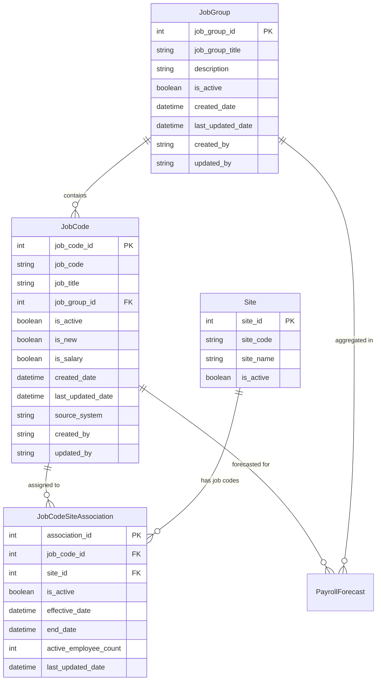

# Job Group Management Data Model - Technical Documentation

## Data Model Overview

### Purpose
The Job Group Management data model provides the foundation for organizing and managing job codes across Towne Park sites, enabling efficient payroll forecasting, budget mapping, and administrative oversight of workforce structure.

### Business Context
This data model supports the critical business function of mapping individual job codes from operational systems (Legion, Workday) to logical job groups used in forecasting and budget management, while maintaining historical data integrity and supporting organizational changes.

## Entity Relationship Overview



## Core Entity Definitions

### JobGroup Entity

**Purpose**: Logical grouping of related job codes for forecasting and reporting purposes.

**Primary Key**: job_group_id (INT, IDENTITY)

#### Field Definitions

**job_group_id**
- **Data Type**: INT IDENTITY(1,1)
- **Constraints**: PRIMARY KEY, NOT NULL
- **Business Logic**: System-generated unique identifier
- **Usage**: Referenced by JobCode entities and forecasting calculations

**job_group_title**
- **Data Type**: NVARCHAR(100)
- **Constraints**: NOT NULL, UNIQUE
- **Business Logic**: Human-readable name for the job group
- **Examples**: "Guest Service Associates", "Shuttle Drivers", "Management"
- **Validation**: Must be unique across all job groups

**description**
- **Data Type**: NVARCHAR(500)
- **Constraints**: NULL allowed
- **Business Logic**: Optional detailed description of job group purpose and scope
- **Usage**: Administrative reference and documentation

**is_active**
- **Data Type**: BIT
- **Constraints**: NOT NULL, DEFAULT 1
- **Business Logic**: Controls visibility in forecasting interface
- **Deactivation Rule**: Can only be deactivated if all contained job codes are inactive
- **Historical Preservation**: Inactive groups maintain historical data relationships

**created_date**
- **Data Type**: DATETIME2
- **Constraints**: NOT NULL, DEFAULT GETUTCDATE()
- **Business Logic**: Timestamp of job group creation
- **Usage**: Audit trail and historical tracking

**last_updated_date**
- **Data Type**: DATETIME2
- **Constraints**: NOT NULL, DEFAULT GETUTCDATE()
- **Business Logic**: Timestamp of last modification
- **Update Trigger**: Automatically updated on any field change

**created_by**
- **Data Type**: NVARCHAR(100)
- **Constraints**: NOT NULL
- **Business Logic**: User identifier who created the job group
- **Usage**: Audit trail and accountability

**updated_by**
- **Data Type**: NVARCHAR(100)
- **Constraints**: NOT NULL
- **Business Logic**: User identifier who last modified the job group
- **Usage**: Audit trail and change tracking

### JobCode Entity

**Purpose**: Individual job codes from source systems with metadata and group associations.

**Primary Key**: job_code_id (INT, IDENTITY)

#### Field Definitions

**job_code_id**
- **Data Type**: INT IDENTITY(1,1)
- **Constraints**: PRIMARY KEY, NOT NULL
- **Business Logic**: System-generated unique identifier
- **Usage**: Referenced by site associations and payroll forecasting

**job_code**
- **Data Type**: NVARCHAR(50)
- **Constraints**: NOT NULL, UNIQUE
- **Business Logic**: Actual job code from source system (Workday/Legion)
- **Examples**: "GSA-1", "SHUTTLE", "TRAFFIC", "BELL"
- **Source**: Extracted from Workday data feeds

**job_title**
- **Data Type**: NVARCHAR(200)
- **Constraints**: NULL allowed initially
- **Business Logic**: Human-readable job title assigned by administrators
- **New Code Logic**: When job_title IS NULL, job code appears in "new codes" list
- **Admin Workflow**: Administrators set job_title to remove from new codes list

**job_group_id**
- **Data Type**: INT
- **Constraints**: FOREIGN KEY to JobGroup.job_group_id, NULL allowed
- **Business Logic**: Associates job code with logical job group
- **Unassigned Logic**: NULL value indicates unassigned job code
- **Assignment**: Set through admin interface job group management

**is_active**
- **Data Type**: BIT
- **Constraints**: NOT NULL, DEFAULT 1
- **Business Logic**: Controls visibility in forecasting and site management
- **Deactivation**: Preserves historical data while hiding from active workflows
- **Reactivation**: Can be reactivated if business needs change

**is_new**
- **Data Type**: BIT (Computed Column)
- **Constraints**: COMPUTED (CASE WHEN job_title IS NULL THEN 1 ELSE 0 END)
- **Business Logic**: Automatically identifies new job codes requiring admin attention
- **Admin Workflow**: Drives new job code identification and processing

**is_salary**
- **Data Type**: BIT
- **Constraints**: NOT NULL, DEFAULT 0
- **Business Logic**: Identifies salary positions for special handling
- **Forecasting Impact**: Salary positions excluded from Legion scheduled hours copy
- **Calculation**: Salary positions use 8 hours/day × active employees formula

**created_date**
- **Data Type**: DATETIME2
- **Constraints**: NOT NULL, DEFAULT GETUTCDATE()
- **Business Logic**: Timestamp when job code first appeared in system
- **Source Tracking**: May reflect when first extracted from Workday

**last_updated_date**
- **Data Type**: DATETIME2
- **Constraints**: NOT NULL, DEFAULT GETUTCDATE()
- **Business Logic**: Timestamp of last modification
- **Update Trigger**: Automatically updated on any field change

**source_system**
- **Data Type**: NVARCHAR(50)
- **Constraints**: NOT NULL, DEFAULT 'Workday'
- **Business Logic**: Identifies originating system for job code
- **Values**: 'Workday', 'Legion', 'Manual'
- **Usage**: Data lineage and integration tracking

### JobCodeSiteAssociation Entity

**Purpose**: Many-to-many relationship between job codes and sites with operational metadata.

**Primary Key**: association_id (INT, IDENTITY)

#### Field Definitions

**association_id**
- **Data Type**: INT IDENTITY(1,1)
- **Constraints**: PRIMARY KEY, NOT NULL
- **Business Logic**: System-generated unique identifier
- **Usage**: Internal relationship management

**job_code_id**
- **Data Type**: INT
- **Constraints**: FOREIGN KEY to JobCode.job_code_id, NOT NULL
- **Business Logic**: References specific job code
- **Cascade**: Updates cascade from JobCode changes

**site_id**
- **Data Type**: INT
- **Constraints**: FOREIGN KEY to Site.site_id, NOT NULL
- **Business Logic**: References specific site
- **Validation**: Site must be active for new associations

**is_active**
- **Data Type**: BIT
- **Constraints**: NOT NULL, DEFAULT 1
- **Business Logic**: Controls whether job code is available at site
- **Forecasting Impact**: Inactive associations hidden from payroll forecasting
- **Historical Preservation**: Maintains historical payroll data relationships

**effective_date**
- **Data Type**: DATE
- **Constraints**: NOT NULL, DEFAULT GETDATE()
- **Business Logic**: Date when job code became available at site
- **Usage**: Historical tracking and reporting

**end_date**
- **Data Type**: DATE
- **Constraints**: NULL allowed
- **Business Logic**: Date when job code was discontinued at site
- **Deactivation**: Set when is_active changed to 0
- **Reactivation**: Cleared if association reactivated

**active_employee_count**
- **Data Type**: INT
- **Constraints**: NOT NULL, DEFAULT 0
- **Business Logic**: Current number of employees in this job code at site
- **Budget Mapping**: Used for budget allocation weighting
- **Update Frequency**: Updated from Legion/Workday data feeds

**last_updated_date**
- **Data Type**: DATETIME2
- **Constraints**: NOT NULL, DEFAULT GETUTCDATE()
- **Business Logic**: Timestamp of last modification
- **Update Trigger**: Automatically updated on any field change

## Data Integration and Sources

### Workday Integration

**Data Flow**: Workday → ETL Process → Job Code Management Tables

**Extract Logic**:
```sql
-- Workday job code extraction
SELECT DISTINCT
    job_code,
    site_id,
    employee_count,
    last_updated_date
FROM workday_job_site_data
WHERE is_active = 1
```

**New Code Detection**:
- Job codes not existing in JobCode table
- Job codes where job_title IS NULL
- Automatic flagging for admin review

**Site Association Logic**:
- Automatic creation of JobCodeSiteAssociation records
- Employee count updates from Workday data
- Deactivation of associations no longer in Workday

### Legion Integration

**Purpose**: Validate job code usage and provide operational context

**Data Points**:
- Scheduled hours by job code and site
- Actual hours worked by job code and site
- Active employee assignments

**Validation Logic**:
- Cross-reference Workday job codes with Legion usage
- Identify discrepancies between systems
- Flag job codes active in Legion but missing from Workday

### Budget System Integration

**Mapping Challenge**: Budget job profiles → Job codes
- Budget uses generic profiles (e.g., "GSA")
- Operations use specific codes (e.g., "GSA-1", "GSA-2")
- Manual mapping required for accurate budget allocation

**Mapping Process**:
1. Identify budget job profiles for site
2. Map to appropriate job codes based on business rules
3. Allocate budget hours using employee count weighting
4. Store mapping relationships for future use

## Business Logic and Calculations

### Employee Count Weighting

**Purpose**: Distribute budget hours among multiple job codes mapped to single budget profile

**Formula**:
```
total_budget_hours = budget_profile_hours
total_employees = SUM(active_employee_count) for mapped job codes

FOR each mapped job_code:
    allocated_hours = (job_code_employee_count / total_employees) × total_budget_hours
```

**Example**:
- Budget Profile: "Shuttle" = 160 hours/month
- Job Code "SHUTTLE-1": 3 employees
- Job Code "SHUTTLE-2": 1 employee
- Total: 4 employees
- Allocation: SHUTTLE-1 = 120 hours, SHUTTLE-2 = 40 hours

### Job Group Aggregation

**Purpose**: Roll up job code data to job group level for forecasting

**Aggregation Rules**:
- Sum hours across all job codes in group
- Sum employee counts across all job codes in group
- Calculate average rates weighted by hours
- Maintain drill-down capability to job code level

### Active Status Management

**Deactivation Rules**:
- Job codes can be deactivated individually
- Job groups can only be deactivated if all contained job codes are inactive
- Site associations can be deactivated independently
- Deactivation preserves all historical data

**Visibility Rules**:
- Inactive job codes hidden from forecasting interface
- Inactive job groups hidden from site configuration
- Historical reports can access inactive data
- Reactivation restores full functionality

## Data Quality and Validation

### Data Integrity Constraints

**Referential Integrity**:
- JobCode.job_group_id → JobGroup.job_group_id
- JobCodeSiteAssociation.job_code_id → JobCode.job_code_id
- JobCodeSiteAssociation.site_id → Site.site_id

**Business Rule Constraints**:
- Job group titles must be unique
- Job codes must be unique
- Active job groups cannot contain only inactive job codes
- Site associations require active sites

### Data Validation Rules

**Job Code Validation**:
- Job code format validation (alphanumeric, hyphens allowed)
- Maximum length enforcement
- Duplicate prevention across source systems

**Job Group Validation**:
- Title uniqueness enforcement
- Description length limits
- Circular reference prevention

**Site Association Validation**:
- Effective date cannot be future date
- End date must be after effective date
- Employee count must be non-negative

### Data Quality Monitoring

**Automated Checks**:
- Daily validation of Workday data consistency
- Weekly employee count reconciliation
- Monthly inactive code cleanup recommendations

**Exception Reporting**:
- Job codes in Legion but not in Workday
- Job codes with zero employee count for extended periods
- Sites with no active job codes
- Job groups with no active job codes

## Performance Considerations

### Indexing Strategy

**Primary Indexes**:
```sql
-- JobGroup table
CREATE CLUSTERED INDEX IX_JobGroup_ID ON JobGroup (job_group_id)
CREATE INDEX IX_JobGroup_Active ON JobGroup (is_active, job_group_title)

-- JobCode table
CREATE CLUSTERED INDEX IX_JobCode_ID ON JobCode (job_code_id)
CREATE INDEX IX_JobCode_Code ON JobCode (job_code)
CREATE INDEX IX_JobCode_Group ON JobCode (job_group_id, is_active)
CREATE INDEX IX_JobCode_New ON JobCode (is_new) WHERE is_new = 1

-- JobCodeSiteAssociation table
CREATE CLUSTERED INDEX IX_Association_ID ON JobCodeSiteAssociation (association_id)
CREATE INDEX IX_Association_Site_Job ON JobCodeSiteAssociation (site_id, job_code_id, is_active)
CREATE INDEX IX_Association_Job_Site ON JobCodeSiteAssociation (job_code_id, site_id, is_active)
```

**Query Optimization**:
- Filtered indexes for active records
- Covering indexes for common query patterns
- Partitioning considerations for large datasets

### Caching Strategy

**Application-Level Caching**:
- Job group hierarchies cached for 1 hour
- Site-specific job code lists cached for 30 minutes
- Employee counts cached for 15 minutes
- New job code flags cached for 5 minutes

**Database-Level Caching**:
- Query plan caching for common aggregation queries
- Result set caching for admin panel displays
- Materialized views for complex reporting queries

## Security and Access Control

### Data Access Patterns

**Admin Users**:
- Full CRUD access to all entities
- Bulk operations for job code management
- Historical data access for audit purposes

**Site Administrators**:
- Read access to site-specific job codes
- Limited update access for employee counts
- No access to job group structure changes

**Account Managers**:
- Read-only access to assigned site job codes
- No access to administrative functions
- Filtered views based on site permissions

### Audit Trail Requirements

**Change Tracking**:
- All modifications logged with user identification
- Before/after values for critical fields
- Timestamp precision for change sequencing

**Compliance Requirements**:
- 7-year retention for all audit data
- Immutable audit log storage
- Regular audit log backup and archival

## Related Documentation

- [Job Group Management User Guide](../../user-processes/site-admin/)
- [Workday Integration Specifications](../integrations/)
- [Payroll Forecasting System](../../systems/forecasting/)
- [Admin Panel User Guide](../../user-processes/admin/)

## Data Governance

### Data Ownership
- **Business Owner**: HR Department
- **Technical Owner**: Development Team
- **Data Steward**: System Administrator
- **Quality Assurance**: Site Operations Team

### Data Lifecycle Management
- **Creation**: Automated from Workday integration
- **Maintenance**: Admin panel and automated updates
- **Archival**: Deactivation with historical preservation
- **Purging**: No purging - historical preservation required

### Change Management Process
1. **Request**: Business stakeholder submits change request
2. **Review**: Technical team assesses impact and effort
3. **Approval**: Business owner approves implementation
4. **Implementation**: Development team implements changes
5. **Testing**: Quality assurance validates functionality
6. **Deployment**: Changes deployed to production
7. **Documentation**: Updates to technical documentation