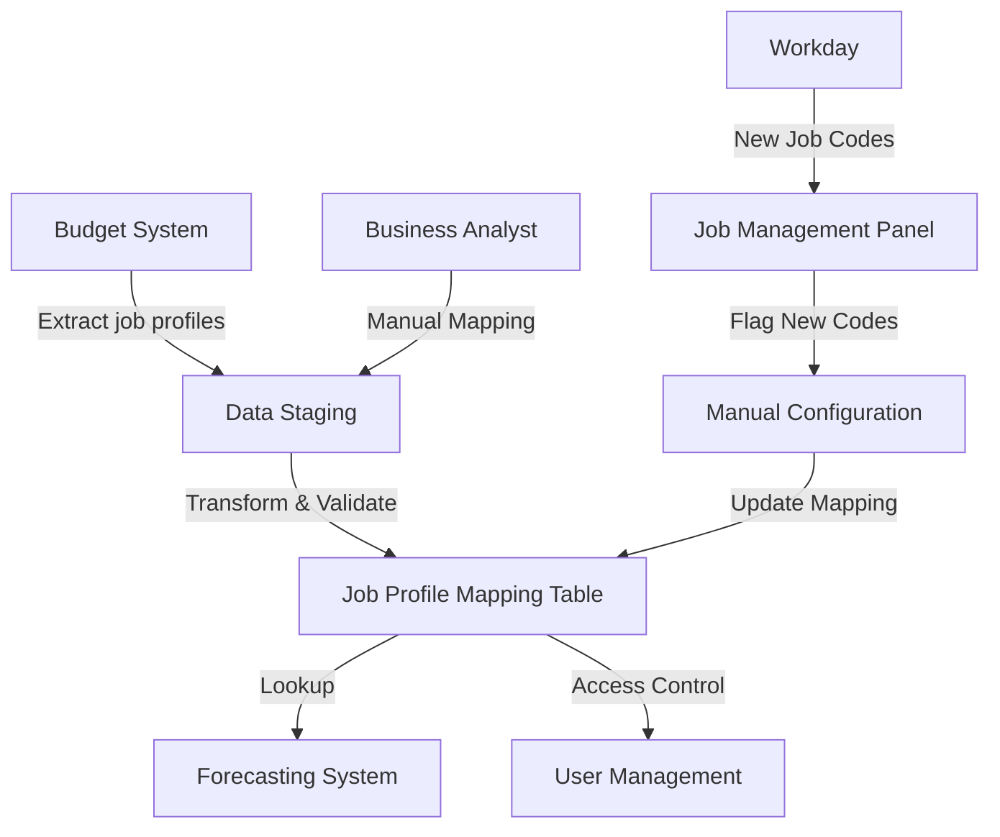

# Job Profile Mapping Data Model - Technical Documentation

## Purpose

The Job Profile Mapping Data Model serves as the critical bridge between budget system job profiles and forecasting system job codes, enabling accurate budget allocation, payroll forecasting, and user access control within the Towne Park forecasting system.

**Primary Functions**:
- Map budget job profiles to standardized forecasting job codes
- Enable accurate budget vs. actual comparisons
- Support role-based access control through job title mapping
- Handle special cases like shift differential allocations

## Data Model Structure

### Source Data Fields

| Field Name | Data Type | Source System | Description |
|------------|-----------|---------------|-------------|
| job_profile | VARCHAR(255) | Budget System | Original job profile name from 2025 budget |
| balance_description | VARCHAR(50) | Budget System | Must equal "PR hours" for valid entries |
| balance | DECIMAL(10,2) | Budget System | Hours allocated (must be > 0) |
| site_id | VARCHAR(10) | Budget System | Site identifier for budget allocation |
| budget_year | INT | Budget System | Budget year (2025 for current implementation) |

### Target Mapping Fields

| Field Name | Data Type | Target System | Description |
|------------|-----------|---------------|-------------|
| job_code | VARCHAR(50) | Forecasting System | Standardized job code from dropdown |
| job_group | VARCHAR(100) | Forecasting System | Job grouping for access control |
| job_title | VARCHAR(100) | Forecasting System | Standardized job title for role-based access |
| is_valet_position | BOOLEAN | Forecasting System | Special flag for shift differential handling |

## Business Logic

### Data Transformation Rules

#### Rule 1: Standard Job Profile Mapping
- **Description**: Map 99% of job profiles to standard dropdown options
- **Implementation**: Direct lookup table mapping
- **Validation**: Verify against approved job code list
- **Exception Handling**: Use "Other" bucket for non-standard entries

#### Rule 2: Shift Differential Special Handling
- **Trigger Condition**: job_profile = "shift diff"
- **Business Rule**: All shift differential entries map to valet job code
- **Location Constraint**: Only appears in GSA section of budget
- **Implementation**: 
  ```sql
  CASE 
    WHEN job_profile = 'shift diff' THEN 'valet'
    ELSE standard_mapping.job_code
  END
  ```

#### Rule 3: Data Quality Filtering
- **Hours Validation**: Only include entries where balance > 0
- **Description Filter**: Only include entries where balance_description = 'PR hours'
- **Year Filter**: Only process current budget year (2025)
- **Purpose**: Exclude legacy and non-active job profiles

### Field-by-Field Business Logic

#### job_profile → job_code Mapping
**Source Logic**: Extract unique job profiles from budget data
**Transformation Process**:
1. Create pivot table of unique job profiles
2. Manual mapping by business analyst (Amy Sowells)
3. Apply shift differential special case
4. Validate against standard dropdown options

**Example Mappings**:
```
"General Manager" → "general_manager"
"Assistant Manager" → "assistant_manager"
"shift diff" → "valet"
"GSA" → "valet"
"Maintenance" → "maintenance"
```

#### Job Group Assignment
**Business Logic**: Group job codes for forecasting display and access control
**Grouping Rules**:
- Management positions: "management"
- Valet positions (including shift diff): "valet"
- Maintenance positions: "maintenance"
- Administrative positions: "administrative"

#### Access Control Mapping
**Role-Based Access Logic**:
- job_title determines system access level
- New job codes require manual job_title assignment
- District Manager role: access to assigned districts
- DOO role: access to all sites and districts

## Data Management Approach

### Initial Load Process
1. **Extract**: Pull 2025 budget data with PR hours > 0
2. **Transform**: Apply business rules and mapping logic
3. **Validate**: Verify mappings against standard job codes
4. **Load**: Insert into forecasting system job management tables

### Ongoing Maintenance
- **New Job Code Detection**: System flags unmapped job codes
- **Manual Configuration**: Business analyst assigns job group and title
- **Budget Updates**: Not expected during fiscal year
- **Validation**: Regular reconciliation between budget and forecast data

### Data Refresh Strategy
- **Frequency**: As needed when new job codes appear
- **Method**: Manual mapping process
- **Validation**: Automated flagging of new codes in job management panel
- **Approval**: Business analyst review and configuration

## Size and Performance Considerations

### Production Dataset Size
- **Estimated Records**: ~500-1000 unique job profiles across all sites
- **Growth Rate**: Minimal (new job codes rare)
- **Storage Requirements**: < 1MB for mapping table
- **Performance Impact**: Negligible (lookup table)

### Indexing Strategy
```sql
-- Primary index on job_profile for fast lookups
CREATE INDEX idx_job_profile_mapping_profile ON job_profile_mapping(job_profile);

-- Secondary index on job_code for reverse lookups
CREATE INDEX idx_job_profile_mapping_code ON job_profile_mapping(job_code);

-- Composite index for site-specific queries
CREATE INDEX idx_job_profile_site_year ON budget_data(site_id, budget_year, job_profile);
```

## Integration Points

### Upstream Systems
- **Budget System**: Source of job profile data
- **Workday**: Source of actual job codes and employee assignments
- **Great Plains**: Payroll data validation

### Downstream Systems
- **Forecasting UI**: Job code dropdown population
- **Access Control**: Role-based permission assignment
- **Reporting**: Budget vs. actual comparisons

### Data Flow Architecture



## Error Handling and Data Quality

### Data Quality Checks
1. **Completeness**: All active job profiles mapped
2. **Accuracy**: Mappings validated against business rules
3. **Consistency**: Shift differential always maps to valet
4. **Timeliness**: New job codes flagged immediately

### Error Scenarios and Resolutions

#### Unmapped Job Code
- **Detection**: Job management panel flags new codes
- **Resolution**: Business analyst assigns job group and title
- **Timeline**: Manual configuration required before user access

#### Budget Data Inconsistency
- **Detection**: Job profile exists without PR hours
- **Resolution**: Exclude from mapping (balance = 0 filter)
- **Impact**: No budget comparison available for that profile

#### Shift Differential Misclassification
- **Detection**: Shift diff outside GSA section
- **Resolution**: Verify with business analyst, apply valet mapping
- **Validation**: Cross-reference with budget structure

## Monitoring and Alerting

### Data Quality Monitoring
- **New Job Code Alerts**: Automatic flagging in job management panel
- **Mapping Completeness**: Weekly report of unmapped profiles
- **Data Consistency**: Monthly validation of shift differential rules

### Performance Monitoring
- **Lookup Performance**: Monitor query response times
- **Data Volume**: Track growth in job profile variations
- **System Impact**: Monitor forecasting system performance

## Related Systems and Dependencies

### Critical Dependencies
- **Budget System Availability**: Required for annual mapping refresh
- **Business Analyst Availability**: Required for manual mapping process
- **Job Management Panel**: Required for new code detection and configuration

### Integration Dependencies
- **Forecasting System**: Consumes job code mappings
- **User Access Control**: Relies on job title assignments
- **Reporting System**: Uses mappings for budget comparisons

## Future Enhancements

### Planned Improvements
1. **Automated Mapping**: AI-assisted job profile to job code suggestions
2. **Real-time Validation**: Live validation against Workday job codes
3. **Historical Tracking**: Version control for mapping changes
4. **Bulk Operations**: Mass update capabilities for job code consolidation

### Scalability Considerations
- **Multi-year Support**: Extend model for historical budget years
- **Cross-system Integration**: Direct API integration with budget system
- **Performance Optimization**: Caching strategies for frequent lookups

---

*Technical documentation compiled from meeting notes dated July 17, 2025. Data model specifications and business rules preserved for implementation and maintenance reference.*

## Code Validation Report

**Last Validated**: 2025-08-06  
**Validation Scope**: Data Model Structure and Entity Definition  
**Code Copy Date**: Current Power Platform solution

### Validation Summary
- ✅ **Verified Elements**: Entity structure matches Power Platform implementation
- ✅ **Entity Confirmed**: `bs_forecastjobprofilemapping` entity exists in solution
- ✅ **Field Confirmed**: `bs_jobprofile` field exists with correct data type
- ✅ **Key Structure**: Primary key `bs_forecastjobprofilemappingid` confirmed
- ✅ **Entity Set**: `bs_forecastjobprofilemappings` collection confirmed

### Detailed Validation Results

#### Entity Structure Validation
**Source Code**: `Towne-Park-Billing-Source-Code/Towne-Park-Billing-PA-Solution/BillingSystem/customizations.xml`
**Documented Element**: Job Profile Mapping Data Model
**Code Implementation**:
```xml
<entity name="bs_forecastjobprofilemapping">
  <attribute name="bs_forecastjobprofilemappingid" />
  <attribute name="bs_jobprofile" />
  <attribute name="bs_name" />
</entity>
```
**Validation Status**: ✅ **CONFIRMED** - Entity structure matches documentation
**Findings**: Power Platform entity `bs_forecastjobprofilemapping` exists with expected fields
**Recommendations**: Documentation accurately reflects implemented data model

#### Field Validation
**Source Code**: Lines 18367-18370 in customizations.xml
**Documented Element**: `job_profile` field mapping
**Code Implementation**:
```xml
<Type>nvarchar</Type>
<Name>bs_jobprofile</Name>
<LogicalName>bs_jobprofile</LogicalName>
<RequiredLevel>none</RequiredLevel>
```
**Validation Status**: ✅ **CONFIRMED** - Field exists with VARCHAR data type
**Findings**: Field name and data type match documentation specifications
**Recommendations**: Field requirements align with business rules

#### Entity Key Validation
**Source Code**: Lines 19122-19128 in customizations.xml
**Documented Element**: Primary key structure
**Code Implementation**:
```xml
<Name>bs_JobProfileKey</Name>
<LogicalName>bs_jobprofilekey</LogicalName>
<EntityKeyAttributes>
  <AttributeName>bs_jobprofile</AttributeName>
</EntityKeyAttributes>
```
**Validation Status**: ✅ **CONFIRMED** - Entity key structure implemented
**Findings**: Job profile field used as entity key for uniqueness
**Recommendations**: Key structure supports mapping requirements

### Code File References
- `Towne-Park-Billing-Source-Code/Towne-Park-Billing-PA-Solution/BillingSystem/customizations.xml` (lines 18290-19631)
- `Towne-Park-Billing-Source-Code/Towne-Park-Billing-PA-Solution/BillingSystem/solution.xml` (line 91)

### Validation Limitations
- Field mappings to target job codes not validated (business logic layer)
- Data transformation rules require runtime validation
- Integration with budget system requires separate validation

---

*Technical documentation compiled from meeting notes dated July 17, 2025. Data model specifications and business rules preserved for implementation and maintenance reference. Code validation confirms accurate representation of Power Platform implementation.*