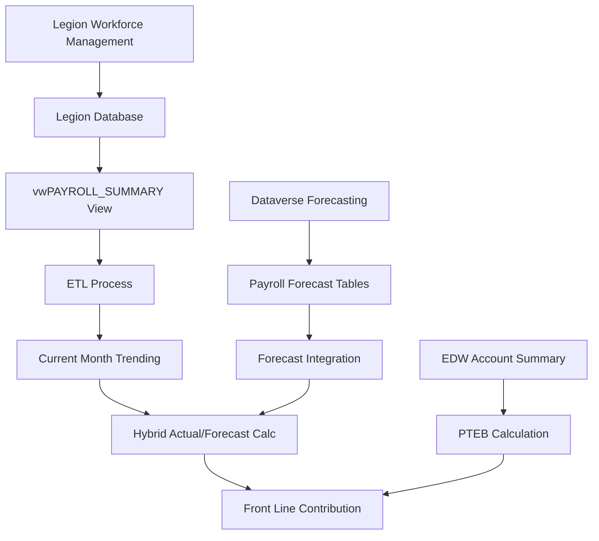

# Legion Payroll Integration Data Model

## Purpose

The Legion Payroll Integration data model provides the structure and business logic for integrating actual payroll data from the Legion workforce management system into Towne Park's current month trending calculations. This integration enables real-time payroll cost tracking by combining actual payroll data with forecasted data for complete monthly trending.

## Data Model Overview

### Integration Architecture
- **Source System**: Legion Workforce Management System
- **Target Database**: `TP_LEGION`
- **Primary View**: `vwPAYROLL_SUMMARY`
- **Integration Method**: Daily ETL process
- **Granularity**: Daily payroll data by work location and job title

### Business Context
This data model supports the transition from purely forecasted payroll costs to hybrid actual/forecasted calculations, enabling accurate current month trending for Front Line Contribution (FLC) calculations and payroll expense management.

## Field Definitions

### Core Identification Fields

| Field Name | Data Type | Description | Business Rules |
|------------|-----------|-------------|----------------|
| `WORK_LOCATION` | VARCHAR | Site identifier matching EDW site codes | Required. Must match site master data |
| `DATE` | DATE | Payroll transaction date | Required. Daily granularity for trending |
| `TITLE` | VARCHAR | Job title/position classification | Required. Maps to job code structure |

### Financial Data Fields

| Field Name | Data Type | Description | Business Rules |
|------------|-----------|-------------|----------------|
| `TOTAL_DOLLARS` | DECIMAL(18,2) | Total payroll cost for the date/location/title | Includes all payroll components |

### Additional Classification Fields

| Field Name | Data Type | Description | Business Rules |
|------------|-----------|-------------|----------------|
| `EMPLOYEE_ID` | VARCHAR | Employee identifier | Links to employee master data |
| `HOURS_WORKED` | DECIMAL(10,2) | Total hours worked | Used for hour-based calculations |
| `REGULAR_HOURS` | DECIMAL(10,2) | Regular hours component | Standard time hours |
| `OVERTIME_HOURS` | DECIMAL(10,2) | Overtime hours component | Premium time hours |

## Business Logic

### Payroll Cost Aggregation

#### Current Month Actual Payroll Query
```sql
-- Retrieve actual payroll costs for current month to date
SELECT [WORK_LOCATION]
    ,[TITLE]
    ,SUM([TOTAL_DOLLARS]) AS 'ACTUAL_CURRENT_COST'  
FROM [TP_LEGION].[dbo].[vwPAYROLL_SUMMARY]  
WHERE [WORK_LOCATION] = @SiteCode
  AND [DATE] BETWEEN     
      DATEADD(MONTH, DATEDIFF(MONTH, 0, GETDATE()), 0) -- First day of current month    
      AND GETDATE() -- Current date
GROUP BY [WORK_LOCATION], [TITLE]
ORDER BY [TITLE]
```

#### Hours Worked Analysis
```sql
-- Retrieve hours worked by job code for forecasting integration
SELECT [WORK_LOCATION]
    ,[TITLE]
    ,[DATE]
    ,SUM([HOURS_WORKED]) AS TOTAL_HOURS
    ,SUM([REGULAR_HOURS]) AS REGULAR_HOURS
    ,SUM([OVERTIME_HOURS]) AS OVERTIME_HOURS
FROM [TP_LEGION].[dbo].[vwPAYROLL_SUMMARY]
WHERE [WORK_LOCATION] = @SiteCode
  AND [DATE] BETWEEN @StartDate AND @EndDate
GROUP BY [WORK_LOCATION], [TITLE], [DATE]
ORDER BY [DATE], [TITLE]
```

### Integration with Forecasting System

#### Hybrid Actual/Forecasted Calculation Process

**Step 1: Retrieve Actual Payroll (Current Month to Date)**
- Query Legion system for actual payroll costs
- Aggregate by work location and job title
- Cover period from first day of month to current date

**Step 2: Retrieve Forecasted Payroll (Remaining Month)**
- Query Dataverse forecasting tables
- Cover period from (current date + 1) to end of month
- Use same work location and job title groupings

**Step 3: Combine Actual and Forecasted**
```sql
-- Conceptual combination logic
WITH ActualPayroll AS (
    -- Actual payroll from Legion (Step 1)
    SELECT WORK_LOCATION, TITLE, SUM(TOTAL_DOLLARS) AS ACTUAL_COST
    FROM [TP_LEGION].[dbo].[vwPAYROLL_SUMMARY]
    WHERE DATE BETWEEN @MonthStart AND @CurrentDate
    GROUP BY WORK_LOCATION, TITLE
),
ForecastedPayroll AS (
    -- Forecasted payroll from Dataverse (Step 2)
    SELECT SITE AS WORK_LOCATION, JOB_TITLE AS TITLE, SUM(FORECASTED_COST) AS FORECAST_COST
    FROM [Dataverse].[Forecasting].[PayrollForecast]
    WHERE DATE BETWEEN @NextDay AND @MonthEnd
    GROUP BY SITE, JOB_TITLE
)
SELECT 
    COALESCE(a.WORK_LOCATION, f.WORK_LOCATION) AS WORK_LOCATION,
    COALESCE(a.TITLE, f.TITLE) AS TITLE,
    ISNULL(a.ACTUAL_COST, 0) + ISNULL(f.FORECAST_COST, 0) AS TOTAL_MONTH_COST
FROM ActualPayroll a
FULL OUTER JOIN ForecastedPayroll f 
    ON a.WORK_LOCATION = f.WORK_LOCATION 
    AND a.TITLE = f.TITLE
```

### PTEB (Payroll Tax and Employee Benefits) Integration

#### PTEB Account Structure
Based on meeting discussions, PTEB calculations involve specific General Ledger accounts:

| Account Code | Description | Usage |
|--------------|-------------|-------|
| 6200 | Payroll Tax Component | Part of PTEB calculation |
| 6399 | Employee Benefits Component | Part of PTEB calculation |
| 6500 | Additional Benefits Component | Part of PTEB calculation |

#### PTEB Calculation Logic
```sql
-- PTEB calculation using GL accounts
SELECT 
    COST_CENTER,
    SUM(CASE WHEN MAIN_ACCOUNT IN ('6200', '6399', '6500') THEN BALANCE ELSE 0 END) AS TOTAL_PTEB
FROM [TP_EDW].[dbo].[ACCOUNT_SUMMARY]
WHERE COST_CENTER = @SiteCode
  AND PERIOD = @CurrentPeriod
GROUP BY COST_CENTER
```

#### Billable Payroll PTEB Calculation
For contracts using percentage-based PTEB:
- Calculate PTEB as percentage of billable payroll
- Use active payroll accounts as calculation base
- Apply contract-specific PTEB percentage rates

## Run-time Calculations

### Daily Payroll Cost Tracking
```sql
-- Daily payroll cost analysis
SELECT 
    [WORK_LOCATION],
    [DATE],
    [TITLE],
    SUM([TOTAL_DOLLARS]) AS DAILY_COST,
    SUM([HOURS_WORKED]) AS DAILY_HOURS,
    AVG([TOTAL_DOLLARS] / NULLIF([HOURS_WORKED], 0)) AS AVG_HOURLY_RATE
FROM [TP_LEGION].[dbo].[vwPAYROLL_SUMMARY]
WHERE [WORK_LOCATION] = @SiteCode
  AND [DATE] BETWEEN @StartDate AND @EndDate
GROUP BY [WORK_LOCATION], [DATE], [TITLE]
ORDER BY [DATE], [TITLE]
```

### Job Title Cost Analysis
```sql
-- Job title cost breakdown for budget analysis
SELECT 
    [WORK_LOCATION],
    [TITLE],
    COUNT(DISTINCT [DATE]) AS DAYS_WORKED,
    SUM([TOTAL_DOLLARS]) AS TOTAL_COST,
    SUM([HOURS_WORKED]) AS TOTAL_HOURS,
    AVG([TOTAL_DOLLARS]) AS AVG_DAILY_COST
FROM [TP_LEGION].[dbo].[vwPAYROLL_SUMMARY]
WHERE [WORK_LOCATION] = @SiteCode
  AND [DATE] BETWEEN @StartDate AND @EndDate
GROUP BY [WORK_LOCATION], [TITLE]
ORDER BY TOTAL_COST DESC
```

## Integration Points

### Source System Relationships



### Downstream System Dependencies

#### Current Month Trending Integration
- **Purpose**: Provides actual payroll costs for trending calculations
- **Frequency**: Daily updates as payroll data becomes available
- **Integration Point**: Combines with forecasted data for complete month view

#### Front Line Contribution Calculation
- **Input**: Total payroll costs (actual + forecasted)
- **Formula**: FLC = Internal Revenue - Payroll - Claims - Other Expenses - PTEB - Insurance
- **Dependency**: Accurate payroll data critical for FLC accuracy

#### Forecasting System Feedback
- **Purpose**: Actual payroll data improves future forecasting accuracy
- **Process**: Historical actual data used to refine forecasting algorithms
- **Frequency**: Monthly analysis and model updates

### Related Data Models

#### EDW Account Summary
- **Relationship**: Provides PTEB calculation data
- **Integration**: PTEB accounts (6200, 6399, 6500) combined with payroll data
- **Usage**: Complete labor cost picture including taxes and benefits

#### Dataverse Forecasting Tables
- **Relationship**: Provides forecasted payroll for remaining month days
- **Integration**: Seamless combination with actual Legion data
- **Synchronization**: Daily updates to maintain current forecasts

## Data Management Approach

### Loading Strategy
- **Method**: Daily ETL from Legion system to TP_LEGION database
- **Frequency**: Daily loads to support current month trending
- **Timing**: Early morning loads to provide current data for daily reporting
- **Validation**: Data quality checks on load completeness and accuracy

### Data Quality Measures

#### Validation Rules
1. **Work Location Validation**: Must exist in site master data
2. **Date Validation**: Must be valid business date
3. **Cost Validation**: Total dollars must be positive and reasonable
4. **Hours Validation**: Hours worked must be positive and within reasonable limits

#### Completeness Monitoring
- **Daily Load Verification**: Ensure all active sites have payroll data
- **Missing Data Detection**: Identify gaps in daily payroll submissions
- **Variance Analysis**: Monitor significant changes in payroll costs

### Data Retention Strategy
- **Current Data**: Maintain 13 months of detailed daily data
- **Historical Data**: Archive older data with monthly summaries
- **Backup Strategy**: Daily backups with point-in-time recovery capability

## Performance Considerations

### Indexing Strategy
- **Primary Index**: WORK_LOCATION + DATE for efficient daily queries
- **Secondary Index**: TITLE for job-based analysis
- **Composite Index**: WORK_LOCATION + DATE + TITLE for trending queries

### Query Optimization
- **Date Range Filtering**: Always include date filters for performance
- **Site Filtering**: Limit queries to specific work locations when possible
- **Aggregation Optimization**: Use appropriate GROUP BY clauses for summaries

### Data Volume Estimates
- **Daily Records**: 100-500 records per site per day (depending on workforce size)
- **Monthly Volume**: 3,000-15,000 records per site per month
- **Annual Growth**: 5-10% growth in data volume as workforce expands

## Reports Built from Data Model

### Current Month Payroll Trending Report
- **Purpose**: Real-time payroll cost tracking for current month
- **Data Sources**: Legion actual data + Dataverse forecasted data
- **Frequency**: Daily updates
- **Users**: Account Managers, Site Managers, Finance Team

### Labor Cost Analysis Report
- **Purpose**: Detailed analysis of labor costs by job title and location
- **Data Sources**: Legion payroll summary data
- **Frequency**: Weekly and monthly
- **Users**: Operations Managers, HR Team, Finance Team

### PTEB Analysis Report
- **Purpose**: Payroll tax and employee benefits cost tracking
- **Data Sources**: Legion payroll data + EDW account summary
- **Frequency**: Monthly
- **Users**: Finance Team, Payroll Administrators

## Business Stakeholders

### Data Approval Authority
- **Primary**: Payroll Manager
- **Secondary**: Finance Director
- **Technical**: Data Engineering Team Lead

### Access Control
- **Read Access**: Finance team, operations managers, account managers
- **Write Access**: ETL processes and payroll administrators only
- **Admin Access**: Data Engineering Team and Database Administrators

## Data Validation Status

**Validation Required**: This data model should be validated against actual Legion system integration and payroll calculation implementations.

**Code Validation Scope**:
- Legion database schema and view structure validation
- ETL process validation for payroll data integration
- Forecasting system integration validation
- PTEB calculation logic validation

**Next Steps**: Perform comprehensive validation against:
- Legion system integration code in `Towne-Park-Billing-Source-Code/`
- Payroll calculation implementations
- Forecasting system integration points
- PTEB calculation business rules