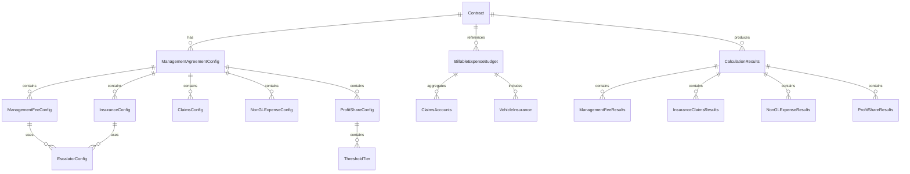

# Management Agreement Data Model Technical Documentation

## Purpose

This data model supports the comprehensive Management Agreement billing calculation system, providing the foundational data structures for management fees, insurance/claims processing, non-GL billable expenses, and profit share calculations. The model integrates with existing billing infrastructure while supporting the complex calculation requirements specific to Management Agreement contract types.

## Business Data Sources and Systems

### Primary Data Sources
- **EDW (Enterprise Data Warehouse)**: Budget and actual financial data
- **Power Platform Dataverse**: Contract configuration and calculation results
- **Billable Accounts System**: Account classifications and enabled/disabled status
- **Forecasting System**: Projected revenue and expense data

### Integration Points
- **Internal Revenue Calculator**: Aggregates Management Agreement calculation results
- **PTEB Calculator**: Provides payroll base amounts and totals
- **External Revenue Calculator**: Supplies revenue figures for percentage-based calculations
- **Billable Accounts Calculator**: Provides foundational account totals

## Entity Relationships



## Field Definitions

### ManagementAgreementConfig Entity

| Field Name | Data Type | Source System | Description | Business Rules |
|------------|-----------|---------------|-------------|----------------|
| contract_id | GUID | Dataverse | Unique contract identifier | Primary key, references Contract entity |
| management_fee_enabled | Boolean | Dataverse | Enables management fee calculations | Default: true |
| insurance_enabled | Boolean | Dataverse | Enables insurance calculations | Default: true |
| claims_enabled | Boolean | Dataverse | Enables claims processing | Default: false |
| non_gl_enabled | Boolean | Dataverse | Enables non-GL expense calculations | Default: false |
| profit_share_enabled | Boolean | Dataverse | Enables profit share calculations | Default: false |
| created_date | DateTime | Dataverse | Configuration creation timestamp | Auto-generated |
| last_modified_date | DateTime | Dataverse | Last modification timestamp | Auto-updated |

### ManagementFeeConfig Entity

| Field Name | Data Type | Source System | Description | Business Rules |
|------------|-----------|---------------|-------------|----------------|
| config_id | GUID | Dataverse | Unique configuration identifier | Primary key |
| contract_id | GUID | Dataverse | Parent contract reference | Foreign key to Contract |
| calculation_type | String | Dataverse | Fee calculation method | Values: "fixed_fee", "per_labor_hour", "revenue_percentage" |
| fixed_fee_amount | Decimal(18,2) | Dataverse | Fixed fee amount | Required when calculation_type = "fixed_fee" |
| hourly_rate | Decimal(18,4) | Dataverse | Rate per labor hour | Required when calculation_type = "per_labor_hour" |
| job_code | String | Dataverse | Specific job code for hour tracking | Required when calculation_type = "per_labor_hour" |
| revenue_percentage | Decimal(5,4) | Dataverse | Percentage of external revenue | Required when calculation_type = "revenue_percentage" |
| escalator_enabled | Boolean | Dataverse | Enables escalation calculations | Default: false |

### InsuranceConfig Entity

| Field Name | Data Type | Source System | Description | Business Rules |
|------------|-----------|---------------|-------------|----------------|
| config_id | GUID | Dataverse | Unique configuration identifier | Primary key |
| contract_id | GUID | Dataverse | Parent contract reference | Foreign key to Contract |
| calculation_type | String | Dataverse | Insurance calculation method | Values: "fixed_fee", "percentage_based" |
| fixed_fee_amount | Decimal(18,2) | Dataverse | Fixed insurance amount | Required when calculation_type = "fixed_fee" |
| payroll_percentage | Decimal(5,4) | Dataverse | Percentage of forecasted payroll | Default: 0.0577 (5.77%) |
| additional_percentage | Decimal(5,4) | Dataverse | Additional percentage for billable accounts | Optional additional rate |
| vehicle_insurance_enabled | Boolean | Dataverse | Include vehicle insurance account 7082 | Default: true |

### ClaimsConfig Entity

| Field Name | Data Type | Source System | Description | Business Rules |
|------------|-----------|---------------|-------------|----------------|
| config_id | GUID | Dataverse | Unique configuration identifier | Primary key |
| contract_id | GUID | Dataverse | Parent contract reference | Foreign key to Contract |
| cap_type | String | Dataverse | Claims cap calculation method | Values: "per_claim", "annual_calendar", "annual_anniversary" |
| annual_cap_amount | Decimal(18,2) | Dataverse | Maximum annual claims amount | Required for annual cap types |
| account_codes | String | Dataverse | JSON array of claims account codes | Default: ["7099", "7100"] |
| contract_start_date | Date | Dataverse | Contract anniversary date | Required for annual_anniversary cap type |

### BillableExpenseBudget Entity (Enhanced)

| Field Name | Data Type | Source System | Description | Business Rules |
|------------|-----------|---------------|-------------|----------------|
| budget_id | GUID | Dataverse | Unique budget record identifier | Primary key |
| contract_id | GUID | Dataverse | Contract reference | Foreign key to Contract |
| site_id | GUID | Dataverse | Site reference | Foreign key to Site |
| month_year | Date | Dataverse | Budget period | Format: YYYY-MM-01 |
| vehicle_insurance_budget | Decimal(18,2) | EDW | Vehicle insurance account 7082 budget | New field from ETL process |
| claims_accounts_total | Decimal(18,2) | EDW | Sum of enabled claims accounts | New field from ETL process |
| other_expense_accounts | JSON | EDW | Other billable expense account totals | Existing field |
| pteb_total | Decimal(18,2) | EDW | PTEB account totals | Existing field |

### NonGLExpenseConfig Entity

| Field Name | Data Type | Source System | Description | Business Rules |
|------------|-----------|---------------|-------------|----------------|
| expense_id | GUID | Dataverse | Unique expense identifier | Primary key |
| contract_id | GUID | Dataverse | Parent contract reference | Foreign key to Contract |
| expense_title | String | Dataverse | Descriptive name for expense | User-defined |
| expense_type | String | Dataverse | Calculation method | Values: "fixed_amount", "percent_revenue", "percent_payroll" |
| fixed_amount | Decimal(18,2) | Dataverse | Fixed expense amount | Required when expense_type = "fixed_amount" |
| percentage_rate | Decimal(5,4) | Dataverse | Percentage rate | Required for percentage-based types |
| payroll_type | String | Dataverse | Payroll calculation base | Values: "billable", "total" |
| enabled | Boolean | Dataverse | Expense item active status | Default: true |

### ProfitShareConfig Entity

| Field Name | Data Type | Source System | Description | Business Rules |
|------------|-----------|---------------|-------------|----------------|
| config_id | GUID | Dataverse | Unique configuration identifier | Primary key |
| contract_id | GUID | Dataverse | Parent contract reference | Foreign key to Contract |
| accumulation_type | String | Dataverse | Profit accumulation method | Values: "monthly", "annual_calendar", "annual_anniversary" |
| contract_start_date | Date | Dataverse | Contract anniversary date | Required for annual_anniversary type |
| escalator_enabled | Boolean | Dataverse | Enables threshold escalation | Default: false |

### ProfitShareThreshold Entity

| Field Name | Data Type | Source System | Description | Business Rules |
|------------|-----------|---------------|-------------|----------------|
| threshold_id | GUID | Dataverse | Unique threshold identifier | Primary key |
| profit_share_config_id | GUID | Dataverse | Parent configuration reference | Foreign key to ProfitShareConfig |
| threshold_amount | Decimal(18,2) | Dataverse | Profit threshold level | Must be positive |
| percentage_rate | Decimal(5,4) | Dataverse | Profit share percentage | Range: 0.0000 to 1.0000 |
| tier_order | Integer | Dataverse | Threshold application order | Sequential ordering |

## Business Logic Transformations

### Management Fee Calculation Logic

```sql
-- Fixed Fee Calculation
CASE 
    WHEN management_fee_config.calculation_type = 'fixed_fee' 
    THEN management_fee_config.fixed_fee_amount
    
-- Per Labor Hour Calculation    
    WHEN management_fee_config.calculation_type = 'per_labor_hour'
    THEN (forecasted_hours.hours * management_fee_config.hourly_rate)
    
-- Revenue Percentage Calculation
    WHEN management_fee_config.calculation_type = 'revenue_percentage'
    THEN (external_revenue.amount * management_fee_config.revenue_percentage)
    
    ELSE 0
END
```

### Insurance Calculation Logic

```sql
-- Insurance Base Calculation
CASE 
    WHEN insurance_config.calculation_type = 'fixed_fee'
    THEN insurance_config.fixed_fee_amount
    
    WHEN insurance_config.calculation_type = 'percentage_based'
    THEN (
        (pteb_calculation.base_amount * insurance_config.payroll_percentage) +
        COALESCE(billable_expense_budget.vehicle_insurance_budget, 0) +
        (billable_accounts_total.amount * COALESCE(insurance_config.additional_percentage, 0))
    )
    
    ELSE 0
END
```

### Claims Cap Application Logic

```sql
-- Claims Cap Processing
CASE 
    WHEN claims_config.cap_type = 'per_claim'
    THEN billable_expense_budget.claims_accounts_total
    
    WHEN claims_config.cap_type = 'annual_calendar'
    THEN LEAST(
        claims_config.annual_cap_amount,
        SUM(billable_expense_budget.claims_accounts_total) 
        OVER (PARTITION BY contract_id, YEAR(month_year))
    )
    
    WHEN claims_config.cap_type = 'annual_anniversary'
    THEN LEAST(
        claims_config.annual_cap_amount,
        SUM(billable_expense_budget.claims_accounts_total) 
        OVER (PARTITION BY contract_id, contract_year_period)
    )
    
    ELSE 0
END
```

### Profit Share Revenue Calculation

```sql
-- Profit Share Base Revenue
(external_revenue.amount - 
 management_fee_total - 
 insurance_claims_total - 
 billable_accounts_total - 
 non_gl_expenses_total) AS profit_share_base_revenue
```

## Run-time Calculations

### Field-by-Field Calculation Definitions

#### Management Fee Total
- **Source**: ManagementFeeConfig + Forecasted Data
- **Calculation**: Based on calculation_type (fixed_fee | per_labor_hour | revenue_percentage)
- **Dependencies**: External revenue, forecasted hours, job code data
- **Escalation**: Applied if escalator_enabled = true

#### Insurance Total
- **Source**: InsuranceConfig + PTEB + Vehicle Insurance Budget
- **Calculation**: Payroll percentage + vehicle insurance + additional percentage
- **Dependencies**: PTEB base amount, vehicle insurance account 7082, billable accounts total
- **Validation**: Must handle fixed_fee vs percentage_based calculation types

#### Claims Total
- **Source**: ClaimsConfig + Claims Accounts Budget
- **Calculation**: Sum of enabled claims accounts with cap application
- **Dependencies**: Claims account totals, cap configuration, contract dates
- **Complex Logic**: Different cap types require different date range calculations

#### Non-GL Expenses Total
- **Source**: NonGLExpenseConfig + Revenue/Payroll Data
- **Calculation**: Sum of all enabled non-GL expense items
- **Dependencies**: External revenue, payroll totals (billable vs total)
- **Iteration**: Process each expense item individually then sum

#### Profit Share Total
- **Source**: ProfitShareConfig + All Other Calculator Results
- **Calculation**: (Revenue - All Deductions) applied to threshold tiers
- **Dependencies**: All other calculator outputs, threshold configuration
- **Execution Order**: Must run last in calculator sequence

## Data Management Approach

### ETL Process Enhancements

**New Columns Added**:
- `billable_expense_budget.vehicle_insurance_budget`
- `billable_expense_budget.claims_accounts_total`

**ETL Query Logic**:
```sql
-- Vehicle Insurance Budget
SELECT 
    contract_id,
    site_id,
    month_year,
    SUM(CASE WHEN account_code = '7082' THEN budget_amount ELSE 0 END) as vehicle_insurance_budget
FROM edw.budget_final
WHERE account_code = '7082'
GROUP BY contract_id, site_id, month_year

-- Claims Accounts Total
SELECT 
    contract_id,
    site_id,
    month_year,
    SUM(budget_amount) as claims_accounts_total
FROM edw.budget_final b
INNER JOIN billable_expense_config bec ON b.account_code = bec.account_code
WHERE bec.account_code IN ('7099', '7100', '7101', '7102') -- Claims accounts
  AND bec.enabled = 1
GROUP BY contract_id, site_id, month_year
```

### Data Refresh Strategy

**ETL Schedule**: Daily refresh during off-peak hours
**Delta Processing**: Incremental updates for modified records only
**Full Reload**: Monthly complete refresh for data integrity
**Error Handling**: Retry logic with notification for failed updates

## Size of Production Dataset

### Estimated Record Volumes

| Entity | Estimated Records | Growth Rate | Storage Requirements |
|--------|------------------|-------------|---------------------|
| ManagementAgreementConfig | 500 contracts | 5% annually | 50 KB |
| ManagementFeeConfig | 500 records | 5% annually | 100 KB |
| InsuranceConfig | 500 records | 5% annually | 75 KB |
| ClaimsConfig | 300 records | 3% annually | 50 KB |
| NonGLExpenseConfig | 1,500 records | 10% annually | 200 KB |
| ProfitShareConfig | 200 records | 2% annually | 25 KB |
| BillableExpenseBudget | 50,000 records/month | 12 months/year | 500 MB/year |
| CalculationResults | 50,000 records/month | 12 months/year | 1 GB/year |

### Performance Considerations

**Indexing Strategy**:
- Primary keys: Clustered indexes
- Foreign keys: Non-clustered indexes
- Date fields: Non-clustered indexes for range queries
- Calculation type fields: Filtered indexes for common values

**Query Optimization**:
- Partition large tables by month_year
- Use covering indexes for frequent calculation queries
- Implement query hints for complex aggregations

## Indexing and Archiving Strategy

### Index Definitions

```sql
-- Primary Performance Indexes
CREATE INDEX IX_BillableExpenseBudget_Contract_Month 
ON BillableExpenseBudget (contract_id, month_year) 
INCLUDE (vehicle_insurance_budget, claims_accounts_total);

CREATE INDEX IX_CalculationResults_Contract_Date 
ON CalculationResults (contract_id, calculation_date) 
INCLUDE (management_fee_total, insurance_total, profit_share_total);

-- Configuration Lookup Indexes
CREATE INDEX IX_ManagementFeeConfig_Type 
ON ManagementFeeConfig (calculation_type) 
WHERE calculation_type IS NOT NULL;

CREATE INDEX IX_ClaimsConfig_CapType 
ON ClaimsConfig (cap_type) 
WHERE cap_type IS NOT NULL;
```

### Archival Strategy

**Retention Policy**:
- Active calculations: Current + 2 years
- Historical data: 7 years total retention
- Configuration data: Permanent retention with version history

**Archive Process**:
- Monthly archive of data older than 2 years
- Compressed storage for archived records
- Restore capability for audit and historical analysis

## Related Reports

### Management Agreement Calculation Summary Report
- **Purpose**: Monthly calculation results by contract
- **Data Sources**: All calculation result entities
- **Refresh Schedule**: Daily
- **Format**: Excel export with drill-down capability

### Profit Share Analysis Report
- **Purpose**: Profit share performance tracking
- **Data Sources**: ProfitShareResults, threshold configurations
- **Refresh Schedule**: Monthly
- **Format**: Power BI dashboard with trend analysis

### Claims Cap Utilization Report
- **Purpose**: Claims cap usage monitoring
- **Data Sources**: ClaimsConfig, ClaimsResults
- **Refresh Schedule**: Weekly
- **Format**: PDF summary with exception highlighting

## Business Stakeholder Approval

### Configuration Changes
- **Primary Approver**: Contract Management Director
- **Secondary Approver**: Finance Director
- **Notification**: Billing Operations Manager

### Data Access
- **Read Access**: Account Managers, Billing Administrators
- **Write Access**: System Administrators, Development Team
- **Audit Access**: Finance Team, Compliance Officer

---

*This data model documentation provides the comprehensive foundation for Management Agreement billing calculations, ensuring accurate implementation and maintainable system architecture.*