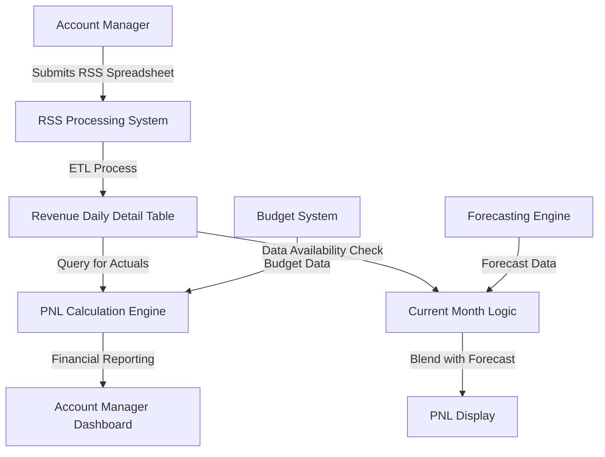

# Revenue Daily Detail Data Model - Technical Documentation

## Table Overview

### Purpose
The Revenue Daily Detail table serves as the primary repository for daily external revenue data collected from Towne Park sites through the RSS (Revenue and Statistics Submission) process. This table provides the foundation for current month revenue calculations, variance analysis, and financial reporting within the forecasting system.

### Business Context
This table captures actual revenue performance on a daily basis, enabling the system to blend actual revenue (month-to-date) with forecasted revenue (remaining days) for current month financial reporting. The data directly impacts PNL calculations and account manager performance metrics.

## Field Definitions and Source Mapping

### Primary Key Fields

**site**
- **Data Type**: VARCHAR(10)
- **Source System**: RSS Submission Process
- **Source Field**: Site identifier from submitted spreadsheets
- **Business Logic**: Maps to Towne Park site identification system
- **Constraints**: NOT NULL, Foreign Key to Sites table
- **Example Values**: "0170", "0919", "1129"

**date**
- **Data Type**: DATE
- **Source System**: RSS Submission Process  
- **Source Field**: Revenue date from submitted spreadsheets
- **Business Logic**: Represents the business date when revenue was generated
- **Constraints**: NOT NULL, Valid date format
- **Example Values**: "2025-07-15", "2025-07-16"

### Revenue Fields

**net_external_revenue**
- **Data Type**: DECIMAL(15,2)
- **Source System**: RSS Submission Process
- **Source Field**: Calculated from gross revenue minus adjustments
- **Business Logic**: 
  - Gross external revenue from parking operations
  - Minus any adjustments (refunds, chargebacks, etc.)
  - Represents actual collectible revenue for the date
- **Constraints**: Can be negative (net refund days), typically positive
- **Calculation**: gross_external_revenue - adjustments
- **Example Values**: 1250.75, -45.00, 2100.50

**gross_external_revenue**
- **Data Type**: DECIMAL(15,2)
- **Source System**: RSS Submission Process
- **Source Field**: Total revenue before adjustments
- **Business Logic**: Raw revenue from all parking operations before any deductions
- **Constraints**: Typically positive, can be zero
- **Example Values**: 1300.00, 0.00, 2150.75

**adjustments**
- **Data Type**: DECIMAL(15,2)
- **Source System**: RSS Submission Process
- **Source Field**: Revenue adjustments (refunds, chargebacks, etc.)
- **Business Logic**: Deductions from gross revenue for various operational reasons
- **Constraints**: Can be positive (refunds) or negative (additional charges)
- **Example Values**: 49.25, -5.00, 0.00

### Metadata Fields

**type**
- **Data Type**: VARCHAR(50)
- **Source System**: RSS Submission Process
- **Source Field**: Revenue type classification
- **Business Logic**: Categorizes the type of revenue entry
- **Constraints**: Controlled vocabulary
- **Example Values**: "daily_revenue", "monthly_pass", "special_event"

**date_loaded**
- **Data Type**: TIMESTAMP
- **Source System**: ETL Process
- **Source Field**: System-generated timestamp
- **Business Logic**: 
  - Records when the data was loaded into the system
  - Critical for determining data availability for current month calculations
  - May lag behind the revenue date due to submission timing
- **Constraints**: NOT NULL, Automatically populated
- **Example Values**: "2025-07-15 14:30:22", "2025-07-17 09:15:45"

## Business Logic and Transformations

### Data Loading Process

**1. RSS File Submission**
- Account managers submit daily revenue spreadsheets
- Files contain revenue data for multiple dates
- Submission timing varies by site and account manager schedule

**2. File Processing**
- ETL process extracts revenue data from submitted spreadsheets
- Data validation ensures completeness and accuracy
- Transformation logic calculates net_external_revenue

**3. Data Loading**
- Processed data inserted into Revenue Daily Detail table
- date_loaded timestamp recorded for tracking
- Duplicate detection prevents data duplication

### Calculation Logic

**Net External Revenue Calculation**
```sql
net_external_revenue = gross_external_revenue - adjustments
```

**Data Availability Logic**
```sql
-- Find most recent data for current month calculations
SELECT MAX(date) as latest_data_date
FROM revenue_daily_detail 
WHERE site = @site_id 
  AND date >= @first_day_current_month
  AND date <= @current_date
  AND net_external_revenue IS NOT NULL
```

### Data Quality Rules

**Validation Rules**
- Revenue dates must be valid business dates
- Net external revenue must be calculated correctly
- Site codes must exist in master site table
- No duplicate entries for same site/date combination

**Data Completeness**
- Missing dates indicate no revenue activity or delayed submission
- Zero revenue is valid and different from missing data
- Negative net revenue is valid (refund scenarios)

## Runtime Calculations and Field Usage

### Current Month PNL Calculations

**Actual Revenue Component**
```sql
SELECT SUM(net_external_revenue) as actual_revenue
FROM revenue_daily_detail
WHERE site = @site_id
  AND date >= @first_day_current_month  
  AND date <= @latest_data_date
```

**Data Availability Determination**
```sql
SELECT MAX(date_loaded) as latest_load,
       MAX(date) as latest_revenue_date
FROM revenue_daily_detail
WHERE site = @site_id
  AND date >= @first_day_current_month
```

**Gap Analysis for Forecasting**
- Compare latest_revenue_date to current_date
- Calculate forecast period: (latest_revenue_date + 1) to month_end
- Blend actual and forecasted revenue for current month display

### Variance Analysis Calculations

**Monthly Variance**
```sql
SELECT 
  SUM(net_external_revenue) as actual_revenue,
  budget.budgeted_revenue,
  (SUM(net_external_revenue) - budget.budgeted_revenue) as variance
FROM revenue_daily_detail rdd
JOIN budget_final budget ON rdd.site = budget.site
WHERE rdd.site = @site_id
  AND rdd.date >= @month_start
  AND rdd.date <= @month_end
  AND budget.month = @target_month
```

## Data Flow Architecture



## Integration Points and Dependencies

### Upstream Systems

**RSS Submission Process**
- **Interface**: File-based submission (Excel spreadsheets)
- **Frequency**: Daily (variable timing by site)
- **Data Format**: Structured spreadsheet with defined columns
- **Error Handling**: Validation and rejection of malformed submissions

**Site Master Data**
- **Interface**: Database foreign key relationship
- **Dependency**: Site codes must exist in master site table
- **Validation**: Referential integrity constraints

### Downstream Systems

**PNL Reporting**
- **Usage**: Primary source for external revenue actuals
- **Calculation**: Current month blended actual/forecast calculations
- **Performance**: Optimized queries for real-time reporting

**Variance Analysis**
- **Usage**: Actual vs budget comparison calculations
- **Frequency**: Real-time for current month, batch for historical months
- **Aggregation**: Daily detail rolled up to monthly totals

**Financial Dashboards**
- **Usage**: Revenue trend analysis and performance monitoring
- **Integration**: API endpoints for dashboard data feeds
- **Caching**: Strategic caching for frequently accessed aggregations

## Reports and Analytics Built from This Model

### Primary Reports

**1. PNL (Profit & Loss) Report**
- **Usage**: External revenue line item
- **Calculation**: Current month blended actual/forecast
- **Frequency**: Real-time access, daily refresh

**2. Revenue Variance Report**
- **Usage**: Actual vs budget variance analysis
- **Calculation**: Monthly and cumulative variance calculations
- **Frequency**: Monthly reporting cycle

**3. Revenue Trend Analysis**
- **Usage**: Historical revenue performance tracking
- **Calculation**: Daily, weekly, monthly trend analysis
- **Frequency**: On-demand analysis

### Dashboard Metrics

**Daily Revenue Tracking**
- Current day revenue vs. budget
- Month-to-date revenue vs. budget
- Revenue trend indicators

**Site Performance Metrics**
- Revenue per day averages
- Variance trend analysis
- Performance ranking among sites

## Production Dataset Information

### Data Volume Characteristics

**Current Scale (Estimated)**
- **Daily Records**: ~500-1000 records per day (across all sites)
- **Monthly Volume**: ~15,000-30,000 records per month
- **Annual Volume**: ~180,000-360,000 records per year
- **Historical Data**: 3+ years of historical revenue data

**Growth Projections**
- **Site Expansion**: Additional sites will increase daily volume
- **Data Retention**: Long-term retention for historical analysis
- **Performance Impact**: Indexing strategy required for large datasets

### Storage Requirements

**Disk Space**
- **Current**: Approximately 50-100 MB per year
- **Projected**: 200-500 MB over 5 years with site expansion
- **Indexing Overhead**: Additional 20-30% for performance indexes

**Memory Requirements**
- **Query Performance**: Adequate RAM for index caching
- **Concurrent Access**: Support for multiple simultaneous users
- **Aggregation Processing**: Memory for complex calculation queries

## Indexing and Performance Strategy

### Primary Indexes

**Clustered Index**
```sql
CREATE CLUSTERED INDEX IX_RevenueDailyDetail_Site_Date 
ON revenue_daily_detail (site, date)
```

**Non-Clustered Indexes**
```sql
-- For date_loaded queries (current month calculations)
CREATE INDEX IX_RevenueDailyDetail_DateLoaded 
ON revenue_daily_detail (date_loaded, site)

-- For monthly aggregations
CREATE INDEX IX_RevenueDailyDetail_MonthYear 
ON revenue_daily_detail (site, YEAR(date), MONTH(date))
```

### Query Optimization

**Current Month Queries**
- Optimized for date range queries within current month
- Efficient lookup of latest data availability
- Fast aggregation of month-to-date totals

**Historical Reporting**
- Partitioning strategy for large historical datasets
- Archived data management for older records
- Efficient monthly and yearly aggregations

## Data Management and Archiving

### Data Retention Policy

**Active Data**
- **Current Year**: Full performance optimization
- **Previous 2 Years**: Standard performance, full accessibility
- **Historical Data**: Archived with reduced performance expectations

**Archiving Strategy**
- **Frequency**: Annual archiving of data older than 3 years
- **Storage**: Compressed storage for archived data
- **Access**: Read-only access to archived data for historical analysis

### Backup and Recovery

**Backup Schedule**
- **Daily**: Incremental backups of current data
- **Weekly**: Full backup of entire table
- **Monthly**: Archive backup for long-term retention

**Recovery Requirements**
- **RTO**: 4 hours for production restoration
- **RPO**: Maximum 24 hours of data loss acceptable
- **Testing**: Quarterly backup restoration testing

## Related Documentation

- [RSS Integration Specifications](../integrations/)
- [PNL Report Technical Documentation](../reports/PNL_Report_TechnicalDocument.md)
- [Forecasting System Overview](../../systems/forecasting/forecasting-system-overview.md)
- [Database Performance Standards](../../standards/)

## Data Governance and Security

### Access Controls
- **Read Access**: Account managers (site-specific), financial analysts (multi-site)
- **Write Access**: ETL processes only, no direct user modification
- **Administrative Access**: Database administrators and system administrators

### Data Privacy
- **PII Considerations**: No personally identifiable information stored
- **Financial Sensitivity**: Revenue data considered confidential business information
- **Audit Requirements**: All access logged for compliance purposes

### Data Quality Monitoring
- **Automated Checks**: Daily data validation and completeness checks
- **Alert System**: Notifications for data quality issues or missing submissions
- **Manual Review**: Weekly review of data quality metrics and exception reports