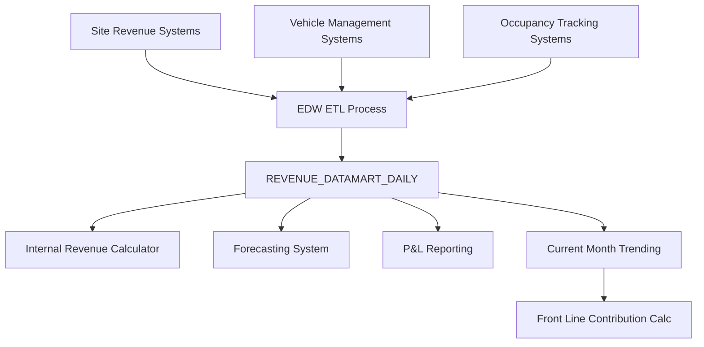

# Revenue Datamart Daily Data Model

## Purpose

The Revenue Datamart Daily table serves as the primary source for daily-level revenue, occupancy, and vehicle count data within the Towne Park EDW system. This table supports current month trending calculations by providing actual daily data that replaces forecasted values for accurate financial reporting and analysis.

## Data Model Overview

### Table Information
- **Database**: `TP_EDW`
- **Schema**: `dbo`
- **Table Name**: `REVENUE_DATAMART_DAILY`
- **Granularity**: Daily level data per site
- **Primary Use**: Current month trending calculations and revenue analysis

### Business Context
This data model supports the transition from monthly summary reporting to daily actual calculations, enabling real-time trending for internal revenue calculations and providing inputs for forecasting algorithms.

## Field Definitions

### Core Identification Fields

| Field Name | Data Type | Description | Business Rules |
|------------|-----------|-------------|----------------|
| `SITE` | VARCHAR | Site identifier code | Required. Links to site master data |
| `DATE` | DATE | Transaction date | Required. Daily granularity |
| `DW_LOADED_DTTM` | DATETIME | Data warehouse load timestamp | System generated. Indicates when data was loaded |

### Data Classification Fields

| Field Name | Data Type | Description | Business Rules |
|------------|-----------|-------------|----------------|
| `REVENUE_CATEGORY` | VARCHAR | Revenue classification category | Maps to existing statistics categories |
| `VALUE_TYPE` | VARCHAR | Type of data stored in VALUE column | Valid values: 'Revenue', 'Vehicles', 'Other' |

### Data Value Fields

| Field Name | Data Type | Description | Business Rules |
|------------|-----------|-------------|----------------|
| `VALUE` | DECIMAL | Numeric value for the specified type | Can be revenue amount, vehicle count, or occupancy number |

## Business Logic

### Value Type Classifications

#### Revenue Data (`VALUE_TYPE = 'Revenue'`)
- **Purpose**: Stores daily external revenue amounts
- **Calculation**: Used as input for internal revenue calculations
- **Aggregation**: Sum all revenue categories and adjustments for net external revenue
- **Business Rule**: Includes all revenue categories and adjustments for complete external revenue picture

#### Vehicle Data (`VALUE_TYPE = 'Vehicles'`)
- **Purpose**: Stores daily vehicle count data
- **Calculation**: Used for capacity and utilization calculations
- **Business Rule**: Represents actual vehicle counts for the specified date and site

#### Occupancy Data (`VALUE_TYPE = 'Other'`)
- **Purpose**: Stores occupancy numbers for per-occupied-room calculations
- **Calculation**: Feeds into per-occupied-room calculator algorithms
- **Business Rule**: Represents actual occupancy data replacing forecasted occupancy in trending calculations

### Data Loading Logic

#### File Submission Validation
- **Challenge**: Sites may submit empty files with zero values
- **Solution**: Validate actual data values, not just file submission timestamps
- **Logic**: Find most recent record with `VALUE > 0` to determine data availability
- **Business Rule**: Consider entire day as loaded when valid data found for any value type

#### Data Availability Determination
```sql
-- Logic to find most recent valid data
SELECT MAX(DATE) as LATEST_DATA_DATE
FROM [TP_EDW].[dbo].[REVENUE_DATAMART_DAILY]
WHERE [SITE] = @SiteCode
  AND [VALUE] > 0
```

### Run-time Calculations

#### Net External Revenue Calculation
```sql
-- Sum all revenue value types for complete external revenue
SELECT [SITE],
       SUM([VALUE]) AS TOTAL_NET_EXTERNAL_REVENUE
FROM [TP_EDW].[dbo].[REVENUE_DATAMART_DAILY]
WHERE [SITE] = @SiteCode
  AND [VALUE_TYPE] = 'Revenue'
  AND [DATE] BETWEEN @StartDate AND @EndDate
GROUP BY [SITE]
```

#### Occupancy Data Retrieval
```sql
-- Retrieve occupancy data for per-occupied-room calculations
SELECT [SITE],
       [DATE],
       [DW_LOADED_DTTM],
       [REVENUE_CATEGORY],
       SUM([VALUE]) AS TOTAL_OCCUPANCY
FROM [TP_EDW].[dbo].[REVENUE_DATAMART_DAILY]
WHERE [SITE] = @SiteCode
  AND [VALUE_TYPE] = 'Other'
  AND [DATE] BETWEEN @StartDate AND @EndDate
GROUP BY [SITE], [DATE], [DW_LOADED_DTTM], [REVENUE_CATEGORY]
ORDER BY [DATE], [DW_LOADED_DTTM], [REVENUE_CATEGORY]
```

#### Vehicle Count Data Retrieval
```sql
-- Retrieve vehicle count data for capacity calculations
SELECT [SITE],
       [DATE],
       [DW_LOADED_DTTM],
       [REVENUE_CATEGORY],
       SUM([VALUE]) AS TOTAL_VEHICLES
FROM [TP_EDW].[dbo].[REVENUE_DATAMART_DAILY]
WHERE [SITE] = @SiteCode
  AND [VALUE_TYPE] = 'Vehicles'
  AND [DATE] BETWEEN @StartDate AND @EndDate
GROUP BY [SITE], [DATE], [DW_LOADED_DTTM], [REVENUE_CATEGORY]
ORDER BY [DATE], [DW_LOADED_DTTM], [REVENUE_CATEGORY]
```

## Integration Points

### Source System Relationships



### Downstream System Dependencies

#### Forecasting System Integration
- **Purpose**: Provides actual data to replace forecasted values
- **Process**: Daily data replaces forecasted external revenue, occupancy, and vehicle counts
- **Timing**: Up to `DW_LOADED_DTTM` date for each site

#### Internal Revenue Calculation
- **Input**: Net external revenue from summed revenue value types
- **Input**: Occupancy data from 'Other' value type
- **Input**: Vehicle counts from 'Vehicles' value type
- **Process**: Feeds into multi-step internal revenue calculation algorithm

#### P&L View Integration
- **Purpose**: Provides daily actuals for current month trending
- **Data Flow**: Aggregated data flows to P&L view components
- **Frequency**: Daily updates as new data becomes available

### Related Data Models

#### Revenue Daily Detail Table
- **Relationship**: Alternative source for revenue data
- **Difference**: Contains net external revenue but lacks occupancy data
- **Usage**: Revenue Datamart Daily preferred for comprehensive data needs

#### Account Summary Table
- **Relationship**: Monthly summary data source
- **Difference**: Monthly vs. daily granularity
- **Usage**: Used for historical monthly reporting, not current month trending

## Data Management Approach

### Loading Strategy
- **Method**: ETL process loads daily files from site systems
- **Frequency**: Daily file submissions from sites
- **Validation**: File presence validation and data value validation required
- **Error Handling**: Empty file detection and zero-value filtering

### Data Quality Measures

#### Validation Rules
1. **Site Code Validation**: Must exist in site master data
2. **Date Validation**: Must be valid date, typically current or recent dates
3. **Value Type Validation**: Must be one of: 'Revenue', 'Vehicles', 'Other'
4. **Value Validation**: Numeric values must be reasonable for the value type

#### Data Completeness Monitoring
- **Daily Load Monitoring**: Track successful data loads per site
- **Value Validation**: Monitor for zero-value submissions
- **Gap Detection**: Identify missing data for critical calculation periods

### Archiving Strategy
- **Retention Period**: Maintain daily data for current and prior fiscal years
- **Archive Process**: Older data archived to long-term storage
- **Access Pattern**: Current month data accessed frequently, historical data accessed for analysis

## Performance Considerations

### Indexing Strategy
- **Primary Index**: Site + Date for efficient daily queries
- **Secondary Index**: DW_LOADED_DTTM for load monitoring
- **Composite Index**: Site + Date + Value_Type for calculation queries

### Query Optimization
- **Date Range Filtering**: Always include date range filters for performance
- **Site Filtering**: Include site filters to limit data scope
- **Value Type Filtering**: Filter by value type early in query execution

### Data Volume Estimates
- **Daily Records**: Approximately 50-100 records per site per day
- **Monthly Volume**: 1,500-3,000 records per site per month
- **Annual Growth**: Estimated 10-15% growth in data volume annually

## Reports Built from Data Model

### Current Month Trending Report
- **Purpose**: Real-time current month financial trending
- **Data Sources**: Revenue, occupancy, and vehicle data
- **Frequency**: Daily updates
- **Users**: Account Managers, District Managers, Finance Team

### Internal Revenue Analysis Report
- **Purpose**: Detailed internal revenue calculation breakdown
- **Data Sources**: Revenue and occupancy data combined with payroll
- **Frequency**: Daily during month, final at month-end
- **Users**: Revenue Analysts, Site Managers

### Occupancy Performance Report
- **Purpose**: Daily occupancy tracking and analysis
- **Data Sources**: Occupancy data ('Other' value type)
- **Frequency**: Daily
- **Users**: Operations Team, Site Managers

## Business Stakeholders

### Data Approval Authority
- **Primary**: Data Engineering Team Lead
- **Secondary**: Business Intelligence Manager
- **Final Approval**: Finance Director for calculation methodology

### Access Control
- **Read Access**: All finance and operations team members
- **Write Access**: ETL processes only
- **Admin Access**: Data Engineering Team and Database Administrators

## Data Validation Status

**Validation Required**: This data model should be validated against actual table structure in EDW database and ETL implementation code.

**Code Validation Scope**:
- Table schema validation in EDW database
- ETL process validation for data loading logic
- Calculation logic validation in forecasting system
- Integration validation with downstream systems

**Next Steps**: Perform comprehensive validation against:
- EDW database schema in `Towne-Park-Billing-Source-Code/`
- ETL implementation code
- Forecasting system integration code