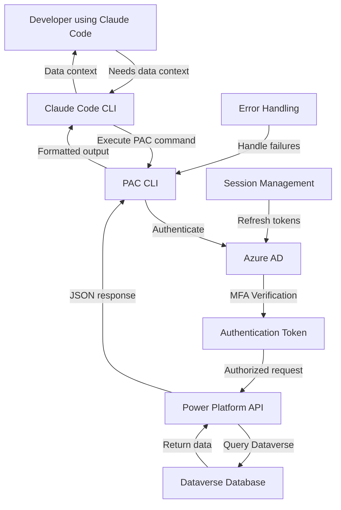
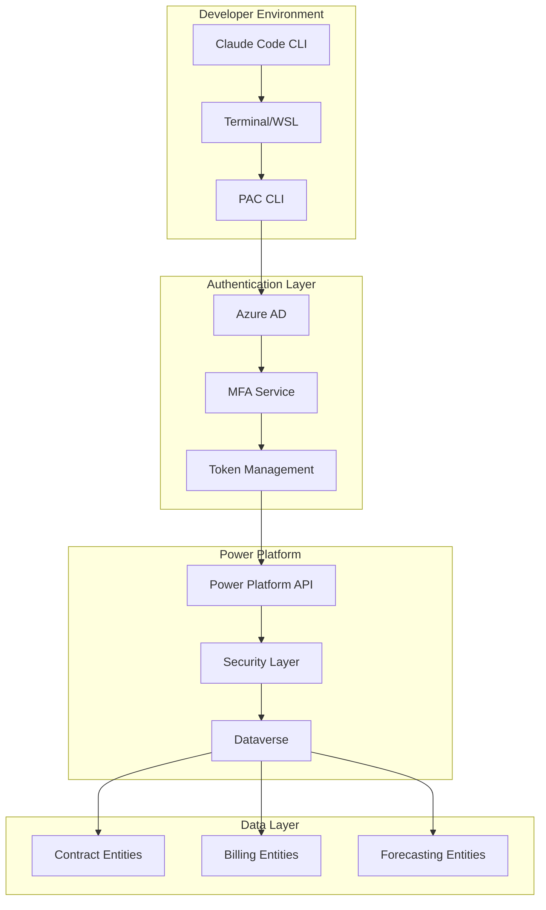

# Dataverse PAC CLI Integration Technical Document

**Document Version:** 1.0  
**Author:** Documentation Team  
**Date:** 2025-08-06

---

**Table of Contents**

1. [Introduction](#introduction)
2. [Integration Overview](#integration-overview)
3. [Source and Target Systems](#source-and-target-systems)
4. [Field-Level Mapping](#field-level-mapping)
5. [Technical Implementation](#technical-implementation)
6. [Code Logic and Documentation](#code-logic-and-documentation)
7. [Schedule and Execution](#schedule-and-execution)
8. [Integration Method and Technical Details](#integration-method-and-technical-details)
9. [Monitoring, Alerting, and Error Handling](#monitoring-alerting-and-error-handling)
10. [Architecture Diagram](#architecture-diagram)
11. [Security and Compliance](#security-and-compliance)
12. [Performance and Scalability](#performance-and-scalability)
13. [Testing and Validation](#testing-and-validation)
14. [Deployment and Configuration](#deployment-and-configuration)
15. [Troubleshooting Guide](#troubleshooting-guide)
16. [Appendix](#appendix)

---

## 1. Introduction

This document describes the integration between AI development tools (specifically Claude Code) and Dataverse via the Power Platform CLI (PAC CLI), enabling real-time data access during development workflows for enhanced context and validation.

---

## 2. Integration Overview

### Purpose
Enable AI development tools to query Dataverse in real-time during feature development to:
- Understand existing data structures and relationships
- Validate implementation approaches against actual data
- Reduce development iterations by incorporating data context early
- Improve code quality through data-informed decision making

### Scope
- PAC CLI integration with terminal-based AI tools
- Read-only access to Dataverse entities and data
- Multi-factor authentication for secure access
- Query execution and result processing within AI tool context

### Business Requirements
- Accelerate development cycles by providing immediate data context
- Reduce bugs related to data structure assumptions
- Enable data-driven implementation decisions
- Maintain security through read-only permissions and MFA

---

## 3. Source and Target Systems

### Source System Details
| Attribute | Value |
|-----------|-------|
| System Name | Dataverse (Power Platform) |
| System Type | Cloud Database Platform |
| Version | Current Power Platform Version |
| Owner | IT/Platform Team |
| Environment | Development/Staging/Production |
| Connection Details | Power Platform Environment URL |

### Target System Details
| Attribute | Value |
|-----------|-------|
| System Name | AI Development Tools (Claude Code, Terminal) |
| System Type | CLI-based Development Environment |
| Version | Latest Claude Code CLI |
| Owner | Development Team |
| Environment | Developer Workstations |
| Connection Details | Local Terminal/WSL Environment |

---

## 4. Field-Level Mapping

### Data Access Patterns
| Query Type | Dataverse Entity | Fields Accessed | Purpose | Example Use Case |
|------------|------------------|-----------------|---------|------------------|
| Schema Query | All Entities | Entity Names, Field Names, Data Types | Structure Understanding | Planning table relationships |
| Data Sample | Contract Details | All Fields | Implementation Context | Understanding nested JSON structure |
| Relationship Query | Related Entities | Foreign Keys, Relationships | Data Model Validation | Verifying join logic |
| Count Query | Any Entity | Record Counts | Volume Assessment | Performance planning |

### Data Transformation Rules
1. **JSON Structure Analysis**: 
   - **Input**: Raw Dataverse entity data with nested JSON fields
   - **Process**: Parse JSON structure to identify nested properties and data types
   - **Output**: Structured analysis of available data elements
   - **Example**: Contract details JSON parsed to reveal billing flags and configuration options

2. **Schema Mapping**:
   - **Input**: Dataverse entity metadata
   - **Process**: Extract field names, types, and relationships
   - **Output**: Formatted schema documentation for AI context
   - **Example**: Entity field list formatted for AI tool consumption

### Data Validation Rules
- **Read-Only Access**: All queries must be SELECT operations only
- **Row Limit Enforcement**: Maximum 100 rows per query for performance
- **Timeout Limits**: Queries must complete within 30 seconds
- **Authentication Validation**: Valid PAC CLI session required

---

## 5. Technical Implementation

### Integration Architecture
The integration leverages the existing PAC CLI tool installed in the developer's terminal environment, providing a bridge between AI development tools and Dataverse through authenticated command execution.

### Technology Stack
| Component | Technology | Version | Purpose |
|-----------|------------|---------|---------|
| PAC CLI | Microsoft Power Platform CLI | Latest | Dataverse connectivity |
| Claude Code | Anthropic Claude CLI | Latest | AI development interface |
| WSL | Windows Subsystem for Linux | WSL2 | Linux environment for CLI tools |
| PowerShell/Bash | Shell Environment | Latest | Command execution |

### Dependencies
- **Internal Dependencies**: Valid Power Platform environment access
- **External Dependencies**: Internet connectivity for authentication
- **Library Dependencies**: PAC CLI installation, Claude Code subscription

---

## 6. Code Logic and Documentation

### Core Integration Logic
```bash
# Authenticate with Power Platform environment
pac auth create --url https://[environment].crm.dynamics.com

# Query entity schema for development context
pac data list-records --entity-name [entity] --select [fields] --top 10

# Example: Query contract details for nested JSON analysis
pac data list-records --entity-name tp_contractdetails --select tp_contractdetailsjson --top 5
```

### Key Functions and Methods
#### Query Entity Data
**Purpose**: Retrieve sample data from Dataverse entities for AI context
**Parameters**: 
- `entity-name` (string): Name of the Dataverse entity
- `select` (string): Comma-separated list of fields to retrieve
- `top` (integer): Maximum number of records to return

**Returns**: JSON formatted entity data

**Example Usage**:
```bash
# Get contract details with nested JSON
pac data list-records --entity-name tp_contractdetails --select tp_name,tp_contracttype,tp_contractdetailsjson --top 10
```

#### Authenticate Session
**Purpose**: Establish authenticated connection to Power Platform environment
**Parameters**: 
- `url` (string): Power Platform environment URL
- `tenant-id` (string): Azure AD tenant identifier

**Returns**: Authentication success confirmation

**Example Usage**:
```bash
# Authenticate with MFA
pac auth create --url https://townepark-dev.crm.dynamics.com --tenant-id [tenant-guid]
```

### Error Handling Logic
```bash
# Check authentication status before queries
if ! pac auth list | grep -q "Active"; then
    echo "Authentication required. Please run: pac auth create --url [environment-url]"
    exit 1
fi

# Execute query with error handling
if ! pac data list-records --entity-name "$entity" --select "$fields" --top "$limit" 2>/dev/null; then
    echo "Query failed. Check entity name and field permissions."
    exit 1
fi
```

---

## 7. Schedule and Execution

### Execution Schedule
| Schedule Type | Frequency | Time | Days | Notes |
|---------------|-----------|------|------|-------|
| On-Demand | As needed during development | Real-time | Any | Developer-initiated queries |
| Session-based | Per development session | Start of session | Weekdays | Authentication refresh |

### Execution Triggers
- **Developer-initiated**: Manual queries during AI tool conversations
- **Authentication-based**: Automatic re-authentication when sessions expire
- **Context-driven**: Triggered by AI tool need for data validation

### Execution Environment
- **Server/Platform**: Developer workstation with WSL/Terminal
- **Resource Requirements**: Minimal - CLI tool execution
- **Runtime Configuration**: PAC CLI configuration and authentication tokens

---

## 8. Integration Method and Technical Details

### Integration Method
**Primary Method**: CLI Command Execution via Terminal

### CLI Integration Details
#### Commands
| Command | Purpose | Authentication | Output Format |
|---------|---------|----------------|---------------|
| pac auth create | Establish connection | MFA Required | Status confirmation |
| pac data list-records | Query entity data | Active session | JSON |
| pac org list | List available environments | Active session | Table format |

#### Authentication
- **Method**: Multi-Factor Authentication (MFA) via Azure AD
- **Credentials**: Azure AD user credentials with Power Platform access
- **Token Refresh**: Automatic token refresh with pac auth refresh

#### Request/Response Format
**Command Format**:
```bash
pac data list-records --entity-name tp_contractdetails --select tp_name,tp_contracttype --top 5 --output json
```

**Response Format**:
```json
{
  "value": [
    {
      "tp_contractdetailsid": "guid-value",
      "tp_name": "Contract Name",
      "tp_contracttype": "Revenue Share",
      "tp_contractdetailsjson": "{\"billingFlags\": {\"autoInvoice\": true}}"
    }
  ]
}
```

---

## 9. Monitoring, Alerting, and Error Handling

### Monitoring Procedures
#### Key Performance Indicators
| Metric | Target | Warning Threshold | Critical Threshold | Monitoring Tool |
|--------|--------|-------------------|-------------------|-----------------|
| Query Response Time | < 5 seconds | > 10 seconds | > 30 seconds | Manual observation |
| Authentication Success | 100% | < 95% | < 90% | Developer feedback |
| Data Availability | 100% | Partial data | No data | Query results |

#### Monitoring Tools and Dashboards
- **Primary Monitoring Tool**: Developer observation and feedback
- **Log Locations**: Terminal output and PAC CLI logs
- **Metrics Collection**: Manual tracking of query performance

### Alerting Configuration
#### Alert Types
| Alert Type | Condition | Recipients | Escalation |
|------------|-----------|------------|------------|
| Authentication Failure | Login fails repeatedly | Developer | IT Support after 3 failures |
| Query Timeout | Query exceeds 30 seconds | Developer | Platform team if persistent |
| Permission Denied | Access denied to entity | Developer | Security team review |

### Error Handling Procedures
#### Error Categories
1. **Authentication Errors**
   - **Description**: Failed login or expired session
   - **Response**: Prompt for re-authentication
   - **Resolution**: Execute pac auth create command
   - **Prevention**: Regular session refresh

2. **Permission Errors**
   - **Description**: Access denied to specific entities or fields
   - **Response**: Error message with entity name
   - **Resolution**: Request access from platform administrator
   - **Prevention**: Verify permissions before development

3. **Network Errors**
   - **Description**: Connection timeout or network issues
   - **Response**: Retry with exponential backoff
   - **Resolution**: Check network connectivity
   - **Prevention**: Stable internet connection

---

## 10. Architecture Diagram

### Integration Flow Diagram


### System Architecture


---

## 11. Security and Compliance

### Security Measures
- **Data Encryption**: All data transmitted via HTTPS/TLS
- **Authentication**: Multi-factor authentication required
- **Authorization**: Read-only permissions enforced
- **Network Security**: Secure connections to Power Platform endpoints
- **Audit Logging**: All queries logged in Power Platform audit trail

### Compliance Requirements
- **Data Privacy**: No sensitive data stored locally
- **Access Control**: Role-based access through Azure AD
- **Data Retention**: No local data retention - queries only
- **Data Classification**: Respects Dataverse security roles

### Security Testing
- **Access Validation**: Regular verification of read-only permissions
- **Authentication Testing**: MFA requirement validation
- **Session Security**: Token expiration and refresh testing

---

## 12. Performance and Scalability

### Performance Requirements
| Metric | Requirement | Current Performance | Notes |
|--------|-------------|-------------------|-------|
| Query Response | < 5 seconds | 2-3 seconds typical | Depends on data volume |
| Authentication | < 10 seconds | 5-8 seconds with MFA | One-time per session |
| Concurrent Users | 10+ developers | Not limited by integration | Limited by Power Platform |

### Scalability Considerations
- **User Scaling**: No technical limits on concurrent developers
- **Query Scaling**: Rate limits enforced by Power Platform
- **Data Scaling**: Query result limits prevent performance issues

### Performance Monitoring
- **Response Time Tracking**: Manual observation during development
- **Error Rate Monitoring**: Developer feedback on failed queries
- **Usage Patterns**: Track most common query types

---

## 13. Testing and Validation

### Testing Strategy
#### Integration Testing
- **Authentication Flow**: Verify MFA and token management
- **Query Execution**: Test various entity queries
- **Error Handling**: Validate error scenarios and responses

#### Data Validation Testing
- **Data Accuracy**: Compare query results with Power Platform interface
- **Permission Testing**: Verify read-only access enforcement
- **Schema Validation**: Confirm entity structure accuracy

### Performance Testing
- **Response Time Testing**: Measure query performance under normal load
- **Timeout Testing**: Verify timeout handling for long queries
- **Concurrent Access**: Test multiple developers using integration

---

## 14. Deployment and Configuration

### Deployment Process
1. **Pre-deployment Checklist**
   - [ ] PAC CLI installed on developer workstation
   - [ ] Claude Code CLI subscription active
   - [ ] Power Platform environment access granted
   - [ ] Azure AD permissions configured

2. **Deployment Steps**
   - **Step 1**: Install PAC CLI via Microsoft installer
   - **Step 2**: Configure Claude Code CLI environment
   - **Step 3**: Authenticate with Power Platform environment
   - **Step 4**: Test basic query functionality

3. **Post-deployment Validation**
   - [ ] Authentication successful with MFA
   - [ ] Sample queries return expected data
   - [ ] Error handling works correctly

### Configuration Management
- **PAC CLI Configuration**: Stored in user profile
- **Authentication Tokens**: Managed by PAC CLI
- **Environment URLs**: Configured per environment
- **Query Limits**: Enforced by Power Platform

---

## 15. Troubleshooting Guide

### Common Issues and Solutions
#### Issue: Authentication Failure
**Symptoms**: "Authentication required" error when executing queries
**Cause**: Expired session or invalid credentials
**Solution**: 
1. Run `pac auth list` to check current authentication status
2. Execute `pac auth create --url [environment-url]` to re-authenticate
3. Complete MFA process when prompted
**Prevention**: Regular session refresh and credential validation

#### Issue: Permission Denied
**Symptoms**: "Access denied" error for specific entities
**Cause**: Insufficient permissions for requested entity or fields
**Solution**:
1. Verify entity name spelling and case sensitivity
2. Check user permissions in Power Platform admin center
3. Request additional permissions from platform administrator
**Prevention**: Verify permissions before development work

#### Issue: Query Timeout
**Symptoms**: Queries hang or timeout after 30 seconds
**Cause**: Large dataset or complex query
**Solution**:
1. Reduce the number of records requested (--top parameter)
2. Limit fields selected (--select parameter)
3. Check network connectivity
**Prevention**: Use appropriate query limits and filters

### Support Contacts
| Role | Contact | Availability | Escalation |
|------|---------|-------------|------------|
| Development Team Lead | [Team Lead Email] | Business Hours | Platform Administrator |
| Platform Administrator | [Admin Email] | Business Hours | IT Director |
| IT Support | [Support Email] | 24/7 | Emergency Escalation |

---

## 16. Appendix

### A. Configuration Examples
```bash
# Initial setup commands
pac install latest
pac auth create --url https://townepark-dev.crm.dynamics.com

# Common query patterns
pac data list-records --entity-name tp_contractdetails --select tp_name,tp_contracttype --top 10
pac data list-records --entity-name tp_billingaccounts --select tp_accountname,tp_status --top 5
```

### B. Sample Data
```json
{
  "value": [
    {
      "tp_contractdetailsid": "12345678-1234-1234-1234-123456789012",
      "tp_name": "Sample Contract",
      "tp_contracttype": "Revenue Share",
      "tp_contractdetailsjson": "{\"revenueShare\": 0.15, \"billingFlags\": {\"autoInvoice\": true}}"
    }
  ]
}
```

### C. API Documentation
- [PAC CLI Documentation](https://docs.microsoft.com/en-us/power-platform/developer/cli/introduction)
- [Dataverse Web API Reference](https://docs.microsoft.com/en-us/powerapps/developer/data-platform/webapi/)

### D. Change Log
| Version | Date | Changes | Author |
|---------|------|---------|--------|
| 1.0 | 2025-08-06 | Initial creation from meeting transcript analysis | Documentation Team |

### E. References
- AI Acceleration Meeting Transcript (June 30, 2025)
- Claude Code CLI Documentation
- Power Platform CLI Reference

---

**End of Document**